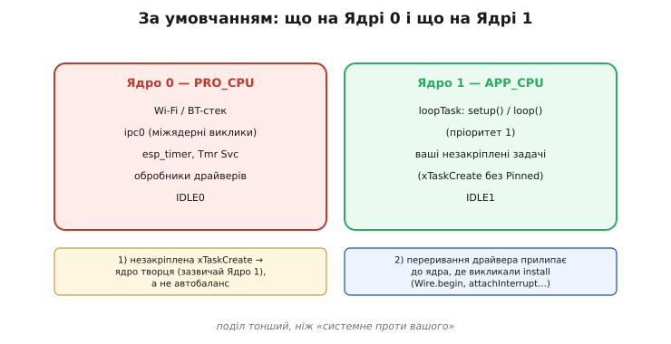

# 🔌 Два ядра ESP32 на практиці: PRO/APP і прив'язка задач

ESP32 має два процесорні ядра, і задачу можна закріпити за конкретним через `xTaskCreatePinnedToCore`. На словах поділ простий — «системне на Ядрі 0, ваше на Ядрі 1», — але насправді він тонший, і саме в тонкощах ховаються майже всі сюрпризи. Розберімо, що реально живе на кожному ядрі, як свідомо прив'язати задачу й як переконатися, що вона справді там.

## Що насправді лежить на кожному ядрі

**Ядро 0 (PRO_CPU)** тримає Wi-Fi/BT-стек, системну задачу `ipc0` (вона виконує міжядерні виклики), службу таймерів `esp_timer` разом із `Tmr Svc`, обробники подій від низки драйверів і `IDLE0`. Причина проста: радіостек чутливий до затримок, і тримати його окремо від призначеного користувачу навантаження — свідоме архітектурне рішення Espressif.

**Ядро 1 (APP_CPU)** — місце, де стартує `loopTask`: Arduino-каркас запускає `setup()` і далі виконує `loop()` саме тут, із пріоритетом 1. Сюди ж потрапляють усі задачі, які ви створили звичайним `xTaskCreate` **без** вказівки ядра.

І ось перший тонкий момент: `xTaskCreate` (без Pinned) на ESP32 **не** означає «планувальник сам балансує між ядрами» — на відміну від Linux чи інших ОС. За замовчуванням порт FreeRTOS для ESP32 створює задачу з афінністю (*affinity* — «спорідненість, прив'язаність») ядра-творця, а не `tskNO_AFFINITY`. Якщо `setup()` запускається на Ядрі 1 — незакріплена задача, породжена з нього, теж осяде на Ядрі 1. Щоб справді дати планувальнику свободу обирати вільніше ядро, треба явно передати `tskNO_AFFINITY`.

Другий тонкий момент: переривання та ISR драйвера «прилипають» до ядра, на якому ви викликали функцію ініціалізації. Якщо `Wire.begin()`, `attachInterrupt()` або `ledcSetup()` викликані в задачі на Ядрі X — їхні обробники реєструються саме там. Ініціалізуйте периферію на тому ядрі, де вона має жити, — інакше отримаєте несподівані затримки.


*Дві колонки-ядра. Ядро 0 (PRO_CPU): Wi-Fi/BT-стек, системна `ipc0`, служба таймерів (`esp_timer`/`Tmr Svc`), `IDLE0`. Ядро 1 (APP_CPU): `loopTask` (ваші setup/loop, пріоритет 1), ваші незакріплені задачі, `IDLE1`. Виноска 1: незакріплена `xTaskCreate` осідає на ядрі творця (зазвичай Ядро 1), а не автобалансується. Виноска 2: переривання драйвера прилипає до ядра, де викликали install. Поділ тонший, ніж «системне проти вашого».*

## Як прочитати й задати, на якому ядрі ти зараз

Найшвидший спосіб переконатися, де насправді опинилась задача, — функція `xPortGetCoreID()`. Вона повертає `0` або `1` залежно від того, з якого ядра викликається прямо зараз.

**Перевірка розміщення:**

```c
// Задача-зонд: надрукує своє ядро щосекунди
void probe(void *arg) {
    for (;;) {
        Serial.printf("probe runs on core %d\n", xPortGetCoreID());
        vTaskDelay(pdMS_TO_TICKS(1000));
    }
}

void setup() {
    Serial.begin(115200);
    // setup() сама друкує своє ядро — зазвичай 1
    Serial.printf("setup on core %d\n", xPortGetCoreID());

    // probe закріплена на Ядрі 0
    xTaskCreatePinnedToCore(probe, "probe", 2048, NULL, 1, NULL, 0);
}
```

У моніторі ви побачите `setup on core 1` і `probe runs on core 0` — простий, незаперечний доказ реального поділу. Варто мати на увазі, що `portNUM_PROCESSORS` дорівнює 2 на класичному ESP32 і ESP32-S3, але 1 на [одноядерних S2/C3/C6](root:embedded/esp32-family) — тому код із жорстко вписаним номером ядра 1 там або падатиме, або цей аргумент ігноруватиметься.

## «Перший байт»: свідомо закріпити задачу й перевірити

Мінімальний робочий сценарій для практики: беремо критичну задачу керування, явно прив'язуємо її до Ядра 1 і одразу перевіряємо, що прив'язка спрацювала.

**Закріплення задачі й перевірка:**

```c
void taskCtrl(void *p) {
    // перший рядок — підтвердження розміщення
    Serial.printf("ctrl runs on core %d\n", xPortGetCoreID());
    for (;;) {
        // критичний крок: керування, генерація сигналу, тайм-критичне опитування
        vTaskDelay(1);  // завжди поступатися, щоб IDLE встигала годувати watchdog
    }
}

void setup() {
    Serial.begin(115200);
    // xTaskCreatePinnedToCore(fn, name, stack_bytes, param, prio, handle, coreID)
    // stack — у байтах на ESP32 (не у словах, як у класичному FreeRTOS)
    xTaskCreatePinnedToCore(taskCtrl, "ctrl", 4096, NULL, 2, NULL, 1);
}
```

У моніторі виводиться `ctrl runs on core 1` — прив'язка підтверджена. Якщо помилитися в останньому аргументі (наприклад, написати `0`), побачите це одразу: `ctrl runs on core 0`. Без `xPortGetCoreID()` ви б просто вірили, що задача там, де треба.

> 🔧 **Навіщо це.** Прив'язуй свідомо лише те, що мусить виконуватись рівно: тайм-критичне керування, генерацію сигналу, точне опитування — на Ядро 1, окремо від радіостека на Ядрі 0. Решту залишай незакріпленою або з `tskNO_AFFINITY`, не «прибиваючи» все вручну. І завжди підтверджуй розміщення через `xPortGetCoreID()`, а не на довіру.

## Типові граблі двоядерності

**«Незакріплена = автобаланс».** Хибно: на ESP32 `xTaskCreate` без Pinned осідає на ядрі-творці (зазвичай Ядро 1), а не розподіляється між ядрами. Хочеш, щоб планувальник сам обирав вільніше — пиши `tskNO_AFFINITY` явно.

**Периферія на «не тому» ядрі.** `Wire.begin()`, `attachInterrupt()`, `ledcSetup()` у задачі на Ядрі X прив'яжуть ISR драйвера до Ядра X. Ініціалізуй периферію там, де її переривання має жити — інакше затримки здивують. Класичний симптом: усе ніби працює, але з непередбачуваними мікропаузами.

**Перевантажене Ядро 0.** Накидати важких власних задач на Ядро 0 «бо здавалося вільним» — прямий шлях до проблем: Wi-Fi/BT-стек починає задихатися, з'являються відвали з'єднання, у Serial зринає `Task watchdog got triggered ... CPU0`. За замовчуванням важкі обчислення тримай на Ядрі 1.

**Голод IDLE-задачі ⇒ watchdog.** Задача без `vTaskDelay` або іншої поступки займає ядро повністю, не даючи IDLE цього ядра виконуватись → спрацьовує [Task Watchdog або Interrupt WDT](book:programming/watchdog) саме того ядра. Тут річ у самій механіці [поступки часу планувальнику](book:programming/tasks): без `vTaskDelay` чи блокувального виклику задача не віддає ядро.

**Перенесення коду з одноядерних ESP32.** S2/C3/C6 одноядерні: код із `xTaskCreatePinnedToCore(..., 1)` або падає, або аргумент 1 ігнорується — поведінка залежить від версії IDF. Не покладайся на наявність Ядра 1 без перевірки `portNUM_PROCESSORS` — [склад родини ESP32](root:embedded/esp32-family) тут вирішує все.

**Стек у байтах, а не у словах.** Ще одна пастка переносу, цього разу з класичного FreeRTOS на ESP32: у «ванільному» ядрі аргумент розміру стека рахується **у словах** (по 4 байти на 32-бітній машині), а в порту Espressif для `xTaskCreate`/`xTaskCreatePinnedToCore` — **у байтах**. Тобто звичне `1000` зі стороннього прикладу дасть тут не 4 КБ, а лише 1 КБ стека — і задача тихо переповнить його на першому ж об'ємнішому буфері чи глибшому виклику. Симптом підступний: збій трапляється не там, де помилка, а там, де стек нарешті закінчився. Бери з запасом (2–4 КБ для звичайної задачі) і перевіряй залишок через `uxTaskGetStackHighWaterMark()`, а не вгадуй.

**Занадто дрібний крок паузи.** `vTaskDelay(1)` — це один **тік**, а не одна мілісекунда. За умовчанням тік на ESP32 — 1 мс (`configTICK_RATE_HZ` = 1000), тож збіг є; але якщо хтось зменшив частоту тіка, той самий `vTaskDelay(1)` раптом стане довшим, і ваш «мілісекундний» цикл сповільниться без жодної видимої причини. Коли пауза має бути в реальних одиницях часу — пиши `vTaskDelay(pdMS_TO_TICKS(1))`, і код лишиться правильним за будь-якої частоти тіка.

Спільні дані між задачами на різних ядрах потребують захисту — [черги, семафори, м'ютекси, атомарні операції](book:programming/task-ipc): без цього два ядра, що пишуть в одну змінну одночасно, дають важковловні гонки.

## Варіації: коли ядра однакові, а коли їх немає

Класичні двоядерні ESP32 і ESP32-S3 мають два рівноцінні ядра (Xtensa LX6 і LX7 відповідно, до 240 МГц). Назви «PRO» та «APP» — суто традиція, що склалася в часи ESP-IDF: технічно обидва ядра однакові, і ніщо не заважає завантажувати будь-яке з них.

Одноядерні ESP32-S2, C3 і C6 мають лише Ядро 0. На них багатозадачність лишається [«ілюзією одного ядра»](book:programming/tasks): FreeRTOS планує задачі по черзі, але справжнього паралелізму немає. Прив'язка до Ядра 1 або відхиляється, або зводиться до Ядра 0.

Практичний висновок простий: пиши код так, щоб він не падав на одноядерному. Використовуй або `portNUM_PROCESSORS` як захисну умову, або просто `tskNO_AFFINITY` там, де паралелізм не критичний, — і тоді той самий скетч без змін запрацює на всіх ESP32.

> 🔧 **Підсумок.** Два ядра ESP32 — не «системне проти вашого», а тонший поділ із пастками: незакріплена задача осідає на ядрі-творці, ISR прилипає до ядра ініціалізації, а перевантажене Ядро 0 валить радіостек. Закріплюй свідомо лише тайм-критичне, решту лишай гнучкою — і завжди звіряй розміщення через `xPortGetCoreID()`.
