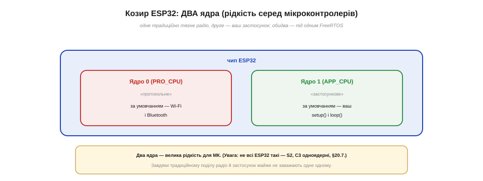
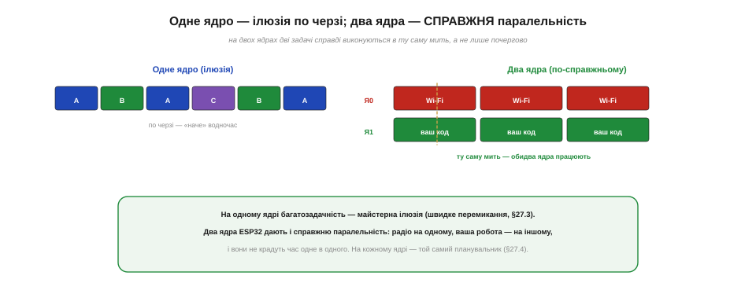
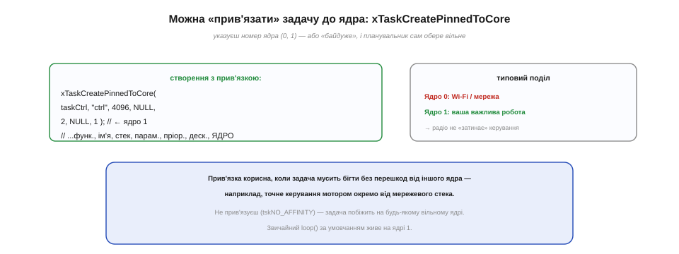
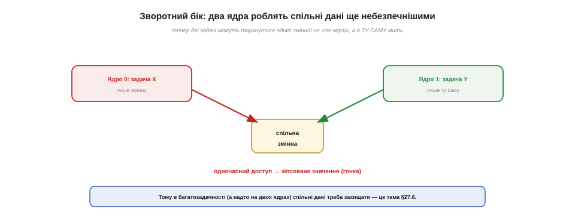

# RTOS і FreeRTOS на ESP32 (два ядра)

[Задачі](book:programming/tasks) і [планувальник](book:programming/scheduler) — поняття абстрактні; час назвати конкретику. Систему, що все це робить у вашому ESP32, звуть **FreeRTOS**, і вона є прикладом **операційної системи реального часу (RTOS)**. У цій темі з'ясуємо, що таке RTOS узагалі, чому FreeRTOS вже працює в кожному ESP32, навіть коли ви про неї не думаєте, — і, головне, як усе змінює унікальний козир цього чипа: **два процесорні ядра**, що дають не лише ілюзію, а й справжню паралельність.

> **Застереження про слово «ядро».** Українське «ядро» тут означає дві різні речі: **ядро ОС** (*kernel* — серце операційної системи) і **процесорне ядро** (*core* — обчислювальний блок чипа). Щоб не плутатись, ядро ОС зватимемо «ядром FreeRTOS», а процесорне — «процесорним ядром» чи «Ядро 0 / Ядро 1».

### Що таке RTOS

**RTOS (*real-time operating system*, операційна система реального часу)** — це невелика програма-**ядро**, що надає готові «цеглинки» багатозадачності: [задачі](book:programming/tasks), [планувальник](book:programming/scheduler), керування часом, [засоби обміну між задачами](book:programming/task-ipc) й [розподіл пам'яті](book:programming/task-stacks). Це і є послуги RTOS.


*Рис. Ядро RTOS дає готовий набір засобів: задачі, [планувальник](book:programming/scheduler), керування часом (тіки, паузи), [обмін між задачами](book:programming/task-ipc) і [розподіл пам'яті під стеки](book:programming/task-stacks). Це не велика «настільна» ОС із файлами й вікнами, а крихітний набір, що перетворює голий чип на багатозадачну систему.*

Окремо варто розтлумачити слова **«реального часу»**, бо їх часто розуміють хибно. Вони означають не «дуже швидко», а «**передбачувано вчасно**»: система гарантує, що важлива задача дістане процесор у відомий, обмежений строк. Іноді система реального часу навіть повільніша за звичайну ОС у середньому — зате не дає прикрих несподіванок, і керівний імпульс ніколи не запізниться непередбачувано. Для пристрою, що керує мотором чи стежить за давачем, ця [**передбачуваність**](book:programming/realtime-determinism) важливіша за рекордну швидкість.

Постає й резонне питання: а навіщо взагалі окрема ОС — хіба не можна самому написати перемикання задач? Можна, та це клопітно й легко наробити помилок, а головне — щоразу винаходити те саме. RTOS дає **перевірене, надійне** рішення тих самих задач, на яке можна спокійно спертися, зосередившись на власному ділі. До того ж RTOS — це саме **ядро**, а не повна ОС: воно дає механізми багатозадачності, та не нав'язує ні файлової системи, ні графіки, ні важкого баласту настільних ОС. Берете рівно стільки системи, скільки треба невеликому чипу.

### FreeRTOS: вже у твоєму ESP32

**FreeRTOS** — це конкретне, дуже популярне ядро RTOS. Воно крихітне (лічені кілобайти), вільне й відкрите, і перенесене на безліч мікроконтролерів. Створив його британський інженер **Річард Баррі (*Richard Barry*)** близько 2003 року; а 2017-го опіку над проєктом узяла компанія **Amazon (AWS)**, перевівши його під вільну ліцензію MIT, — і відтоді FreeRTOS став чи не найпоширенішим RTOS у світі вбудованих систем.


*Рис. Коротка історія (Баррі, 2003 → Amazon, 2017) і головне для нас: у ESP32 FreeRTOS **уже працює**. Arduino на цьому чипі сам збудований поверх FreeRTOS, тож ваш `loop()` — насправді задача `loopTask`, а звичні `xTaskCreate` й `vTaskDelay` — це його виклики.*

Найважливіше тут — те, що на ESP32 FreeRTOS **вже вбудовано** в систему: фреймворк Espressif (ESP-IDF) збудований на ньому, а Arduino для ESP32 — поверх того. Це означає, що ви **вже** користуєтеся FreeRTOS, навіть у найпростішому скетчі: ваш `loop()` крутиться всередині створеної за вас задачі `loopTask` (з пріоритетом 1), а всі знайомі `xTaskCreate`, `vTaskDelay`, пріоритети й тіки — це його послуги. Тому вам нічого не потрібно «встановлювати»: RTOS — це не окрема велика програма, а **бібліотека-ядро**, вбудована у вашу прошивку поряд із вашим кодом. Ви просто починаєте додавати власні задачі поряд із тією, що вже є.

Варто оцінити, наскільки FreeRTOS поширений: він працює в незліченних мільярдах пристроїв — від іграшок до промислової автоматики, — тож набуті навички **переносяться** й на інші чипи, не лише ESP32. Мале технічне застереження: на ESP32 стоїть не зовсім «ванільний» FreeRTOS, а трохи допрацьована Espressif-версія з підтримкою двох ядер; та для нас, на рівні задач і пауз, вона поводиться так само, як класична, тож усе вивчене лишається в силі.

### Козир ESP32: два процесорні ядра

А тепер — головна особливість, заради якої цю тему й винесено окремо. Більшість мікроконтролерів мають **одне** обчислювальне ядро, тож уся їхня багатозадачність — лише [ілюзія швидкого перемикання](book:programming/tasks). ESP32 ж має **два** процесорні ядра — велику рідкість у світі МК.


*Рис. Два процесорні ядра ESP32: Ядро 0 (PRO_CPU, «протокольне») за умовчанням тягне Wi-Fi і Bluetooth; Ядро 1 (APP_CPU, «застосункове») за умовчанням виконує ваші `setup()` і `loop()`. Обидва працюють під одним FreeRTOS. (Не всі ESP32 такі: [S2 і C3 — одноядерні](book:programming/esp32-family).)*

Ці два ядра традиційно розподілили за призначенням. **Ядро 0 (PRO_CPU)** — «протокольне»: на ньому за умовчанням працює стек Wi-Fi і Bluetooth, тобто все радіо. **Ядро 1 (APP_CPU)** — «застосункове»: саме на ньому крутяться ваші `setup()` і `loop()`, тобто звичайний код скетчу. Завдяки цьому поділу важка робота радіо живе на окремому ядрі й майже не заважає вашій логіці. Варто, однак, пам'ятати: [**не всі** чипи ESP32 двоядерні](book:programming/esp32-family) — скажімо, ESP32-S2 і C3 мають лише одне ядро, і там багатозадачність знову стає чистою ілюзією.

Обидва ядра ESP32 рівноцінні — це однакові обчислювальні блоки (Xtensa LX6), що працюють на високій частоті (до 240 МГц) і здатні виконувати будь-який код. Поділ «протокольне/застосункове» — лише **усталена поведінка за умовчанням**, а не апаратний припис: ніщо не заважає вам запускати власні задачі й на Ядрі 0, якщо це доречно. Та для початку найкраще лишити радіо на Ядрі 0, а свою роботу тримати на Ядрі 1 — це найбезпечніший і найпередбачуваніший поділ.

### Ілюзія на одному ядрі — справжня паралельність на двох

Що ж практично дають два ядра? **Справжню** одночасність. На одному ядрі дві задачі ніколи не виконуються буквально в ту саму мить — вони лише [швидко чергуються](book:programming/tasks). А на двох ядрах дві задачі можуть бігти **по-справжньому одночасно**, кожна на своєму ядрі.


*Рис. Ліворуч — одне ядро: задачі чергуються, лише «наче» водночас. Праворуч — два ядра ESP32: радіо на Ядрі 0 і ваш код на Ядрі 1 працюють у ту саму мить, не крадучи час одне в одного. На кожному ядрі діє той самий [пріоритетно-витісняючий планувальник](book:programming/scheduler).*

Це не дрібниця, а суттєвий виграш. Поки Ядро 0 зайняте важкою обробкою Wi-Fi, ваше точне керування на Ядрі 1 біжить **рівно**, ніби радіо й нема, — бо воно фізично на іншому ядрі. Один FreeRTOS керує **обома** ядрами: на кожному діє той самий [пріоритетно-витісняючий планувальник](book:programming/scheduler), а разом вони можуть виконувати дві найпріоритетніші готові задачі **водночас**. Тобто два ядра не замінюють планувальник, а дають йому дві «руки» замість однієї.

Найприємніше, що цим виграшем ви користуєтеся **безкоштовно**, навіть нічого не роблячи. Щойно ви вмикаєте Wi-Fi у звичайному скетчі, його важка робота сама осідає на Ядрі 0, а ваш `loop()` лишається на Ядрі 1 — тож з'єднання з мережею не «підморожує» блимання чи опитування кнопки так, як підморожувало б на одноядерному чипі. Друге ядро тихо працює на вас іще до того, як ви свідомо створили хоч одну власну задачу.

> 🔧 **Навіщо це.** Якщо ваша робота мусить іти **рівно**, без «затинок» від мережі (точне керування мотором, генерація сигналу, опитування давача в реальному часі), — варто свідомо тримати її окремо від радіо. На ESP32 це робиться природно: радіо й так на Ядрі 0, а ви виносите критичну задачу на Ядро 1. Тоді сплеск роботи Wi-Fi (а він буває різким і довгим) не зачепить вашого точного циклу — вони просто на різних ядрах.

### Прив'язування задач до ядра

За умовчанням ваш код живе на Ядрі 1, та FreeRTOS на ESP32 дозволяє **обрати**, на якому ядрі запустити задачу. Для цього є особливий виклик — `xTaskCreatePinnedToCore`: він такий самий, як [знайомий `xTaskCreate`](book:programming/tasks), лише з одним зайвим аргументом — **номером ядра**.


*Рис. `xTaskCreatePinnedToCore` — як `xTaskCreate`, лише з номером ядра наприкінці (0 чи 1). Типовий поділ: радіо й мережа — на Ядрі 0, ваша важлива робота — на Ядрі 1, тож вони не заважають одне одному. Указавши «байдуже» (`tskNO_AFFINITY`), віддаєте вибір ядра планувальникові.*

Прив'язка корисна саме тоді, коли задача мусить бігти без перешкод. Виносите точне керування на Ядро 1 — і навіть найбурхливіший мережевий трафік на Ядрі 0 не зіб'є його з ритму. Якщо ж задачі байдуже, на якому ядрі бігти, указують `tskNO_AFFINITY` — і планувальник сам запустить її на тому, що вільніший, гнучко балансуючи навантаження. Більшість простих скетчів узагалі обходяться без прив'язки: усе живе на Ядрі 1 поряд із `loop()`, і цього досить. Прив'язка — інструмент для тих випадків, коли поділ між ядрами справді важливий.

На практиці більшість починає **без** прив'язки: створюють задачі звичайним `xTaskCreate`, і всі вони мирно живуть на Ядрі 1 поряд із `loop()`. Цього вистачає, доки немає важкої роботи, що мусить іти без перешкод. А коли така робота з'являється — точне керування, генерація сигналу — її свідомо виносять на окреме ядро через `xTaskCreatePinnedToCore`. Тобто прив'язка — не перший крок, а інструмент, по який тягнешся тоді, коли поділ між ядрами справді починає мати значення.

### Зворотний бік: спільні дані ще небезпечніші

Справжня паралельність дає не лише виграш, а й нову небезпеку, про яку треба знати наперед. На одному ядрі дві задачі торкалися спільної змінної бодай **по черзі** (одна, потім інша). На двох ядрах вони можуть зробити це **в ту саму мить** — обидві разом писати чи читати ту саму комірку.


*Рис. Найгірший бік справжньої паралельності: задача на Ядрі 0 і задача на Ядрі 1 пишуть ту саму змінну **одночасно** — і значення псується (гонка). Тому в багатозадачній системі, а надто двоядерній, спільні дані конче треба [захищати](book:programming/task-ipc).*

Це загострює ту саму [**гонку даних**, що виникає між циклом і ISR](book:programming/atomicity-races). Лише тепер вона ще підступніша, бо доступ може бути по-справжньому одночасним, а не лише «майже». Тому з появою задач (а надто двох ядер) конче потрібні [**засоби захисту спільних даних**](book:programming/task-ipc) — щоб упорядкувати, хто й коли торкається спільного: черги, семафори, м'ютекси. Тут важливо усвідомити, що могутність двох ядер іде в парі з новою відповідальністю.

> 🔧 **Навіщо це.** Запам'ятайте просте правило: **не діліть «голу» спільну змінну між задачами наосліп**, особливо на двох ядрах. Те, що в одному потоці виглядало б безпечним (прочитати, змінити, записати), між задачами легко ламається гонкою. Якщо задачам треба обмінятися даними чи поділити спільний ресурс — користуйтеся для цього [спеціальними засобами RTOS](book:programming/task-ipc) (черги, семафори, м'ютекси), а не звичайними змінними. Це вбереже від найпідступніших, невловимих помилок багатозадачності, які зринають раз на тисячу разів і зводять із розуму.

**Приклад (винести точне керування на окреме ядро).** Хай керування мотором має бігти рівно, попри Wi-Fi.

```
void taskControl(void *p) {
    for (;;) {
        stepMotor();          // точний крок керування
        vTaskDelay(1);        // ~1 мс, поступлива пауза
    }
}

void setup() {
    WiFi.begin(...);          // Wi-Fi сам осідає на Ядрі 0
    // керування — явно на Ядро 1, окремо від радіо:
    xTaskCreatePinnedToCore(taskControl, "ctrl", 4096, NULL, 2, NULL, 1);
}
```
Тепер `taskControl` біжить на Ядрі 1 із власним пріоритетом, а важкий Wi-Fi порається на Ядрі 0 — і навіть його сплески не зачеплять рівності керування. Те, що на одноядерному чипі вимагало б тонкого балансування, тут вирішується самим **фізичним** поділом на два ядра — рідкісна розкіш для мікроконтролера, і саме вона робить ESP32 таким зручним для проєктів, де радіо й реальний час потрібні водночас.

Отже, FreeRTOS — це і є той RTOS, що вже працює у вашому ESP32 й надає всі звичні [задачі](book:programming/tasks) та [планувальник](book:programming/scheduler); а два процесорні ядра додають до ілюзії багатозадачності іще й **справжню** паралельність, якою можна свідомо керувати, прив'язуючи задачі до ядер. Та сама паралельність загострює давню небезпеку — гонку за спільні дані, тож узгоджувати взаємодію задач і безпечно ділити між ними ресурси доводиться [спеціальними засобами — чергами, семафорами й м'ютексами](book:programming/task-ipc).
