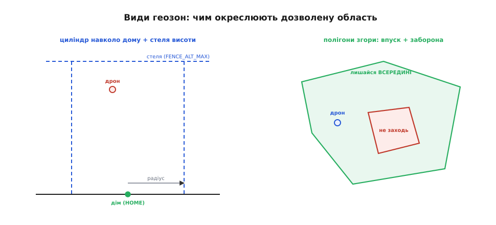
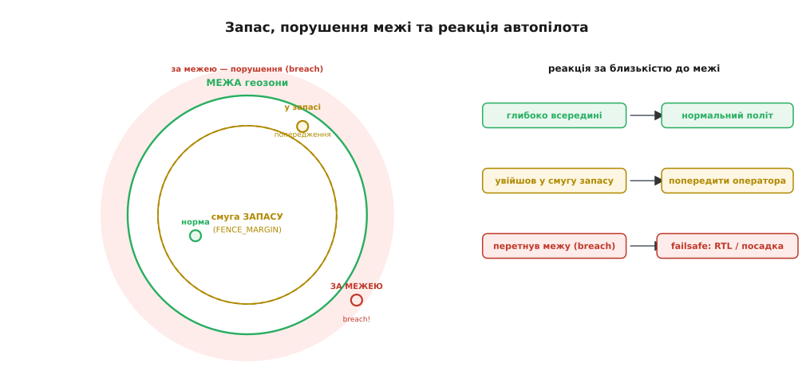

# Геозона (geofence) в автопілоті

Уявіть навчальний політ дрона над полем біля траси. Оператор захопився зйомкою, апарат непомітно віднесло вітром, і за хвилину він уже над проїжджою частиною — там, де падіння означає розбите скло чи гірше. Ніхто не хотів туди летіти; просто ніхто наперед не окреслив, **докуди можна**. А тепер уявіть той самий політ, але в прошивку заздалегідь вписано: «дозволена область — коло радіусом 300 метрів навколо точки зльоту, стеля 120 метрів». Апарат сам стежить за власними координатами, і щойно він наближається до цієї невидимої стіни, автопілот перехоплює керування й повертає його всередину. Ця невидима стіна в повітрі і є **геозона** (англ. *geofence*, від гр. *gē* — земля + англ. *fence* — огорожа): віртуальний кордон дозволеної зони, який пристрій із супутниковим позиціюванням стежить сам за собою й на порушення якого реагує наперед заданою безпечною дією.

Слово молоде: концепція «віртуальної огорожі» навколо географічної точки постала на початку 1990-х разом із першими цивільними застосуваннями GPS і GSM — спершу для стеження за транспортом і майном («виїхав вантаж за дозволену зону — сповісти»). Пізніше ту саму ідею підхопили смартфони (нагадування, прив'язані до місця), а звідти вона природно перейшла в автопілоти безпілотників, де ціна виходу за межу — не пропущене нагадування, а розбитий апарат чи порушене повітряне право.

> 🔧 **Навіщо це.** У більшості країн літати безпілотником вільно можна лише в певному просторі: не над аеропортами, не над натовпом, не вище дозволеної висоти, часом — лише в межах ділянки, на яку є дозвіл. Геозона перетворює цей юридичний і безпековий кордон на **технічне обмеження в самій прошивці**: апарат фізично не дасть собі вилетіти туди, куди не можна. Це різниця між «оператор пообіцяв не залітати за межу» і «апарат сам не залетить, навіть якщо оператор помилиться».

### Чому кордон стежить сам за собою

Найперше питання — **чому взагалі перекладати цей нагляд на прошивку**, а не лишити його оператору. Адже людина з пультом бачить дрон і, здавалося б, не дасть йому залетіти куди не треба.

Проблема в тому, що людське око — ненадійний вимірювач відстані. Дрон на висоті сто метрів і за триста метрів убік виглядає крапкою; на око не скажеш, чи він за 250 метрів, чи вже за 320. А ще оператор відволікається: дивиться в екран камери, змінює налаштування, розмовляє. Найгірше — апарат може просто **вийти за межу видимості**: сховатися за деревами, будинком, пагорбом, і тоді жоден контроль оком неможливий у принципі. У всіх цих випадках єдиний, хто точно знає, **де саме** апарат, — це сам апарат: його [приймач супутникового позиціювання](book:programming/flight-controller) видає координати з точністю до кількох метрів десятки разів на секунду.

Звідси головна ідея: **той, хто знає координати, той і має стерегти кордон**. Геозона — це перекладання нагляду з ненадійного людського окоміра на прошивку, що порівнює власну достовірну позицію з наперед заданою межею. Людина задає *правило* («сюди можна, туди ні»), а виконує його той, у кого є точні дані, — автопілот, невтомно й без відволікань.

І тут проступає зв'язок геозони з ширшим поняттям. Вихід за дозволену зону — це один із видів **аварійної ситуації**, на яку апарат мусить реагувати наперед заданою безпечною дією, точно як на втрату зв'язку чи розряд батареї.

> 🔧 **Геозона — окрема лінія failsafe.** Порушення межі геозони автопілот трактує як один із збоїв у своєму дереві реакцій: помітив вихід за кордон → виконав безпечну дію (найчастіше повернення додому). Механіка та сама, що й для інших відмов: наперед складена пара «ознака (перетнув межу) → безпечна дія». Геозона лише додає до переліку відмов ще один рядок — просторовий.
> [Безпечний відмов (failsafe)](book:programming/failsafe)

### Три способи окреслити дозволену область

Щоб прошивка могла спитати «я всередині чи вже ні», область спершу треба **задати геометрично**. Реальні автопілоти дають кілька форм — від найпростішої до довільної, і вибір між ними — це компроміс між простотою й гнучкістю.

**Циліндр навколо дому** — найпростіша форма, яку в документації ArduPilot прямо називають «бляшанка» (*tin can*). Береться точка зльоту (HOME), навколо неї — коло заданого радіуса, зверху — стеля висоти. Виходить вертикальний циліндр: усередині можна, зовні ні. Задається двома числами — радіус і максимальна висота, — і саме тому це типовий стартовий захист: одна команда, і апарат прив'язаний до майданчика. Перевірка «всередині чи ні» тут майже безкоштовна: досить порівняти відстань від дому з радіусом.

**Стеля й підлога висоти** — окреме, найдешевше обмеження: не давати піднятися вище чи опуститися нижче заданого рівня. Часто діє разом із циліндром (та сама «бляшанка» має і бічну стінку, і кришку), але буває й самостійним: «не вище 120 метрів, куди завгодно по горизонталі».

**Полігон** (гр. *polýgōnos* — багатокутний) — довільний багатокутник, заданий списком вершин-координат. Коли реальна дозволена зона не кругла — ділянка складної форми, коридор уздовж річки, простір між забороненими секторами, — коло вже не підходить, і межу викладають точками: ArduPilot дозволяє до 70 вершин на полігон. Гнучкість платить за себе складнішою перевіркою: питання «точка всередині багатокутника чи ні» вже не звести до одного порівняння.


*Ліворуч — «бляшанка»: коло радіусом навколо точки зльоту плюс стеля висоти, задане двома числами. Праворуч, вид згори, — полігони: зелений окреслює зону, з якої не можна вилітати (впуск), а червоний усередині — пляму, у яку не можна заходити (заборона). Форми поєднуються: дозволена область — те, що всередині всіх впускних меж і поза всіма заборонними.*

Полігони бувають двох протилежних типів, і це друга важлива вісь. **Впускний** (*inclusion*) полігон окреслює зону, **з якої не можна вилітати**: «лишайся всередині». **Заборонний** (*exclusion*) — пляму, **у яку не можна заходити**: «не наближайся». Перший тримає апарат при собі, другий відганяє його від чогось — вежі, аеропорту, приватної ділянки. Їх можна змішувати: кілька впускних зон (тоді літати дозволено лише там, де вони **перекриваються**) і всередині них — заборонні острівці. Так з простих цеглинок складається дозволена область майже будь-якої форми.

> 🔧 **Навіщо це.** Вибір форми — це вибір ціни перевірки. Циліндр — одне порівняння відстані, майже даром; його вистачає для навчання й польотів «біля себе». Полігон коштує дорожче на кожній перевірці, зате описує реальний дозвіл — ділянку, коридор, обхід забороненого сектора. На маленькому [польотному контролері](book:programming/flight-controller), де перевірку роблять багато разів на секунду поряд зі стабілізацією польоту, ця різниця в ціні відчутна, тож форму беруть найпростішу з достатніх.

### Як прошивка питає «я всередині?»

Тепер — серце геозони: як із координат вирахувати, всередині апарат чи ні. Для двох форм відповідь елементарна, для третьої — хитріша, і корисно побачити чому.

Для **циліндра** все зводиться до відстані. Апарат знає свою широту й довготу та широту й довготу дому; треба лише відстань між цими двома точками на поверхні Землі. Її дає **формула гаверсинусів** — тригонометрична формула для відстані між двома точками на сфері за їхніми географічними координатами. Порахували відстань, порівняли з радіусом — і все: менша за радіус означає «всередині», більша — «за межею». Стеля висоти ще простіше: одне порівняння поточної висоти з дозволеною.

Для **полігона** так просто не вийде: у багатокутника немає одного «центру», від якого можна міряти. Класичний спосіб дізнатися, чи точка всередині багатокутника, — **метод променя** (*ray casting*): подумки пустити з точки промінь у будь-який бік і порахувати, скільки разів він перетне сторони багатокутника. **Непарна** кількість перетинів означає, що точка всередині; **парна** (зокрема нуль) — зовні. Інтуїція проста: щоразу, перетинаючи межу, ти переходиш «зсередини назовні» або навпаки; якщо ти вийшов з точки й перетнув межу непарну кількість разів, то стартував ти зсередини. Обчислення вже не одне порівняння, а цикл по всіх сторонах багатокутника — тому полігон і дорожчий.

Обидва прийоми — і формула гаверсинусів, і метод променя — заслуговують окремого розбору з виведенням і кодом; тут досить розуміти саму ідею: **перевірка належності зводиться до відстані (для кола) або до підрахунку перетинів (для багатокутника)**. Хто хоче побачити самі формули з покроковим виведенням, знайде їх у окремих статтях про [відстань великого кола](book:math/great-circle-distance) (формула гаверсинусів для кола) і [належність точки багатокутнику](book:math/point-in-polygon) (метод променя).

**Перевірка кола: чи апарат усередині «бляшанки».**

:::tabs
```c
// Спрощена перевірка циліндричної геозони навколо дому.
// dist_home_m() рахує відстань (метри) від поточної точки до HOME
// за формулою гаверсинусів; тут ми лише порівнюємо її з радіусом.

#define FENCE_RADIUS_M   300.0f   // радіус «бляшанки», метри
#define FENCE_ALT_MAX_M  120.0f   // стеля висоти, метри

bool inside_cylinder(float lat, float lon, float alt_m) {
    float d = dist_home_m(lat, lon);      // відстань до дому по горизонталі
    if (d > FENCE_RADIUS_M)   return false;   // вилетів за коло
    if (alt_m > FENCE_ALT_MAX_M) return false; // пробив стелю
    return true;                          // усередині і кола, і стелі
}
```
```python
# Спрощена перевірка циліндричної геозони навколо дому.
# dist_home_m() рахує відстань (метри) від поточної точки до HOME
# за формулою гаверсинусів; тут ми лише порівнюємо її з радіусом.

FENCE_RADIUS_M = 300.0    # радіус «бляшанки», метри
FENCE_ALT_MAX_M = 120.0   # стеля висоти, метри

def inside_cylinder(lat, lon, alt_m):
    d = dist_home_m(lat, lon)         # відстань до дому по горизонталі
    if d > FENCE_RADIUS_M:            # вилетів за коло
        return False
    if alt_m > FENCE_ALT_MAX_M:       # пробив стелю
        return False
    return True                       # усередині і кола, і стелі
```
:::

Уся перевірка — два порівняння: горизонтальна відстань проти радіуса й висота проти стелі. Саме ця дешевизна робить циліндр стартовим захистом за замовчуванням: його не шкода викликати десятки разів на секунду.

### Запас: реагувати до межі, а не на межі

Наївна реалізація спрацьовувала б **на самій межі**: перетнув коло — вмикай реакцію. Але це погано з двох причин, і обидві варто зрозуміти.

Перша — **інерція**. Дрон не зупиняється миттєво; він летить із якоюсь швидкістю, і якщо почати гальмувати й розвертати його точно на лінії кордону, то за інерцією він **проскочить** за неї на кілька, а то й десятки метрів. Кордон, який дозволено порушувати «трохи», — це вже не кордон.

Друга — **тремтіння координат**. Супутникова позиція не абсолютно точна: вона трохи «плаває» навколо істинної на метри-два, кадр за кадром. Дрон, що завис рівно на лінії кордону, через це тремтіння то опинявся б «усередині», то «зовні» — і реакція вмикалася б і вимикалася десятки разів, апарат сіпався б без сенсу.

Обидві біди лікує **смуга запасу** (*margin*) — вузька зона перед самою межею, зайшовши в яку апарат уже вважають «майже за кордоном» і починають діяти. У ArduPilot це параметр FENCE_MARGIN. Запас дає два виграші відразу. По-перше, він **компенсує інерцію**: розворот починається завчасно, і навіть проскочивши смугу, апарат лишається в межах справжнього кордону. По-друге, він дає **раннє попередження**: щойно апарат увійшов у смугу запасу, автопілот може сповістити оператора — «ти близько до межі», — і той ще встигне втрутитися сам, не доводячи до автоматичної реакції.


*Дозволена область (зелене коло) оточена смугою запасу (пунктир): доки апарат глибоко всередині — політ звичайний; увійшов у смугу — оператора попереджають; перетнув саму межу — це порушення (breach), і автопілот виконує failsafe-дію. Запас потрібен, бо апарат за інерцією проскакує кордон, а супутникова позиція трохи тремтить — реагувати треба завчасно, а не рівно на лінії.*

### Що робить автопілот на порушенні

Виявити вихід за межу — половина справи; друга половина — **що з цим зробити**. Тут геозона повністю зливається з логікою failsafe: реакцію задають наперед, окремим параметром (у ArduPilot — FENCE_ACTION), і вибір її диктує здоровий глузд.

Найтиповіша реакція — **повернутися додому** (RTL, *Return To Launch*): апарат розвертається й летить до точки зльоту, тобто явно в глиб дозволеної зони. Логіка бездоганна: якщо ти вилетів за кордон, найнадійніший шлях назад — до відомої безпечної точки, з якої ти стартував і яка гарантовано всередині. Інші варіанти — **зависнути** на місці (для мультикоптера: просто перестати віддалятися й чекати команди оператора), **сісти** там, де є (коли повертатися вже нема ресурсу), або м'яко **розвернути назад**, лише «відштовхнувши» апарат від стіни.

Головна тонкість — **пріоритети, коли збоїв кілька**. Уявіть: апарат вилетів за геозону й одночасно в нього критично сіла батарея. Реакція геозони каже «лети додому», але до дому — кілометр, а заряду немає. Тут перемагає **найнебезпечніший** збій: не RTL, а негайна посадка тут-і-зараз, бо долетіти однаково не вийде. Геозона не існує окремо від решти failsafe — вона один рядок у спільній таблиці пріоритетів, і низька батарея цей рядок перебиває.

**Реакція на порушення геозони з урахуванням пріоритету.**

:::tabs
```c
// Викликається регулярно з польотного циклу.
// Спершу — найнебезпечніше (батарея), потім — власне геозона.

void fence_check(float lat, float lon, float alt_m) {
    if (inside_cylinder(lat, lon, alt_m))
        return;                          // усе гаразд, апарат у межах

    // Ми ЗА межею. Але спершу — чи вистачить ресурсу на повернення?
    if (battery_critical()) {
        set_mode(MODE_LAND);             // додому не дотягнемо — сідаємо тут
        return;
    }
    set_mode(MODE_RTL);                  // інакше — повертаємось у зону
}
```
```python
# Викликається регулярно з польотного циклу.
# Спершу — найнебезпечніше (батарея), потім — власне геозона.

def fence_check(lat, lon, alt_m):
    if inside_cylinder(lat, lon, alt_m):
        return                           # усе гаразд, апарат у межах

    # Ми ЗА межею. Але спершу — чи вистачить ресурсу на повернення?
    if battery_critical():
        set_mode(MODE_LAND)              # додому не дотягнемо — сідаємо тут
        return
    set_mode(MODE_RTL)                   # інакше — повертаємось у зону
```
:::

Зверніть увагу на порядок: перевірка батареї стоїть **перед** реакцією геозони й перебиває її. Це не випадковість, а той самий принцип, що тримає весь failsafe передбачуваним — з усіх бід, які тривають зараз, виконуємо реакцію на найтяжчу, а не на ту, що трапилась першою.

### Чому геозоні потрібне надійне позиціювання

Є пастка, без якої розуміння геозони неповне: **геозона працює рівно настільки, наскільки достовірна позиція апарата**. Уся її логіка — це порівняння координат із межею; якщо координати брешуть, брешуть і всі висновки про те, всередині апарат чи ні.

Звідси прямий наслідок: **геозона й супутникове позиціювання нерозлучні**. Тому автопілоти при ввімкненій геозоні вимагають надійної фіксації супутників **ще до зльоту** — це частина перевірок перед стартом: немає впевненої позиції, апарат не дасть себе озброїти, бо без координат він не зможе стерегти кордон. І навпаки — якщо позиція **зникає в польоті** (апарат «осліп»), геозона більше не має на що спиратися, і це вже інший, свій збій: втрата позиціювання, у відповідь на яку ArduPilot переходить у посадку, поки апарат ще над відомим місцем. Пускати сліпий апарат далі летіти «за геозоною», якої він уже не бачить, було б гірше, ніж сісти.

> 🔧 **Навіщо це.** Не вимикайте перевірку супутників і контроль позиції, коли ввімкнена геозона, — це підрубує їй опору. Геозона без достовірних координат гірша за відсутню: вона створює **оманливе відчуття захисту**, тоді як насправді порівнює межу з випадковими числами. Правило просте: увімкнув геозону — забезпеч їй надійне позиціювання, інакше вона не захищає, а лише вдає захист.

### Звідки беруться межі: параметри й завантаження зони

Лишається питання, звідки прошивка взагалі знає межу. Радіус, стелю й дії — це звичайні [параметри автопілота](book:programming/params-gcs): FENCE_ENABLE вмикає механізм, FENCE_TYPE обирає активні форми, FENCE_RADIUS і FENCE_ALT_MAX задають «бляшанку», FENCE_ACTION — реакцію на порушення, FENCE_MARGIN — смугу запасу. Наземна станція (GCS) записує ці числа в апарат, як і будь-які інші налаштування, — і геозона готова.

Полігон — складніший: це вже не одне число, а список вершин, і його передають окремим порядком поверх [каналу зв'язку MAVLink](book:programming/mavlink-channel), тим самим, яким завантажують у дрон маршрут місії. Оператор малює багатокутник на мапі в наземній станції, а та відправляє його точку за точкою спеціальними командами (у MAVLink — вершини впуску й заборони), і апарат складає з них свою межу. Так намальований на екрані контур перетворюється на невидиму стіну в повітрі, за якою вже стежить сам автопілот.

Підсумуймо суть. Геозона — це **віртуальний кордон дозволеної зони, за яким пристрій стежить сам** через власне супутникове позиціювання. Область задають простими формами: коло-«бляшанка» навколо дому зі стелею висоти — майже безкоштовне на перевірці, і полігон із вершин — гнучкий, але дорожчий, впускний («лишайся всередині») чи заборонний («не заходь»). Належність рахують за відстанню (коло) або підрахунком перетинів променя (багатокутник), реагують не на самій межі, а завчасно — через смугу запасу, що гасить інерцію й тремтіння координат. Порушення межі автопілот трактує як один зі збоїв failsafe і відповідає наперед заданою дією — найчастіше поверненням додому, а коли накладаються тяжчі біди, перемагає найнебезпечніша. І тримається все це на одній опорі — достовірних координатах: без надійного позиціювання геозона не захищає, а лише вдає захист.
