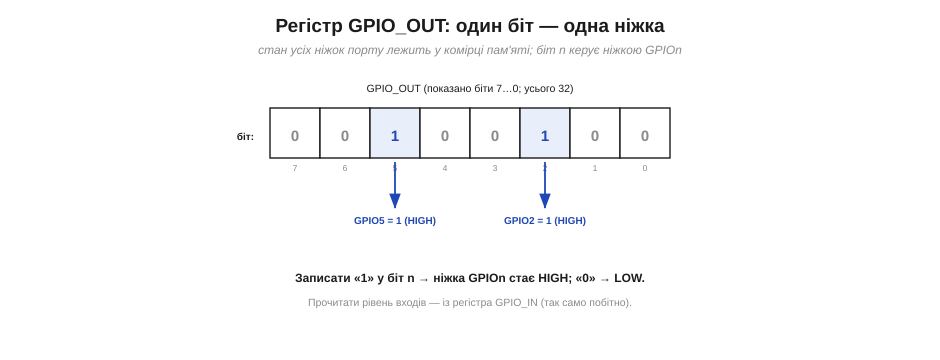
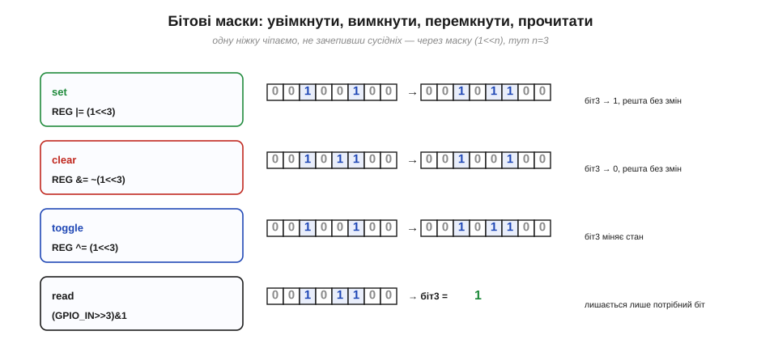
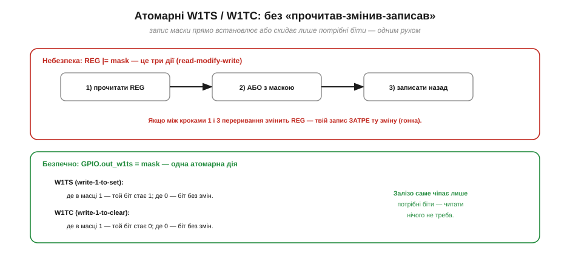
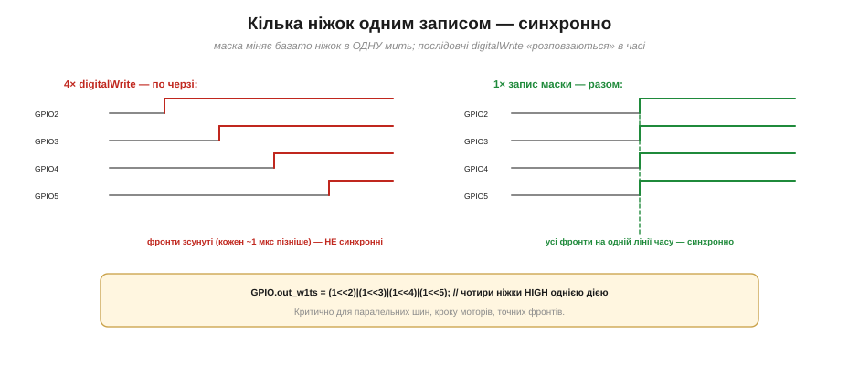
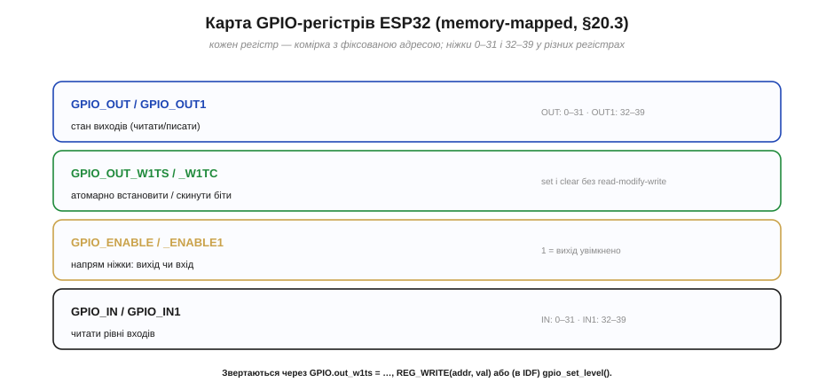

# GPIO у прошивці: регістри й маски (швидкодія)

Подивімося на ніжку очима **програміста**, а не електрика. Периферія мікроконтролера керується через [регістри — особливі комірки в адресному просторі](book:programming/memory-mapped-io), де кожен біт щось вмикає чи показує (memory-mapped IO). GPIO — найясніший приклад цього принципу. Уся ця тема — про те, як код **торкається** ніжок напряму: який регістр за що відповідає, як бітовою **маскою** чіпнути одну ніжку, не зачепивши сусідніх, чому `digitalWrite` зручний, але повільний, і як змінити кілька ніжок **одночасно** однією дією.

### Регістр GPIO_OUT: один біт — одна ніжка

Стан усіх вихідних ніжок порту зібрано в **одному** регістрі — у ESP32 він зветься `GPIO_OUT`. Це 32-бітна комірка з фіксованою адресою, і кожен її біт відповідає одній ніжці: біт 0 — це GPIO0, біт 5 — GPIO5, і так далі. Записати «1» у біт n — ніжка GPIOn стає HIGH; записати «0» — стає LOW. Усе керування виходом зводиться до того, щоб **поставити потрібні біти** в цій комірці.


*Рис. Регістр `GPIO_OUT` — 32 біти, по одному на ніжку. На малюнку біти 5 і 2 стоять у «1», тож GPIO5 і GPIO2 — HIGH; решта в «0» — LOW. Рівні **входів** так само читають із дзеркального регістра `GPIO_IN`, біт за бітом.*

Це пряме втілення ідеї [memory-mapped IO](book:programming/memory-mapped-io): «торкнутися заліза» означає **записати число у відому адресу**. Ніякої магії — лампочка спалахує тому, що в певному біті певної комірки з'явилася одиниця, і [двотактний вихідний каскад](book:electronics/push-pull-output) приєднав ніжку до VDD.

Симетрично влаштовано читання й напрям. Рівні **входів** чіп складає в дзеркальний регістр `GPIO_IN`: прочитати його біт n — те саме, що зробити `digitalRead(n)`. А чи буде ніжка взагалі виходом, вирішує ще один регістр — `GPIO_ENABLE`: одиниця в його біті вмикає вихідний каскад, нуль лишає ніжку входом. Тобто три речі — «куди» (напрям), «що видати» (вихід) і «що там» (вхід) — це три окремі регістри, кожен по біту на ніжку.

### digitalWrite — це зручна обгортка

Чому ж тоді у звичайному коді пишуть `digitalWrite(2, HIGH)`, а не чіпають регістр напряму? Бо `digitalWrite` — **дружня обгортка** над тим самим записом у регістр. Усередині вона робить чимало роботи: за **номером піна** знаходить, який саме регістр і який біт йому відповідають, виконує перевірки (чи коректний пін, чи не зайнятий він периферією), а вже **потім** робить власне запис. Усе це коштує часу — на ESP32 один `digitalWrite` забирає **близько мікросекунди**. Прямий запис у регістр виконується за **одиниці–десятки наносекунд** — у десятки разів швидше.


*Рис. `digitalWrite` — це виклик функції: пошук регістра й біта за номером піна, перевірки безпеки й лише потім запис (~1 мкс). Прямий запис у регістр (`GPIO.out_w1ts = (1<<2)`) — одна машинна дія (~наносекунди). Зручність обгортки оплачується швидкістю.*

Висновок не «ніколи не вживайте `digitalWrite`», а **доречність**. Для звичайного коду, де ніжку перемикають зрідка, обгортка ідеальна: читабельна, безпечна, переносна між платами. Та коли треба «бити» ніжкою дуже **часто** й **точно** — формувати власний протокол «руками» (це називають *bit-banging*), видавати точні фронти, крутити крок мотора — мікросекунда на кожне перемикання стає неприпустимою розкішшю, і тоді спускаються на рівень регістрів.

Варто розуміти, **звідки** береться та мікросекунда. Левова частка — не сам запис (він миттєвий), а **пошук**: перетворити людський номер піна на адресу регістра й номер біта та ще перевірити купу умов. Саме за цю універсальність — той самий `digitalWrite(2, HIGH)` працює і на ESP32, і на Arduino Uno, і на сотні інших плат — платять швидкістю. Це загальний закон, той самий, що й [у виборі між «голим залізом» і фреймворком](book:programming/baremetal-vs-framework): **шар абстракції зручний і переносний, але повільніший за «голий» доступ**. Інженер обирає рівень свідомо, під задачу.

### Бітові маски: чіпнути один біт, не зачепивши інших

Головна складність прямої роботи з регістром: усі 32 ніжки сидять в **одній** комірці, а змінити треба зазвичай **одну**. Тут і потрібні **бітові маски**. Маска однієї ніжки — це число, де стоїть одиниця рівно в потрібному біті: `(1 << n)` (одиниця, зсунута ліворуч на n позицій). А далі — чотири базові операції [побітної логіки](book:math/boolean-algebra):

```
маска однієї ніжки:   mask = (1u << n)

увімкнути (set):    GPIO_OUT |=  mask;   // АБО: ставить біт у 1
вимкнути (clear):   GPIO_OUT &= ~mask;   // І з ~mask: ставить біт у 0
перемкнути (toggle):GPIO_OUT ^=  mask;   // ВИКЛЮЧНЕ-АБО: міняє біт
прочитати (read):   рівень = (GPIO_IN >> n) & 1;
```

Кожна працює «хірургічно»: чіпає лише свій біт, а решту лишає недоторканими. `|=` з маскою піднімає потрібний біт у 1 (бо «АБО 1» дає 1, «АБО 0» не змінює); `&= ~mask` саджає його в 0 (бо «І 0» дає 0, «І 1» не змінює); `^=` перевертає (бо «ВИКЛЮЧНЕ-АБО 1» інвертує); а `(REG >> n) & 1` зсуває потрібний біт у наймолодшу позицію й маскою «1» відрізає все зайве.


*Рис. Чотири операції з маскою `(1<<3)`: **set** (`|=`) піднімає біт 3 у 1; **clear** (`&= ~`) саджає його в 0; **toggle** (`^=`) перевертає; **read** (`>>3 & 1`) видобуває його значення. Сусідні біти (ніжки) щоразу лишаються без змін.*

> 🔧 **Навіщо це.** Маски `(1<<n)` — це абетка вбудованого програмування; ви зустрічатимете їх скрізь, не лише в GPIO. Запам'ятайте трійцю: **`|=` увімкнути, `&= ~` вимкнути, `^=` перемкнути**. Найчастіша помилка початківця — написати `REG = mask` замість `REG |= mask`: перше **затирає всі інші ніжки** нулями, друге чіпає лише потрібну. Знак «дорівнює» без операції в роботі з регістрами — майже завжди баг.

Ще дві технічні дрібниці. По-перше, маску пишуть як `(1u << n)` — з `u` (unsigned): зсуви на велике число у знакових типах поводяться підступно, а беззнаковий тип безпечний. По-друге, для ширших **полів** (кількох сусідніх бітів) маску будують із кількох одиниць, і перед записом нового значення спершу **очищають** старі біти (`&= ~поле`), а вже тоді вставляють нові (`|= нове`) — інакше залишки старого зіпсують результат. Це той самий принцип «прочистити, потім записати», лише для групи бітів.

### Атомарність: регістри W1TS і W1TC

У записі `GPIO_OUT |= mask` причаїлася пастка. Ця коротка стрічка насправді — **три** окремі дії: прочитати регістр, виконати АБО з маскою, записати результат назад («читати-змінити-записати», read-modify-write). А що, як між кроком «прочитати» і кроком «записати назад» втрутиться [переривання](book:programming/interrupts) і теж змінить `GPIO_OUT`? Тоді ваш запис назад **затре** його зміну — і одна з ніжок «загубиться». Це класична [гонка даних](book:programming/atomicity-races).


*Рис. Угорі — небезпека: `REG |= mask` складається з трьох дій, і втручання між ними псує результат. Унизу — рятунок: окремі регістри `W1TS` (write-1-to-set) і `W1TC` (write-1-to-clear). Записуєш маску — і залізо саме ставить (чи скидає) **лише** ті біти, де в масці 1, не чіпаючи решти, **однією неподільною дією**.*

Розв'язання вбудоване в сам чіп — **окремі регістри** для встановлення й скидання бітів. Запис маски в `GPIO_OUT_W1TS` (*write-1-to-set*) **встановлює** ті біти, де в масці одиниця, а решту лишає як є; запис у `GPIO_OUT_W1TC` (*write-1-to-clear*) — **скидає** їх. Жодного «прочитати» не потрібно: ти не чіпаєш цілий регістр, а лише кажеш залізу «постав оці біти» — і воно робить це **атомарно**, однією дією, яку нічим не перервати посередині. Тому в надійному коді (особливо там, де ніжки чіпають і головний цикл, і переривання) користуються саме W1TS/W1TC, а не `|=`/`&=`.

> 🔧 **Навіщо це.** Якщо колись ніжка «самовільно» скидається або не вмикається в програмі з перериваннями — підозра номер один саме тут: десь `|=`/`&=` зіткнулися з перериванням. Лік простий: замінити їх на атомарні `out_w1ts`/`out_w1tc`. Це той випадок, коли «правильний» регістр позбавляє цілого класу плаваючих, важко відтворюваних багів.

Цей прийом ширший за GPIO. Майже вся периферія мікроконтролера керується регістрами, і скрізь, де біт чіпають і головний код, і переривання, чигає та сама гонка — тож апаратні «set/clear» регістри (під різними назвами) трапляються по всьому чипу. Є й програмна альтернатива, коли атомарного регістра нема: на час «читати-змінити-записати» **тимчасово вимкнути переривання** (критична секція). Але якщо залізо дає W1TS/W1TC — це і простіше, і дешевше, ніж вимикати переривання.

### Кілька ніжок одним записом — синхронно

Є ще одна суперсила прямої роботи з регістром, якої `digitalWrite` дати **не може** в принципі. Оскільки всі ніжки лежать в одній комірці, **одним** записом можна змінити **відразу кілька** — і всі вони перемкнуться в **ту саму мить**. А послідовні `digitalWrite` неминуче **зсунуті** в часі: поки відпрацює перший, минає мікросекунда, потім другий, третій — фронти «розповзаються».


*Рис. Чотири `digitalWrite` піднімають ніжки по черзі — фронти зсунуті на мікросекунди. Один масковий запис `GPIO.out_w1ts = (1<<2)|(1<<3)|(1<<4)|(1<<5)` піднімає всі чотири **одночасно**. Для паралельної шини, кроку мотора чи точних фронтів ця синхронність — вирішальна.*

Збирають таку маску об'єднанням окремих масок через АБО: `(1<<2)|(1<<4)|(1<<5)`. Це незамінне там, де кілька ліній мусять змінитися **разом**: паралельна шина даних (усі біти байта виставити одночасно), керування кроковим мотором (фази), формування синхронних сигналів. Жодна послідовність `digitalWrite` такого не дасть — лише один запис у регістр.

Маленька, але важлива умова: синхронно, однією дією, змінюються лише ніжки **одного** регістра. На ESP32, де ніжки поділено на групи 0–31 і 32–39, об'єднати в одному записі можна тільки ніжки з тієї самої групи; «змішані» доведеться писати двома діями — тобто вже не зовсім одночасно. Тому, проєктуючи паралельну шину чи будь-що, що мусить перемикатися **строго разом**, ніжки під неї добирають із **однієї** групи — це й уможливлює той жаданий синхронний фронт одним записом.

### Карта GPIO-регістрів ESP32

Зведімо в одну картину, які регістри є й за що відповідають. Важлива деталь ESP32: ніжок більше за 32, тож вони **не вміщаються** в один 32-бітний регістр — їх поділено на дві групи. Ніжки 0–31 живуть у «перших» регістрах, а 32–39 — у «других» (з одиничкою в назві: `OUT1`, `IN1`, `ENABLE1`).


*Рис. Основні GPIO-регістри ESP32: `GPIO_OUT/OUT1` — стан виходів; `W1TS/W1TC` — атомарні set/скид; `GPIO_ENABLE/ENABLE1` — напрям (вихід чи вхід); `GPIO_IN/IN1` — читання входів. Ніжки 0–31 і 32–39 — у різних регістрах. Усі мають фіксовані адреси в пам'яті.*

Окремий регістр `GPIO_ENABLE` задає **напрям** ніжки: одиниця в біті вмикає вихідний каскад (ніжка стає виходом), нуль лишає її входом. Це, по суті, те, що під капотом робить `pinMode`. Звертаються до всіх цих регістрів кількома способами: у Arduino-стилі через структуру `GPIO` (наприклад, `GPIO.out_w1ts = mask`) чи макрос `REG_WRITE(addr, val)`, а в ESP-IDF — через готову функцію `gpio_set_level()`, яка сама вибере потрібний регістр.

Корисно усвідомити, що **жодної нової магії** тут нема: `pinMode` під капотом чіпає `GPIO_ENABLE`, `digitalWrite` — `GPIO_OUT` (точніше, його W1TS/W1TC), `digitalRead` читає `GPIO_IN`. Знайомі функції — лише ввічливі імена для записів у ці комірки. А ще варто пам'ятати: читаючи `GPIO_OUT`, ви дізнаєтесь, що **наказали** видати, а читаючи `GPIO_IN` — який рівень **насправді** на ніжці. Зазвичай вони збігаються, та розбіжність між ними — цінна підказка під час налагодження (наприклад, вихід «бореться» із зовнішнім сигналом, і реальний рівень не той, що наказано).

### Порахуймо: швидкість і синхронність

Зберімо все в кількох рядках коду.

**Приклад (швидко й синхронно).**

```
Перемкнути GPIO2:
   digitalWrite(2, !digitalRead(2));   // зручно, але ~2 мкс
   GPIO.out ^= (1 << 2);               // прямо, ~наносекунди

Запалити GPIO2, GPIO4, GPIO5 СИНХРОННО (в одну мить):
   mask = (1<<2)|(1<<4)|(1<<5) = 0b0011_0100 = 0x34
   GPIO.out_w1ts = 0x34;               // усі три — HIGH однією дією

Погасити ЛИШЕ GPIO4, не торкаючись інших (атомарно):
   GPIO.out_w1tc = (1 << 4);
```

Три рядки показують усе, заради чого спускаються на рівень регістрів: **швидкість** (наносекунди проти мікросекунд), **синхронність** (кілька ніжок разом) і **атомарність** (чіпнути одну ніжку, не наражаючись на гонку). Ціна — менша читабельність і прив'язка до конкретного чипа, тож у звичайному коді лишають дружній `digitalWrite`, а на регістри переходять там, де ці три переваги справді потрібні.

> ⚙️ **Найгостріше застосування швидкості.** Коли потрібного апаратного блока нема, протокол відтворюють **самим смиканням ніжок** — це біт-бенгінг. Як це робиться й чому тут конче потрібні швидкі регістри (а не `digitalWrite`) — у вставці [Біт-бенгінг](proj-bitbang.md).

Отже, керування ніжкою з коду — це запис бітів у регістр (`GPIO_OUT`), а `digitalWrite` лише зручна, але повільніша обгортка над тим самим. Окрему ніжку чіпають **маскою** `(1<<n)` через `|=`/`&= ~`/`^=`, рівень входу читають зсувом і маскою, гонок уникають **атомарними** `W1TS`/`W1TC`, а кілька ніжок міняють **синхронно** одним записом. Так замикається повна картина GPIO — від [двотактного каскаду](book:electronics/push-pull-output) усередині ніжки до регістрів, якими його сіпає код. Звідси природний крок угору за абстракцією — побачити ніжки не нарізно, а як [інтерфейс модуля](book:programming/module-model): типового «цеглинку», яку підмикають до мікроконтролера.
