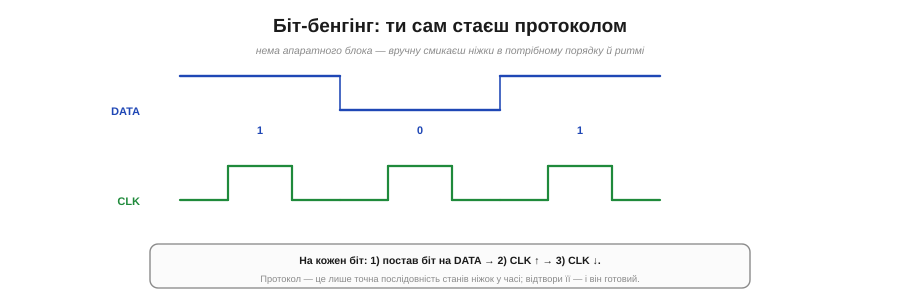
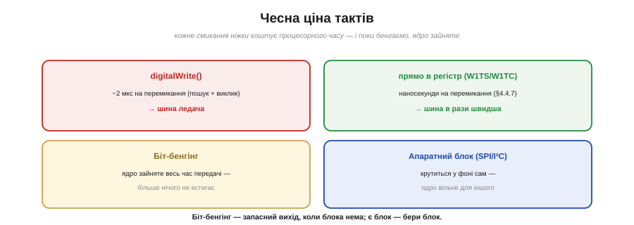

# ⚙️ Біт-бенгінг: протокол на голих регістрах і чесна ціна тактів

> Алгоритмічна вставка про **прямий запис у регістри GPIO** — коли ніжку треба смикати швидко й синхронно. Тут — найгостріше застосування цього: відтворити цілий протокол **самими ніжками**, коли апаратного блока для нього нема.

## Задача

Більшість шин — SPI, I²C, UART — мають у мікроконтролері **апаратний блок**, що жене біти сам. Та що, коли блока **нема** (рідкісний протокол, як в адресних світлодіодів WS2812), або всі блоки вже **зайняті**, а вам потрібна ще одна шина на довільних ніжках? Відповідь — **біт-бенгінг** (*bit-banging*): реалізувати протокол вручну, **самим кодом**, що по черзі виставляє й читає ніжки.

## Ідея

Будь-який цифровий протокол — це, по суті, **точна послідовність станів ніжок у часі**: коли підняти дані, коли смикнути такт, скільки тримати. Якщо код виставляє ці стани в правильному порядку й ритмі, він **і є** протокол — ніякого заліза не треба.


*Рис. Протокол — це послідовність станів ніжок у часі. На кожен біт: постав його на DATA, дай імпульс на CLK (↑ потім ↓). Приймач читає DATA по фронту CLK. Відтвори цю послідовність кодом — і ти реалізував протокол.*

Візьмімо простий тактований вивід (як спрощений SPI): на кожен біт кладемо його значення на лінію DATA, потім даємо імпульс на лінії CLK (підняли — опустили). Приймач читає DATA по фронту CLK. Вісім таких кроків — і байт передано «голими руками».

## Псевдокод

```
send_byte(b):                  # старший біт першим
    повторити для i = 7..0:
        DATA = (b >> i) & 1     # виставити поточний біт
        CLK = 1                 # фронт такту — приймач читає
        CLK = 0
```

Усе. Для прийому — дзеркально: підняти CLK, **прочитати** DATA, опустити CLK, зсунути біт у результат. Складніші протоколи (старт/стоп-умови I²C, тайминги WS2812) — це той самий принцип, лише з точнішими паузами.

## Чому тут конче потрібні швидкі регістри

Швидкість шини дорівнює тому, **як швидко крутиться ваш цикл**. І ось де ціна тактів стає видимою: якщо смикати ніжки через `digitalWrite` (~2 мкс на виклик через пошук і обгортку), шина виходить ледачою. Перейшовши на **прямий запис у регістр** (`W1TS`/`W1TC`, наносекунди) — ви прискорюєте біт-бенгінг у рази. Тому біт-бенгінг і живе пліч-о-пліч із регістрами: без них він надто повільний.


*Рис. Дві ціни біт-бенгінгу. Швидкість: digitalWrite (~2 мкс) робить шину ледачою, прямі регістри (наносекунди) — швидкою. Зайнятість: під час бенгінгу ядро не робить нічого іншого, тоді як апаратний блок жене дані у фоні.*

## Складність і пастки на МК

- **Зайнятий процесор.** Поки код бенгає біти, ядро **не робить нічого іншого** — на відміну від апаратного блоку, що жене дані у фоні. Це головна ціна: час процесора цілком іде на шину.
- **Тремтіння таймінгу.** Програмні паузи **неточні**: переривання може втрутитись посеред передачі й розтягнути біт. Для протоколів зі **строгим** таймінгом (ті ж WS2812) доводиться **забороняти переривання** на час передачі або писати критичну ділянку точними затримками чи асемблером.
- **digitalWrite уб'є швидкість.** Для будь-якого відчутного темпу — лише прямий запис у регістри GPIO.
- **Це запасний вихід, не перший.** Є апаратний блок під ваш протокол — **беріть його**: він швидший, точніший і звільняє процесор. Біт-бенгінг — коли блока нема, він зайнятий, або потрібні нестандартні ніжки.

## Підсумок

Біт-бенгінг — це «протокол голими руками»: код сам виставляє ніжки в потрібній послідовності, **стаючи** шиною. Він безцінний як запасний вихід — але платить **часом процесора** й вимагає **швидких регістрів** та обережності з таймінгом. Є залізо під задачу — довірте її залізу; нема — бенгайте, але свідомо.
