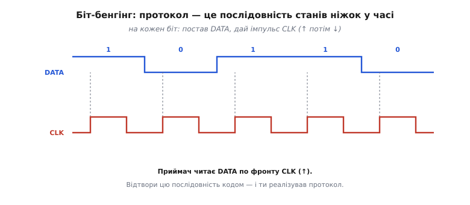

# ⚙️ Біт-бенгінг: протокол на голих регістрах і чесна ціна тактів

Найгостріше застосування прямого запису в регістри GPIO — відтворити цілий протокол **самими ніжками**, коли апаратного блока для нього нема. Саме тут наносекундна швидкість регістрів (проти мікросекунди в обгортці) вирішує, чи шина взагалі працюватиме.

## Задача

Більшість шин — SPI, I²C, UART — мають у мікроконтролері **апаратний блок**, що жене біти сам: ти кладеш байт у регістр даних, а залізо саме формує такт і рівні. Але так щастить не завжди, і причин узятися за ніжки руками три. Перша — потрібного блока в чипі **просто нема**: протокол рідкісний або саморобний (класика — адресні світлодіоди WS2812, де біт кодується довжиною імпульсу, і стандартний SPI його не жене). Друга — блоки **є, але всі зайняті**: два SPI вже тримають дисплей і флеш-пам'ять, а тобі потрібна третя лінія. Третя — блок прив'язаний до **фіксованих ніжок**, а твоя плата розведена так, що сигнал треба зняти зовсім з іншого піна.

У всіх трьох випадках відповідь одна — **біт-бенгінг** (англ. *bit-banging* — буквально «гупання бітами»): реалізувати протокол вручну, **самим кодом**, що по черзі виставляє й читає ніжки. Плата за гнучкість — час процесора й точність таймінгу, про що нижче.

## Ідея

Будь-який цифровий протокол — це, по суті, **точна послідовність станів ніжок у часі**: коли підняти дані, коли смикнути такт, скільки тримати. Якщо код виставляє ці стани в правильному порядку й ритмі, він **і є** протокол — ніякого спеціального заліза не треба.


*Протокол — це послідовність станів ніжок у часі. На кожен біт: постав його на DATA, дай імпульс на CLK (↑ потім ↓). Приймач читає DATA по фронту CLK. Відтвори цю послідовність кодом — і ти реалізував протокол.*

Візьмімо простий тактований вивід (як спрощений SPI): на кожен біт кладемо його значення на лінію DATA, потім даємо імпульс на лінії CLK (підняли — опустили). Приймач читає DATA по наростальному фронту CLK. Вісім таких кроків — і байт передано «голими руками».

Чому саме старший біт першим? Це поширена домовленість тактованих шин (її звуть MSB-first, від англ. *most significant bit* — найстарший біт): обидві сторони мусять однаково розуміти, у якому порядку йдуть біти, інакше байт «перевернеться». Тому порядок — частина протоколу, і код передавача та приймача має його дотримуватися однаково. Сам вибір біта робить зсув: `(b >> i) & 1` спускає i-й біт у наймолодшу позицію й маскою «1» лишає тільки його — той самий прийом читання одного біта, що й при роботі з будь-яким регістром.

## Робочий код передавання

Спершу найочевидніший варіант — через обгортку середовища (в Arduino це `digitalWrite`, в ESP-IDF — `gpio_set_level`, у STM32 HAL — `HAL_GPIO_WritePin`), щоб видно було логіку:

:::tabs
```arduino
#define PIN_DATA  23
#define PIN_CLK   18

void send_byte_slow(uint8_t b) {        // старший біт першим
    for (int i = 7; i >= 0; i--) {
        digitalWrite(PIN_DATA, (b >> i) & 1);  // виставити поточний біт
        digitalWrite(PIN_CLK, HIGH);           // наростальний фронт — приймач читає
        digitalWrite(PIN_CLK, LOW);
    }
}
```
```esp-idf
#include "driver/gpio.h"

#define PIN_DATA  GPIO_NUM_23
#define PIN_CLK   GPIO_NUM_18

void send_byte_slow(uint8_t b) {        // старший біт першим
    for (int i = 7; i >= 0; i--) {
        gpio_set_level(PIN_DATA, (b >> i) & 1);  // виставити поточний біт
        gpio_set_level(PIN_CLK, 1);              // наростальний фронт — приймач читає
        gpio_set_level(PIN_CLK, 0);
    }
}
```
```stm32
#include "stm32f4xx_hal.h"

#define PORT      GPIOB
#define PIN_DATA  GPIO_PIN_5
#define PIN_CLK   GPIO_PIN_6

void send_byte_slow(uint8_t b) {        // старший біт першим
    for (int i = 7; i >= 0; i--) {
        HAL_GPIO_WritePin(PORT, PIN_DATA,        // виставити поточний біт
                          ((b >> i) & 1) ? GPIO_PIN_SET : GPIO_PIN_RESET);
        HAL_GPIO_WritePin(PORT, PIN_CLK, GPIO_PIN_SET);   // фронт — приймач читає
        HAL_GPIO_WritePin(PORT, PIN_CLK, GPIO_PIN_RESET);
    }
}
```
:::

Логіка правильна, але кожен виклик обгортки — близько мікросекунди, тож на один біт іде три виклики (≈3 мкс), а на байт — під 25 мкс. Це повільно. Той самий алгоритм на прямих регістрах: маска `(1<<n)` і атомарний регістр установки/скидання — на ESP32 це пара `W1TS`/`W1TC`, на STM32 — один `BSRR`, де молодша половина слова ставить біт, а старша скидає:

:::tabs
```esp-idf
const uint32_t M_DATA = (1u << PIN_DATA);
const uint32_t M_CLK  = (1u << PIN_CLK);

void send_byte_fast(uint8_t b) {        // старший біт першим
    for (int i = 7; i >= 0; i--) {
        if ((b >> i) & 1) GPIO.out_w1ts = M_DATA;   // біт = 1 → set
        else              GPIO.out_w1tc = M_DATA;   // біт = 0 → clear
        GPIO.out_w1ts = M_CLK;          // фронт такту вгору
        GPIO.out_w1tc = M_CLK;          // і вниз
    }
}
```
```stm32-ll
// GPIO_PIN_5 / GPIO_PIN_6 — це вже готові маски (1<<5) і (1<<6)

void send_byte_fast(uint8_t b) {        // старший біт першим
    for (int i = 7; i >= 0; i--) {
        if ((b >> i) & 1) PORT->BSRR = PIN_DATA;         // біт = 1 → set
        else              PORT->BSRR = PIN_DATA << 16;   // біт = 0 → clear
        PORT->BSRR = PIN_CLK;           // фронт такту вгору
        PORT->BSRR = PIN_CLK << 16;     // і вниз
    }
}
```
:::

Кожен рядок — один запис у регістр (наносекунди), без пошуку піна й перевірок. Та сама логіка стала в рази швидшою — і тільки так шина виходить на пристойний темп.

## Прийом — дзеркально

Для прийому байта міняємо ролі: самі женемо такт, а DATA не виставляємо, а **читаємо** — зсувом і маскою з регістра входу (на ESP32 він зветься `GPIO_IN`, на STM32 — `IDR`):

```esp-idf
uint8_t recv_byte(void) {
    uint8_t b = 0;
    for (int i = 7; i >= 0; i--) {
        GPIO.out_w1ts = M_CLK;                 // підняли такт
        uint32_t bit = (GPIO.in >> PIN_DATA) & 1u;  // читаємо рівень DATA
        b |= (uint8_t)(bit << i);              // вкладаємо біт на своє місце
        GPIO.out_w1tc = M_CLK;                 // опустили такт
    }
    return b;
}
```

Тонкощів додає **момент зчитування**. Тут ми читаємо DATA одразу після підняття CLK, бо передавач виставив дані ще до фронту й тримає їх стабільними. У строгіших протоколах приймач навмисне відбирає рівень не на самому фронті, а **посередині біта** — коли лінія вже точно усталилася, подалі від моменту перемикання, де можливі викиди й перехідні стани. Це той самий мотив, що й скрізь у цифровій техніці: читати тоді, коли сигнал гарантовано стабільний. Складніші протоколи (старт/стоп-умови I²C, точні тайминги WS2812) — це той самий принцип, лише з акуратнішими паузами між діями.

## Чому тут конче потрібні швидкі регістри

Швидкість шини дорівнює тому, **як швидко крутиться твій цикл**. І ось де ціна тактів стає видимою: якщо смикати ніжки через обгортку (≈1 мкс на виклик через перевірки й пошук піна, до 3 мкс на біт), шина виходить ледачою. Перейшовши на **прямий запис у регістр** (`W1TS`/`W1TC`, наносекунди), ти прискорюєш біт-бенгінг у рази. Тому біт-бенгінг і живе пліч-о-пліч із регістрами: без них він надто повільний для будь-чого серйознішого за поодинокий вивід.


*Дві ціни біт-бенгінгу. Швидкість: digitalWrite (близько мікросекунди) робить шину ледачою, прямі регістри (наносекунди) — швидкою. Зайнятість: під час бенгінгу ядро не робить нічого іншого, тоді як апаратний блок жене дані у фоні.*

Щоб відчути різницю в числах, прикиньмо темп шини для обох варіантів.

**Умова: передати байт (8 бітів) на ESP32; оцінити частоту такту через обгортку й через регістри.**

```
один біт = виставити DATA + підняти CLK + опустити CLK = 3 дії

через обгортку (~1 мкс на дію):
   біт   ≈ 3 × 1 мкс      = 3 мкс
   байт  ≈ 8 × 3 мкс      = 24 мкс   → темп такту ≈ 330 кГц

через прямі регістри (~50 нс на запис, з накладними циклу):
   біт   ≈ 3 × 50 нс      = 150 нс
   байт  ≈ 8 × 150 нс     = 1.2 мкс  → темп такту ≈ 6–7 МГц
```

Цифри орієнтовні (точні залежать від компілятора й частоти ядра), але порядок промовистий: обгортка тримає шину в межах сотень кілогерц, прямі регістри піднімають її до одиниць мегагерц — на порядок швидше. Тому для будь-чого, окрім поодинокого виводу, обгортку в біт-бенгінгу не лишають.

## Складність і пастки на мікроконтролері

- **Зайнятий процесор.** Поки код бенгає біти, ядро **не робить нічого іншого** — на відміну від апаратного блока, що жене дані у фоні. Це головна ціна: час процесора цілком іде на шину, і чим довша посилка, тим довше все інше стоїть.
- **Тремтіння таймінгу** (англ. *jitter* — дрижання). Програмні паузи **неточні**: переривання може втрутитись посеред передачі й розтягнути один біт. Для протоколів зі **строгим** таймінгом (ті ж WS2812, де довжина імпульсу кодує 0 чи 1) це псує дані — доводиться **забороняти переривання** на час передачі або писати критичну ділянку точними затримками чи навіть асемблером.
- **Обгортка вб'є швидкість.** Для будь-якого відчутного темпу — лише прямий запис у регістри GPIO; обгортку (`digitalWrite`, `gpio_set_level`, `HAL_GPIO_WritePin`) лишають хіба для налагодження.
- **Це запасний вихід, не перший.** Є апаратний блок під твій протокол — **бери його**: він швидший, точніший і звільняє процесор. Біт-бенгінг доречний, коли блока нема, він зайнятий, або потрібні нестандартні ніжки.

Як ці пастки виглядають на практиці — добре видно на тих самих WS2812. Там нулі й одиниці кодуються довжиною високого імпульсу (різниця — сотні наносекунд), а пауза понад умовний поріг означає «кінець кадру, засвічуй». Варто перериванню розтягнути один біт — і світлодіод приймає не той колір або сприймає паузу як кінець кадру; гірлянда «сипле» випадковими спалахами. Лік той самий: на час такої передачі переривання **вимикають**, а самі імпульси формують прямими записами в регістр із точно відрахованими затримками. Це наочно показує, чому для строгого таймінгу мало просто «швидко» — потрібно ще й **рівномірно**, без чужих втручань усередині посилки.

## Підсумок

Біт-бенгінг — це «протокол голими руками»: код сам виставляє ніжки в потрібній послідовності, **стаючи** шиною. Він безцінний як запасний вихід — але платить **часом процесора** й вимагає **швидких регістрів** та обережності з таймінгом. Є залізо під задачу — довір її залізу; нема — бенгай, але свідомо: масками `(1<<n)`, атомарними `W1TS`/`W1TC` і, де треба, із вимкненими перериваннями.
