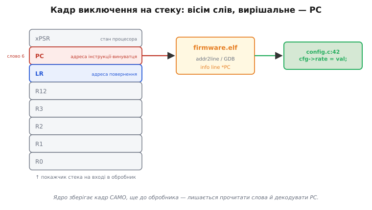
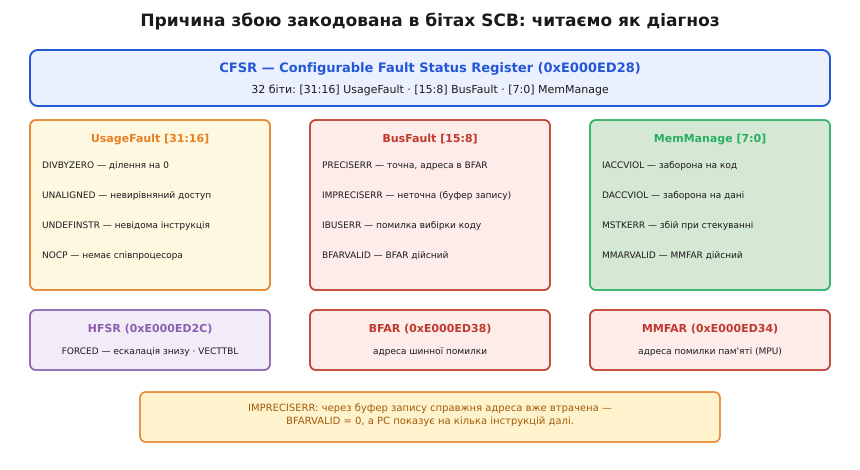
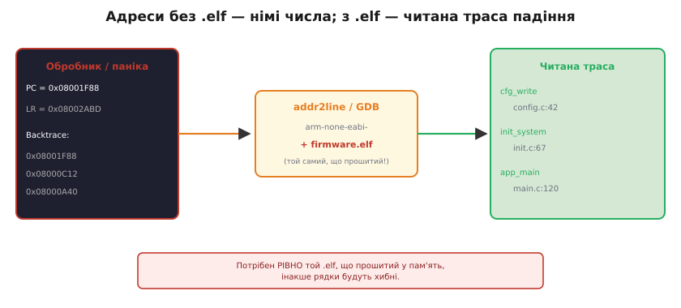

# Розбір HardFault

Прошивка крутиться роками без жодного людського ока поряд, і найгірша звістка від неї — раптовий перезапуск без пояснень. Пристрій ішов своїм циклом, аж раптом завмер, смикнувся й почав з нуля. Майже завжди за цим стоїть **HardFault** (англ. *hard* — твердий, безумовний; *fault* — збій): процесор натрапив на дію, яку архітектура виконати не може, і передав керування спеціальному обробникові збою. Здавалося б, глуха стіна. Насправді ядро лишає по собі напрочуд докладний слід — треба лише знати, де його шукати й як прочитати.

### Що ядро вважає збоєм

Процесор постійно стежить за тим, чи кожна дія законна, і сам ловить «неможливі» ситуації — ті, що порушують правила архітектури. У Cortex-M ці ситуації впорядковані в ієрархію виключень. **MemManageFault** спрацьовує на доступ до адреси, яку заборонив [модуль захисту пам'яті MPU](topic:programming/stack-overflow/comp-mpu.md). **BusFault** — це відмова на шині: звернення до неіснуючої периферії, читання за межами фізичної пам'яті. **UsageFault** ловить логічно неправильну інструкцію: невідомий код операції, ділення на нуль, невирівняний доступ там, де він заборонений.

Над ними стоїть **HardFault** — останній рубіж. Він перехоплює все, чого не спіймали (або не змогли спіймати) спеціалізовані обробники вище. Якщо MemManage, Bus чи Usage вимкнені або самі впали під час входу, їхній збій **ескалює** (від латин. *scala* — драбина: піднімається сходинкою вище) до HardFault. Тому на практиці пристрій найчастіше падає саме в HardFault, навіть коли первинна причина — звичайне ділення на нуль.

> 🔧 **Навіщо це.** Знати ієрархію — означає за лічені секунди звузити коло пошуку: піднятий прапор BusFault веде до апаратури й покажчиків, UsageFault — до арифметики й вирівнювання, MemManage — до MPU й виходу за межі масиву. Замість гадати на всю прошивку, ви відразу дивитесь у потрібний бік.

HardFault — це **подія**, а не вирок. Що з нею робити далі (перезавантажитись, зберегти стан у незалежну пам'ять, блимнути світлодіодом коду помилки) — окреме рішення, яке належить [обробці помилок](topic:programming/error-handling). Тут ідеться про інше: як саме **прочитати** цю подію, перетворивши голий перезапуск на точну адресу винуватця.

### Слід на стеку: кадр виключення

У мить збою ядро Cortex-M робить одну критично важливу річ ще **до** того, як викликати будь-який обробник: апаратно зберігає знімок свого стану на активному стеку. Цей знімок називають **кадром виключення** (англ. *stacked frame* — складений на стек кадр), бо ядро «стекує» регістри автоматично, без жодного рядка вашого коду.

Кадр містить вісім слів у строго визначеному порядку: R0, R1, R2, R3, R12, далі **LR** (англ. *Link Register* — регістр зв'язку, адреса повернення), потім **PC** (англ. *Program Counter* — лічильник команд) і нарешті **xPSR** (стан процесора). Якщо задіяний блок з рухомою комою, до них додаються ще регістри S0–S15 і FPSCR. Лежать вони так, що R0 опиняється за найменшою адресою, а xPSR — за найбільшою; PC — це сьоме слово від початку (зміщення 6).



*Ядро кладе знімок стану на стек ще до обробника — лишається прочитати слова й декодувати PC.*

Серце кадру — **PC**. Це точна адреса інструкції, на якій усе зламалося. Маючи цю адресу і **той самий .elf-файл**, з якого зібрано прошивку у Flash, причину звужено до одного машинного коду. Сусіднє слово LR підказує, **звідки** прийшли у винну функцію, — це перший крок зворотного сліду викликів.

### Чому впало: статусні регістри

Кадр відповідає на питання «де». На питання «чому» відповідають **статусні регістри збою** — окремі комірки в блоці системного керування процесора (SCB), куди ядро записує закодований діагноз.

Головний серед них — **CFSR** (англ. *Configurable Fault Status Register*) за адресою `0xE000ED28`. Це 32-бітний регістр, поділений на три поля: старші 16 бітів описують UsageFault, середні 8 — BusFault, молодші 8 — MemManage. Кожне поле має набір бітових прапорів, і кожен прапор — одна конкретна причина:

- `IACCVIOL` — спроба виконати код з адреси, заблокованої MPU;
- `DACCVIOL` — доступ до даних за забороненою MPU адресою;
- `PRECISERR` — **точна** помилка шини: адреса винного звернення збережена в BFAR;
- `IMPRECISERR` — **неточна** помилка шини: справжню адресу вже втрачено через буфер запису;
- `DIVBYZERO` — ділення на нуль (ловиться, лише якщо ввімкнено в керуванні);
- `UNALIGNED` — невирівняний доступ (так само за умови ввімкнення).

Поруч стоять два регістри-адреси: **BFAR** (`0xE000ED38`) тримає адресу, за якою сталася помилка шини, а **MMFAR** (`0xE000ED34`) — адресу помилки пам'яті. Але довіряти їм можна **лише** тоді, коли в CFSR піднято відповідний прапор дійсності — `BFARVALID` чи `MMARVALID`. Перевірити цей прапор треба насамперед: без нього в BFAR лежить старе сміття, що поведе слід хибним шляхом.

Окремий регістр **HFSR** (`0xE000ED2C`) описує сам HardFault. Прапор `FORCED` означає, що первинний збій стався нижче (скажімо, BusFault), але був замаскований і ескалував сюди — отже, справжню причину шукайте в CFSR. Прапор `VECTTBL` вказує на помилку вже під час читання таблиці векторів.



*Причину збою закодовано в конкретних бітах — їх читають як медичний діагноз.*

Найпідступніший випадок — `IMPRECISERR`. У Cortex-M3 і M4 запис у пам'ять може проходити через **буфер запису**: ядро встигає виконати ще кілька інструкцій, перш ніж відкладений запис дійде до шини й там спіткнеться. Через це PC у кадрі вказує не на винний рядок, а на кілька інструкцій далі, а `BFARVALID` буде нульовим — адресу вже не відновити. Обхід для M3/M4: тимчасово вимкнути буфер бітом `DISDEFWBUF` у регістрі ACTLR (`0xE000E008`), щоб записи стали синхронними й помилка вказала точно. На Cortex-M7 такого вимикача немає — там частину збоїв запису неможливо зробити точними, і доводиться спиратися на LR та зворотний слід.

### Від адреси до рядка коду

Сама по собі адреса на кшталт `0x08001F88` — німе число. Перекладає його на людську мову той самий .elf, у якому збережено таблицю символів: яка функція за якою адресою і який рядок якого файлу. Робить переклад або `addr2line`, або GDB командою `info line *PC`:

```bash
arm-none-eabi-addr2line -pfiaC -e build/firmware.elf 0x08001F88 0x08002ABC
```

```
0x08001F88: cfg_write at /project/src/config.c:42
0x08002ABC: init_system at /project/src/init.c:67
```

Тут вирішальна умова — **той самий** .elf, що зараз прошитий у пам'ять. Зібрали наново, змінили хоч рядок, переключили рівень оптимізації — адреси поїхали, і той самий `0x08001F88` вкаже на зовсім інше місце. Тому .elf кожної прошивки, яка йде «в поле», варто зберігати разом із версією.



*Адреси без .elf — німі числа; з .elf — читана траса падіння.*

На ESP32 (ядро Xtensa, не ARM) усе влаштовано суголосно, лише іншими словами: панічний обробник ESP-IDF при кожному збої сам друкує зворотний слід адрес, а `idf.py monitor` декодує їх у функції й рядки на льоту, користуючись `xtensa-esp32-elf-addr2line`. Прапорів CFSR/HFSR там немає — натомість свої виключення (`LoadProhibited`, `StoreProhibited`, `IllegalInstruction`), але логіка та сама: адреса плюс правильний .elf дають рядок.

### Робочий обробник Cortex-M

Складемо все докупи в обробник, який не просто ловить HardFault, а й виймає з кадру PC та LR і друкує декодований діагноз. Точка входу мусить бути «голою» (`naked`): ядро вже зберегло кадр, і будь-який пролог компілятора зіпсував би покажчик стека. Тому в кількох рядках асемблера ми лише з'ясовуємо, **який** стек був активний, і передаємо його адресу у звичайну C-функцію.

Який стек активний, каже біт 2 регістра LR на вході в обробник (значення EXC_RETURN): біт скинутий — діяв головний стек MSP, піднятий — стек процесу PSP.

```c
// Точка входу: визначаємо активний стек і передаємо його у C-обробник
__attribute__((naked)) void HardFault_Handler(void) {
    __asm volatile(
        "tst lr, #4            \n"  // біт 2 EXC_RETURN: який стек?
        "ite eq               \n"
        "mrseq r0, msp        \n"  // біт = 0 → кадр на MSP
        "mrsne r0, psp        \n"  // біт = 1 → кадр на PSP
        "b hardfault_report   \n"  // r0 = покажчик на кадр
    );
}
```

Тепер кадр — це просто структура у пам'яті за отриманою адресою. Накладаємо її й читаємо PC, LR і статусні регістри:

```c
typedef struct {            // порядок строго як кладе ядро
    uint32_t r0, r1, r2, r3, r12;
    uint32_t lr;            // звідки прийшли
    uint32_t pc;            // де саме впало
    uint32_t xpsr;
} fault_frame_t;

#define SCB_CFSR (*(volatile uint32_t *)0xE000ED28)
#define SCB_HFSR (*(volatile uint32_t *)0xE000ED2C)
#define SCB_BFAR (*(volatile uint32_t *)0xE000ED38)

void hardfault_report(fault_frame_t *frame) {
    uint32_t cfsr = SCB_CFSR;

    printf("PC   = 0x%08lx\n", frame->pc);   // → addr2line дасть рядок
    printf("LR   = 0x%08lx\n", frame->lr);   // зворотний слід
    printf("CFSR = 0x%08lx\n", cfsr);
    printf("HFSR = 0x%08lx\n", SCB_HFSR);

    if (cfsr & (1u << 9))                     // PRECISERR (біт 9)
        printf("точна шинна помилка\n");
    if (cfsr & (1u << 25))                    // DIVBYZERO (біт 25)
        printf("ділення на нуль\n");
    if (cfsr & (1u << 15))                    // BFARVALID (біт 15): адреса дійсна?
        printf("BFAR = 0x%08lx\n", SCB_BFAR);
    for (;;) { }                              // спинитись для відлагоджувача
}
```

**Повний розбір за роздруком.** Хай обробник вивів такий стан:

```
PC   = 0x08001F88
LR   = 0x08002ABD
HFSR = 0x40000000   (FORCED — ескальовано знизу)
CFSR = 0x00008200   (BusFault: PRECISERR=1, BFARVALID=1)
BFAR = 0x00000000   (запис за адресою 0x0!)
```

Крок 1 — декодуємо CFSR. Біти `[15:8]` (поле BusFault): `PRECISERR=1`, `BFARVALID=1`. Отже, точна шинна помилка, адреса в BFAR дійсна.

Крок 2 — читаємо BFAR = `0x00000000`. Це запис за нульовим покажчиком.

Крок 3 — перекладаємо PC у рядок:

```bash
arm-none-eabi-addr2line -e build/firmware.elf 0x08001F88
# → cfg_write at /project/src/config.c:42
```

Крок 4 — дивимося `config.c:42`:

```c
void cfg_write(config_t *cfg, uint32_t val) {
    cfg->rate = val;          // рядок 42 — запис через покажчик
}
```

Крок 5 — LR = `0x08002ABD` веде в `init_system`, де `cfg` не ініціалізували і він лишився нульовим. Запис `cfg->rate` пішов за адресою `0x0` — звідси точна шинна помилка з BFAR = 0, ескальована до HardFault. Справу закрито: одна адреса розплутала весь ланцюжок.

> 🔧 **Навіщо це.** HardFault у полі — не біла стіна, а лист із точною адресою події. Обробник на двадцять рядків, що друкує PC, LR і CFSR, перетворює розслідування з днів навмання на хвилини за роздруком; а збережений .elf робить читаним навіть той збій, що стався у клієнта за тисячу кілометрів.
