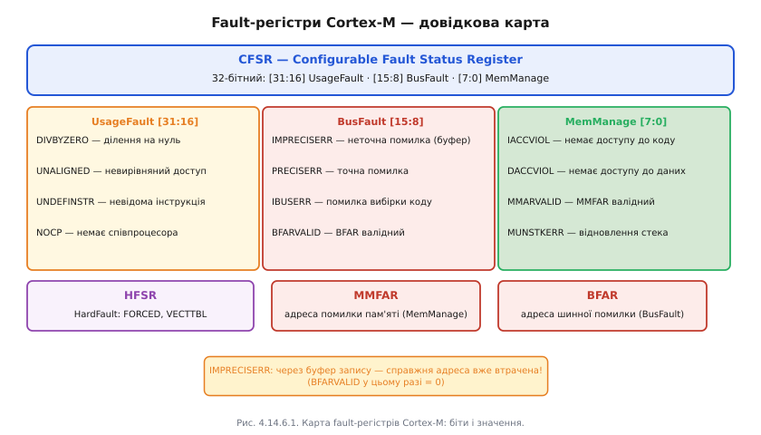
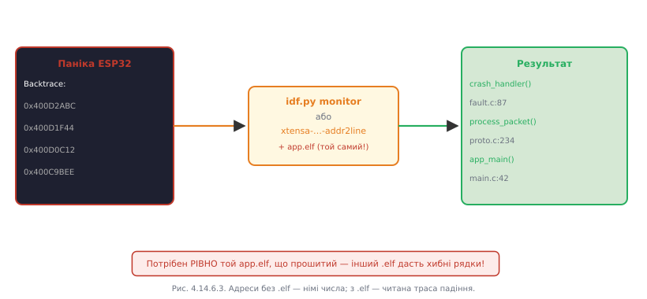

# Розбір HardFault: що ядро зберігає при збої і як прочитати причину падіння

Зупинити справну програму своєю волею — одне; куди частіший сценарій у реальній розробці — пристрій зупиняється **сам**: потрапляє в обробник збою і перезавантажується. Саме тоді відлагоджувач (або хоча б правильно написаний обробник) показує найбільше.

### Природа збою: що таке HardFault

Процесор сам ловить «неможливі» ситуації — події, що порушують правила архітектури. Для Cortex-M це ієрархія виключень: **MemManageFault** (доступ до забороненої адреси MPU), **BusFault** (помилка на шині, наприклад звернення до неіснуючої периферії), **UsageFault** (невідома інструкція, ділення на нуль, невирівняний доступ) і **HardFault** — «останній рубіж», що перехоплює все, чого не спіймали вищі обробники. Для Xtensa в ESP32 — власний набір виключень: `LoadProhibited`, `StoreProhibited`, `IllegalInstruction`, `Unaligned`.

HardFault — це **подія**; що з нею зробити (перезавантажитись, зберегти стан, блимнути світлодіодом) — окреме питання [обробки помилок](book:programming/error-handling). Тут ідеться про те, як саме **прочитати** цю подію.

### Передсмертна записка: exception-фрейм

У мить збою ядро Cortex-M виконує критично важливу дію ще **до** виклику будь-якого обробника: воно автоматично зберігає знімок свого стану на стеку. Цей знімок, що з'явився на стеку, називається **exception-фреймом**. Він містить: R0, R1, R2, R3, R12, LR (звідки прийшли), **PC** (де саме виникло виключення) і xPSR (стан процесора). Якщо використовується FPU — також регістри S0–S15 і FPSCR.

Ключове тут — **PC**. Це точна адреса інструкції, яка спричинила збій. Маючи цю адресу і [той самий .elf-файл](book:programming/openocd-gdb), що відповідає прошивці у Flash, можна отримати точний рядок вихідного коду через `addr2line` або `GDB list *PC`.


*Рис. Ядро кладе «передсмертну записку» на стек — PC вказує, де саме впало.*

### Fault-регістри: закодований діагноз

Exception-фрейм дає PC — де саме впало. Але чому — пояснюють **fault-статусні регістри**.

**CFSR** (Configurable Fault Status Register) — 32-бітний регістр, поділений на три частини. Старші 16 бітів — UsageFault, середні 8 — BusFault, молодші 8 — MemManageFault. Кожна частина має бітові прапори, що кодують конкретну причину:

- `IACCVIOL` — спроба виконати код з адреси, заблокованої MPU
- `DACCVIOL` — доступ до даних за адресою, заблокованою MPU
- `IMPRECISERR` — неточна помилка шини (через буфер запису: справжня адреса вже втрачена до появи помилки)
- `PRECISERR` — точна помилка шини (адреса збережена в BFAR)
- `DIVBYZERO` — ділення на нуль (якщо увімкнено в UFSR)
- `UNALIGNED` — невирівняний доступ (якщо увімкнено)

**MMFAR** і **BFAR** — адреса, за якою сталась помилка пам'яті чи шини відповідно. Вони дійсні лише тоді, коли встановлені прапори `MMARVALID`/`BFARVALID` у CFSR — перевіряти це треба насамперед.

**HFSR** — HardFault Status Register. Прапор `FORCED` означає, що первинний збій стався в нижчому обробнику (наприклад, BusFault), але той був замаскований і ескалував до HardFault. `VECTTBL` — помилка при читанні таблиці векторів.



*Рис. Збій закодовано в конкретних бітах — їх читають як діагноз.*

Хитрий випадок — `IMPRECISERR`. Через буфер запису в Cortex-M3/M4 процесор може виконати кілька інструкцій **після** реально помилкового запису, перш ніж помилка шини до нього дійде. Тому PC у exception-фреймі вказує не на рядок з помилкою, а на кілька інструкцій далі — і BFARVALID буде нульовим. Обхід: тимчасово вимкнути буфер запису (`ACTLR.DISDEFWBUF`) для відтворення точної адреси.

### Від адреси до рядка: addr2line

На ESP32 з Xtensa-ядром панічний обробник ESP-IDF автоматично виводить backtrace у вигляді адрес при будь-якому збої. Перетворити адреси на рядки:

```bash
# idf.py monitor робить це автоматично у реальному часі
idf.py monitor

# Або вручну:
xtensa-esp32-elf-addr2line -pfiaC -e build/myapp.elf 0x400D2ABC 0x400D1F44
```

Результат:
```
0x400D2ABC: sensor_read at /project/main/sensor.c:88
0x400D1F44: update_sensors at /project/main/tasks.c:45
```



*Рис. Адреси без .elf — німі числа; з .elf — читана траса падіння.*

**Worked-приклад. Повний розбір HardFault.**

Стан регістрів при збої:

```
HFSR  = 0x40000000  (FORCED — ескалований з BusFault)
CFSR  = 0x00008200  (BusFault: PRECISERR=1, BFARVALID=1)
BFAR  = 0x00000000  (спроба запису за адресою 0x0!)
PC    = 0x400D1F88
LR    = 0x400D2ABD
```

Крок 1 — декодуємо CFSR. Біти `[15:8]` (BusFault): `PRECISERR=1`, `BFARVALID=1`. Точна шинна помилка, BFAR валідний.

Крок 2 — читаємо BFAR = `0x00000000`. Запис за нульовим вказівником.

Крок 3 — addr2line за PC:
```bash
xtensa-esp32-elf-addr2line -e build/app.elf 0x400D1F88
# → cfg_write at /project/main/config.c:42
```

Крок 4 — дивимося рядок `config.c:42`:
```c
void cfg_write(config_t *cfg, uint32_t val) {
    cfg->rate = val;          // рядок 42 — запис через вказівник
}
```

Крок 5 — backtrace з LR показує, що `cfg_write` викликали з `init_system()`, де `cfg` не ініціалізовано і залишилось `NULL`. Справа закрита.

> 🔧 **Навіщо це:** HardFault у полі — не «біла стіна», а лист із точною адресою злочину; вміння прочитати скорочує розслідування з днів до хвилин.

---
