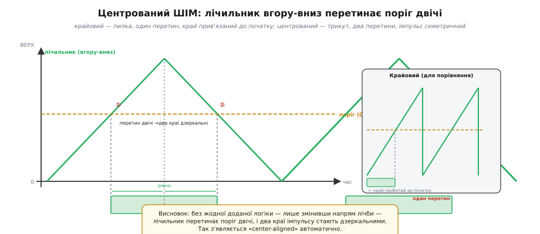
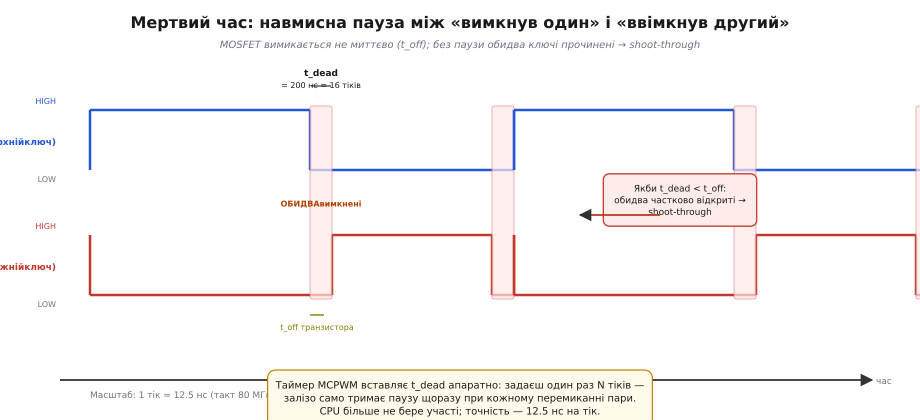

# ⚙️ Edge- і center-aligned ШІМ, мертвий час: навіщо таймери це вміють

## Задача

Простий крайовий (*edge-aligned*) [ШІМ](book:programming/hardware-pwm) працює так: лічильник рахує вгору, досягає ВЕРХУ, скидається й починає знову. Поріг порівняння перетинається рівно **раз** за кожен підйом — і один край імпульсу намертво прив'язаний до початку кожного нового циклу. Такий підхід чудово працює для світлодіода чи простого вентилятора. Але точне керування мотором через силовий міст висуває дві пов'язані вимоги, яких крайовий ШІМ не задовольняє сам по собі.

Перша: центрований (*center-aligned*) ШІМ, де центр кожного імпульсу збігається в часі між усіма каналами — симетрія, яка спрощує синхронне вимірювання струму й зменшує пульсації поля. Проста лічба вгору цього не дає, бо всі краї прив'язані до одного моменту. Друга: пара транзисторів півмоста керується протилежними (*complementary outputs*) сигналами — верхній увімкнений, коли нижній вимкнений, і навпаки. Миттєве перемикання, за якого один ключ ще не встиг закритися, а другий уже відкривається, спричиняє **наскрізний струм** (*shoot-through*) — короткочасне коротке замикання через [півмостовий вихід](book:electronics/push-pull-output): піковий струм у сотні ампер, нагрів і деградація транзисторів за лічені мікросекунди. Вставка розбирає **механізм** (як лічильник породжує симетрію) і **числа** (скільки наносекунд паузи і де їх задавати).

Двомовні терміни тут: «крайовий (*edge-aligned*)», «центрований (*center-aligned*)», «наскрізний струм (*shoot-through*)», «мертвий час (*dead-time*)», «комплементарні виходи (*complementary outputs*)».

## Ідея 1: один лічильник вгору-вниз дає симетрію «безкоштовно»

У крайовому режимі лічильник рахує лише вгору, скидається — і поріг перетинається рівно раз, на підйомі. Звідси «edge»: один край намертво прибитий до початку нового підрахунку. Уявімо тепер, що, досягнувши ВЕРХУ, лічильник не скидається, а **повертає назад** — трикутна хвиля замість пилки. На підйомі він перетне поріг один раз; на спуску — другий, із тим самим значенням і на симетрично рівній відстані від ВЕРХУ. Обидва краї однаково далеко від вершини — центр імпульсу збігається з моментом ВЕРХУ.


*Механізм центрування: трикутна траєкторія лічильника вгору-до-ВЕРХУ-і-вниз; горизонтальна лінія порога перетинає її двічі — на підйомі й на спуску; вертикальні пунктири від двох перетинів окреслюють імпульс, дзеркальний відносно ВЕРХУ. Два краї рівновіддалені від центра — симетрія виникає сама, без додаткової логіки. Права врізка: крайовий — пилка, один перетин, один край прив'язаний до початку.*

Зміна напряму лічби — це один біт у регістрі конфігурації таймера (`MCPWM_TIMER_COUNT_MODE_UP_DOWN`). Жодної додаткової логіки, жодного другого компаратора. Симетрія виникає із самої геометрії трикутної хвилі.

> 🔧 **Навіщо це.** По-перше, центр кожного імпульсу всіх каналів збігається в часі в момент ВЕРХУ — це зручна точка, де всі ключі переходять від «всі відкрито» до «всі закрито» (або навпаки), ідеальна для синхронного зчитування струму АЦП у момент, коли всі ключі в однаковій фазі. По-друге, менші пульсації поля: симетричні імпульси рівномірно розподіляють енергію по обидва боки від середини. Третій момент, про який легко забути: той самий ВЕРХ, що й у крайового, дає **вдвічі довший** реальний період — бо лічильник проходить шлях «вгору + вниз» замість лише «вгору».

**Порахуймо: частота центрованого ШІМ.**

```
Дано: такт таймера 80 МГц, ВЕРХ = 1000, передільник = 1

Крайовий (лічить лише вгору):
  T_edge   = ВЕРХ / f_clk = 1000 / 80 000 000 ≈ 12.5 мкс
  f_edge   = 80 000 000 / (1 × 1000) = 80 000 Гц ≈ 80 кГц

Центрований (вгору + вниз = 2 × ВЕРХ тіків):
  T_center = 2 × ВЕРХ / f_clk = 2000 / 80 000 000 = 25 мкс
  f_center = 80 000 000 / (1 × 2 × 1000) = 40 000 Гц = 40 кГц

Та сама цифра ВЕРХ = 1000 — вдвічі нижча частота.
Врахуй у розрахунках: хочеш 40 кГц центрованого — ставиш ВЕРХ = 1000;
хочеш 80 кГц центрованого — ставиш ВЕРХ = 500.
```

## Ідея 2: мертвий час — скільки чекати і чому

Симетрію дістали. Тепер — про другу, небезпечнішу проблему пари ключів.

Як знає кожен, хто вмикав [півмостовий вихід](book:electronics/push-pull-output): одночасно відкриті верхній і нижній транзистори дають наскрізне коротке — сотні ампер за мікросекунди, деградація ключів і драйверів. Чому «миттєве» перемикання комплементарних виходів не рятує? MOSFET вимикається не миттєво: заряд затвора стікає через вихідний імпеданс драйвера за час **t_off**, що визначається [ємністю затвора](book:electronics/gate-capacitance). Якщо комплементарний ключ відкривається саме тоді, коли перший ще не закрився, — shoot-through неминучий. Саме тому між «вимкнув один» і «ввімкнув другий» таймер MCPWM вставляє навмисну паузу **t_dead** (*dead-time*) апаратно: точність у наносекунди для CPU недосяжна.


*Комплементарна пара: два рядки прямокутних сигналів — майже інверсні; крупним планом переходи, де між «вимкнув один» і «ввімкнув другий» навмисний проміжок t_dead (заштрихована смужка), в якому обидва вимкнені. Поряд — t_off транзистора (спад заряду затвора): без паузи зони провідності перекриються → shoot-through. Масштаб: 200 нс = 16 тіків при 80 МГц.*

Як обрати t_dead? Правило: t_dead > t_off_max (найгірший випадок із даташита) + запас на розкид драйвера й PCB, зазвичай 20–50 нс. Але надто великий t_dead «з'їдає» краї ефективного імпульсу — на малих кутах (5% шпаруватості) пауза займає помітну частку ширини й вносить нелінійність. Тож не «більше — безпечніше», а **рівно стільки, скільки треба**.

**Порахуймо: мертвий час у тіках таймера.**

```
Дано: t_dead = 200 нс, такт MCPWM = 80 МГц → 1 тік = 12.5 нс

N = t_dead / T_тік = 200 нс / 12.5 нс = 16 тіків

Записуємо N = 16 у регістр dead-time один раз.
Далі MCPWM вставляє рівно 16 × 12.5 нс = 200 нс паузи
між кожним перемиканням пари — без участі CPU.
```

## Робочий код: center-aligned + комплементарна пара + мертвий час на ESP32 (MCPWM)

Блок **LEDC** на ESP32 тут не підходить: він підтримує лише лічбу вгору, один вихід на канал, без комплементарних пар і dead-time. Для силового керування ESP32 має окремий блок — **MCPWM** (Motor Control PWM). Нижче — мінімальний компільований кістяк, що демонструє три речі з ідей вище: UP_DOWN, дзеркальні дії генераторів і dead-time submodule.

```cpp
#include <stdio.h>
#include "driver/mcpwm_prelude.h"

#define CLK_HZ       80000000   // такт MCPWM, Гц
#define PERIOD_TICKS 1000       // ВЕРХ; f_center = 80e6 / (2*1000) = 40 кГц
#define CMP_TICKS    400        // поріг → duty ≈ 40% (400/1000)
#define DEAD_TICKS   16         // t_dead = 16 × 12.5 нс = 200 нс

// ніжки GPIO (змінити під свою плату)
#define GPIO_HIGH_SIDE  18
#define GPIO_LOW_SIDE   19

void app_main(void)
{
    // ── 1. Таймер: режим UP_DOWN, resolution = 80 МГц, ВЕРХ = 1000 ──────────
    mcpwm_timer_handle_t timer = NULL;
    mcpwm_timer_config_t timer_cfg = {
        .group_id       = 0,
        .clk_src        = MCPWM_TIMER_CLK_SRC_DEFAULT,   // 80 МГц
        .resolution_hz  = CLK_HZ,
        .count_mode     = MCPWM_TIMER_COUNT_MODE_UP_DOWN, // центрований ШІМ
        .period_ticks   = PERIOD_TICKS,                   // ВЕРХ = 1000
    };
    mcpwm_new_timer(&timer_cfg, &timer);

    // ── 2. Оператор: зв'язує timer із парою ніжок ────────────────────────────
    mcpwm_oper_handle_t oper = NULL;
    mcpwm_operator_config_t oper_cfg = { .group_id = 0 };
    mcpwm_new_operator(&oper_cfg, &oper);
    mcpwm_operator_connect_timer(oper, timer);

    // ── 3. Компаратор: поріг = 400 тіків ─────────────────────────────────────
    mcpwm_cmpr_handle_t cmpr = NULL;
    mcpwm_comparator_config_t cmpr_cfg = {
        .flags.update_cmp_on_tez = true,  // оновлення на межі (тіньовий регістр)
    };
    mcpwm_new_comparator(oper, &cmpr_cfg, &cmpr);
    mcpwm_comparator_set_compare_value(cmpr, CMP_TICKS);

    // ── 4. Генератори: прямий і комплементарний (дзеркальні дії) ─────────────
    mcpwm_gen_handle_t gen_high = NULL, gen_low = NULL;
    mcpwm_generator_config_t gen_high_cfg = { .gen_gpio_num = GPIO_HIGH_SIDE };
    mcpwm_generator_config_t gen_low_cfg  = { .gen_gpio_num = GPIO_LOW_SIDE  };
    mcpwm_new_generator(oper, &gen_high_cfg, &gen_high);
    mcpwm_new_generator(oper, &gen_low_cfg,  &gen_low);

    // gen_high: HIGH при порозі на підйомі, LOW при порозі на спуску
    mcpwm_generator_set_actions_on_compare_event(gen_high,
        MCPWM_GEN_COMPARE_EVENT_ACTION(MCPWM_TIMER_DIRECTION_UP,   cmpr, MCPWM_GEN_ACTION_HIGH),
        MCPWM_GEN_COMPARE_EVENT_ACTION(MCPWM_TIMER_DIRECTION_DOWN, cmpr, MCPWM_GEN_ACTION_LOW),
        MCPWM_GEN_COMPARE_EVENT_ACTION_END());

    // gen_low: дзеркально — LOW при підйомі, HIGH при спуску
    mcpwm_generator_set_actions_on_compare_event(gen_low,
        MCPWM_GEN_COMPARE_EVENT_ACTION(MCPWM_TIMER_DIRECTION_UP,   cmpr, MCPWM_GEN_ACTION_LOW),
        MCPWM_GEN_COMPARE_EVENT_ACTION(MCPWM_TIMER_DIRECTION_DOWN, cmpr, MCPWM_GEN_ACTION_HIGH),
        MCPWM_GEN_COMPARE_EVENT_ACTION_END());

    // ── 5. Dead-time: 16 тіків (= 200 нс) між Q_high і Q_low ────────────────
    mcpwm_dead_time_config_t dt_cfg = {
        .posedge_delay_ticks = DEAD_TICKS,  // пауза перед наростаючим фронтом
        .negedge_delay_ticks = DEAD_TICKS,  // пауза перед спадаючим фронтом
    };
    mcpwm_generator_set_dead_time(gen_high, gen_low, &dt_cfg); // застосувати до пари

    // ── 6. Запуск ─────────────────────────────────────────────────────────────
    mcpwm_timer_enable(timer);
    mcpwm_timer_start_stop(timer, MCPWM_TIMER_START_NO_STOP);

    printf("MCPWM center-aligned + dead-time запущено\n");
}
```

Після запуску таймер сам формує симетричні імпульси й між кожним перемиканням пари вставляє 200-нс паузу — CPU більше не бере участі. Симетрія — з UP_DOWN, безпека моста — з dead-time submodule: це й відповідь на обидві задачі.

## Складнощі й пастки на МК

- **LEDC ≠ MCPWM.** Спроба реалізувати dead-time через LEDC — глухий кут: у LEDC немає ані режиму UP_DOWN, ані submodule dead-time, ані комплементарних пар. Не той блок — немає потрібної функції. Шукайте `mcpwm_prelude.h`, не `ledc.h`.

- **t_dead занадто малий = тихе самогубство моста.** Симптом: міст гріється й деградує без явної помилки в коді. Причина — пауза менша за t_off у найгіршому випадку. Лік: t_off із даташита + запас 20–50 нс → конвертувати в тіки.

- **t_dead занадто великий = спотворення шпаруватості.** На малих кутах мертвий час займає помітну частку ширини імпульсу → нелінійність середнього. Компроміс, не «більше = безпечніше».

- **Подвоєний період центрованого.** Той самий ВЕРХ = 1000 у режимі UP_DOWN дає 40 кГц, а не 80 кГц. Перевіряйте: f_center = f_clk / (2 × ВЕРХ).

- **Оновлення порога — тільки на межі.** Через тіньовий регістр: `update_cmp_on_tez = true`. Асинхронна зміна посередині циклу може на один перехід зламати симетрію й перекрити паузу. Покладайтеся на буферування залізом.

- **Полярність драйвера.** «Активний низький» вхід ([open-drain](book:electronics/open-drain)) перевертає логіку dead-time — проміжок «обидва вимкнені» стає «обидва відкриті». Звіряйте полярність із даташита **до** першого вмикання живлення моста.

Симетрія — з UP_DOWN-лічби, безпека моста — з dead-time submodule. Обидві апаратні функції — це те, що відрізняє повноцінний моторний таймер на кшталт [MCPWM](book:programming/hardware-pwm) від простого ШІМ-каналу для світлодіода.
