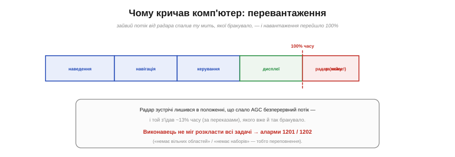
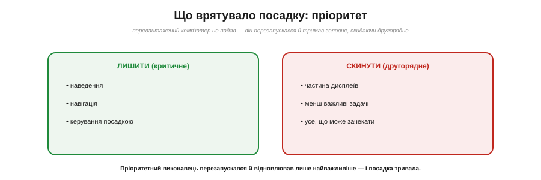
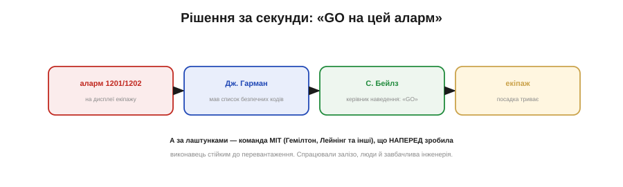

# 📜 Apollo 11: аларми 1201/1202 — пріоритети, що дозволили посадку

> Пріоритет — це не суха теорія планувальника. Одного липневого дня 1969-го саме [пріоритет переривань](book:programming/interrupt-priorities) вирішив, сяде людина на Місяць чи поверне назад.

## Дванадцять хвилин до Місяця

20 липня 1969 року місячний модуль «Орел» ішов на посадку. Ніл Армстронг (Neil Armstrong) і Базз Олдрін (Buzz Aldrin) спускалися до поверхні, а крихітний бортовий комп'ютер AGC (*Apollo Guidance Computer*) вів їх униз. І раптом, за хвилини до прилунення, на дисплеї спалахнув тривожний код: **1202**. Армстронг, напружено: «Дайте нам розшифровку цього аларму 1202». За мить — знову, потім **1201**. Комп'ютер, від якого залежало все, неначе захлинався — а до поверхні лишалися секунди.

## Що означали 1201 і 1202

Обидва коди означали одне: **переповнення виконавця** (*executive overflow*). Простими словами — комп'ютерові забракло місця, щоб розкласти всі задачі, які раптом на нього навалилися. Він був **перевантажений**: роботи виявилося більше, ніж він міг утиснути у відведений час. Для машини, що веде посадку, це звучало як вирок.

*Рис. Звичайні задачі (наведення, навігація, керування, дисплеї) і так заповнювали час AGC. Радар зустрічі, лишений у непотрібному положенні, додав безперервний потік, що з'їдав ще ~13% (за документами) — і навантаження перейшло за 100%. Виконавець не міг розкласти все → аларми 1201/1202.*

## Винуватець: радар, що крав час

Причину знайшли згодом. **Радар зустрічі** (для стикування на орбіті) лишився ввімкненим у положенні, за якого слав на AGC безперервний потік сигналів, що йому **зараз не були потрібні**. Кожен такий сигнал відкушував крихту процесорного часу — за документами, близько **13%** усього часу AGC. А того часу й так бракувало: посадка завантажувала комп'ютер майже вщерть. Зайві 13% і стали тією соломинкою, що переломила спину: навантаження пробило стелю — і виконавець почав сигналити, що не встигає.

## Чому комп'ютер не впав: пріоритет і перезапуск

І ось головне — **чому це не скінчилося катастрофою**. Бо AGC був спроєктований розумно. Його виконавець був **асинхронний і пріоритетний**: кожна задача мала пріоритет, і коли роботи ставало забагато, комп'ютер не «зависав» наосліп, а **перезапускався** й наново брався робити лише **найважливіше** — наведення, навігацію, керування спуском, — **скидаючи** все другорядне. Аларми 1201/1202 були не передсмертним хрипом, а **звітом**: «я перевантажений, тож відкидаю зайве й роблю головне».

*Рис. Перевантажений AGC не падав: пріоритетний виконавець перезапускався й відновлював лише критичні задачі (наведення, навігація, керування), скидаючи другорядні. Комп'ютер працював на самій межі — але робив саме те, що було потрібно для посадки.*

Це і є [**пріоритет**](book:programming/interrupt-priorities) у найвищій ставці: коли неможливо зробити **все**, правильно спроєктована система робить **головне** й жертвує рештою — замість того щоб упасти цілком.

## Команда, що зробила це наперед

Така стійкість не береться сама — її **закладають заздалегідь**. Асинхронний пріоритетний виконавець AGC був дітищем **Дж. Гелкомба «Гела» Лейнінга** (J. Halcombe «Hal» Laning) з Лабораторії приладобудування MIT. А величезну, ретельно вивірену систему польотного програмного забезпечення вела команда під керівництвом **Маргарет Гемілтон** (Margaret Hamilton) — саме її люди наполягли на захисті від перевантаження й перезапусків, передбачаючи **непередбачене**. Це не подвиг одного генія, а **колективна** інженерна культура: роками до старту хтось подумав «а що, як комп'ютер захлинеться?» — і вбудував рятунок. У ту липневу мить він і спрацював.

## Рішення за секунди

Лишалася ще людська ланка. Коли спалахнув 1202, у Г'юстоні все вирішували **секунди**. Молодий інженер **Джек Гарман** (Jack Garman) мав при собі список: які саме аларми **безпечні**, якщо не йдуть суцільним потоком. Він передав це керівникові наведення **Стіву Бейлзу** (Steve Bales), той ухвалив: **«GO»** — продовжуємо. Капком **Чарлі Дюк** (Charlie Duke) переказав екіпажу: «Ми GO на цей аларм». І посадка тривала. За кілька хвилин «Орел» торкнувся Місяця.

*Рис. Рішення за секунди: аларм на дисплеї → Гарман (мав список безпечних кодів) → Бейлз (керівник наведення) каже «GO» → екіпаж продовжує. А за лаштунками — команда MIT (Гемілтон, Лейнінг та інші), що наперед зробила виконавець стійким до перевантаження.*

## Урок для вашого коду

Ваш ESP32 не сідатиме на Місяць — але принцип той самий, що й тоді. Коли подій більше, ніж процесор устигає обробити, доля системи вирішується **наперед**, у тому, як ви розставили **пріоритети** й що буде, коли всього не вистачить. Добре спроєктована система під перевантаженням **скидає другорядне й тримає головне** — як AGC, що відкинув зайве й довів «Орла» до поверхні. Погано спроєктована — захлинається й падає вся. [Пріоритет](book:programming/interrupt-priorities) — це і є та завбачливість, що відрізняє перше від другого. А ще ця історія нагадує: найкраща обробка перевантаження — та, про яку подумали **до** того, як воно сталося.
