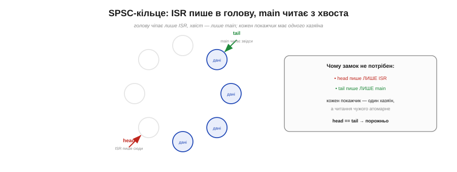

# ⚙️ Кільце «ISR пише — main читає»: SPSC-буфер без блокувань

## Задача

Прапорець у [перериванні](book:programming/interrupts) передає одну подію «сталося/ні». А як передати з обробника цілий **потік** даних, не борючись із гонками й не вимикаючи переривань? Обробник (ISR) **виробляє** дані — байти з UART, відліки з АЦП, мітки часу імпульсів. Головний цикл (`main`/`loop`) їх **споживає**. Та вони працюють «одночасно»: ISR будь-якої миті **витісняє** main посеред роботи. Як безпечно передати дані від одного до іншого? Замок тут незручний: проти **власного** обробника main не «залочиться», а вимикати переривання на кожну передачу — груба й дорога зброя. Хочеться **без блокувань**.

## Ідея

Відповідь — **кільцева черга** для одного письменника й одного читача: **SPSC** (*single-producer, single-consumer*). Заводимо масив-кільце й **два покажчики**: **head** — куди писати, **tail** — звідки читати. ISR (єдиний письменник) кладе елемент у head і посуває head; main (єдиний читач) бере з tail і посуває tail. Порожньо, коли `head == tail`.


*Кільце з двома покажчиками: head (куди пише ISR) і tail (звідки читає main). head чіпає лише ISR, tail — лише main, тож кожен покажчик має одного хазяїна, а читання чужого атомарне. Через це замок і не потрібен; head == tail означає «порожньо».*

Уся магія — в **дисципліні власності**: head чіпає **лише** ISR, tail — **лише** main. Кожен покажчик має **одного хазяїна**, а **читання** чужого покажчика атомарне (одне вирівняне слово читається цілим). Тому жодного замка не треба: самі правила виключають гонку. Це не хитрий трюк, а простий контракт «один пише — один читає».

## Код

Заводимо кільце для одного письменника (ISR) й одного читача (main). Дані тут — мітки часу імпульсів від давача (`micros()`), але так само лягли б байти з UART чи відліки АЦП. Розмір беремо **степенем двійки** — тоді замість дорогого `%` працює швидка бітова маска.

```cpp
#define RING_SIZE 64                 // мусить бути степенем двійки
#define RING_MASK (RING_SIZE - 1)

static volatile uint32_t buf[RING_SIZE];   // дані: тут — мітки часу
static volatile uint16_t head = 0;         // куди пише ISR
static volatile uint16_t tail = 0;         // звідки читає main

// --- письменник: лише з ISR (єдиний хазяїн head) ---
static inline bool ring_push(uint32_t item) {
  uint16_t h = head;                 // head пише лише ISR — читаємо свій індекс
  uint16_t next = (h + 1) & RING_MASK;
  if (next == tail) return false;    // повно -> відкидаємо новий (політика на ваш вибір)
  buf[h] = item;                     // 1) спершу ДАНІ
  head = next;                       // 2) потім ОПУБЛІКУВАТИ індекс
  return true;
}

// --- читач: лише з main/loop (єдиний хазяїн tail) ---
static inline bool ring_pop(uint32_t *out) {
  uint16_t t = tail;                 // tail читає лише main — читаємо свій індекс
  if (t == head) return false;       // порожньо
  *out = buf[t];                     // 1) спершу забрати дані
  tail = (t + 1) & RING_MASK;        // 2) потім звільнити слот
  return true;
}
```

Ось як кільце живе поряд із перериванням: обробник кладе мітку часу й одразу виходить, а `loop()` на дозвіллі забирає **все** накопичене.

```cpp
void IRAM_ATTR onPulse() {           // обробник: КОРОТКО
  ring_push(micros());               // покласти мітку часу — і вийти
}

void loop() {
  uint32_t t;
  while (ring_pop(&t)) {             // вибрати все, що встигло накопичитися
    // ... обробити мітку t: період між імпульсами, швидкість тощо
  }
}
```

## Тонкість, що вирішує все: порядок

Як і в надійному [записі у флеш](book:programming/write-integrity), **порядок** двох дій критичний. Письменник мусить **спершу записати дані**, а **тоді** посунути head. Інакше — посунув head першим — споживач побачить «новий» елемент і прочитає слот **до того**, як у нього лягли дані: сміття. Рух покажчика — це **публікація**; роби її **останньою**. Той самий принцип «перемикач останнім», що рятує оновлення конфігу й прошивки від напівзаписаного стану.


*Письменник: спершу записати дані в слот, і лише потім посунути head. Зробиш навпаки — споживач прочитає слот ще до запису й дістане сміття. Публікуй (рухай покажчик) останнім — той самий принцип «перемикач останнім», що й при надійному записі у флеш.*

## Складність і пастки на МК

- **Тільки один + один.** SPSC — рівно **один** письменник і **один** читач. Два обробники пишуть в одне кільце, або два читачі — і контракт ламається; тоді вже потрібен замок чи інша черга.
- **Атомарність покажчика.** Покажчик мусить читатися/писатися **одним** вирівняним словом. На 8-бітному МК 16-бітний індекс **не атомарний** — читач може спіймати його «напівоновленим»; тоді індекс беруть у машинне слово чи захищають.
- **volatile.** head і tail змінює інша сторона, тож вони мусять бути [**volatile**](book:programming/volatile) — інакше компілятор закешує старе значення, і черга «застрягне».
- **Через два ядра — ще й бар'єр.** ISR і main на **одному** ядрі: порядку інструкцій досить. Якщо ж письменник і читач на **різних** ядрах ESP32, самого `volatile` мало — потрібен **бар'єр пам'яті**, щоб дані напевно лягли **до** публікації head.
- **Степінь двійки.** Якщо SIZE — степінь двійки, замість дорогого `% SIZE` беруть швидку маску `& (SIZE−1)`.
- **Політика переповнення.** Кільце заповнилось — що робити: **відкинути новий**, **затерти старий** чи сигналити? Виберіть свідомо; мовчазна втрата даних підступна.

## Підсумок

SPSC-кільце — це **черга без замка** між обробником і main: два покажчики, по одному хазяїну на кожен, дані пишемо **перед** публікацією head. Простий контракт «один пише — один читає» робить непотрібним усе важке блокування — і це найкращий спосіб винести дані з ISR, не вимикаючи переривань.
