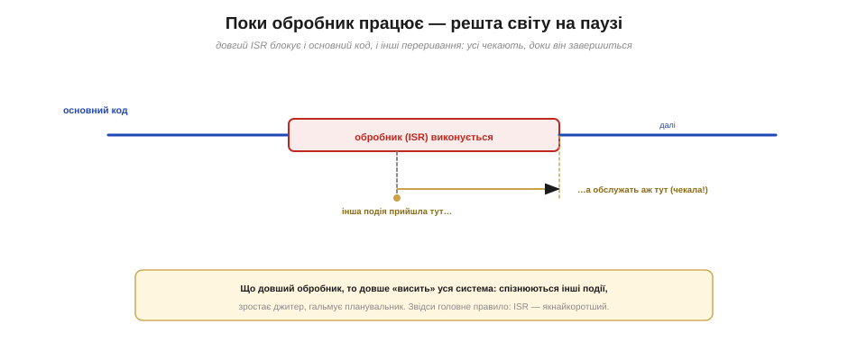
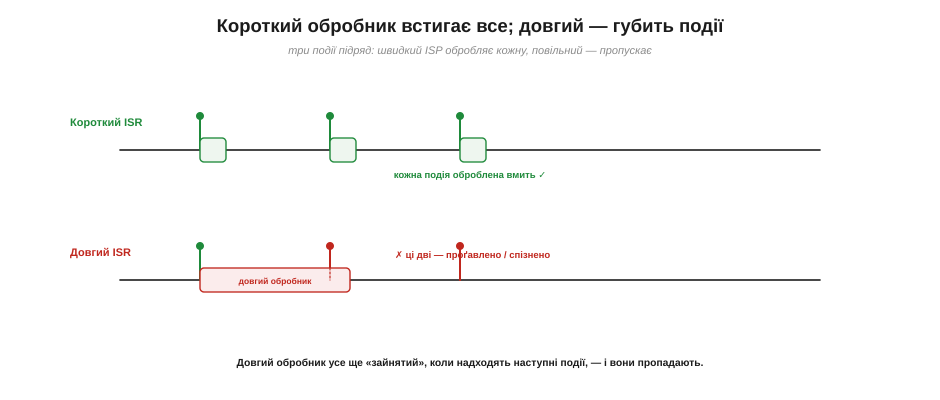
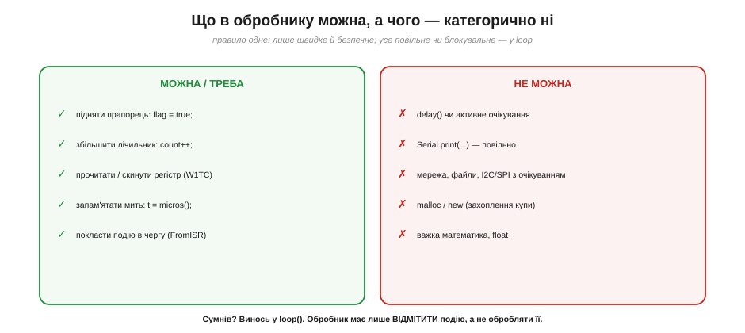
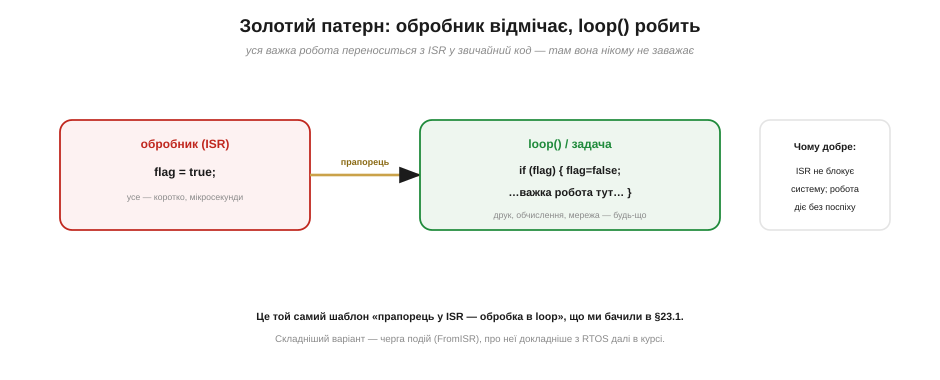
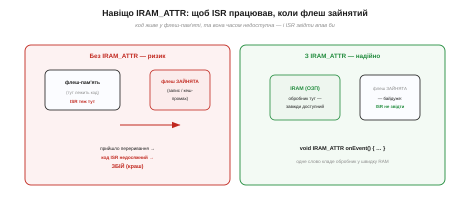

# Обробник (ISR): чому коротко (що можна й не можна)

Правило «обробник має бути коротким» звучить як заповідь, але справжня користь — у тому, **чому** воно діє і що з нього випливає на практиці. Ця тема — про дисципліну написання обробника переривання (ISR). Розберемо, чому довгий обробник шкодить усій системі, що в ньому **можна** робити, а чого — **категорично ні**, який золотий шаблон рятує від помилок і що означає загадкове слово `IRAM_ATTR` на ESP32. Наприкінці складемо все в анатомію правильного ISR.

### Поки обробник працює — світ на паузі

Коли стається переривання, процесор [кидає основний код і виконує обробник](book:programming/interrupt-vector). А це означає, що **поки обробник працює, основний код стоїть**. Мало того: на час обробника зазвичай притримуються й інші переривання того ж або нижчого пріоритету — вони чекають своєї черги. Виходить, обробник на ті миті, що він триває, ставить на паузу **майже всю** систему.


*Рис. Доки обробник виконується, основний код призупинено, а інші події змушені **чекати**. Що довший ISR, то довше «висить» уся система: спізнюються інші переривання, зростає джитер, гальмує планувальник. Звідси й головне правило — обробник якнайкоротший.*

Звідси й видно, чому довжина обробника — не дрібниця, а питання справності всього пристрою. Затримався обробник на мілісекунду — і на цю мілісекунду оглухли всі інші переривання, збився точний відлік часу, підвис обмін даними. Обробник — це наче пожежна тривога: поки вона гуде, усі інші справи завмирають, тож гудіти вона має **коротко й по ділу**.

Є й жорсткіший наслідок, ніж просто спізнення. ESP32 має апаратного «сторожа» — **watchdog**, що стежить, чи не завис процесор. Якщо обробник (або ланцюг обробників) тримає систему надто довго, не даючи їй дихнути, сторожовий таймер вирішує, що сталося зависання, — і **перезавантажує** плату. Тобто задовгий ISR не просто гальмує: він здатен узагалі **скинути** пристрій. Те саме стосується [планувальника операційної системи](book:programming/scheduler): доки крутиться обробник, планувальник не може перемкнути задачі, і вся багатозадачність завмирає.

### Короткий встигає все, довгий губить події

Особливо боляче довгий обробник б'є тоді, коли події йдуть **часто**. Уявімо три імпульси підряд. Короткий обробник встигає опрацювати кожен і звільнитися до наступного. А довгий — усе ще «зайнятий» першим, коли приходять другий і третій, — і вони просто **пропадають**, бо обробник їх не почув.


*Рис. Три події підряд. Угорі — короткий обробник: кожну опрацьовано вмить. Унизу — довгий: поки він порається з першою, друга й третя надходять і **губляться**, бо ISR ще зайнятий. Для частих подій довгий обробник означає втрачені дані.*

Це та сама біда, що з [пропуском подій при опитуванні](book:programming/interrupts), тільки тепер винне не опитування, а **сам обробник**, що задовго тримає систему. Парадоксально, але переривання з довгим обробником може бути **гіршим** за просте опитування. Тому ціль завжди одна: щоб обробник відпрацював за лічені мікросекунди й звільнив систему.

Наскільки ж коротким має бути «короткий»? Чіткого порога нема, але є робочий орієнтир: добрий обробник укладається в **одиниці мікросекунд**, прийнятний — у десятки; усе, що тягне на сотні мікросекунд і більше, майже напевно слід переробити. Корисний прийом самоперевірки — заміряти тривалість ISR, відмітивши `micros()` на вході й виході, або просто рахувати, скільки подій устигаєте обробити. Якщо лічильник «недобирає» подій — обробник задовгий, і частину роботи треба винести в `loop()`.

### Що в обробнику можна, а чого — ні

З цього випливає чіткий перелік дозволеного й забороненого. **Можна** все, що швидке й безпечне: підняти прапорець (`flag = true`), збільшити лічильник (`count++`), прочитати чи скинути апаратний регістр, запам'ятати мить події (`micros()`), покласти повідомлення в чергу спеціальним «з-переривання» викликом. **Не можна** нічого повільного чи блокувального.


*Рис. Ліворуч (можна): прапорець, лічильник, читання/скидання регістра, мітка часу `micros()`, черга подій. Праворуч (не можна): `delay()`, `Serial.print`, мережа/файли/блокувальний I2C-SPI, `malloc`/`new`, важка математика й float. Правило просте: усе повільне чи блокувальне — у `loop()`.*

Розгляньмо заборони по черзі, бо кожна має причину. **`delay()`** в обробнику безглуздий і небезпечний — він спирається на лічильник часу, який сам потребує переривань, тож у ISR просто зависне. **`Serial.print`** повільний (мілісекунди) і теж сам спирається на [переривання](book:programming/interrupt-vector) — викликати його з ISR означає чекати на те, що зараз заблоковане. **Блокувальні** операції (чекати відповіді мережі, прочитати файл, дочекатися завершення I2C-обміну) можуть тривати скільки завгодно — а обробникові не можна. **`malloc`/`new`** (виділення пам'яті з купи) здатні **заклинити** систему: купу захищає замок, і якщо переривання застане основний код саме посеред роботи з нею, обробник або зруйнує її структури, або (на FreeRTOS) аварійно завершиться — бо брати замок-м'ютекс із переривання заборонено; до того ж саме виділення повільне й непередбачуване. І нарешті **важка математика** (особливо з дробовими числами, float) — і повільна, і на ESP32 вимагає обережності зі станом співпроцесора, тож їй місце в `loop()`.

Два пункти з «можна» варті уточнення. Мітка часу `micros()` безпечна тому, що лише **читає** апаратний лічильник, не чекаючи нічого, — тож зафіксувати в обробнику точний момент події цілком гаразд. А **черга** — це коли обробникові треба не просто крикнути «була подія», а **передати дані** (наприклад, який саме байт прийшов). Для цього в [операційній системі реального часу](book:programming/freertos) є спеціальні «з-переривання» виклики (їхні назви закінчуються на `FromISR`), безпечні всередині обробника. Головне тут — що навіть передавання даних із ISR роблять особливим, швидким способом, а не звичайним повільним викликом.

> 🔧 **Навіщо це.** Запам'ятайте один рятівний критерій: **сумнів — виноси в `loop()`**. Обробник має лише **відмітити**, що подія сталася, а не **обробляти** її. Майже всі «загадкові зависання» з перериваннями — це повільна або блокувальна дія, що пролізла в ISR. Якщо тримати обробник аскетично коротким, цілий клас цих бід просто не виникає.

### Золотий патерн: відмітити в обробнику, обробити в loop

Як же тоді робити щось серйозне у відповідь на подію, якщо в обробнику нічого не можна? Відповідь — **відкласти** роботу. Обробник робить мінімум (піднімає прапорець або кладе подію в чергу) і миттю звільняється, а вся справжня робота діється потім, у `loop()` чи окремій задачі, де немає жодних обмежень ISR. Це і є **золотий патерн** [переривань](book:programming/interrupts).


*Рис. Обробник лише піднімає прапорець (мікросекунди) — і звільняє систему. А `loop()` чи задача, побачивши прапорець, виконує важку роботу без поспіху: друк, обчислення, мережу — будь-що. Так реакція лишається миттєвою, а складна обробка нікому не заважає.*

Цей розподіл «швидко відмітити — неквапом обробити» — головний прийом усієї роботи з перериваннями. Складніший його варіант використовує не простий прапорець, а **чергу** подій (щоб не загубити кілька подій поспіль і передати дані) — але це вже царина [операційної системи реального часу](book:programming/freertos). Простіший шаблон «прапорець у ISR — обробка в `loop()`» закриває переважну більшість потреб.

> ⚙️ **Три форми відкладання.** Прапорець — лише найпростіша. Далі сходинками йдуть **черга подій** (потік даних) і **задача-обробник** в RTOS (важка, структурована робота). Коли яку брати — з псевдокодом і пастками — у вставці [Відкладена робота](proj-deferred-work.md).

Одну пастку простого прапорця назвімо одразу. Булева змінна `flag` лише каже «**хоч раз** сталося», але **не рахує**: якщо до того, як `loop()` її прочитає, подія станеться двічі, ви все одно побачите лише одне `true` — другу втрачено. Тому коли події треба **рахувати** (імпульси, натиски), у обробнику беруть не прапорець, а **лічильник** (`count++`), як у прикладі нижче. А коли важливі ще й **дані** кожної події — повноцінну чергу. Вибір «прапорець / лічильник / черга» визначається тим, що саме ви не маєте права втратити.

У цього розподілу є й усталена назва. Швидку частину, що діється просто в обробнику, інженери звуть «**верхньою половиною**» переривання, а відкладену, неквапну обробку в `loop()` чи задачі — «**нижньою половиною**». Поділ на дві половини — не примха конкретного чипа, а класичний прийом, що його застосовують скрізь, від крихітних мікроконтролерів до ядра великих операційних систем. Запам'ятавши цей образ, ви впізнаватимете його в будь-якій системі з перериваннями.

### IRAM_ATTR: щоб обробник не впав, коли флеш зайнятий

На ESP32 є ще одна специфічна, але важлива вимога до обробника. Код програми зазвичай живе у **флеш-пам'яті** (зовнішній SPI-флеш), звідки процесор його підвантажує через кеш. Проблема в тому, що флеш буває **тимчасово недоступний** — наприклад, коли система пише в нього дані або коли інше ядро виконує флеш-операцію. І якщо саме в цей момент станеться переривання, а код обробника лежить у флеші — процесор не зможе його дістати, і станеться **збій**.


*Рис. Ліворуч — небезпека: обробник у флеші, а флеш саме зайнятий (запис чи кеш-промах) → код ISR недосяжний → краш. Праворуч — рятунок: слово `IRAM_ATTR` кладе обробник у внутрішню RAM (IRAM), доступну **завжди**, тож зайнятість флеша йому байдужа.*

Рятує спеціальне слово-позначка **`IRAM_ATTR`**: воно наказує покласти обробник у внутрішню оперативну пам'ять (IRAM), що доступна **завжди**, незалежно від стану флеша. Тому всі обробники переривань на ESP32 позначають `void IRAM_ATTR myISR() { … }`. Важлива тонкість: це стосується не лише самого обробника, а й **усього, що він викликає**, — будь-яка функція, яку ISR смикає, теж має бути в IRAM, інакше пастка повертається. Це ще одна причина тримати обробник простим: що менше він робить і викликає, то легше гарантувати, що все потрібне — у безпечній пам'яті.

Тонкість сягає й **даних**. Якщо обробник звертається до сталих (наприклад, рядка чи таблиці), вони теж не повинні лежати лише у флеші, інакше повертається та сама пастка недоступності. На щастя, прості змінні (лічильники, прапорці) живуть у швидкій RAM за замовчуванням, а Arduino-обгортка `attachInterrupt` сама дбає про чимало цих дрібниць, — тож для типового короткого обробника досить просто не забути `IRAM_ATTR` і не кликати «важких» бібліотек.

> 🔧 **Навіщо це.** Якщо переривання на ESP32 «іноді» вішає плату або скидає її без видимої причини — перша підозра саме на `IRAM_ATTR`: або його забули на обробнику, або ISR викликає функцію з флеша. Це підступний баг, бо проявляється **зрідка** (лише коли переривання збіглося з флеш-операцією). Узяти за звичку позначати кожен ISR `IRAM_ATTR` і не кликати з нього «важких» бібліотечних функцій — і проблеми не буде.

### Анатомія правильного обробника

Зведімо всі правила в один зразок. Добрий обробник має чотири ознаки: він **короткий** (лише найнеобхідніше), він у **IRAM** (`IRAM_ATTR`), спільні з основним кодом змінні він позначає [**`volatile`**](book:programming/volatile) (щоб компілятор їх не «оптимізував»), і в ньому **нема** нічого повільного чи блокувального.


*Рис. Чотири ознаки доброго обробника: (1) спільну змінну оголошено `volatile`; (2) сам обробник позначено `IRAM_ATTR`; (3) тіло — лише прапорець, жодних `delay`/`Serial`/`malloc`; (4) уся «важка» робота винесена в `loop()`.*

Складімо це в робочий приклад — лічильник імпульсів, де переривання справді необхідне ([імпульси можуть іти швидше за цикл](book:programming/interrupts)), а вся обробка винесена в `loop()`.

**Лічильник імпульсів: правильний ISR і обробка в loop.**

```
volatile uint32_t pulses = 0;          // спільний лічильник (volatile, §4.5.5)

void IRAM_ATTR onPulse() {             // короткий обробник у RAM
  pulses++;                            // лише рахуємо — і все
}

void setup() {
  pinMode(SENSOR, INPUT_PULLUP);
  attachInterrupt(digitalPinToInterrupt(SENSOR), onPulse, FALLING);
}

void loop() {
  static uint32_t last = 0;
  if (millis() - last >= 1000) {       // раз на секунду
    last = millis();
    noInterrupts();                    // безпечно зняти значення (§4.5.6)
    uint32_t n = pulses; pulses = 0;
    interrupts();
    Serial.println(n);                 // друк — у loop(), НЕ в обробнику!
  }
}
```

Кожен рядок утілює правило теми: обробник `onPulse` короткий, у IRAM, лічильник `pulses` оголошено `volatile`, а вся «важка» робота — рахунок раз на секунду й `Serial.println` — діється в `loop()`, де їй ніщо не заважає. Зверніть увагу й на `noInterrupts()`/`interrupts()` навколо знімання значення — це безпечне [«вихоплення» спільної змінної](book:programming/atomicity-races), щоб переривання не змінило `pulses` саме посеред читання й обнулення.

Ще про форму обробника. Звичайний ISR для `attachInterrupt` — це функція **без аргументів і без результату** (`void onPulse()`): перериванню нема кому передати параметри й нема куди повернути значення, воно лише «трапляється». Якщо ж одну функцію-обробник хочеться повісити на кілька ніжок і розрізняти їх, у Arduino-ESP32 є варіант `attachInterruptArg`, що передасть в обробник вказівник на ваші дані. Та для перших кроків звичайного `attachInterrupt` із простим прапорцем чи лічильником цілком досить.

Отже, обробник мусить бути коротким, бо на час його роботи завмирає вся система: довгий ISR спізнює й губить інші події. У ньому **можна** лише швидке й безпечне (прапорець, лічильник, регістр, мітка часу), а все повільне чи блокувальне (`delay`, `Serial`, мережа, `malloc`, важка математика) виносять у `loop()` за золотим патерном «відмітити — обробити». На ESP32 обробник додатково позначають `IRAM_ATTR`, щоб він працював навіть при зайнятому флеші. Окреме питання постає, коли переривань **кілька** й вони сперечаються за процесор: хто головніший і чи можна перебити обробник посеред роботи — це вже [пріоритети й вкладеність](book:programming/interrupt-priorities).
