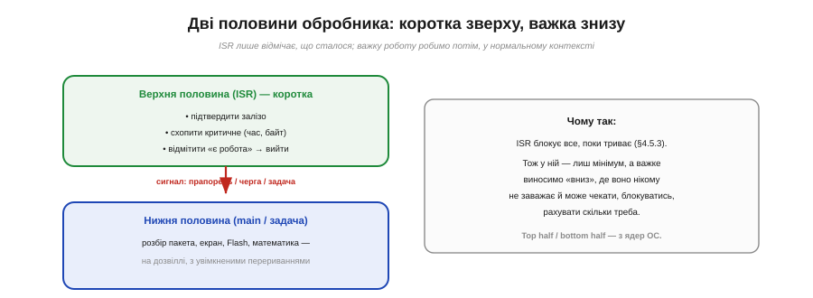
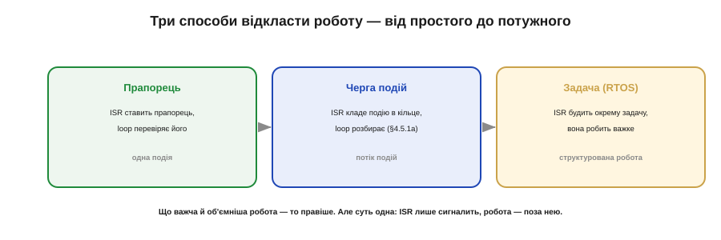

# ⚙️ Відкладена робота: прапорець, черга подій, «нижня половина» обробника

> Алгоритмічна вставка про те, як [обробник переривання (ISR)](book:programming/isr) робить **важку** роботу у відповідь на подію. ISR має бути коротким — тож важке виносять «вниз», і тут є три сходинки.

## Задача

[Обробник переривання](book:programming/isr) блокує всю систему, поки працює, тож має бути куций. А подія часом вимагає **серйозної** роботи: розібрати пакет, перемалювати екран, записати у Flash, порахувати з плаваючою комою. У ISR такого не зробиш. Як же зреагувати на подію — і все ж виконати важке, не паралізувавши систему?

## Ідея

Розділити обробник **на дві половини** (прийом родом із ядер операційних систем). **Верхня половина** — це сам ISR: робить лиш необхідний мінімум (підтвердити залізо, схопити критичне число, **відмітити**, що є робота) і миттю виходить. **Нижня половина** — звичайний код (`loop` чи окрема задача), що робить важке **потім**, на дозвіллі, з увімкненими перериваннями.


*Рис. Верхня половина (ISR) робить мінімум — підтвердити залізо, схопити критичне, відмітити «є робота» — і виходить. Нижня половина (main чи задача) робить важке потім, з увімкненими перериваннями. ISR блокує все, поки триває, тож у ньому — лиш сигнал.*

Ключ — у тому, **як саме** верхня половина сигналить нижній. Тут три сходинки, від простого до потужного.


*Рис. Три способи відкласти роботу: прапорець (одна подія), черга подій (потік даних), задача в RTOS (важка структурована робота). Що об'ємніша робота — то правіше; суть скрізь одна: ISR лише сигналить.*

## Три форми — псевдокод

**1. Прапорець** — для однієї простої події:

```
ISR:     прапорець = true                  # лише відмітити
loop:    if прапорець: прапорець=false; зробити_важке()
```

**2. Черга подій** — коли подій **потік** або треба передати **дані** (через кільцевий буфер «один пише — один читає», SPSC):

```
ISR:     push(подія)                        # покласти в чергу й вийти
loop:    while (e = pop()): обробити(e)
```

**3. Задача-обробник (RTOS)** — для важкої роботи, що може чекати чи блокуватись:

```
ISR:     notify(задача)                     # ISR-безпечним примітивом (…FromISR)
задача:  чекати notify → зробити_важке()
```

Що об'ємніша й важча робота — то правіше по цій шкалі. Та суть скрізь одна: **ISR лише сигналить, робота діється поза ним**.

## Складність і пастки на МК

- **Не забудьте підтвердити переривання.** Навіть відклавши роботу, верхня половина мусить **скинути/підтвердити** джерело (інакше воно спрацює знову й знову). Відкладається **робота**, не квитанція.
- **Затримка й накопичення.** Нижня половина біжить **пізніше**; якщо події надходять швидше, ніж вона встигає, потрібна **черга** (форма 2) і політика на переповнення — інакше тиха втрата.
- **Спільний стан — обережно.** Дані між половинами — [`volatile`](book:programming/volatile), а складні структури захищають від [гонок](book:programming/atomicity-races). Але цього значно менше, ніж якби все робили в ISR.
- **«Лише цей раз» — пастка.** Спокуса «та я швиденько в ISR» — головна причина зламаного таймінгу: п'ятиміллісекундний запис у Flash, що «випадково» опинився в обробнику, кладе всю систему.
- **RTOS — лише FromISR.** З обробника будять задачу **спеціальними** ISR-безпечними викликами (`…FromISR`), не звичайними — інакше можна підвісити планувальник.

## Підсумок

Відкласти роботу — означає лишити в ISR саме **сигнал**, а важке винести в нижню половину: прапорець (одна подія), чергу (потік), задачу (важке). Так обробник лишається куцим — а ваш пристрій реагує миттєво й при цьому встигає робити поважні речі.
