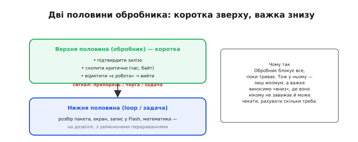
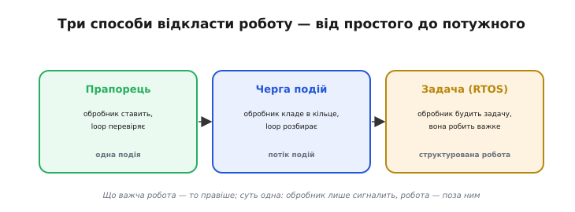

# ⚙️ Відкладена робота: прапорець, черга подій, «нижня половина» обробника

[Обробник переривання](topic:programming/isr) блокує всю систему, поки працює, тож має бути куций. А подія часом вимагає **серйозної** роботи: розібрати пакет, перемалювати екран, записати у Flash, порахувати з дробовими числами. У обробнику такого не зробиш. Як же зреагувати на подію — і все ж виконати важке, не паралізувавши систему?

## Задача

Уявімо давач, що шле байти по UART. На кожен прийнятий байт спрацьовує переривання. Розібрати з цих байтів цілий рядок, перетворити його на число, вивести на екран — робота на сотні мікросекунд, а то й мілісекунди. Зробити її **в обробнику** не можна: поки він її робитиме, загубляться наступні байти, спізняться інші переривання, а то й спрацює сторожовий таймер. Але й **не реагувати** теж не вийде — дані треба обробити. Потрібен спосіб прийняти подію миттєво, а важку обробку виконати **окремо**.

## Ідея

Розділити обробник **на дві половини** — прийом родом із ядер операційних систем (англ. *top half* / *bottom half*). **Верхня половина** — це сам обробник: робить лиш необхідний мінімум (підтвердити залізо, схопити критичне число, **відмітити**, що є робота) і миттю виходить. **Нижня половина** — звичайний код поза перериванням: головний цикл програми (`loop()` в Arduino, `while (1)` у `main()` на STM32, задача FreeRTOS в ESP-IDF), що робить важке **потім**, на дозвіллі, з увімкненими перериваннями.


*Верхня половина (обробник) робить мінімум — підтвердити залізо, схопити критичне, відмітити «є робота» — і виходить. Нижня половина (`loop` чи задача) робить важке потім, з увімкненими перериваннями. Обробник блокує все, поки триває, тож у ньому — лиш сигнал.*

Чому такий поділ узагалі працює? Бо він розводить дві різні вимоги, які в одному шматку коду суперечать одна одній. Перша — **встигнути зреагувати**: подію треба прийняти негайно, поки залізо не перезаписало регістр і не загубило наступну. Друга — **встигнути обробити**: розбір, обчислення, вивід тривають довго. Якщо робити обидві речі в обробнику, довга обробка глушить швидку реакцію — система перестає чути нові події. Розрізавши обробник, ми віддаємо швидку реакцію верхній половині (вона коротка, тож завжди встигає), а повільну обробку — нижній (вона з увімкненими перериваннями, тож не глушить нікого). Кожна половина робить лише те, у чому сильна.

> 🔧 **Навіщо це.** Поділ на дві половини — не теоретична краса, а спосіб **не втрачати події під навантаженням**. Поки нижня половина неквапом малює екран чи пише в журнал, верхня встигає прийняти десятки нових переривань. Об'єднайте їх в одне — і пристрій почне «глухнути» рівно тоді, коли подій найбільше, тобто в найгірший момент.

Ключ — у тому, **як саме** верхня половина сигналить нижній. Тут три сходинки, від простого до потужного.


*Три способи відкласти роботу: прапорець (одна подія), черга подій (потік даних), задача в RTOS (важка структурована робота). Що об'ємніша робота — то правіше; суть скрізь одна: обробник лише сигналить.*

## Три форми — суть

**1. Прапорець** — для однієї простої події. Обробник піднімає булеву змінну, головний цикл бачить її й береться до роботи:

```
обробник:  прапорець = true                  // лише відмітити
цикл:      if (прапорець) { прапорець = false; зробити_важке(); }
```

**2. Черга подій** — коли подій **потік** або треба передати **дані**. Обробник кладе подію в кільцевий буфер (один пише, один читає — схема «виробник-споживач»), головний цикл вичерпує його:

```
обробник:  push(подія)                        // покласти в чергу й вийти
цикл:      while ((e = pop())) обробити(e);
```

**3. Задача-обробник (RTOS)** — для важкої роботи, що може чекати чи блокуватись. Обробник будить окрему задачу спеціальним ISR-безпечним викликом:

```
обробник:  notify(задача)                     // примітивом …FromISR
задача:    чекати notify → зробити_важке();
```

Що об'ємніша й важча робота — то правіше по цій шкалі. Та суть скрізь одна: **обробник лише сигналить, робота діється поза ним**.

## Робочий код

Візьмімо найпоширеніший випадок — **прапорець**. Давач замикає ніжку (скажімо, лічильник обертів або кнопку). Загальне тут одне й те саме на будь-якому МК: ніжка, здатна на переривання, налаштована на вхід із підтяжкою до живлення й на спадний фронт; обробник підіймає прапорець; уся реакція — у головному циклі. Різняться лише назви:

:::tabs
```arduino
volatile bool fired = false;      // спільний прапорець — тому volatile

void IRAM_ATTR onEvent() {        // верхня половина: коротка, у RAM
  fired = true;                   // лише відмітити — і вийти
}

void setup() {
  pinMode(PIN, INPUT_PULLUP);
  attachInterrupt(digitalPinToInterrupt(PIN), onEvent, FALLING);
  Serial.begin(115200);
}

void loop() {                     // нижня половина: тут можна все
  if (fired) {
    fired = false;                // скинути ПЕРЕД роботою
    Serial.println("подія!");     // друк, обчислення — будь-що
  }
}
```
```esp-idf
#include "driver/gpio.h"
#include "esp_log.h"
#include "freertos/FreeRTOS.h"
#include "freertos/task.h"

static volatile bool fired = false;          // спільний прапорець

static void IRAM_ATTR on_event(void *arg) {  // верхня половина: коротка, у RAM
    fired = true;                            // лише відмітити — і вийти
}

void app_main(void) {
    gpio_config_t cfg = {
        .pin_bit_mask = 1ULL << PIN,
        .mode         = GPIO_MODE_INPUT,
        .pull_up_en   = GPIO_PULLUP_ENABLE,
        .intr_type    = GPIO_INTR_NEGEDGE,   // спадний фронт
    };
    gpio_config(&cfg);
    gpio_install_isr_service(ESP_INTR_FLAG_IRAM);
    gpio_isr_handler_add(PIN, on_event, NULL);

    while (1) {                              // нижня половина: тут можна все
        if (fired) {
            fired = false;                   // скинути ПЕРЕД роботою
            ESP_LOGI("app", "подія!");       // друк, обчислення — будь-що
        }
        vTaskDelay(pdMS_TO_TICKS(10));       // віддати CPU іншим задачам
    }
}
```
```stm32
volatile bool fired = false;                     // спільний прапорець

// верхня половина: HAL сам скидає прапорець EXTI й кличе цей callback
void HAL_GPIO_EXTI_Callback(uint16_t pin) {
    if (pin == EVENT_Pin) fired = true;          // лише відмітити — і вийти
}

int main(void) {
    HAL_Init();
    SystemClock_Config();
    MX_GPIO_Init();          // ніжка: GPIO_MODE_IT_FALLING + GPIO_PULLUP
    HAL_NVIC_SetPriority(EXTI0_IRQn, 5, 0);
    HAL_NVIC_EnableIRQ(EXTI0_IRQn);

    while (1) {                                  // нижня половина: тут можна все
        if (fired) {
            fired = false;                       // скинути ПЕРЕД роботою
            printf("подія!\r\n");                // друк через retarget на UART
        }
    }
}
```
:::

Обробник торкається лише прапорця; увесь друк — у нижній половині, де він нікому не заважає. Скидаємо `fired` **до** обробки: якщо подія прийде під час неї, прапорець знову стане `true`, і наступний прохід циклу її підхопить. Порядок тут не дрібниця: скинь ми прапорець **після** друку — подію, що влетіла під час друку, було б затерто, і ми б її проґавили. Дрібна перестановка двох рядків — і поведінка міняється від «нічого не губимо» до «зрідка губимо під навантаженням».

Коли ж подій багато й вони несуть **дані**, прапорця замало — потрібна **черга**. Обробник складає байти, а розбір — у нижній половині:

:::tabs
```arduino
volatile uint8_t  buf[64];        // кільцевий буфер
volatile uint8_t  head = 0, tail = 0;   // індекси: пише обробник, читає loop

void IRAM_ATTR onByte() {         // верхня половина
  uint8_t next = (head + 1) % sizeof(buf);
  if (next != tail) {             // є місце?
    buf[head] = readByte();       // лише читання регістра + запис
    head = next;
  }                               // переповнення — мовчки відкидаємо
}

void loop() {                     // нижня половина
  while (tail != head) {          // поки є непрочитане
    uint8_t b = buf[tail];
    tail = (tail + 1) % sizeof(buf);
    parse(b);                     // розбір, друк, математика — без поспіху
  }
}
```
```esp-idf
#include "freertos/FreeRTOS.h"
#include "freertos/queue.h"
#include "freertos/task.h"

static QueueHandle_t q;                        // черга замість власного кільця

static void IRAM_ATTR on_byte(void *arg) {     // верхня половина
    uint8_t b = read_byte();                   // лише читання регістра
    BaseType_t woken = pdFALSE;
    xQueueSendFromISR(q, &b, &woken);          // черга повна — байт відкидається
    if (woken) portYIELD_FROM_ISR();           // розбудили задачу — віддати їй CPU
}

static void parser_task(void *arg) {           // нижня половина
    uint8_t b;
    while (xQueueReceive(q, &b, portMAX_DELAY) == pdTRUE)
        parse(b);                              // розбір, друк, математика — без поспіху
}

void app_main(void) {
    q = xQueueCreate(64, sizeof(uint8_t));     // 64 байти місткості
    xTaskCreate(parser_task, "parser", 4096, NULL, 5, NULL);
}
```
```stm32
volatile uint8_t  buf[64];        // кільцевий буфер
volatile uint8_t  head = 0, tail = 0;   // індекси: пише переривання, читає main
static   uint8_t  rx;             // куди HAL кладе черговий байт

// верхня половина: HAL кличе це з переривання, коли байт прийнято
void HAL_UART_RxCpltCallback(UART_HandleTypeDef *huart) {
    uint8_t next = (head + 1) % sizeof(buf);
    if (next != tail) {           // є місце?
        buf[head] = rx;
        head = next;
    }                             // переповнення — мовчки відкидаємо
    HAL_UART_Receive_IT(huart, &rx, 1);   // одразу замовити наступний байт
}

int main(void) {
    /* … HAL_Init(), MX_USART2_UART_Init() … */
    HAL_UART_Receive_IT(&huart2, &rx, 1); // запустити ланцюжок прийому
    while (1) {                   // нижня половина
        while (tail != head) {    // поки є непрочитане
            uint8_t b = buf[tail];
            tail = (tail + 1) % sizeof(buf);
            parse(b);             // розбір, друк, математика — без поспіху
        }
    }
}
```
:::

Один пише `head`, інший читає `tail` — і за такої однонапрямної схеми проста перевірка `next != tail` тримає буфер цілим без важких замків. Це працює саме тому, що ролі **розведені**: обробник лише рухає `head` уперед, нижня половина лише рухає `tail`. Жоден не чіпає індекс іншого, тож їм нема за що битися — і складний захист (замки, заборона переривань) тут просто не потрібен. Якби обидва писали в обидва індекси, ця проста схема розсипалася б, і довелося б вимикати переривання на кожен доступ.

Зверніть увагу й на те, що обидві сторони працюють **байтами**: запис одного `uint8_t` і зсув одного індексу — неподільні дії, які переривання не розірве посередині. Саме тому черга байтів безпечна там, де знімання, скажімо, 32-бітного лічильника вже вимагало б короткої заборони переривань. Розмір того, що ви передаєте між половинами, прямо визначає, чи потрібен вам додатковий захист.

## Складність і пастки на МК

- **Не забудьте підтвердити переривання.** Навіть відклавши роботу, верхня половина мусить **скинути або підтвердити** джерело (інакше воно спрацює знову й знову). Відкладається **робота**, не квитанція про подію.
- **Затримка й накопичення.** Нижня половина біжить **пізніше**; якщо події надходять швидше, ніж вона встигає, потрібна **черга** (форма 2) і політика на переповнення — інакше тиха втрата даних. У прикладі вище переповнення відкидається мовчки; деінде доречніше рахувати втрати чи розширити буфер.
- **Спільний стан — обережно.** Дані між половинами — [`volatile`](topic:programming/volatile), а складні структури захищають від [гонок](topic:programming/atomicity-races). Знімаючи багатобайтове значення в нижній половині, беріть його в критичній секції — із забороною переривань на час знімання (`noInterrupts()`/`interrupts()` в Arduino, `__disable_irq()`/`__enable_irq()` на Cortex-M, `portENTER_CRITICAL()` у FreeRTOS). Та все ж цього клопоту значно менше, ніж якби все робили в обробнику.
- **«Лише цей раз» — пастка.** Спокуса «та я швиденько в обробнику» — головна причина зламаного таймінгу: п'ятимілісекундний запис у Flash, що «випадково» опинився в обробнику, кладе всю систему.
- **RTOS — лише FromISR.** З обробника будять задачу **спеціальними** ISR-безпечними викликами (їхні назви закінчуються на `FromISR`), не звичайними — інакше можна підвісити планувальник. Деякі з них ще й просять перемкнути контекст одразу на виході з обробника — це теж частина «нижньої половини».
- **Нижня половина мусить устигати.** Відкладання не безкоштовне: якщо головний цикл надовго застрягне в чомусь своєму, відкладена робота чекатиме, а черга тим часом переповниться. Тримайте й нижню половину жвавою — без глухих затримок і довгих блокувань, — інакше ви просто переносите затор з обробника в головний цикл, а не усуваєте його.
- **Прапорець не рахує.** Один булевий прапорець каже лише «**хоч раз** сталося»: дві події між проходами циклу зіллються в одну. Треба не проґавити кількість — беріть лічильник або чергу, а не прапорець.

## Підсумок

Відкласти роботу — означає лишити в обробнику саме **сигнал**, а важке винести в нижню половину: прапорець (одна подія), чергу (потік даних), задачу (важка структурована робота). Вибір форми диктує не складність обробки, а те, що саме ви **не маєте права втратити**: сам факт події — прапорець; кожну подію та її дані — черга; важку реакцію, яка може чекати, — окрема задача. Так обробник лишається куцим — а пристрій реагує миттєво й при цьому встигає робити поважні речі.
