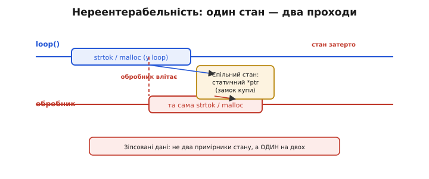
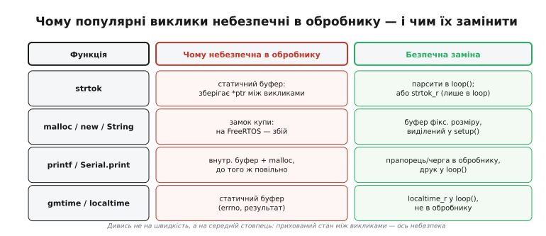

# ⚙️ Реентерабельність: чому printf, malloc і strtok небезпечні в обробнику

Чому в [обробнику переривання](topic:programming/isr) не можна друкувати в консоль (`printf`, `Serial.print`, `ESP_LOGI`), кликати `malloc` чи важку математику? Не лише тому, що вони повільні — є тонша, підступніша причина, через яку навіть швидкий виклик може тихо зруйнувати дані. Слово, що все пояснює, — **реентерабельність** (англ. *reentrancy*, від *re-enter* — «увійти повторно»): чи можна знову ввійти у функцію, поки попередній виклик ще не завершився.

## Задача

Обробник (ISR) перериває `main`/`loop` у будь-якому місці — навіть посеред виконання бібліотечної функції. Процесор кидає основний код «на півслова», зберігає його стан [через таблицю векторів](topic:programming/interrupt-vector) і стрибає в ISR. Тут постає нюанс, який звичайний список заборон для обробника лише позначає, не пояснюючи: що станеться, якщо і `loop()`, і ISR захочуть скористатися тією самою функцією — скажімо, `printf` чи `malloc`?

Уявімо конкретну ситуацію: фоновий код — `loop()` в Arduino, окрема задача під FreeRTOS, головний цикл `main()` на голому STM32 — щойно зайшов у `strtok`, щоб розбити рядок із UART, і саме в цей момент спрацьовує переривання, ISR теж починає розбирати рядок через `strtok`, а потім повертає керування назад у `loop()`. Питання, що лежить в основі: чи безпечно так робити, навіть якщо код в обох місцях «однаковий»? І чому навіть «однаковий» код по обидва боки може бути небезпечним?

Функція, яку **безпечно** перервати й викликати знову, поки перший виклик іще не завершився, — **реентерабельна (reentrant)**. Усі інші — ні, і саме вони утворюють список того, що в обробнику заборонено.

## Ідея

Нереентерабельна функція тримає **прихований спільний стан між викликами** — і два «одночасні» проходи крізь неї борються за цей стан. Це рівно та сама [гонка даних](topic:programming/atomicity-races), лише схована всередині чужого коду, який ви не писали й, можливо, навіть не підозрюєте, що він так влаштований.

Є три конкретні механізми, через які це трапляється.

**Перший — статичний буфер.** Функція `strtok` зберігає поточну позицію розбору у статичній змінній усередині себе. При першому виклику ви передаєте рядок; при наступних — лише `NULL`, а функція повертає наступний токен, пам'ятаючи, де зупинилась. Але ця «пам'ять» — один спільний статичний покажчик: якщо ISR викликає `strtok` посередині того, як `loop()` іще не закінчив розбір, він затирає цей покажчик своїм. Коли керування повернеться в `loop()`, той продовжить розбір... у неправильному місці — або взагалі в `NULL`. Результат: тихе читання сміття без жодної помилки компіляції. До тієї самої категорії статичного буфера належать `gmtime`, `asctime`, стара `inet_ntoa` — всі вони повертають вказівник на внутрішній статичний масив.

**Другий — замок купи (heap lock).** Функції `malloc`, `free`, `new`, `delete` керують глобальними структурами динамічної пам'яті під захистом замка. Якщо ISR застав `loop()` посередині `malloc` — тобто коли замок уже взятий і структури купи в напіврозібраному стані — можливі два сценарії. Без RTOS: ISR просто зіпсує ці структури, і наступний `malloc`/`free` може впасти або повернути пошкоджену пам'ять. Під RTOS, де купа захищена м'ютексом (FreeRTOS в ESP-IDF і в ESP32-Arduino, Zephyr, ThreadX): спроба взяти м'ютекс із ISR — це гарантований збій планувальника. Саме тому `malloc` здатен заклинити систему — і тут видно точну причину, а не лише наслідок.

**Третій — `printf`/`Serial.print`.** У них подвійна біда: вони одночасно повільні та блокувальні **і** нереентерабельні. Усередині вони кладуть дані у спільний буфер виводу й нерідко самі викликають `malloc` для форматування. Тобто навіть «коротенький» друк у ISR — це і загроза замку купи, і загроза буфера виводу. Дві причини замість однієї, і кожна окремо достатня для збою.

> 🔧 **Навіщо це.** Безпека функції в ISR — це не про її швидкість, а про її **внутрішній стан**: якщо функція десь тримає статичний буфер, замок купи чи глобальну змінну — їй не місце в обробнику. Є сумнів → не клич із ISR.



*`loop()` і обробник заходять в одну нереентерабельну функцію; її прихований спільний стан (статичний буфер `strtok` чи замок купи `malloc`) не витримує двох проходів — обробник, перервавши основний код посеред виклику, псує стан. Звідси заборона: в обробнику — лише функції без спільного внутрішнього стану.*

## Робочий код

**Зламаний ISR — три способи зруйнувати систему в одному обробнику:**

:::tabs
```arduino
// НЕ РОБІТЬ ТАК — усе нереентерабельне в ISR
void IRAM_ATTR onByte() {
    char buf[32];
    size_t n = readLine(buf);            // умовно: читаємо рядок
    char *tok = strtok(buf, ",");        // статичний стан! — зітре позицію loop()
    int *vals = (int*)malloc(n * sizeof(int));  // замок купи! — збій на FreeRTOS
    printf("got %s\n", tok);             // буфер виводу + malloc! — подвійний удар
    // ... три способи тихо зламати систему в одному обробнику
}
```
```esp-idf
// НЕ РОБІТЬ ТАК — усе нереентерабельне в обробнику
static const char *TAG = "uart";

static void IRAM_ATTR uart_isr(void *arg) {
    char buf[32];
    size_t n = read_line(buf);           // умовно: читаємо рядок
    char *tok = strtok(buf, ",");        // статичний стан! — зітре позицію задачі
    int *vals = malloc(n * sizeof(int)); // замок купи! — з ISR у FreeRTOS заборонено
    ESP_LOGI(TAG, "got %s", tok);        // буфер виводу + malloc! — подвійний удар
    // ... три способи тихо зламати систему в одному обробнику
}
```
```stm32
// НЕ РОБІТЬ ТАК — усе нереентерабельне в обробнику
// HAL кличе цей callback із контексту переривання USART
void HAL_UART_RxCpltCallback(UART_HandleTypeDef *huart) {
    char buf[32];
    size_t n = read_line(buf);           // умовно: читаємо рядок
    char *tok = strtok(buf, ",");        // статичний стан! — зітре позицію main()
    int *vals = malloc(n * sizeof(int)); // замок купи newlib! — псує її структури
    printf("got %s\r\n", tok);           // буфер виводу + malloc! — подвійний удар
    // ... три способи тихо зламати систему в одному обробнику
}
```
:::

Кожен із трьох викликів небезпечний саме через спільний стан, а не лише через швидкість. `strtok` затирає статичний покажчик `loop()`, `malloc` застає купу в напіврозібраному стані, а `printf` додає до цього ще й свій буфер і власний `malloc`. На ESP32 з FreeRTOS додатково діє IRAM-пастка: якщо обробник не позначений `IRAM_ATTR`, він може бути недоступний, коли флеш зайнята.

**Правильно — верхня половина копіює байти, розбір у `loop()`:**

Принцип «двох половин» — коротка верхня половина в ISR і вся обробка в нижній половині (у `loop()` чи задачі) — тут є природним рішенням. ISR отримує лише ті операції, що є справді реентерабельними: читання апаратного регістра і запис у буфер по одному байту.

:::tabs
```arduino
volatile char line[64];      // спільний сирий буфер (тому volatile)
volatile bool ready = false; // прапорець «рядок готовий»

void IRAM_ATTR onByte() {    // верхня половина — нічого «розумного»
    static uint8_t i = 0;
    char c = (char)readByte();       // лише читання регістра — реентерабельно
    if (c == '\n') {
        line[i] = 0;
        ready = true;                // сигнал нижній половині
        i = 0;
    } else if (i < sizeof(line) - 1) {
        line[i++] = c;               // складаємо байти по одному
    }
    // жодних strtok / malloc / printf — тільки складаємо байти
}

void loop() {                // нижня половина — тут можна ВСЕ
    if (ready) {
        ready = false;
        char tmp[64];
        noInterrupts();
        strncpy(tmp, (const char*)line, sizeof(tmp)); // атомарний знімок буфера
        interrupts();
        char *tok = strtok(tmp, ",");   // strtok — але лише в одному місці!
        Serial.println(tok);            // друк — у loop(), де безпечно
    }
}
```
```esp-idf
static volatile char line[64];   // спільний сирий буфер (тому volatile)
static SemaphoreHandle_t ready;  // сигнал «рядок готовий» замість прапорця
static portMUX_TYPE mux = portMUX_INITIALIZER_UNLOCKED;

static void IRAM_ATTR uart_isr(void *arg) {  // верхня половина — нічого «розумного»
    static uint8_t i = 0;
    BaseType_t woken = pdFALSE;
    char c = (char)read_byte();      // лише читання регістра — реентерабельно
    if (c == '\n') {
        line[i] = 0;
        i = 0;
        xSemaphoreGiveFromISR(ready, &woken);   // *FromISR — єдина дозволена форма
    } else if (i < sizeof(line) - 1) {
        line[i++] = c;               // складаємо байти по одному
    }
    if (woken) portYIELD_FROM_ISR(); // жодних strtok / malloc / ESP_LOGI
}

static void parse_task(void *arg) {  // нижня половина — тут можна ВСЕ
    char tmp[64];
    for (;;) {
        xSemaphoreTake(ready, portMAX_DELAY);
        portENTER_CRITICAL(&mux);
        strncpy(tmp, (const char *)line, sizeof(tmp)); // атомарний знімок буфера
        portEXIT_CRITICAL(&mux);
        char *save, *tok = strtok_r(tmp, ",", &save);  // розбір — в одному місці!
        ESP_LOGI(TAG, "%s", tok);                      // лог — у задачі, де безпечно
    }
}
```
```stm32
volatile char line[64];          // спільний сирий буфер (тому volatile)
volatile bool ready = false;     // прапорець «рядок готовий»
volatile uint8_t rx;             // сюди HAL кладе черговий прийнятий байт

// HAL кличе це з контексту переривання USART — верхня половина
void HAL_UART_RxCpltCallback(UART_HandleTypeDef *huart) {
    static uint8_t i = 0;
    char c = (char)rx;               // байт уже в пам'яті — реентерабельно
    if (c == '\n') {
        line[i] = 0;
        ready = true;                // сигнал нижній половині
        i = 0;
    } else if (i < sizeof(line) - 1) {
        line[i++] = c;               // складаємо байти по одному
    }
    HAL_UART_Receive_IT(huart, (uint8_t *)&rx, 1);  // знову озброїти прийом
}

int main(void) {                 // нижня половина — тут можна ВСЕ
    HAL_Init(); MX_USART2_UART_Init();
    HAL_UART_Receive_IT(&huart2, (uint8_t *)&rx, 1);
    while (1) {
        if (!ready) continue;
        ready = false;
        char tmp[64];
        __disable_irq();
        strncpy(tmp, (const char *)line, sizeof(tmp)); // атомарний знімок буфера
        __enable_irq();
        char *tok = strtok(tmp, ",");   // strtok — але лише в одному місці!
        printf("%s\r\n", tok);          // друк — у main(), де безпечно
    }
}
```
:::

ISR робить лише те, що реентерабельне: читає один байт із апаратного регістра і кладе його в масив. Жодних функцій зі спільним станом. Усі нереентерабельні `strtok`, друк, `malloc` живуть тепер у нижній половині — `loop()`, задачі RTOS чи головному циклі `main()`, — де викликаються з одного потоку — і спільному станові нема з ким конфліктувати. Зверніть увагу: `strtok` не став безпечнішим сам по собі, він такий само, як був. Безпечним стало те, що більше немає другого паралельного виклику.

## Складність і пастки на МК

- **Не лише швидкість.** Головна пастка мислення: «та я викличу щось коротеньке». Короткість не рятує — рятує реентерабельність. `strtok` виконується за мікросекунди, але небезпечний у ISR — бо несе прихований стан, а не бо повільний.

- **`*_r`-версії існують, але не для ISR.** Є реентерабельні двійники: `strtok_r`, `localtime_r` — вони приймають стан ззовні як аргумент, тобто два проходи не заважають один одному. Але вони вирішують проблему гонки між потоками у звичайному коді, а не узаконюють виклик з обробника: повільність, вимога тримати код в IRAM та потенційне блокування нікуди не зникають. Практичне правило просте — не клич із ISR узагалі нічого підозрілого.

- **`printf`/`Serial` — потрійний гріх.** Повільні + блокувальні + нереентерабельні (внутрішній буфер, нерідко `malloc`). Це найчастіша причина «загадкових» зависань ISR на практиці, коли код «виглядає правильно», але система зависає раз на кілька хвилин.

- **Купа під забороною повністю.** `malloc`/`free`/`new`/`delete`/`String` — усі вони звертаються до глобальних структур купи. Arduino-клас `String` теж підпадає під цю заборону, бо під капотом кличе `malloc`. Пам'ять для ISR-шляху виділяйте **наперед**, під час ініціалізації — у `setup()`, в `app_main()` до запуску задач, у `main()` до старту планувальника.

- **`errno` й стан float теж спільні.** `errno` — глобальна змінна; математичні функції, що її змінюють, і операції з float (стан математичного співпроцесора) — ще один прихований спільний стан, що може зіпсуватись у ISR.

- **Перевір весь ланцюг викликів.** Небезпечна не лише функція, яку ти бачиш у ISR, а й те, що вона викликає глибше. Якщо `readLine()` усередині кличе `malloc` — вся конструкція нереентерабельна, навіть якщо ти сам `malloc` не написав. Це пряме продовження правила про IRAM: увесь ланцюг від ISR має бути і в IRAM, і реентерабельним.



*Чому популярні бібліотечні виклики не можна з обробника й чим їх замінити. Спільний корінь у середньому стовпці — прихований стан між викликами (статичний буфер, замок купи, глобальний `errno`); саме він, а не лише повільність, робить функцію небезпечною в обробнику.*

## Підсумок

Небезпека `printf`/`malloc`/`strtok` в обробнику — не (лише) їхня повільність, а **нереентерабельність**: прихований спільний стан, який обробник порушує, перервавши той самий виклик посередині. Ліки прості: верхня половина робить лише реентерабельний мінімум — читання регістра, складання байтів у буфер, — а всі «розумні» бібліотечні виклики живуть у `loop()` або задачі, де вони завжди викликаються з одного потоку. Тримати обробник куцим — це не лише про час і не лише про [гонки за **вашими** даними](topic:programming/atomicity-races), а й про гонки за **чужим**, схованим станом бібліотек.
