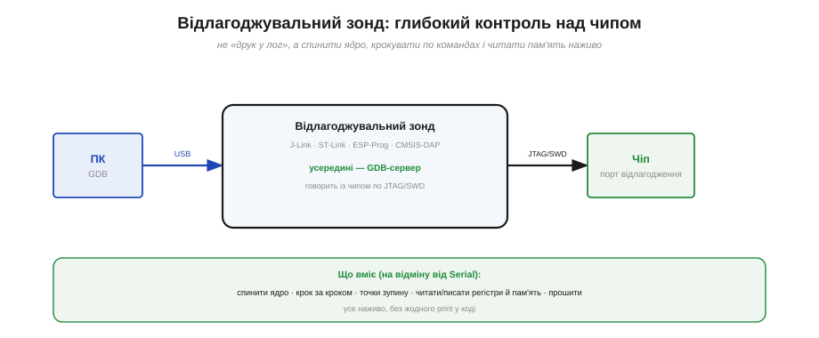
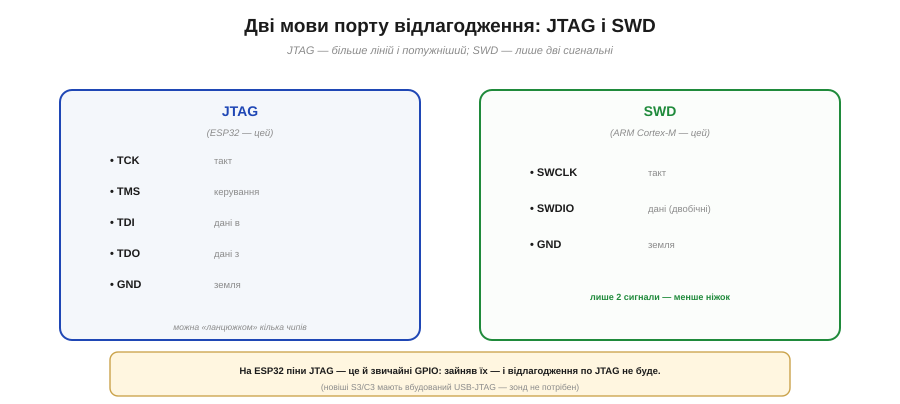

# 🔌 Відлагоджувальні зонди (J-Link/ST-Link/ESP-Prog-класи): підключення й можливості

> Поряд із «друком у `Serial`» є й апаратне відлагодження по JTAG/SWD. Той, хто його дає, — **зонд** (*debug probe*); розберімо, що він уміє й як його під'єднати.

## Що це за клас

**Відлагоджувальний зонд** — маленький адаптер між ПК і **портом відлагодження** чипа. На відміну від USB-UART моста, що лише возить байти туди-сюди, зонд дає **глибокий контроль над ядром**: спинити його посеред роботи, крокувати **по одній команді**, ставити точки зупину, читати й писати регістри та пам'ять наживо, а також прошивати. Усередині зонда — **GDB-сервер**, до якого під'єднується відлагоджувач (GDB) на ПК.

*Рис. Зонд стоїть між ПК (де GDB) і портом відлагодження чипа. На відміну від `Serial`, він не «слухає друк», а **керує** ядром: спиняє, крокує, ставить точки зупину, читає пам'ять і регістри — усе наживо, без жодного `print` у коді.*

Поширені сімейства — **J-Link** (SEGGER, потужний), **ST-Link** (STMicro, дешевий), **ESP-Prog** (власний від Espressif, JTAG + UART в одному) і відкритий **CMSIS-DAP**.

## JTAG чи SWD: дві мови порту

Зонд говорить із чипом однією з двох «мов». **JTAG** — старша й потужніша: чотири сигнальні лінії (**TCK**, **TMS**, **TDI**, **TDO**) плюс земля, ще й можна зчіплювати кілька чипів у ланцюг. **SWD** (*Serial Wire Debug*) — компактніша: лише **дві** сигнальні (**SWCLK**, **SWDIO**) і земля. ESP32 відлагоджують по **JTAG**, а ARM Cortex-M зазвичай — по **SWD**.

*Рис. JTAG — більше ліній і потужніший (ESP32 — цей); SWD — лише дві сигнальні (ARM Cortex-M — цей). Важлива пастка ESP32: піни JTAG — це й звичайні GPIO, тож зайнявши їх, відлагодження по JTAG втрачаєш. А новіші S3/C3 мають вбудований USB-JTAG, і зовнішній зонд їм не потрібен.*

## Підключення

Сигнальні лінії зонда (TCK/TMS/TDI/TDO для JTAG чи SWCLK/SWDIO для SWD) з'єднують з однойменними **пінами відлагодження** чипа, обов'язково — **спільна земля**. Багато зондів ще й «нюхають» напругу живлення цілі окремим виводом (VCC-sense), щоб самим підлаштувати рівні. Далі зонд піднімає GDB-сервер, до нього під'єднується GDB — і ви вже спиняєте ядро та ходите по коду.

## Типові граблі

- **Піни JTAG зайняті як GPIO.** На ESP32 лінії JTAG — звичайні ніжки; повісив на них давач — і відлагодження по JTAG зникло. Плануй це наперед.
- **Невідповідність мови** — підключив SWD-зонд до JTAG-цілі (чи навпаки) — зв'язку нема.
- **Рівні живлення** — звіряй напругу цілі; не кожен зонд сам підлаштовується.
- **Підробний ST-Link/J-Link** — клон може не дружити з рідними драйверами (знайома історія з USB-UART адаптерами).

## Варіації класу

**J-Link** — потужний і дорогий (є дешевша версія EDU для навчання); **ST-Link** — копійчаний, заточений під STM32, але годиться ширше; **ESP-Prog** — рідний для ESP32, поєднує JTAG і UART; **CMSIS-DAP** — відкритий стандарт, що крутиться навіть на дешевих платах. Окремо — чипи з **вбудованим USB-JTAG** (ESP32-S3, C3): їм зовнішній зонд не потрібен зовсім, відлагодження йде прямо через USB. На тлі простого USB-UART адаптера (лише друк) зонд — це вже зовсім інший рівень заглядання всередину живого чипа.
