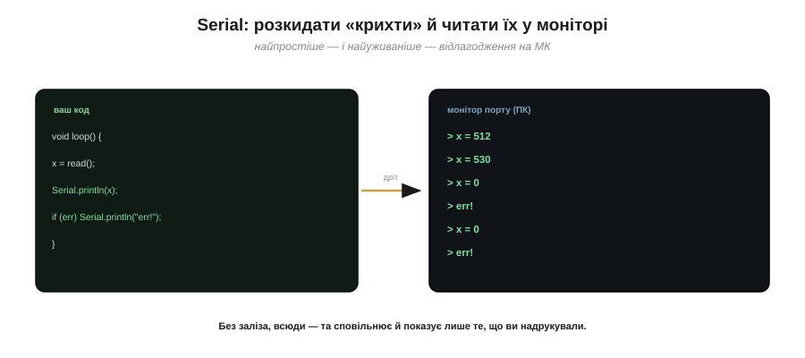
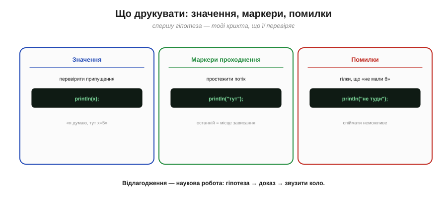
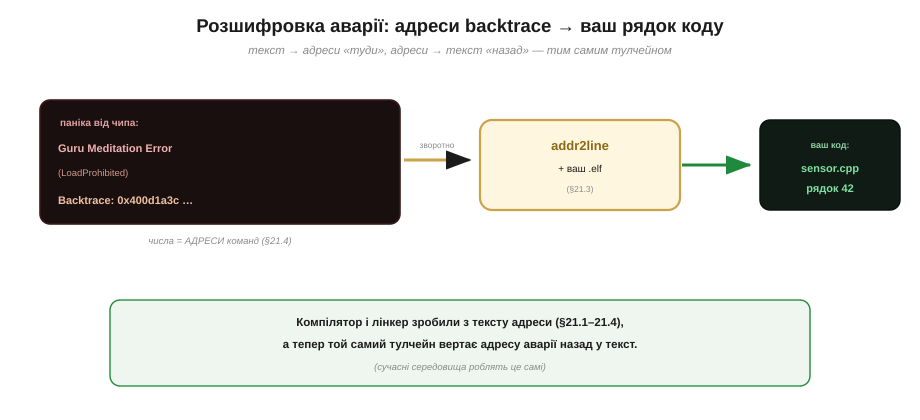

# Відлагодження: Serial, JTAG/SWD (інструменти)

Зібрати шлях від тексту до прошивки, що оживляє чіп, — півділа. Сподіватися на «залив — і запрацювало» наївно: код **раз у раз** поводиться не так, як задумано. Мистецтво знаходити **чому** зветься **відлагодженням** (*debugging*) — тим самим словом, що його подарував нам метелик у реле з [історії розділу](book:programming/compilation/hist-grace-hopper.md). На «великому» комп'ютері це звична справа; а ось на мікроконтролері відлагодження має свою прикрість, і долають її двома головними інструментами: **Serial** (друкувати «хлібні крихти») і **апаратним налагоджувачем** (JTAG/SWD), що зазирає всередину живого чипа.

Це вміння — не «додаток» до програмування, а **половина** ремесла: писати код ви будете годинами, а **шукати**, чому він не працює, — часом і довше. Тож опанувати інструменти полювання на баги так само важливо, як навчитися писати сам код. Почнімо з того, чому на МК воно складніше, ніж на ПК.

### Чому відлагодження на МК особливе

У чому ж прикрість? На комп'ютері програма виконується **на тій самій машині**, де ви сидите: можна поставити її на паузу, зазирнути в будь-яку змінну, пройти код по рядку. А програма мікроконтролера біжить на **окремому, запечатаному** чипі — і ви не бачите, що в нього всередині. Якщо вона зависла чи впала, чіп просто... мовчить або перезапускається, не кажучи й слова. Тож головна задача — здобути **спосіб спостерігати**, що коїться в тій сліпій коробці.

Найпримітивніший «налагоджувач» ви, до речі, вже знаєте — це **світлодіод**. Коли більше нічого нема, навіть одна ніжка з діодом каже багато: блимнув — отже, дійшов сюди; засвітився рівно — отже, завис ось на цьому; зморгнув N разів — отже, помилка номер N. Грубо, але часом це єдине, що лишається, коли й Serial недоступний (наприклад, у найперші миті старту, поки [завантажувач](book:programming/bootloader) ще не передав керування вашому коду). А загалом усі інструменти відлагодження роблять одне: **проривають** ту непрозорість запечатаного чипа, даючи бодай вузеньке вікно в його нутро. Що ширше вікно — то потужніший (і складніший) інструмент.


*Рис. Чому на МК сліпо. **На ПК** програма біжить на вашій же машині — її легко спинити, зазирнути в змінні, пройти по кроках. **На МК** код виконується на окремому запечатаному чипі: зсередини його не видно, а впавши, він мовчить. Тому й потрібні особливі інструменти, щоб **зазирнути** в живий чіп.*

### Serial: друкувати «хлібні крихти»

Найпростіший і найуживаніший інструмент ви вже мимохідь знаєте. Це **Serial**: розкидати по коду `Serial.println(...)`, що друкують значення й повідомлення в той самий послідовний дріт (той, що й [для заливання прошивки](book:programming/flashing)), а тоді читати їх на ПК у **моніторі порту**. Класичне «відлагодження друком»: лишаєш у коді хлібні крихти й дивишся, **доки** чіп ними йде і **де** збивається.

Його сила — у простоті: жодного зайвого заліза, працює завжди й усюди, опанувати — мить. Слабкості теж очевидні: друк **уповільнює** й змінює час (а часом саме час і є причиною бага); ви бачите **лише те, що здогадалися надрукувати**; не можна спинити чіп і роздивитися довільний стан. І все ж — **дев'ять із десяти** багів на МК ловлять саме монітором Serial, бо для більшості випадків цього досить.

Дві практичні дрібниці. По-перше, Serial треба **завести** — `Serial.begin(115200)` — і та сама швидкість (baud) має стояти в моніторі; інакше замість тексту посиплеться абракадабра (класична пастка новачка: швидкості з обох боків дроту мусять збігатися). По-друге, тонша й підступніша: оскільки друк **забирає час**, він може **змінити поведінку** бага — додав `println`, і баг, чутливий до часу, зник; прибрав — повернувся. Такий «баг, що тікає від спостереження», навіть має ім'я — **гейзенбаг** (за принципом невизначеності). У таких випадках Serial безсилий, і починається царина апаратного налагоджувача. І не забувайте **прибирати** зайві крихти з готового коду: вони і час крадуть, і пам'ять.


*Рис. Відлагодження друком. У код вставляють `Serial.println(...)`, що шлють значення й маркери тим самим дротом у **монітор порту** на ПК. Просто, без зайвого заліза, працює всюди — та сповільнює, змінює час і показує лише те, що ви здогадались надрукувати. Попри це, більшість багів на МК ловлять саме так.*

### Що друкувати: значення, маркери, помилки

Друкувати наосліп — марно; Serial працює, коли є **гіпотеза**. Три найкорисніші види крихт:

- **значення** — надрукувати змінну, щоб перевірити припущення («я думаю, тут `x` дорівнює 5» → друкуєш і дивишся, чи справді);
- **маркери проходження** — рядки «дійшов сюди», «вийшов звідти», щоб простежити, **куди** тече виконання й де спиняється (особливо цінно, коли чіп «зависає» — останній надрукований маркер указує місце);
- **повідомлення про помилки** — друк у тих гілках, які «не мали б трапитись».


*Рис. Три види «крихт». **Значення** — перевірити припущення про дані. **Маркери** («дійшов сюди») — простежити потік і знайти, де чіп спинився (останній маркер = місце зависання). **Помилки** — у гілках, що «не мали б статись». Спершу гіпотеза — тоді крихта, що її перевіряє.*

Є й потужний спосіб **швидко** звузити коло крихтами — **поділ навпіл** (*bisection*). Замість сипати `println` усюди, ставлять **один** маркер десь посередині підозрілого шляху: дійшло до нього — отже, баг **далі**; не дійшло — отже, **раніше**. Тоді ділять навпіл уже ту половину — і так за кілька кроків заганяють причину в один-два рядки. Це той самий двійковий пошук: кожна крихта **вдвічі** зменшує область пошуку, тож навіть величезну програму «промацують» лічені рази, а не сотні.

Корисно й не **перебирати** з друком: суцільна стіна повідомлень ховає важливе незгірш за їхню відсутність. Тому досвідчені лишають у коді кілька **рівнів** балакучості (помилки — завжди, дрібні подробиці — лише коли ввімкнеш), щоб у спокійні часи монітор мовчав, а в годину пошуку — розповідав усе.

> ⚙️ **Друк, що виріс у систему.** Як перетворити розрізнені `println` на справжній лог — із рівнями, мітками часу й **кільцевим буфером**, що зберігає «останні слова» пристрою перед аварією, — у вставці [Логування як інженерна система](proj-logging.md).

> 🔧 **Навіщо це.** Тут оживає головна мораль метелика з історії розділу: шукай **доказ**, а не здогад. Відлагодження — це не «вдивлятися в код, доки осяє», а **наукова** робота: сформулюй гіпотезу про причину → постав крихту, що її **перевірить** → подивись на факт → звузь коло. Так найзаплутаніший баг розкладається на низку простих «так/ні», і ви методично заганяєте його в кут, замість безпорадно міняти рядки навмання.

### Апаратний налагоджувач: JTAG/SWD

Коли Serial безсилий — баг чутливий до часу, чіп падає **ще до** першого друку, треба роздивитися глибокий стан — беруть важчу артилерію: **апаратний налагоджувач**. Це окремий «зонд», під'єднаний до спеціальних **відлагоджувальних ніжок** чипа (інтерфейс **JTAG**, або його дводротова рідня **SWD** на ARM-чипах). Через нього можна те, чого Serial не вміє: **спинити** чіп на ходу (*halt*), пройти код **по рядку** (*step*), зазирнути в **будь-яку** змінну чи регістр, поставити **точку зупину** (*breakpoint* — спинитись, дійшовши до рядка) чи **сторожок на дані** (*watchpoint* — спинитись, коли змінна змінилась). Зонд дотягується **всередину** живого чипа — і робить його прозорим, як на ПК.


*Рис. Апаратний налагоджувач. Зонд під'єднано до відлагоджувальних ніжок (JTAG / SWD), і через них видно нутро живого чипа: можна **спинити**, пройти **по кроку**, зазирнути в **будь-яку** змінну й регістр, поставити **точки зупину** й **сторожки** на дані. Те, що на ПК буденне, тут робить цей зонд — ціною зайвого заліза й налаштування.*

На практиці зв'язок із зондом дають через знайомий **налагоджувач** (для багатьох — це GDB): ставиш точку зупину на потрібний рядок, запускаєш — і програма спиняється рівно там, а ти роздивляєшся змінні, як на ПК. ESP32, до речі, має JTAG **на борту** (а в S3/C3/C6 його виведено навіть через USB — тож часом окремий зонд і не потрібен), і це робить таку розкіш доступною без дорогого окремого пристрою — варто лиш раз налаштувати. Сила тут велика, та й ціна є: трохи більше мороки з налаштуванням, тож тягнуться до нього **не щодня**.

> 🔌 **Сам зонд зблизька.** Які бувають зонди (J-Link, ST-Link, ESP-Prog, CMSIS-DAP), чим JTAG відрізняється від SWD по пінах і як це під'єднати — у вставці [Відлагоджувальні зонди](comp-debug-probes.md).

### Serial vs JTAG: коли що

Звідси й проста стратегія, що римується з вибором [«простіше за замовчуванням»](book:programming/baremetal-vs-framework). **Serial — за замовчуванням**: швидко, без заліза, і для більшості багів (перевірити значення, простежити потік) його цілком досить. **JTAG/SWD — для важких**: коли чіп падає до першого друку, коли баг тікає від друку, коли треба роздивитися все нутро. Більшість розробників живуть на Serial і тягнуться до JTAG зрідка — і це нормально. Зрештою, обидва інструменти служать одній меті — **зробити невидиме видимим**; різниться лише, наскільки глибоке вікно в чіп вам цього разу потрібне.


*Рис. Дві снасті — різні випадки. **Serial** — легка й завжди напохваті: значення, маркери, більшість багів. **JTAG/SWD** — важка артилерія: спинити, пройти по кроку, зазирнути будь-куди — для аварій, тонкого часу й глибокого стану. Беруть Serial за замовчуванням, JTAG — коли він справді потрібен.*

> 🔧 **Навіщо це.** Практична звичка: **Serial — завжди перший**. Заведіть `Serial.begin` у `setup()` ще до того, як знадобиться щось ловити, — нехай він буде напохваті. Дев'ять із десяти загадок розкриваються кількома вчасними `println`, і лише десята жене вас по зонд. Не починайте з важкої артилерії там, де вистачить кількох хлібних крихт, — це той самий принцип «простіше за замовчуванням», що й [у виборі між голим залізом і фреймворком](book:programming/baremetal-vs-framework).

### Розшифруймо аварію

Окрема порода багів — **аварії** (*crash*), коли чіп не просто рахує не те, а валиться зовсім. Найчастіші їхні причини на МК варто знати в обличчя: звернення за **порожнім чи зіпсованим покажчиком** (як у прикладі нижче); **переповнення стека**, коли рекурсія чи величезні локальні змінні з'їли всю відведену йому RAM, і [стек налазить на дані](book:programming/stack-overflow); спроба чіпати **периферію, якої ще не ввімкнули** (її регістри мовчать, поки [тактування й живлення блоку](book:programming/clock-power) не подано). Добре, що чіп при аварії не мовчить, а друкує підказку, — лишається її прочитати.

І наостанок — найкрасивіше, де докупи сходяться [компіляція](book:programming/compilation), [лінкування](book:programming/linking) й образ прошивки. Коли програма на ESP32 падає, чіп друкує «паніку» з **трасуванням** (*backtrace*) — і ось де знадобиться розуміння того, як текст став адресами.

**Приклад (адреси аварії → ваш рядок коду).** Чіп упав і надрукував у монітор:

```
Guru Meditation Error: Core 0 panic'ed (LoadProhibited)
Backtrace:  0x400d1a3c  0x400d1b08  0x400d2f50  …
```

Ці числа — **адреси** машинних команд, де стався збій: ті самі числа, що їх роздає програмі [лінкер](book:programming/linking), складаючи [образ прошивки](book:programming/firmware-image). Самі по собі вони незрозумілі. Та тулчейн уміє **зворотне** перетворення: інструмент `addr2line` бере ваш `.elf`-файл (повний образ, що його зібрав лінкер) — і обертає адресу назад на **рядок вашого коду**:

```
addr2line  +  ваш .elf:
   0x400d1a3c   →   sensor.cpp : 42    (читання з порожнього покажчика)
```

Адреса перетворилася назад на ваш `sensor.cpp`, рядок 42. Замкнулося **коло**: [компіляція](book:programming/compilation) і [лінкування](book:programming/linking) перетворили ваш текст на адреси, а тепер, ловлячи аварію, ви тим самим тулчейном вертаєте адресу назад у текст. (Сучасні середовища роблять це автоматично, друкуючи в аварії одразу назви ваших файлів і рядків.)

Гарнішої симетрії годі й уявити: розуміння того, як текст перетворюється на адреси, наосліп будуючи шлях «туди», тепер служить, коли йдемо «назад» — від голої адреси аварії до рядка, що її спричинив. Опанувавши тулчейн, ви не лише вмієте **зібрати** прошивку — ви вмієте **прочитати** її аварії й допитати її в роботі. Оце й означає по-справжньому володіти інструментом, а не побожно тиснути «Upload» і сподіватися на краще.


*Рис. Аварія розшифрована тим самим тулчейном. Чіп друкує **паніку** з адресами (backtrace). Інструмент `addr2line` + ваш `.elf` обертають кожну адресу назад на **файл і рядок** вашого коду. Текст став адресами на шляху «туди» — і адреси стають текстом на шляху «назад».*
