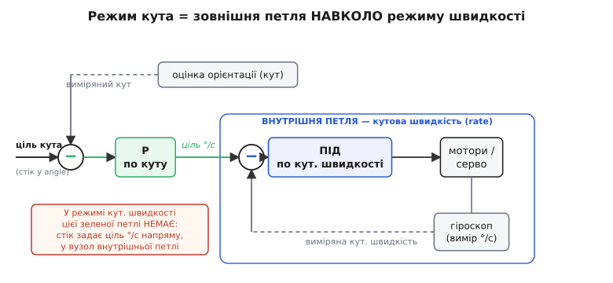
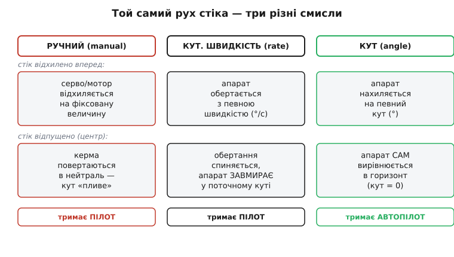
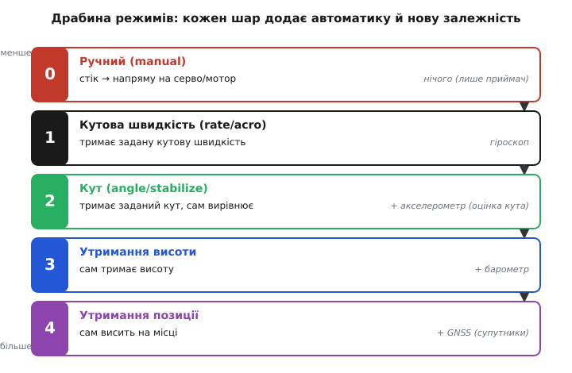

# Ручні режими: від «стік напряму» до «тримай кут»

Візьми будь-який літальний апарат із мультикоптерів чи літачків і спитай, що станеться, коли ти штовхнеш стік уперед. Відповідь залежить не від апарата, а від **режиму** (англ. *flight mode* — режим польоту), у якому крутиться його прошивка. У одному режимі стік — це напряму команда на серво й мотор. У другому — прохання «крутися ось із такою швидкістю». У третьому — «нахилися ось на стільки градусів і тримай». Апарат той самий, залізо те саме, стіки ті самі — а поведінка різна, бо між стіком і моторами стоїть різна кількість автоматики.

Режим — це і є **відповідь на питання «що означає рух стіка»**. Розібратися в ручних і стабілізованих режимах — значить зрозуміти, скільки роботи прошивка бере на себе, а скільки лишає пілоту, і чим за кожен рівень автоматики доводиться платити. Почнімо з крайнього випадку, де автоматики немає зовсім.

## Ручний режим: стік просто керує кермами

Найпростіший режим — **ручний** (*manual*). Тут прошивка майже не думає: положення стіка перетворюється напряму на команду виконавчому пристрою. Штовхнув стік елеронів — серво відхилило елерон рівно настільки. Дав газ — регулятор мотора (ESC) розкрутив гвинт. Між твоєю рукою й механікою — лише масштабування чисел, жодного «розуму».

Щоб зрозуміти, що фізично «виходить» зі стіка, треба глянути на сам сигнал. Класичний керувальний імпульс до серво чи регулятора — це [короткий імпульс, ширина якого й кодує команду](book:programming/pwm-on-mcu): близько **1000 мкс** — один край ходу, **1500 мкс** — нейтраль, **2000 мкс** — інший край, і повторюється зазвичай 50 разів на секунду. У ручному режимі прошивка бере число зі стіка й лінійно розкладає його в цю ширину — і все. Ніхто не питає гіроскоп, ніхто не порівнює бажане з дійсним.

> 🔧 **Навіщо це.** Ручний режим — еталон «нульового шару». Коли налаштовуєш апарат і хочеш перевірити, що механіка й розводка сигналів справні, ти ставиш саме його: якщо в ручному стік не рухає потрібне серво чи плутає напрям, шукати треба в залізі й розводці каналів, а не в стабілізації. Це діагностичний нуль, від якого відлічуєш решту.

Для чого таке взагалі тримають? Для апаратів, у яких **стабілізацію робить сама фізика**. Тренувальний літачок із крилом-«дигедралом» (піднятими вгору половинами крила) сам вертається в горизонт завдяки аеродинаміці — прошивці нема потреби втручатися. Досвідчений пілот теж часом обирає ручний, бо машина в ньому відгукується найпряміше, без жодної затримки на роздуми автоматики. Але спробуй у ручному втримати мультикоптер — і за півсекунди він перекинеться. Мультикоптер аеродинамічно **нестійкий**: найменший перекос росте сам собою, і рятує лише те, що хтось — людина або прошивка — постійно його підправляє. Людині це не під силу зробити достатньо швидко. Значить, потрібен перший шар автоматики.

## Режим кутової швидкості: «крутися ось так швидко»

Наступний шар вводить у гру перший давач — **гіроскоп** (гр. *gyros* — обертання + *skopeō* — дивлюся), що міряє **кутову швидкість** (скільки градусів за секунду апарат зараз повертається довкола кожної осі). Тепер стік означає вже не «відхили кермо», а **«крутися з такою кутовою швидкістю»**. Відхилив стік крену наполовину — прошивка тримає, скажімо, 200 °/с обертання. Відпустив стік у центр — ціль стає 0 °/с, тобто «не крутися»: апарат **застигає в тому куті, у якому опинився**, і сам у горизонт **не** вертається.

Цей режим має усталені назви: у автопілотах його звуть **режимом кутової швидкості** (*rate mode*), у прошивках гоночних і фрістайл-дронів — **acro** (від *acrobatic*). Це та сама річ під різними іменами: керуємо швидкістю обертання, а не кутом.

Як прошивка втримує задану швидкість, коли вітер, інерція й нерівна тяга моторів постійно збивають апарат? Вона щотакту порівнює **бажану** кутову швидкість (зі стіка) із **виміряною** (з гіроскопа) і за різницею підкручує мотори так, щоб різницю прибрати. Цей вузол — [дискретний ПІД-регулятор](book:algorithms/discrete-pid): він дивиться на помилку (наскільки дійсне розходиться з бажаним), на те, як швидко вона змінюється, і на те, як довго вона накопичується, — і з цих трьох складників рахує поправку. Порівнюй-виправляй, сотні разів на секунду.

Ось спрощене ядро такого такту в реальній прошивці:

**Умова.** Гіроскоп дав виміряну кутову швидкість по крену `gyro_roll` (°/с); пілот стіком задав ціль `target_roll` (°/с); від минулого такту лишилися накопичений інтеграл і попередня помилка.

```c
// один такт внутрішньої петлі кутової швидкості (напр. на 400 Гц, dt = 0.0025 с)
float rate_pid_update(float target_dps, float gyro_dps, float dt,
                      PidState *s)
{
    float error = target_dps - gyro_dps;      // наскільки не так крутимось
    s->integ  += error * dt;                  // накопичена помилка
    float deriv = (error - s->prev_err) / dt; // як швидко міняється
    s->prev_err = error;

    return s->kp * error            // тягне до цілі зараз
         + s->ki * s->integ         // прибирає сталий недолік
         + s->kd * deriv;           // гасить розгойдування
}
```

Повернене число — це поправка, яку далі домішують до кожного мотора (щоб один бік підняти, другий опустити). Частота **400 Гц** — не випадковість: [автопілот ArduPilot крутить цю петлю саме на 400 Гц на сучасних платах](book:programming/flight-controller) (і на 100 Гц на зовсім старих), бо нестійкий апарат треба підправляти достатньо часто, інакше перекос устигне вирости між тактами. Це — **внутрішня петля** (*inner loop*): найшвидша, найголовніша, вона стоїть найближче до моторів у будь-якому стабілізованому режимі.

> 🔧 **Навіщо це.** Режим кутової швидкості — це «сира» стабілізація: прошивка не дає апарату шарпатися від власної нестійкості, але **не нав'язує** горизонт. Саме тому фрістайл і гонки літають в acro: він дозволяє перевертатися через голову, робити бочки й зависати під будь-яким кутом — апарат тримає рівно ту швидкість обертання, яку задав пілот, і не пробує «випрямитися» посеред трюку. Ціною за свободу є те, що горизонт тепер цілком на плечах пілота.

## Режим кута: «нахилися ось на стільки й тримай»

Наступний шар вирішує рівно ту проблему, що лишилася: змусити апарат **сам вертатися в горизонт**. Для цього замало знати швидкість обертання — треба знати сам **кут** нахилу. А кут гіроскоп напряму не дає: він міряє лише швидкість. Звідки ж береться кут?

Тут потрібен другий давач — **акселерометр** (лат. *accelero* — прискорюю), що відчуває напрям сили тяжіння й тим підказує, де «низ», тобто під яким кутом апарат стоїть. Але акселерометр сам по собі шумний і бреше під час різких рухів (бо міряє не лише тяжіння, а й прискорення самого апарата). Тому кут не беруть з одного давача, а **зливають** покази обох: гіроскоп дає швидку, гладку, але «спливаючу» оцінку, акселерометр — повільну, шумну, але без накопиченого зсуву. Разом вони дають надійний кут — цим займається окремий вузол оцінки орієнтації.

> Щоб режим кута працював, апарат мусить у кожен момент **знати свій нахил**. Ця оцінка приходить не з одного давача, а зі злиття гіроскопа й акселерометра (а часто й магнітометра): кожен покриває слабину іншого. Як саме їх зливають — окрема тема [оцінки орієнтації](root:embedded/attitude-estimation); тут досить знати, що на вхід режиму кута весь час подається надійний виміряний кут.

Тепер стік означає вже **кут**: відхилив наполовину — апарат нахиляється, скажімо, на 20°; відхилив до краю — на граничні 45°; **відпустив у центр — ціль кута стає 0°, і апарат сам вирівнюється в горизонт**. У цьому й уся різниця з режимом кутової швидкості: там центр стіка означав «не крутися» (застигни як є), тут центр означає «кут нуль» (стань рівно).

Назви так само усталені: **режим кута** (*angle mode*), у автопілотах — **stabilize**, у деяких прошивках просто «angle». І головне для розуміння: цей режим **не викидає** петлю кутової швидкості, а **обгортає** її. Всередині так само крутиться керування по кутовій швидкості; згори до нього додається ще одна ланка.

Працює це так. Проста пропорційна ланка (буква P) бере **помилку кута** (бажаний кут мінус виміряний) і перетворює її на **бажану кутову швидкість**: чим далі апарат від потрібного кута, тим швидше йому туди повертатися. А цю бажану швидкість вона віддає **всередину** — тій самій петлі кутової швидкості з ПІД-регулятором. Виходить два вкладені кільця: зовнішнє рахує «з якою швидкістю крутитися, щоб дійти до потрібного кута», внутрішнє — «як підкрутити мотори, щоб цю швидкість витримати».


*Дві вкладені петлі. Внутрішня (синя) порівнює бажану кутову швидкість із гіроскопом і крутить мотори — вона працює в обох режимах. Режим кута лише додає згори зелену петлю: пропорційна ланка перетворює помилку кута на ціль швидкості для внутрішньої петлі. У режимі кутової швидкості зеленої петлі просто немає — стік задає ціль °/с прямо у внутрішній вузол.*

Саме тому режим кутової швидкості й режим кута — це не два незалежні алгоритми, а **один каскад із вимкненим чи ввімкненим верхнім поверхом**. Технічно перехід між ними — це чи подавати ціль кутової швидкості напряму зі стіка (rate), чи спершу проганяти стік через ланку по куту (angle). Ця будова «петля в петлі» — типовий [каскадний регулятор орієнтації](book:algorithms/stabilization-cascade); вона повторюється всюди, де повільну величину (кут) тримають через швидшу (кутову швидкість).

Різницю в тому, що фізично означає той самий рух стіка, найлегше побачити поруч:


*Один жест, три смисли. Відхилення стіка: ручний рухає керма, режим швидкості задає °/с, режим кута задає кут. Але найважливіше — що буде, коли стік відпустити: у ручному кут «пливе» за фізикою, у режимі швидкості апарат завмирає під поточним кутом, у режимі кута сам стає в горизонт.*

> 🔧 **Навіщо це.** Режим кута — це «мода для новачка» й основа спокійного, стабільного польоту. Відпустив стіки — апарат сам вирівнявся й тихо висить (у мультикоптера) чи летить рівно (у літака). Пілоту не треба ловити горизонт уручну, тож можна зосередитися на маршруті чи зйомці. Плата — обмеженість: апарат **не пустить** тебе за граничний кут (типово 45°), тож перевернутися через голову чи зробити бочку в цьому режимі неможливо. Хочеш трюк — вимикай верхній поверх, вертайся в режим кутової швидкості.

## Гібрид: кут біля центру, свобода на краю

Між «безпечно, але скуто» й «вільно, але тільки для вправної руки» напрошується середина — і вона існує. Гібридний режим (у прошивках гоночних дронів — **horizon**) поводиться як режим кута, **поки стік близько до центру**: апарат сам вирівнюється, тримає горизонт, не пускає за граничний кут. Але щойно ти доводиш стік **до краю**, він перемикається в режим кутової швидкості й пускає апарат крутитися далі — можна зробити повний переворот. Відпустив стік назад до центру — знову ввімкнувся горизонт, апарат вирівнявся.

Скільки саме стіка «належить куту», а скільки «свободі», задають окремим параметром переходу. Наприклад, за типового значення перші три чверті ходу стіка працюють як режим кута, остання чверть — як кутова швидкість. Це зручний місток для того, хто вчиться: спокійний політ лишається під захистом самовирівнювання, а трюки вже доступні одним доведенням стіка до упору.

## Драбина автоматики: чим вище, тим більше треба

Якщо вибудувати режими за кількістю автоматики, вийде драбина, де кожен щабель **додає ще один шар керування — і ще одну залежність від давачів**.


*Що вище щабель, то більше прошивка робить за пілота — і то більше давачів мусять справно працювати. Ручний не потребує нічого, крім приймача; режим кутової швидкості додає гіроскоп; режим кута — акселерометр; утримання висоти — барометр; утримання позиції — супутникову навігацію. Кожен новий давач знімає роботу з пілота, але стає новою точкою відмови.*

Ручні й стабілізовані режими — це **нижні два-три щаблі**: вони керують лише **орієнтацією** (як апарат нахилений і як крутиться), а газом і положенням у просторі далі порядкує пілот. У режимі кута прошивка тримає крен і тангаж, але **не** тримає висоту: газ так само керує середньою тягою моторів, і щоб висіти рівно, пілот мусить постійно підправляти газ. Наступний щабель — **утримання висоти** — знімає й цю роботу: додається барометр, і прошивка сама тримає газ так, щоб висота не мінялася, а стік газу стає «підіймайся / опускайся». Ще вище — **утримання позиції**: додається супутникова навігація, і апарат сам висить над точкою, опираючись вітру.

Ця драбина пояснює важливу річ про надійність. Що вище режим, то **від більшої кількості давачів** він залежить — і то більше в нього способів зламатися. Утримання позиції відмовить, щойно зникнуть супутники; утримання висоти захитається від різкого перепаду тиску; а режим кутової швидкості працюватиме, доки живий сам гіроскоп. Тому нижні, ручні й стабілізовані режими — це ще й **запасний ґрунт**: коли «розумний» верхній режим втратив свій давач, розумна прошивка [відступає на простіший режим](book:programming/failsafe), а не падає. Простота нижніх щаблів — не бідність, а страховка.

> 🔧 **Навіщо це.** Обираючи режим для конкретної задачі, ти насправді обираєш **компроміс між свободою й безпекою**, а заразом — **набір давачів, від яких залежить політ**. Зйомка з повільним обльотом — утримання позиції (максимум автоматики, максимум залежностей). Навчання — режим кута (апарат прощає помилки). Гонка чи фрістайл — кутова швидкість (повна свобода, усе на пілоті). Розуміння, що кожен верхній щабель докуповує зручність ціною нового давача-точки-відмови, — саме те, що відрізняє того, хто просто «перемикає моди», від того, хто знає, чому в критичний момент апарат поводиться так, а не інакше.
