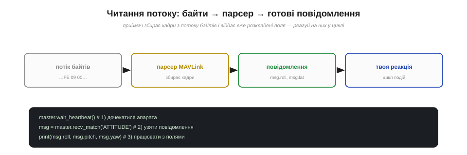
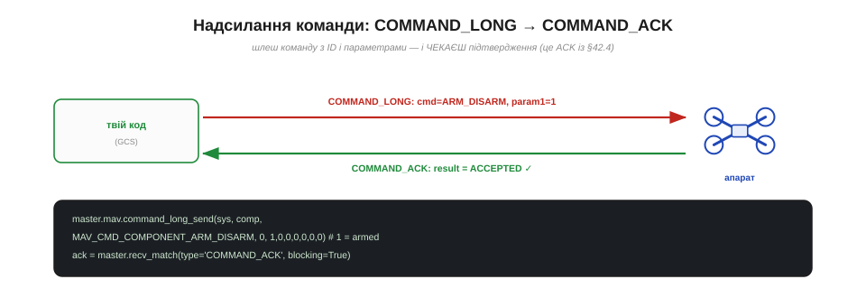
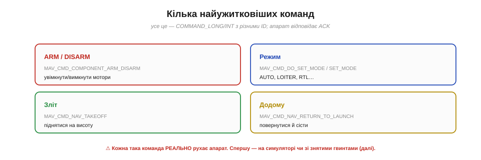
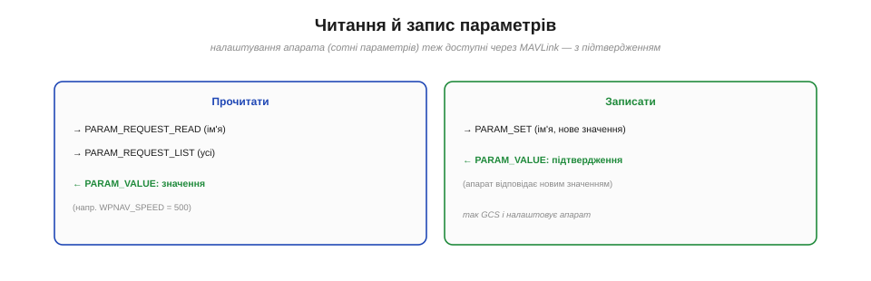
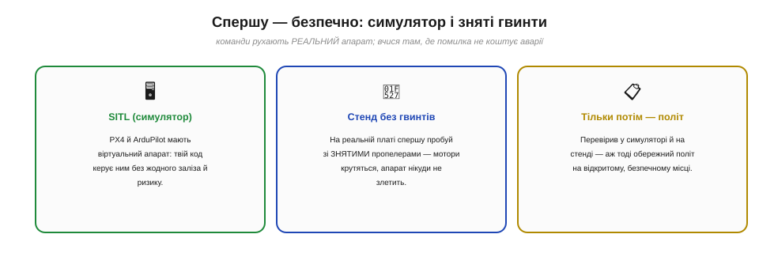

# Читання потоку й надсилання команд

Найцікавіше в роботі з MAVLink — **поговорити** з апаратом самому. Уся механіка протоколу зрештою стає **діалогом**: ми під'єднуємося до борту, **читаємо** його потік телеметрії й **шлемо** йому команди, дивлячись, як він кориться. По суті, це те саме, що робить наземна станція з [потоком телеметрії](book:communications/telemetry-stream), тільки **свідомо** й **своїм кодом**. Розгляньмо обидва боки розмови — приймання й передавання, — і окремо **безпеку**, бо команди тут рухають реальний апарат.

> ⚠️ Код у цій темі наведено **для розуміння** (у стилі бібліотеки [pymavlink](book:programming/pymavlink)) — щоб побачити логіку розмови, а не як готовий рецепт для запуску. **Не виконуй** його на реальному апараті, не засвоївши правил безпеки із цієї ж теми.

### Підключитися й читати потік

Перший бік розмови — **слухати**. Ми відкриваємо лінк (серійний порт, USB чи мережу) і починаємо **приймати** потік байтів; парсер MAVLink збирає з них готові повідомлення.


*Рис. Потік байтів заходить у парсер MAVLink, який збирає кадри й віддає вже **розкладені** повідомлення з полями (msg.roll, msg.lat). Першим ділом — дочекатися HEARTBEAT (підтвердити, що апарат на лінії), а далі в циклі брати потрібні повідомлення й реагувати.*

Логіка завжди однакова. Спершу — **дочекатися серцебиття**: поки не прийшов [HEARTBEAT](book:communications/mavlink-packet), ми навіть не знаємо адреси апарата. Потім — у циклі **брати повідомлення** потрібного типу й працювати з їхніми **полями**:

```
master.wait_heartbeat()                  # 1) дочекатися апарата (узяти його SYS/COMP)
msg = master.recv_match(type='ATTITUDE') # 2) узяти повідомлення про кути
print(msg.roll, msg.pitch, msg.yaw)      # 3) працювати з готовими полями
```

Зверни увагу: ми **не парсимо байти руками** — парсер уже зібрав кадр, перевірив [CRC](book:communications/mavlink-packet) і віддав об'єкт із полями. Уся робота [автомата розбору потоку](book:programming/stream-parser) тут зроблена за нас. Цикл приймання — це **подієвий** цикл: «прийшло повідомлення → відреагуй».

### Спершу попроси: апарат не шле все підряд

Важлива практична деталь: апарат **за замовчуванням не транслює все** — інакше [вузький канал телеметрії](book:communications/telemetry-stream) захлинувся б. Потрібні повідомлення треба **замовити**.


*Рис. Щоб отримати, скажімо, ATTITUDE десять разів на секунду, спершу шлемо запит **SET_MESSAGE_INTERVAL** (v2) або REQUEST_DATA_STREAM (старий v1) — «шли мені оце з такою частотою». Апарат починає потік. Це і є ті частоти потоку телеметрії — тепер ти керуєш ними сам.*

Якщо потрібного повідомлення «немає», найімовірніше, його просто ніхто **не замовив**. Запит робиться командою: у MAVLink v2 — **`MAV_CMD_SET_MESSAGE_INTERVAL`** (вкажи ID повідомлення й бажаний інтервал), у старому v1 — `REQUEST_DATA_STREAM`. По суті, ти задаєш ті самі [частоти потоку (*stream rates*)](book:communications/telemetry-stream), але вже з власного коду: критичне — частіше, фонове — рідше, щоб не перевантажити канал. Замовив — пішов потік; читаєш його в циклі приймання.

### Надсилання команди — і обов'язковий ACK

Другий бік розмови — **говорити**. Ми шлемо апарату **команду** й — за [правилом надійності зв'язку](book:communications/latency-reliability) — **чекаємо підтвердження**.


*Рис. Команду шлють повідомленням **COMMAND_LONG**: ID команди (наприклад, ARM_DISARM) і до семи параметрів. Апарат виконує й відповідає **COMMAND_ACK** із результатом (ACCEPTED / DENIED / FAILED). Завжди перевіряй ACK — інакше не знатимеш, чи команда взагалі дійшла й спрацювала.*

Узагальнена команда — це повідомлення **`COMMAND_LONG`** (чи `COMMAND_INT` для координат): у ньому **ID команди** (з набору `MAV_CMD_…`) і до **семи параметрів**. Наприклад, **озброїти** апарат (увімкнути мотори):

```
master.mav.command_long_send(sys, comp,
    MAV_CMD_COMPONENT_ARM_DISARM, 0,   # ID команди, confirmation
    1, 0,0,0,0,0,0)                    # param1 = 1 → armed
ack = master.recv_match(type='COMMAND_ACK', blocking=True)
# ack.result == MAV_RESULT_ACCEPTED ?
```

Найважливіше — **дочекатися `COMMAND_ACK`** і перевірити `result`: **ACCEPTED** (виконано), **DENIED** (відмовлено — наприклад, апарат не готовий), **FAILED**. Це і є та сама [стратегія «команда з підтвердженням»](book:communications/latency-reliability): не вистрелив-і-забув, а надіслав-і-переконався. Якщо ACK не прийшов — повтори запит.

### Кілька найужитковіших команд

Більшість дій з апаратом — це `COMMAND_LONG` з різними ID. Ось ключові.


*Рис. **ARM/DISARM** (`COMPONENT_ARM_DISARM`) — увімкнути/вимкнути мотори. **Режим** (`DO_SET_MODE`/`SET_MODE`) — AUTO, LOITER, RTL… **Зліт** (`NAV_TAKEOFF`) — піднятися на висоту. **Додому** (`NAV_RETURN_TO_LAUNCH`) — повернутися й сісти. Усе це — команди з ACK; і кожна РЕАЛЬНО рухає апарат.*

Запам'ятай чотири основні. **`MAV_CMD_COMPONENT_ARM_DISARM`** — озброїти/роззброїти (param1 = 1/0); озброєння розкручує мотори, тож це найвідповідальніша команда. **`MAV_CMD_DO_SET_MODE`** (або повідомлення `SET_MODE`) — змінити **режим** польоту (стабілізація, утримання, авто-місія, повернення). **`MAV_CMD_NAV_TAKEOFF`** — автоматичний **зліт** на задану висоту. **`MAV_CMD_NAV_RETURN_TO_LAUNCH`** — **повернення додому** (той самий RTL, що спрацьовує у failsafe [командного радіоканалу](book:communications/rc-link)). Усе це — звичайні команди з підтвердженням; з них складають будь-який автоматичний сценарій. І наголос: **кожна реально рухає апарат** — тож відпрацьовувати їх треба спершу на симуляторі чи стенді.

### Читання й запис параметрів

Окремий, дуже корисний клас розмови — **параметри**: сотні налаштувань апарата (швидкості, ліміти, коефіцієнти), які теж читаються й пишуться по MAVLink.


*Рис. **Прочитати**: `PARAM_REQUEST_READ` (один за іменем) чи `PARAM_REQUEST_LIST` (усі) → апарат відповідає `PARAM_VALUE` зі значенням. **Записати**: `PARAM_SET` (ім'я + нове значення) → апарат підтверджує, надіславши `PARAM_VALUE` уже з новим значенням. Саме так GCS і налаштовує апарат.*

Щоб **прочитати** параметр, шлеш `PARAM_REQUEST_READ` з його іменем (наприклад, `WPNAV_SPEED` — швидкість на маршруті), і апарат відповідає `PARAM_VALUE` зі значенням; `PARAM_REQUEST_LIST` витягує **всі** параметри одразу. Щоб **записати** — шлеш `PARAM_SET` (ім'я + нове значення), а апарат **підтверджує** запис, надіславши назад `PARAM_VALUE` уже з оновленим значенням (знову принцип «з підтвердженням»). Саме цей механізм стоїть за екранами налаштувань у QGroundControl і Mission Planner — і саме його ти можеш викликати з власного коду.

### Завантаження місії: рукостискання

І найскладніша розмова — **завантаження маршруту** (місії з точок). Тут важлива **надійність**, тож іде акуратне «рукостискання».


*Рис. Станція каже `MISSION_COUNT = N` («буде N точок»). Апарат просить їх **по черзі** (`MISSION_REQUEST` 0, 1, 2…), станція шле кожну (`MISSION_ITEM_INT`), і наприкінці апарат підтверджує `MISSION_ACK`. Жодна точка не загубиться — це надійна стратегія «з підтвердженням» у дії.*

Маршрут не можна «вистрелити й забути» — загублена точка означала б політ не туди. Тому місію вантажать **рукостисканням**: станція повідомляє `MISSION_COUNT` (скільки буде точок), апарат **просить** їх одну за одною (`MISSION_REQUEST_INT` з номером), станція надсилає кожну (`MISSION_ITEM_INT` — координати, висота, тип дії), і наприкінці апарат шле `MISSION_ACK` — «усе прийнято». Кожна точка **підтверджена**; це знову та сама [надійна стратегія зв'язку](book:communications/latency-reliability), тільки розгорнута в повноцінний діалог. Так само місію можна **прочитати** назад із апарата.

> 🔧 **Навіщо це.** Тепер ти бачиш повну розмову з апаратом: **слухати** (дочекатися heartbeat, замовити й читати потрібні повідомлення) і **говорити** (слати команди й параметри, обов'язково перевіряючи ACK). Це фундамент будь-якої автоматизації: моніторинг телеметрії, автозапуск місій, реакція на події (сів заряд → повертайся), власні наземні панелі. Два правила на все життя: **читаючи** — спершу замов потрібне з розумною частотою; **командуючи** — завжди чекай і перевіряй підтвердження. А третє правило — найважливіше — про безпеку.

### Спершу — безпечно: симулятор і зняті гвинти

Останнє й найсерйозніше. Кожна надіслана команда **реально рухає апарат** — а отже, помилка в коді може коштувати аварії чи травми. Тому вчитися треба там, де помилка **безпечна**.


*Рис. **SITL** (*software-in-the-loop*) — віртуальний апарат: і PX4, і ArduPilot мають симулятор, яким твій код керує **без жодного заліза** й ризику; усе MAVLink-спілкування справжнє, а «дрон» — у комп'ютері. Потім — **стенд зі знятими гвинтами**: мотори крутяться, але апарат нікуди не злетить. І лише після цього — обережний політ на безпечному місці.*

Правильний шлях — **трирівневий**. Спершу **SITL** (*software-in-the-loop*): і PX4, і ArduPilot мають **симулятор**, де «апарат» живе всередині комп'ютера; твій код спілкується з ним справжнім MAVLink, але збити нічого не можна — ідеально, щоб налагодити логіку. Потім — **стенд зі знятими пропелерами**: на реальній платі ти бачиш, що мотори реагують правильно, але апарат фізично **не злетить**. І лише **після** цих двох кроків — обережний політ на відкритому, безпечному майданчику, далеко від людей. Це не формальність, а **етика й безпека** інженера: код, що керує літальним апаратом, заслуговує на ту саму обережність, що й будь-яка серйозна техніка. Спочатку — симулятор; гвинти — востаннє.

Поки що вся ця розмова велася ніби «з пульта» — з боку наземної станції. Але той самий код MAVLink можна винести й **на сам апарат**: бортовий комп'ютер здатний без землі читати потік і керувати польотом за власною програмою — це шлях до [автоматизації через pymavlink](book:programming/pymavlink) і справжньої автономності, коли радіозв'язок замикається всередині самого літального апарата.

---
