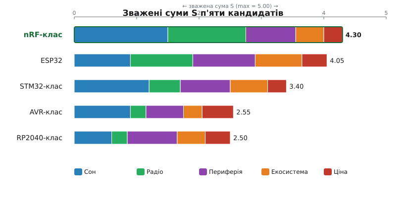
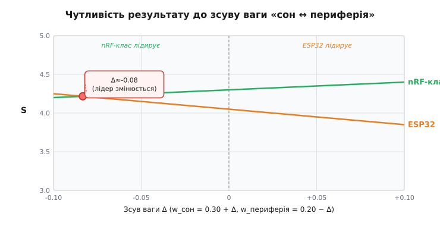

# Вибір МК ваговою матрицею: один проєкт, п'ять чипів, чесне число

> 🧮 Математична вставка до теми [«Як обрати МК під проєкт»](book:programming/mcu-checklist).

Чеклист вибору МК і типові помилки — це «вибір на словах», який лишає відчуття суб'єктивності: чому саме цей чип, а не той? Тут ми показуємо, як ту саму інженерну інтуїцію згорнути в одне число — щоб рішення стало прозорим і захищеним. Вагова матриця (weighted decision matrix) має й докладнішу теорію — нормування критеріїв, пастки методу, аналіз чутливості; тут лише один конкретний приклад, доведений до числа.

---

## Задача: бездротовий польовий давач

Уявімо автономний пристрій: він живиться від батареї, раз на хвилину прокидається, зчитує кілька аналогових і I²C-давачів температури та вологості, надсилає пакет по радіо і знову засинає. Решту часу він повинен витрачати якнайменше струму — бо батарею ніхто міняти щотижня не збирається.

Із цього профілю одразу постають п'ять [критеріїв вибору МК](book:programming/mcu-selection) (criterion), і кожен з них отримує числову вагу (weight, w) — число від 0 до 1, яке відображає, наскільки критерій важливий саме для цього проєкту:

| Критерій | Обґрунтування | Вага w |
|---|---|---|
| Споживання у сні | Батарея — головний обмежувач; мкА під час сну визначають час автономної роботи | 0.30 |
| Радіо «з коробки» | Зовнішній модуль — це додаткові компоненти, монтаж і потенційні точки відмови | 0.25 |
| Периферія (ADC, I²C) | Потрібні канали АЦП і шина I²C для давачів; кількість і якість каналів | 0.20 |
| Екосистема / SDK | Час розробки залежить від [документації і прикладів](book:programming/mcu-ecosystem) | 0.15 |
| Ціна + доступність | Важливо, але вторинно відносно надійності й споживання | 0.10 |

Сума ваг = 0.30 + 0.25 + 0.20 + 0.15 + 0.10 = **1.00**.

> 🔧 **Навіщо це.** Вагова матриця перетворює «мені здається, цей чип кращий» на документ, який можна показати команді й обґрунтувати рік потому. Ваги — це проєкт, що говорить: інший профіль (наприклад, промисловий контролер без батареї) дав би зовсім інший розподіл ваг, і переможець міг би змінитися. Саме тут і ховається чутливість методу — наскільки результат тримається, коли ваги трохи зрушити.

---

## Кандидати: п'ять сімей із пройдених тем

Рядки нашої матриці — п'ять родин мікроконтролерів:

- **[AVR-клас](book:programming/avr)** — копійчана 8-бітна класика з передбачуваними тактами; радіо лише зовнішнє, глибокий сон скромний за стандартами батарейних пристроїв.
- **ESP32** — потужне двоядерне ядро Xtensa, Wi-Fi і BT «з коробки», багата периферія, велика спільнота. Але це найзнайоміший чип — і саме тому особливо цікаво, чи він переможе під батарейний профіль.
- **[STM32/Cortex-M-клас](book:programming/stm32)** — доросла периферія з якісними АЦП і DMA, помірний сон; радіо виключно зовнішнє.
- **[nRF-клас](book:programming/nrf-radio-mcu)** — МК, зроблений навколо BLE і мікроамперного сну; радіо й надглибокий сон — це його основна ідея.
- **[RP2040-клас](book:programming/rp2040-pio)** — унікальна PIO дозволяє програмувати власні протоколи, але вбудованого радіо немає, а режим сну скромний.

Картина вже окреслилась: ESP32 — найзнайоміший, але профіль проєкту голосує насамперед за батарею й радіо. Подивимося, що скаже число.

---

## Рецепт оцінювання

Кожному кандидату виставляємо бал (score) від 1 до 5 за кожним критерієм — де 5 означає «ідеально під цей проєкт», а 1 — «погано підходить». Усі критерії в одній шкалі 1–5, щоб «ціна» і «споживання» були співмірні між собою. Зважена сума (weighted sum) S рахується за формулою:

```
S = Σ (wᵢ · балᵢ),   Σ wᵢ = 1.00,   бал ∈ {1..5}
```

Максимально можлива S — 5.00 (усі бали рівні 5). Нормування й вибір ваг — найтонше місце методу: саме від них залежить, наскільки стійкий результат.

---

## Заповнена матриця та підрахунок

Бали підібрано реалістично й узгоджено з портретами кандидатів вище:

| Кандидат | Сон (0.30) | Радіо (0.25) | Периферія (0.20) | Екосистема (0.15) | Ціна (0.10) | **S** |
|---|:---:|:---:|:---:|:---:|:---:|:---:|
| **nRF-клас** | 5 | 5 | 4 | 3 | 3 | **4.30** |
| ESP32 | 3 | 4 | 5 | 5 | 4 | 4.05 |
| STM32-клас | 4 | 2 | 4 | 4 | 3 | 3.40 |
| AVR-клас | 3 | 1 | 3 | 2 | 5 | 2.55 |
| RP2040-клас | 2 | 1 | 4 | 3 | 4 | 2.50 |

**Приклад. Підрахунок для nRF-класу та ESP32.**

```
S(nRF)  = 0.30·5 + 0.25·5 + 0.20·4 + 0.15·3 + 0.10·3
        = 1.50  + 1.25  + 0.80  + 0.45  + 0.30
        = 4.30

S(ESP32)= 0.30·3 + 0.25·4 + 0.20·5 + 0.15·5 + 0.10·4
        = 0.90  + 1.00  + 1.00  + 0.75  + 0.40
        = 4.05
```

Переможець — nRF-клас з S = 4.30. Але дивіться, *чому*: він не найпотужніший — він найточніше збігається з тим, що проєкт вважає головним. Сегменти «сон» і «радіо» разом дають йому 1.50 + 1.25 = 2.75 зі своїх 4.30 — майже дві третини суми. ESP32, попри п'ятірки за периферію й екосистему, програв саме на сні: 0.90 проти 1.50 — різниця 0.60 при вазі 0.30. Це й вирішило гру.



*Рис. Підсумкові бали п'яти кандидатів і внесок кожного критерію (stacked). Переможець визначений вагами проєкту: сон і радіо переважили сиру потужність.*

---

## Що число не вирішує

S = 4.30 — це підсумок суджень, а не закон природи. Досить змістити вагу «сон» з 0.30 на 0.25, перекинувши 0.05 на «периферію» — і різниця між nRF-класом та ESP32 скоротиться. Якщо зсунути ще на 0.10 у бік периферії, лідер зміниться: точку перетину видно на графіку нижче. Саме тому аналіз чутливості варто робити окремою процедурою, а не необов'язковим додатком.



*Рис. Як зсув ваги «сон ↔ периферія» рухає бали двох лідерів: до точки перетину виграє nRF-клас, після неї — ESP32.*

Практичний висновок: вагова матриця не наказує — вона робить компроміс видимим і змушує команду озвучити ваги вголос. Якщо два лідери в межах кількох сотих — рішає не таблиця, а вторинні чинники: досвід команди з конкретним SDK, наявний готовий код, реальна доступність чипа в постачальника.

---

## Де це працює в курсі

Цей спосіб можна застосувати прямо зараз — для будь-якого власного [вибору МК під проєкт](book:programming/mcu-checklist): виписати критерії, розподілити ваги (сума = 1.00), виставити бали й порахувати S. Той самий апарат масштабується на вибір давача, радіомодуля, акумулятора — перетворюючись на систематичну інженерну процедуру trade-study з пастками й формальним аналізом чутливості.
