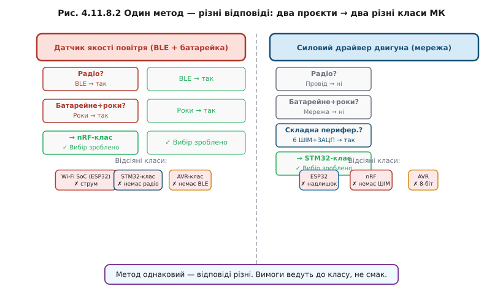

# Як обрати МК під проєкт

Головна теза проста: питання ставлять до [проєкту, а не до чіпа](book:programming/mcu-selection). Спершу вимоги — потім чіп. Аж ніяк не навпаки.

Новачок обирає так: «Знаю ESP32, люблю ESP32 — зроблю на ESP32». Потім виявляється, що батарейний датчик живе три доби замість трьох років, або що для точного ШІМ-контролера двигуна бракує синхронних АЦП-каналів. Переробка плати після першої ревізії — це завжди дорого: час, нові компоненти, нові помилки. Інженер виписує вимоги і потім дивиться, який клас їх закриває.

> 🔧 **Навіщо це**
>
> Чеклист — не бюрократія, а страховка від дорогої переробки. Десять хвилин питань на початку економлять місяць роботи на середині проєкту.

**Чеклист вибору (шість осей [вибору МК](book:programming/mcu-selection) + [екосистема](book:programming/mcu-ecosystem) у послідовності питань):**

1. **Периферія**: які саме інтерфейси, скільки каналів, чи потрібен advanced-timer або синхронний АЦП?
2. **Зв'язок**: провід, Wi-Fi, BLE, нема зовсім? Якщо радіо — це перша «killer-вимога», що відсіває цілі класи (тут вирішують [радіо-МК на кшталт nRF](book:programming/nrf-radio-mcu)).
3. **Живлення**: від мережі або від батареї-роками? Якщо батарея — все: цикл wake/sleep і струм сну, а отже й [бюджет енергії](book:programming/battery-budget).
4. **Продуктивність**: що реально потрібно для задачі, а не «більше — краще»? Чи справді потрібен FPU або DSP, як у [ядрах Cortex-M](book:programming/cortex-m)? Памʼятаймо: [DMIPS ≠ реальна продуктивність](book:programming/esp32-vs-8bit).
5. **Корпус і пайка**: що реально запаяти у своєму виробництві чи вдома? [DIP, QFP, QFN чи BGA](book:electronics/packages) — DIP можна вручну, BGA вимагає печі й рентгена.
6. **Ціна × тираж**: різниця в 50 центів за чіп на тисячі виробів — це реальні гроші.
7. **Екосистема і доступність**: SDK, драйвери, спільнота, [довговічність постачальника](book:programming/mcu-ecosystem). Чи буде цей чіп через три роки?

Порядок не випадковий. Питання 2 і 3 — «killer-вимоги», що одним «так» відсіяють цілий клас і суттєво звузять пошук. Питання 4–7 — тонке налаштування всередині звуженого поля.

**Worked-приклад «Від вимог до чіпа»**

*Пристрій 1: датчик якості повітря на батарейці*

```
Вимога                      Відповідь         Наслідок
──────────────────────────────────────────────────────────────────────
Зв'язок?                    BLE               → ESP32 надміру, Wi-Fi не треба
Батарейне+роки?             CR2032, ~3 роки   → мікроампери, Wi-Fi відпадає
Складна провідна перифер.?  I²C датчик, UART  → простої хватить
Нестандартний протокол?     Ні                → PIO не потрібен
Тираж?                      ~10 000 шт         → ціна важить
Екосистема?                 Активна бажано    → nRF має гарну
──────────────────────────────────────────────────────────────────────
Відсіяно: ESP32 (Wi-Fi, струм), STM32 (немає BLE), AVR (немає BLE),
          RP2040 (немає BLE)
Залишився: nRF-клас  ✓
```

*Пристрій 2: силовий драйвер двигуна (постійне живлення)*

```
Вимога                      Відповідь         Наслідок
──────────────────────────────────────────────────────────────────────
Зв'язок?                    Провід (CAN/UART) → радіо не потрібне
Батарейне?                  Мережа 24 В       → споживання не критично
Складна перифер.?           6 ШІМ+dead-time,  → advanced-timer потрібен
                             3 синхронних АЦП
Нестандартний протокол?     Ні                → PIO не потрібен
──────────────────────────────────────────────────────────────────────
Відсіяно: ESP32 (надлишок, нестандартний АЦП), nRF (немає ШІМ),
          AVR (8-біт, без FPU), RP2040 (M0+, нема advanced-timer)
Залишився: STM32-клас  ✓
```



*Рис. Один метод — різні відповіді: як два несхожі проєкти приводять чеклист до різних класів МК.*

Типові помилки:

- **Гонитися за МГц**: швидший чіп ≠ кращий пристрій.
- **Ігнорувати струм спокою** в батарейному пристрої: різниця між мікроамперами і міліамперами — це рік проти тижня.
- **Вибрати чіп без [екосистеми](book:programming/mcu-ecosystem)**: технічно чудовий чіп без драйверів і спільноти стоїть тижнів.
- **Взяти дефіцитний або EOL-чіп**: вісь [доступності](book:programming/mcu-selection) реальна — 2020–2022 навчили.
- **Закласти [корпус, який не запаяти](book:electronics/packages)**: BGA 0.4 мм у домашньому виробництві — катастрофа.
- **Надлишок «про всяк випадок»**: роздуває ціну, струм і час старту.

Коли осі конфліктують — наприклад, найдешевший чіп має гіршу екосистему, а найкраща екосистема не найдешевша — допомагає **вагова матриця**: кожному критерію присвоюється вага (важливість для цього проєкту), кожен кандидат оцінюється за кожним критерієм, результат — зважена сума. Приклад живого застосування — у вставці 🧮 [r11-s8-m-decision-matrix.md](math-decision-matrix.md). Сам метод trade studies і його пастки — окрема велика тема інженерного вибору.


*Рис. Від вимог до чипа: дерево питань, де кожна відповідь відсікає непридатні класи МК.*

Пейзаж мікроконтролерів широкий — від 8-бітного детерміністичного AVR-класу до програмованих автоматів PIO і BLE-мікроамперних nRF. Але всі вони підкоряються одному методу: спочатку вимоги, потім чіп. ESP32 залишається чудовим вибором там, де потрібен Wi-Fi і великий обсяг коду. AVR-клас — де важлива ціна і детермінізм без ОС. STM32-клас — де потрібна точна провідна периферія. RP2040 — де потрібен нестандартний протокол. nRF — де роки від батарейки. Жоден не «найкращий» — кожен правильний у своїй ніші.
