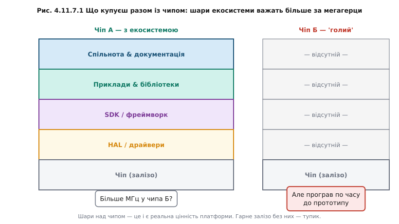
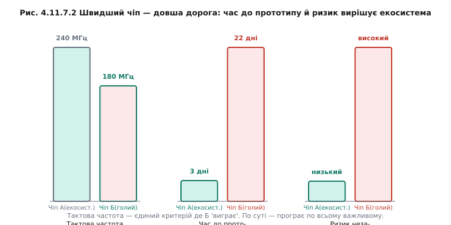

# Екосистема важить більше за мегагерци

Коли обирають мікроконтролер, спокуса велика: зіставити такти, кількість каналів периферії, мікроампери сну — і взяти того, хто виграв таблицю. Але на практиці проєкт частіше виграє або гине не на залізі, а на **екосистемі**: SDK і фреймворк, HAL і драйвери, документація й приклади, спільнота, інструменти прошивки і налагодження.

Екосистема — не абстракція. Це конкретний список питань, відповідь на кожне з яких коштує часу:
- Чи є приклад, що читає саме цей датчик із саме цим чіпом?
- Чи є драйвер для BLE-профілю, що потрібен?
- Якщо не знаєш — хтось у форумі вже відповів?
- Чи можна прошити з командного рядка, або треба спеціальна GUI?
- Чи буде цей SDK підтримуватись через три роки?

Той самий компроміс [«голе залізо vs фреймворк»](book:programming/baremetal-vs-framework) — ціна абстракції — постає тут уже як критерій вибору чіпа. Потужніший чіп із поганим SDK програє слабшому з відмінним — час інженера дорожчий за центи різниці в ціні кремнію. Якщо готовий I²C-драйвер для потрібного датчика лежить у репозиторії і компілюється з першого разу — це тижні зекономленої роботи.

**Worked-приклад «Дві дороги до того самого пристрою»**

Задача: читати I²C-датчик температури і слати значення по UART.

```
Критерій               Чіп А (з екосистемою)   Чіп Б (технічно кращий)
──────────────────────────────────────────────────────────────────────
Тактова частота        180 МГц                 240 МГц       ← Б «виграє»
Документація           відмінна, 600 стор.     часткова, 200 стор.
Драйвер I²C+датчик     є готовий, компілюється треба писати з нуля
Приклади в GitHub      >500 репо               ~10 репо
Спільнота (forum)      активна, відповідь <24 год   мало питань, мало відповідей
Прошивка               USB drag-and-drop        спеціальний програматор
──────────────────────────────────────────────────────────────────────
Час до робочого прото- ~2–3 дні                ~3–4 тижні
  типу (оцінка):
Ризик застрягти:       низький                  середній–високий

Висновок: Чіп Б швидший. Але Чіп А — кращий вибір.
```

Чому ESP32 і Arduino-світ так перемогли, попри те що архітектура ядра не [Cortex-M](book:programming/cortex-m)? Не завдяки мегагерцам — завдяки гігантській спільноті, морю прикладів, безкоштовному і зрілому SDK ESP-IDF. Бібліотека для практично будь-якого популярного датчика є на GitHub. Відповідь на Stack Overflow знайдеться за хвилину. Це жива ілюстрація тези.

Але є і зворотний бік: екосистема прив'язує. Код, написаний під ESP-IDF і Arduino, не перекомпілюється без змін під STM32-HAL. Один код на різні МК — мрія, до якої наближають HAL-шар і умовна компіляція (⚙️ [r11-s7-a-portability.md](proj-portability.md)), але повної переносності нема. Як зменшити прив'язку архітектурно: відокремити бізнес-логіку від драйверів у власний HAL-шар — так зміна платформи чіпатиме лише нижній рівень, а логіка лишається незмінною.



*Рис. Що насправді купуєш разом із чипом: шари екосистеми, які важать більше за мегагерци.*



*Рис. Швидший чіп — довша дорога: час до робочого прототипу й ризик вирішує екосистема, а не тактова частота.*

> 🔧 **Навіщо це**
>
> Перш ніж захоплюватись мегагерцами нового чіпа — спитати: «А чи є приклад, драйвер, спільнота й документація?» Часто ця відповідь вирішує більше, ніж уся таблиця характеристик у datasheet.

Залізо й екосистема — дві осі того самого вибору, і важити вони мають разом. Як звести їх у послідовний [метод вибору під конкретний проєкт](book:programming/mcu-checklist) — окрема розмова.
