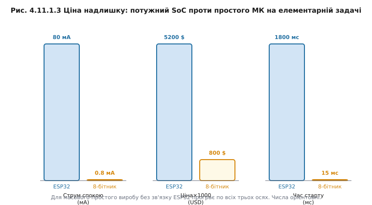
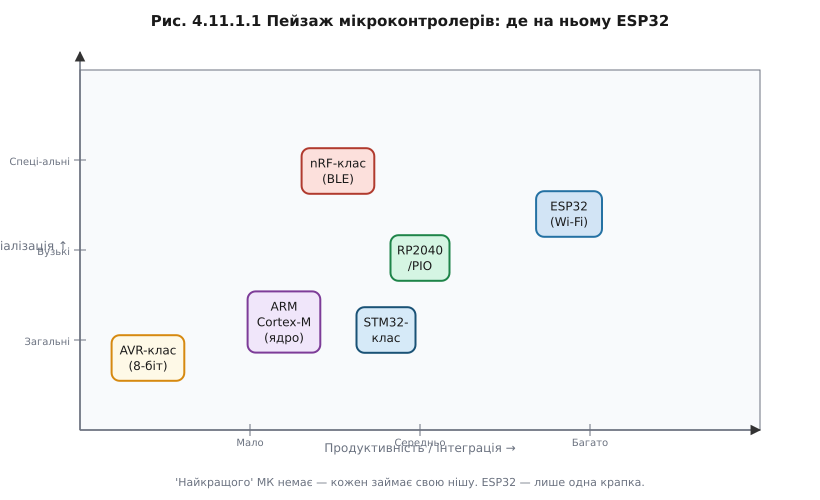

# Навіщо знати інші МК

Вибрати чіп можна вже всередині одного бренду — [сімейство ESP32](book:programming/esp32-family) саме по собі пропонує ESP32-S2 без Bluetooth, ESP32-S3 з двома ядрами і PSRAM, ESP32-C3 на RISC-V, ESP32-C6 із 802.15.4. Це теж вибір — але між варіантами одного виробника в одній екосистемі. Є рівень вище: вибір між принципово різними архітектурами, брендами і навіть підходами до того, що таке «периферія». І тут стає очевидною теза, яку легко проголосити, але важко відчути: «найкращого МК» не існує. Є найкращий-під-задачу.

ESP32 чудовий. Але він несе з собою ціну: споживання в режимі активного Wi-Fi від 80 мА до 300 мА, базову вартість у кілька доларів, час старту від скидання до готовності прошивки понад секунду. Для пристрою, що підключається до хмари і стримить дані, — це абсолютно нормально. Для масового датчика на батарейці, де треба раз на хвилину прокинутись, виміряти температуру і заснути, — три ці числа роблять ESP32 програшним варіантом за всіма трьома осями. Подивимося на це в числах.

**Worked-приклад «Ціна надлишку»**

Задача: мигати світлодіодом, зчитувати кнопку, раз на хвилину слати одне число по UART.

```
Критерій          ESP32            8-бітний МК
──────────────────────────────────────────────
Струм спокою      ~80 мА (deep     ~0.8 мкА (power-down)
                  sleep ~10 мкА,  
                  але Wi-Fi не    
                  спить сам)      
Ціна × 1000 шт   ~5200 USD        ~800 USD
Час старту        ~1800 мс         ~15 мс
                  (bootloader +   
                  Wi-Fi-init)      

Числа орієнтовні; залежать від конкретної моделі та прошивки.
```

Висновок прямий: для масового простого виробу без зв'язку ESP32 програє за всіма трьома числами. Але варто додати Wi-Fi або BLE-координацію — і баланс миттєво зміщується: вбудоване радіо, велика спільнота, готові бібліотеки для хмарних сервісів. Правильний вибір залежить від задачі, а не від звички.



*Рис. Ціна надлишку: потужний SoC проти простого МК на елементарній задачі — три осі програшу.*

Щоб вибір не був стрибком у темряву, потрібен каркас. Зведений [чеклист вибору МК](book:programming/mcu-checklist) спирається на шість осей:

1. **Периферія** — яких інтерфейсів, каналів, таймерів, АЦП вимагає задача? Є вони у чіпі або треба зовнішні мікросхеми?
2. **Споживання** — пристрій від мережі чи від батареї? Якщо батарея — скільки мікроамперів у сні? (Детальна математика енергобюджету — окрема велика тема; тут це лише критерій вибору.)
3. **Корпус** — DIP, QFP, QFN, BGA. Що реально запаяти в умовах виробництва? (🔌 r11-s8-c-packages розбирає це детально.)
4. **Ціна** — ціна одного чіпа в тиражі. Різниця в 30 центів за штуку на 100 000 виробів — це 30 000 доларів.
5. **Доступність** — чи буде цей чіп на ринку через рік, два, п'ять? Дефіцит 2020–2022 років навчив багатьох дорогим урокам.
6. **Екосистема** — SDK, драйвери, приклади, спільнота, інструменти ([екосистема МК](book:programming/mcu-ecosystem) як окремий критерій).


*Рис. Шість осей, за якими інженер обирає мікроконтролер; продуктивність — лише одна з них.*

Чому продуктивність оманлива? Тому що мегагерци — це максимум того, що може зробити ядро за секунду у вакуумі. Реальна пропускна здатність залежить від ширини шини пам'яті, наявності кешу, поведінки планувальника ОС, кількості переривань. [Порівняння DMIPS](book:programming/esp32-vs-8bit) показує, як 8-бітний МК із апаратним таймером часом «реальніший» для конкретної задачі, ніж 240-МГц монстр під товстим SDK. Числа DMIPS — орієнтир, а не вирок.

Це таке саме серйозне інженерне рішення, як і вибір [між мікроконтролером і одноплатним комп'ютером](book:programming/microcontroller): там ішлося про два класи обчислювачів, тут — про різні МК всередині одного класу. І ціна помилки схожа: переробка плати, корпусу, прошивки. Тому вибір варто робити свідомо, до того як замовлені компоненти.

> 🔧 **Навіщо це**
>
> Знати пейзаж МК потрібно, щоб не тягнути Wi-Fi-SoC у батарейний датчик і не ставити копійчаний 8-бітник туди, де потрібен TLS. Половина прикладів у відкритих репозиторіях написана на AVR або STM32 — вміти читати чужий код означає розуміти ці платформи хоч на рівні «де шукати регістр переривання».



*Рис. Пейзаж мікроконтролерів: де на ньому ESP32 і куди тягнуться інші класи.*

На протилежному кінці шкали від ESP32 лежать найпростіші, передбачувані 8-бітники — [AVR-клас](book:programming/avr) і подібні; саме вони показують, як мало кремнію насправді треба для багатьох задач.

---
