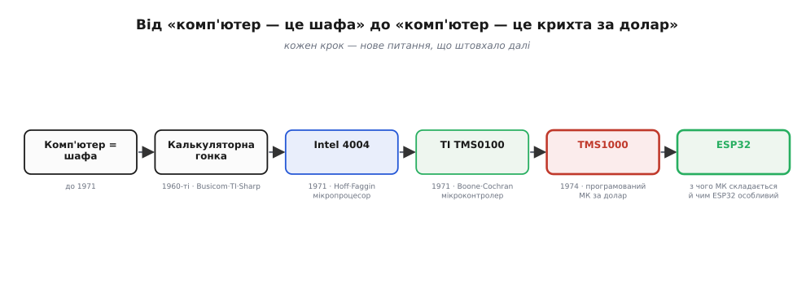
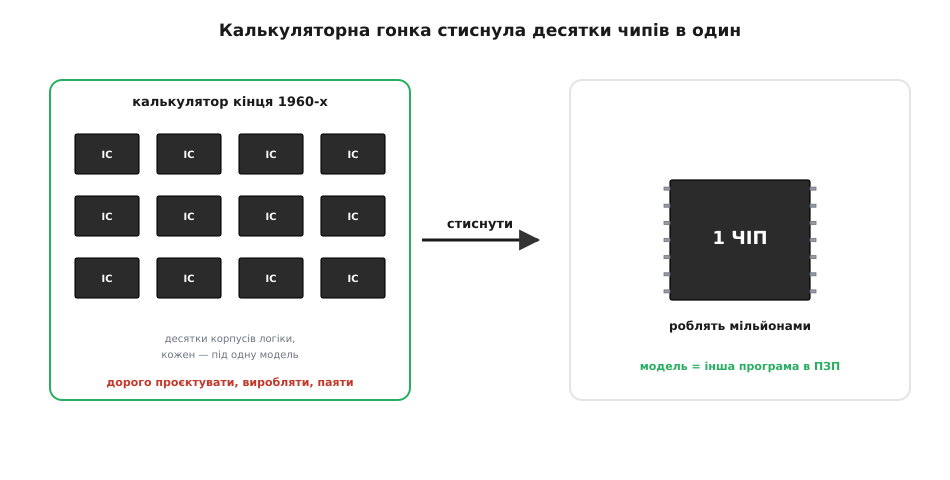
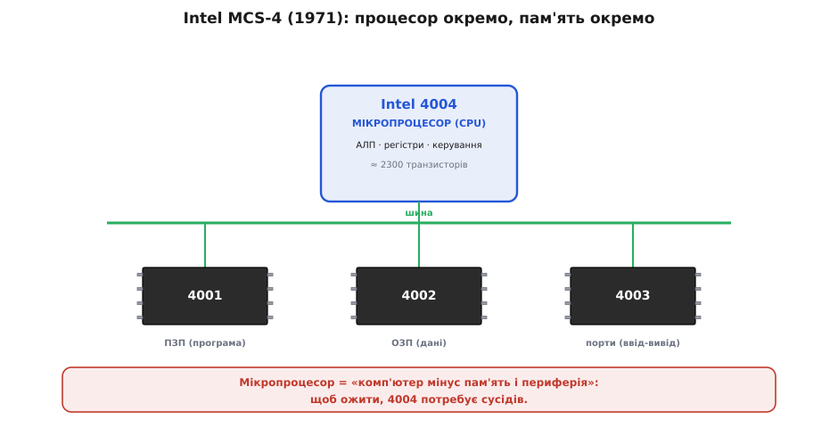
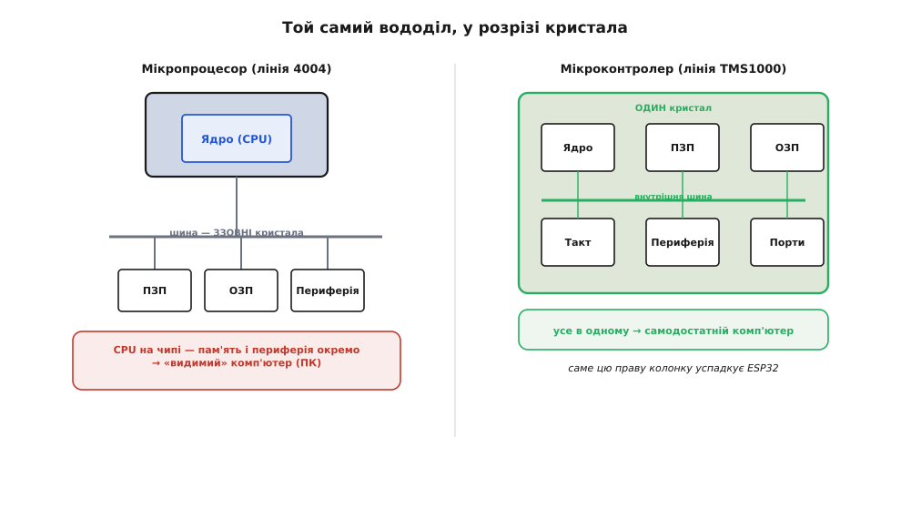
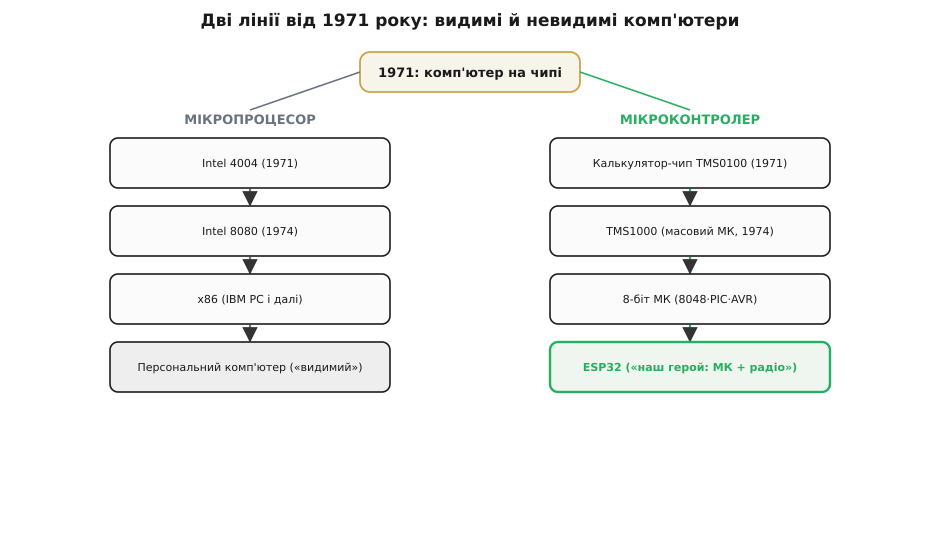
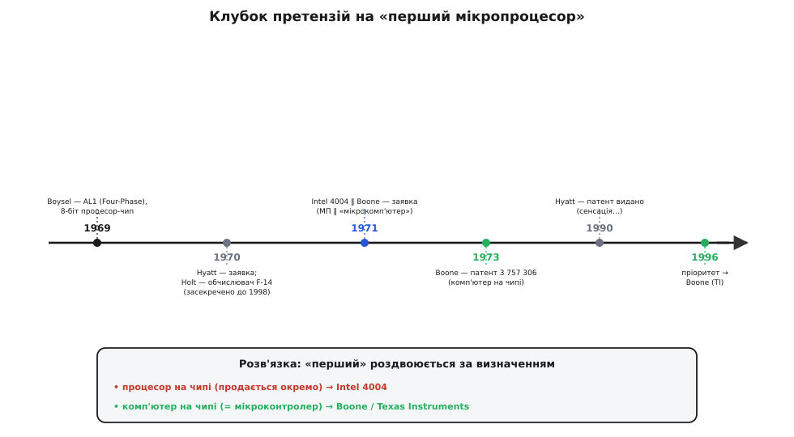

# 📜 Перший мікроконтролер: комп'ютер, що виріс із калькулятора

> Ця розповідь не перелічує «хто що відкрив» — вона веде **ланцюгом питань** навколо однієї дивовижі: як цілий комп'ютер, що ще вчора займав шафу, за кілька років утиснувся в одну кремнієву крихту на нігті. І, що несподівано, штовхнув цю революцію **не** комп'ютерний гігант, а гонка за дешевим **кишеньковим калькулятором**. На цьому шляху народилися два споріднені, але різні створіння — **мікропроцесор** і **мікроконтролер**, — і саме друге з них, через півстоліття нащадків, дало світові [ESP32](topic:programming/microcontroller).

Уявімо [процесор](topic:programming/what-is-processor) зібраним **подумки**: регістри, АЛП, лічильник команд, шина, цикл «вибірка → декодування → виконання». Така машина в уяві — **велика**: десятки корпусів логіки на платі, а то й ціла шафа. На зламі 1960–70-х так і було: «комп'ютер» означало холодильник або кімнату. І тут постало питання, без якого не було б ані ESP32, ані будь-якої «розумної» речі у вашій кишені: **чи може цілий комп'ютер уміститися на одному чіпі?** Не процесор окремо, не пам'ять окремо — а вся машина разом, готова працювати сама. Відповідь визріла майже випадково, на узбіччі великої комп'ютерної індустрії, у запеклій і прозаїчній війні за **арифмометр для бухгалтера**.

*Шлях від «комп'ютер — це шафа» до «комп'ютер — це крихта за долар». Кожен щабель — нове **питання**, на яке попередня відповідь не давала спокою. Сірим — те, з чого МК складається й чим ESP32 особливий.*

---

## Комп'ютер завбільшки з кімнату: навіщо його було стискати

На початку 1970-х обчислювальна машина будувалася з **окремих** мікросхем: тут корпус із кількома логічними вентилями, там — регістр, поряд — лічильник, і так сотні корпусів, з'єднаних доріжками на великій платі. Кожен [логічний вентиль](topic:electronics/basic-gates) фізично жив в окремій ніжці-вивідній мікросхемі. Процесор міні-комп'ютера на кшталт PDP-8 — це була **шафа** плат. Усе разом коштувало як автомобіль, грілося, споживало кіловати й вимагало вентилятора.

Причина роздробленості була не в браку ідей, а в **технології виробництва**. Скільки транзисторів інженери вміли надійно вмістити на одному кристалі, стільки й уміщували, — а решту виводили назовні й з'єднували дротами. На той час «багато» означало кілька сотень, від сили тисяча-дві транзисторів на чіп. Цілий процесор — навіть скромний — у ці межі не влазив. Тож його **різали** на шматки й розкладали по корпусах.

Але кремнієва технологія дорослішала шалено швидко: на тому самому клаптику кристала десь кожні два роки вміщувалося вдвічі більше транзисторів — закономірність, яку згодом назвуть «законом Мура». І в якийсь момент стало зрозуміло: межа, за якою **весь** процесор влізе на один кристал, — це питання не «чи», а «коли». Лишалося знайти задачу, **досить масову й досить просту**, щоб на ній уперше окупилося зробити такий чіп. Великі комп'ютерні фірми (IBM, DEC) на ту крихту дивилися згорда: їхні машини були складні, дорогі, продавалися штучно. А масовий, дешевий, простий ринок чекав зовсім в іншому місці — на столі бухгалтера й у портфелі інженера.

> 🔧 **Навіщо це.** Те, що ціла обчислювальна машина сьогодні вміщується в корпус завбільшки з рисове зерно й коштує копійки, — це не дрібниця, а **передумова всього**, що ми робимо. Без неї не було б ані давача з власним «розумом», ані польотного контролера, ані розумної лампочки. Уся ідея «вбудованої електроніки» (*embedded*) стоїть на тому, що комп'ютер став **дешевим і крихітним** настільки, щоб його не шкода було поставити в чайник. А почалося це з калькулятора.

---

## Калькуляторна гонка: тиск, що змусив усе стиснути

Наприкінці 1960-х спалахнула справжня **калькуляторна війна**. Поява настільних електронних рахівниць — японських (*Busicom*, *Sharp*, *Canon*) та американських — створила ринок, де перемагав той, хто зробить **дешевше й менше**. А коренем ціни була сама електроніка: ранній настільний калькулятор містив **десятки** мікросхем спеціальної логіки, кожну розроблену під конкретну модель. Дорого проєктувати, дорого виробляти, дорого паяти.

Першу пробу «стиснути калькулятор» зробили ще в **Texas Instruments**: 1965–1967 років команда **Джека Кілбі** (*Jack Kilby* — той самий, хто 1958-го зробив першу інтегральну схему), разом із **Джеррі Мерріменом** (*Jerry Merryman*) і **Джеймсом ван Тасселом** (*James Van Tassel*), збудувала прототип кишенькового калькулятора «**Cal-Tech**». Це був доказ, що арифметику можна впакувати в жменю чипів і живити від батарейок. Але справжній стрибок був попереду — і зробили його **дві** команди майже одночасно, кожна своїм шляхом, 1971 року.

*Економічний двигун революції. Ліворуч — настільний калькулятор кінця 1960-х: **десятки** корпусів спеціальної логіки на великій платі, кожен дорогий і «одноразовий» (під одну модель). Праворуч — мета: **один** універсальний чіп, який роблять мільйонами, а під модель лише змінюють **програму** в ПЗП. Саме цей тиск «дешевше, менше, універсальніше» й виштовхнув на світ мікропроцесор та мікроконтролер.*

Чому саме калькулятор, а не комп'ютер, став колискою? Бо тут зійшлися три умови: задача **проста й однотипна** (чотири дії арифметики, кілька регістрів, клавіші й індикатор); ринок **величезний** (мільйони штук на рік) — отже, дорогий «разовий» чіп окуповувався; і вимога до ціни **жорстока** до останнього цента. Це той рідкісний випадок, коли тиск ринку точно збігся з можливостями технології. Велика комп'ютерна індустрія такого тиску не знала — і тому проґавила найбільшу зміну у власній історії.

---

## Intel 4004: процесор на чипі — але ще не весь комп'ютер

1969 року японська фірма **Busicom** замовила американській **Intel** (тоді — молодій компанії, що робила мікросхеми пам'яті) комплект чипів для нового друкувального калькулятора. Інженер Busicom **Масатосі Сіма** (*Masatoshi Shima*) привіз проєкт із **десятка** складних спеціалізованих чипів. І тут інженер Intel **Тед Гофф** (*Marcian «Ted» Hoff*) запропонував зухвалу зміну задуму: замість десятка «одноразових» чипів зробити **один невеликий універсальний процесор** плюс кілька чипів пам'яті — а всю поведінку калькулятора задати **програмою**.

Це був тектонічний зсув мислення. Не «накреслимо логіку під цей калькулятор», а «зробимо просту програмовану машинку й **напишемо** для неї калькулятор». Те, що сьогодні очевидно, тоді було єрессю: навіщо універсальність, якщо клієнтові треба лише рахувати? Гофф із колегою **Стеном Мейзором** (*Stanley Mazor*) накидали архітектуру; а втілив її в кремнії — і це окрема заслуга — **Федеріко Фаджин** (*Federico Faggin*), що прийшов в Intel 1970-го й приніс ключову технологію **кремнієвого затвора** (*silicon-gate*), без якої такої щільності не вийшло б. Сіма допомагав із боку Busicom.

Результат — родина **MCS-4**, серцем якої був чіп **Intel 4004**, публічно представлений **15 листопада 1971 року**. Усього **2300 транзисторів**, 4-бітне слово, тактова частота близько 740 кГц. За обчислювальною силою — приблизно як перший повоєнний комп'ютер ENIAC, що займав цілу залу, — лише тепер на пластинці завбільшки з ніготь. Це був **перший комерційний мікропроцесор** (*microprocessor*).

Та ось ключова деталь. 4004 **сам по собі ще не був комп'ютером**. Він був лише **процесором** — АЛП, регістри, керування, — і щоб ожити, потребував сусідів: окремий чіп ПЗП **4001** (де лежала програма), чіп ОЗП **4002** (де лежали дані), чіп зсувних регістрів **4003** для вводу-виводу. Тобто «комп'ютер» усе ще збирався з **кількох** чипів на платі — просто тепер їх було не десятки, а чотири.

*Родина Intel MCS-4 (1971). У центрі — **4004**, перший мікропроцесор: на чипі лише ядро (АЛП, регістри, керування). Щоб стати робочим комп'ютером, йому потрібні **окремі** чипи довкола: 4001 (ПЗП — програма), 4002 (ОЗП — дані), 4003 (порти вводу-виводу). Це визначення **мікропроцесора**: «комп'ютер мінус пам'ять і периферія», CPU на чипі — а решта зовні.*

> 🔧 **Навіщо це.** Розрізнення «процесор на чипі» проти «комп'ютер на чипі» — не педантизм, а саме той вододіл, на якому стоїть протиставлення [мікропроцесора й мікроконтролера](topic:programming/microcontroller). У ньому — пряме відлуння 1971 року: 4004, якому **бракувало** пам'яті всередині, проти чипа, що ніс **усе** в собі. Перший повів родовід до персонального комп'ютера; другий — до ESP32 у вашій руці.

---

## Інший шлях у Техасі: цілий комп'ютер на одному кристалі

Поки Intel робила процесор для японського калькулятора, у тих-таки **Texas Instruments** двоє інженерів — **Гері Бун** (*Gary Boone*) і **Майкл Кокран** (*Michael Cochran*) — ішли до тієї самої мети, але з **іншого боку**. Їхня задача була ще приземленіша: TI продавала калькуляторні чипсети й хотіла зробити їх дешевшими. А найдешевший спосіб — **скоротити кількість чипів до одного**.

І вони це зробили. 1971 року TI випустила серію **TMS0100** (перший масовий представник — **TMS1802**, анонсований 17 вересня 1971-го) — **калькулятор на одному чипі** (*calculator-on-a-chip*). На одному кристалі сиділо **все**, що потрібно калькуляторові: арифметичний блок, схема керування, **ПЗП із програмою** дій, **ОЗП із регістрами** для чисел, генератор такту й логіка опитування клавіш та керування індикатором. Уставив цей чіп, додав клавіатуру, індикатор і батарейку — і калькулятор готовий.

Бун швидко зрозумів, що тримає в руках щось більше за калькулятор. Адже якщо **змінити програму** в ПЗП, той самий кремній рахуватиме не податки, а керуватиме, скажімо, мікрохвильовкою чи світлофором. Це вже не калькулятор — це **універсальний комп'ютер на одному чипі**. Того ж 1971 року Бун подав патентну заявку саме на таку ідею — «комп'ютер на одному чипі»; **патент США № 3 757 306** (офіційна назва — «Computing systems CPU», тобто процесор на чипі) було видано **4 вересня 1973 року**. (Прізвисько «мікрокомп'ютерний патент» причепилося радше до пізнішої заявки Буна й Кокрана — № 4 074 351, 1978; але й вона офіційно зветься інакше.)

*Той самий вододіл, у розрізі кристала. **Мікропроцесор** (зліва, лінія 4004): на чипі лише ядро, а ПЗП, ОЗП і порти — окремими корпусами навколо, з'єднані зовнішньою шиною. **Мікроконтролер** (справа, лінія TMS1000): ядро, **ПЗП**, **ОЗП**, такт і **периферія** — усе на одному кристалі, шина схована **всередині**. Перший — «процесор, що шукає пам'ять»; другий — **самодостатній комп'ютер**, готовий працювати поодинці. Саме цю праву колонку через півстоліття успадкує ESP32.*

Ось він, **мікроконтролер** (*microcontroller*) — у зародку. Не «процесор, до якого треба докуповувати пам'ять», а **готовий комп'ютер**, що містить у собі обчислювач, пам'ять для програми, пам'ять для даних і канали зв'язку зі світом. Різниця з мікропроцесором — не в потужності, а в **повноті**: мікроконтролер ні від кого не залежить, він самодостатній.

> 🔧 **Навіщо це.** [Складові МК](topic:programming/mcu-blocks) — ядро, Flash, SRAM, периферія — це фактично перелік того, що Бун і Кокран уперше зібрали на одному кристалі 1971 року. «Усе в одному» — це не маркетинг, а **визначальна риса** класу. Саме тому до ESP32 не треба паяти зовнішній чіп ПЗП чи ОЗП, щоб він ожив: він, як і TMS0100, несе свій комп'ютер у собі.

---

## TMS1000: перший мікроконтролер, якого зробили мільярдами

Одиничний доказ — це ще не революція. Революцію зробив **продукт**. 1974 року TI вивела на ринок **TMS1000** — узагальнений, **програмований замовником** мікроконтролер на базі тієї самої калькуляторної архітектури: 4-бітне ядро, близько **1 КБ ПЗП** для програми, **64×4 біт ОЗП** для даних, вбудований такт і лінії вводу-виводу — усе на одному кристалі. Ціна у великих партіях упала до **кількох доларів**, а згодом і нижче.

І світ почав ставити комп'ютер **усюди**. TMS1000 та його родичі опинилися в десятках мільйонів пристроїв, де доти й не мріяли про «обчислювач»: у мікрохвильових печах і пральних машинах, у настільних іграх (легендарна **Simon** від Milton Bradley, 1978), у мовній іграшці-навчалці **Speak & Spell** (1978), у будильниках, терезах, автомобільній автоматиці. До кінця 1970-х TMS1000 розійшовся **сотнями мільйонів** штук — і став, за багатьма мірками, найпоширенішим мікроконтролером свого десятиліття.

Це й була справжня зміна. Мікропроцесор (лінія 4004 → 8008 → 8080) повів до **видимих** комп'ютерів — спершу до Altair і перших ПК, далі до x86 і машини на вашому столі. А мікроконтролер (лінія TMS1000) повів до комп'ютерів **невидимих** — тих, що тихо сидять у речах і роблять їх «розумними», не показуючи, що всередині них б'ється процесор. Сьогодні на кожен «видимий» процесор у ноутбуці чи телефоні припадають **десятки** невидимих мікроконтролерів — у зарядці, навушниках, мишці, клавіатурі, термостаті, замку.

*Розвилка, яку створив 1971 рік. **Ліва гілка** (мікропроцесор): 4004 → 8080 → x86 → персональний комп'ютер — «видимі» машини, де процесор у центрі уваги. **Права гілка** (мікроконтролер): калькуляторний чип → TMS1000 → покоління 8-біт МК → сучасні системи-на-чипі — «невидимі» комп'ютери у речах. **ESP32** сидить у самому кінці правої гілки: цілий комп'ютер (тепер ще й із радіо) на одному чипі — а його [цифри й внутрішня архітектура](topic:programming/esp32-architecture) розкриваються окремо.*

> 🔧 **Навіщо це.** Розуміючи цю розвилку, ви легше відповісте на вічне запитання розробника: «мені тут потрібен мікроконтролер чи повноцінний комп'ютер (мікропроцесор + ОС)?» Для самодостатньої речі, що має надійно й дешево робити свою справу, — нащадок TMS1000 (МК). Для машини з екраном, файлами й операційною системою — нащадок 4004 (МП із зовнішньою пам'яттю). Цей самий вибір, [уже з числами](root:embedded/esp32-vs-8bit), вирішують і сьогодні.

---

## Хто ж «винайшов мікропроцесор»: суперечка, у якої немає одного батька

Щойно стало ясно, **наскільки** великим був винахід, навколо нього спалахнули **патентні війни**, що тяглися десятиліттями. І це повчально: у революцій рідко буває один тихий батько.

- **Intel** пишалася **4004** як «першим мікропроцесором» — і має на це вагоме право: це був перший процесор-на-чипі, що **продавався** окремо як універсальний компонент.
- **Texas Instruments** тримала фундаментальні патенти **Гері Буна** — і на «мікрокомп'ютер» (комп'ютер на чипі), і на сам процесор; багато років TI збирала ліцензійні платежі з усієї індустрії саме за цими патентами.
- 1990 року винахідник-одинак **Гілберт Гаятт** (*Gilbert Hyatt*) несподівано отримав патент (заявка ще з 1970-го), що претендував на «однокристальний комп'ютер», — і на якийсь час його проголосили справжнім винахідником мікропроцесора. Та TI оскаржила це; **1996 року** патентне відомство в процедурі суперечки про першість віддало пріоритет саме **Бунові**, а не Гаятту.
- А ще були **Лі Бойзел** (*Lee Boysel*) із процесором AL1 фірми Four-Phase (1969) і **Рей Голт** (*Ray Holt*) із засекреченим до 1998-го бортовим обчислювачем винищувача F-14 (1970) — кожен зі своїм правом називатися «першим».

Хто ж правий? Усі — і ніхто. Бо відповідь залежить від **визначення**. Якщо «перший» — це **процесор** на чипі, що продається окремо, — то 4004. Якщо «перший» — це **комп'ютер** на чипі (саме те, чим є мікроконтролер), — то лінія Буна й TI. Ця плутанина не випадкова: 1971-й народив **двох** близнюків одразу, і суперечка про першість насправді була суперечкою про те, **що саме** ми називаємо винаходом. Важливіше за ім'я переможця — це чітко бачити **різницю** між близнюками, бо саме правий із них, мікроконтролер, лежить в основі ESP32.

*Чому «першого» так важко назвати. На одному відрізку часу — кілька рівноправних претендентів: AL1 Бойзела (1969), бортовий обчислювач F-14 Голта (1970, засекречений до 1998), заявка Гаятта (1970), Intel 4004 (1971), «мікрокомп'ютерний» патент Буна (заявка 1971 → видано 1973). Розв'язка внизу: відповідь **роздвоюється за визначенням** — «процесор на чипі» веде до 4004, «комп'ютер на чипі» — до Буна й TI (підтверджено пріоритетом 1996 року). Це не плутанина істориків, а наслідок того, що 1971-й народив **двох** близнюків одразу.*

> 🔧 **Навіщо це.** Коли в даташитах і статтях ви читатимете «microprocessor» (MPU) і «microcontroller» (MCU) — тепер ви чуєте за цими словами не синоніми, а двох різних нащадків 1971 року. MPU (як у ноутбуці) — ядро, що по зовнішній шині тягнеться до окремих чипів пам'яті. MCU (як ESP32) — самодостатній комп'ютер у одному корпусі. Плутати їх — як плутати двигун із цілим автомобілем.

---

## Звідки взялися самі слова

Мова теж зберегла сліди цієї історії, і знати їх корисно — ці слова трапляються в кожному даташиті.

- **Мікропроцесор** (*microprocessor*, MPU) — «малий процесор»: те, що раніше було шафою процесорних плат, стиснули («мікро») в один чіп. Лінія 4004.
- **Мікроконтролер** (*microcontroller*, MCU або µC) — «малий керівник»: чіп, що не просто рахує, а **керує** пристроєм, маючи для цього все своє. Спершу його ж називали **мікрокомп'ютером** (*microcomputer*) — саме так його охрестили в TI тих років, — але згодом слово «мікрокомп'ютер» прижилося за маленькими **настільними** машинами, а за «комп'ютером на чипі» закріпилося «мікроконтролер».
- **Вбудована система** (*embedded system*) — пристрій, усередині якого захований комп'ютер, що його не видно й не сприймають як «комп'ютер»: мікрохвильовка, давач, дрон. Майже всі вбудовані системи побудовані на мікроконтролерах — прямих нащадках TMS1000.

Звідси й сталий скорочений запис: **МК** (мікроконтролер, англ. **MCU**). ESP32 — це MCU. А коли поряд із ним з'явиться окремий потужніший «бортовий комп'ютер», то це вже радше нащадок лінії MPU з власною операційною системою.

---

## Що з цього лишилось нам

Озирнімося на цей короткий, але вирішальний ланцюг. За якихось три-чотири роки — від калькуляторної гонки кінця 1960-х до TMS1000 (1974) — людство пройшло від «комп'ютер — це шафа» до **комп'ютера за долар на одному чипі**. І майже все в сучасному мікроконтролері — це закам'янілі сліди тих подій:

- сам **мікроконтролер** — прямий нащадок калькуляторного чипа Буна й Кокрана: «усе в одному» — ядро, пам'ять, периферія;
- розрізнення [**мікропроцесор vs мікроконтролер**](topic:programming/microcontroller) — той самий вододіл 1971 року між 4004 (CPU на чипі) і TMS0100 (комп'ютер на чипі);
- ідея, що поведінку машини задає **програма в ПЗП**, а не розпаяна логіка, — Гоффова єресь, яка стала нормою; саме тому ми «прошиваємо» МК, а не перепаюємо;
- **ESP32** як істота правої, мікроконтролерної гілки — самодостатній комп'ютер на чипі, лише незрівнянно потужніший за TMS1000 і з радіо на додачу.

Калькулятор, що штовхнув усе це, давно став музейним експонатом. А його нащадки розмножилися так, що сьогодні їх у світі **більше, ніж людей** — десятки мікроконтролерів на кожного з нас, тихих і невидимих. І кожен із них досі несе в собі ту саму ідею 1971 року: цілий комп'ютер — ядро, пам'ять, периферія — на одному кристалі, а поведінку задає **програма в ПЗП**, а не розпаяна логіка. ESP32 у вашій руці — це той самий калькуляторний чип Буна, лише через півстоліття нащадків: незрівнянно потужніший і з радіо на додачу.
