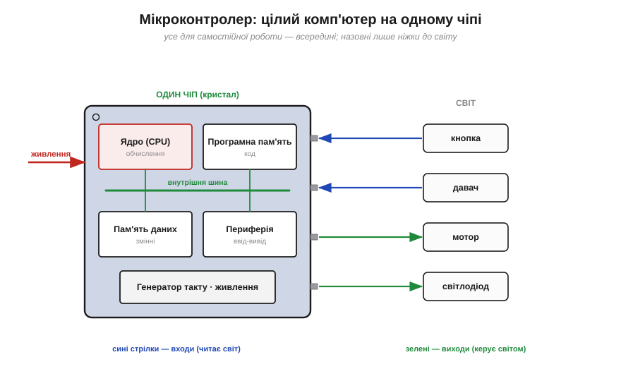
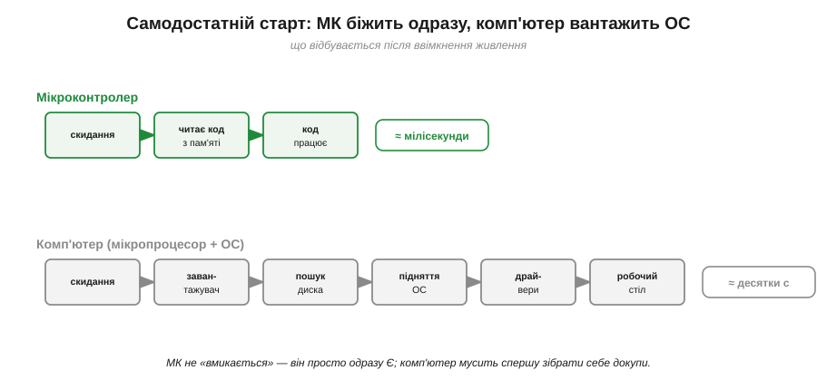
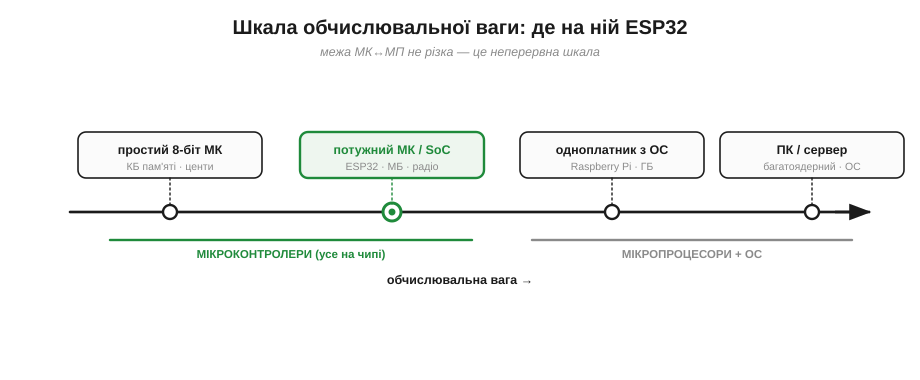

# Мікроконтролер: комп'ютер на одному чіпі (проти мікропроцесора)

Слово «комп'ютер» малює в уяві ноутбук чи телефон: екран, гігабайти пам'яті, операційна система, десятки застосунків. Тож коли кажуть, що в зарядці, навушниках чи термостаті «теж є комп'ютер», це звучить як перебільшення. А це чиста правда — і навіть більша, ніж здається: таких прихованих комп'ютерів у світі **більше, ніж людей**, по кілька десятків на кожного з нас. Просто вони іншого роду — **мікроконтролери**. Перш ніж розбирати ESP32 по нутрощах, треба чітко зрозуміти, **що** це за клас машин і чим він відрізняється і від «великого» комп'ютера, і від свого близького родича — **мікропроцесора**. Від цього розрізнення залежить, що ви взагалі можете побудувати й як.

### Що таке мікроконтролер: цілий комп'ютер на одному кристалі

**Мікроконтролер** (*microcontroller*, MCU або µC) — це **повноцінний комп'ютер, упакований в один чіп**. «Повноцінний» означає, що на одному кремнієвому кристалі зібрано все, що робить машину машиною:

- **ядро** (*core*, CPU) — [процесор](book:programming/what-is-processor): регістри, АЛП, лічильник команд, що крутить цикл «вибірка → декодування → виконання»;
- **програмна пам'ять** — там лежить ваш код (зазвичай це Flash; [деталі типів пам'яті](book:programming/mcu-blocks));
- **пам'ять даних** — там живуть змінні під час роботи (зазвичай SRAM);
- **периферія** (*peripherals*) — вбудовані вузли для зв'язку зі світом: цифрові ніжки, таймери, перетворювачі, інтерфейси зв'язку;
- **генератор такту** й схеми **живлення/скидання**, щоб усе це билося в єдиному ритмі.


*Рис. Мікроконтролер у функційному вигляді: на одному кристалі — ядро, програмна пам'ять, пам'ять даних, периферія й такт, з'єднані внутрішньою шиною. Назовні стирчать **ніжки** (*pins*), якими чіп торкається світу: читає кнопку й давач, крутить мотор, світить діодом, говорить по шині з іншими чіпами. Усе потрібне для самостійної роботи — **всередині**.*

Ключове слово — **«усе»**. Мікроконтролеру не потрібні сусідні чипи, щоб ожити: підведіть живлення й такт — і він одразу починає виконувати зашиту в нього програму. Це самодостатній комп'ютер, тільки маленький, дешевий і «заточений» не показувати кіно, а **керувати** залізом — звідси й «контролер» у назві (*to control* — керувати).

### Мікропроцесор проти мікроконтролера: ядро окремо чи все разом

Тепер — головне розрізнення, заради якого й написана ця тема. Поряд із мікроконтролером живе його близький родич — **мікропроцесор** (*microprocessor*, MPU). Обидва походять від однієї епохи на початку 1970-х, обидва — кремнієві крихти, та влаштовані принципово по-різному.

**Мікропроцесор — це лише ядро.** На його чипі є тільки CPU (АЛП, регістри, керування) — і все. Пам'яті для програми, пам'яті для даних, периферії в ньому **немає**: їх треба додати **окремими** чипами поруч на платі й з'єднати зовнішніми шинами. Сам по собі мікропроцесор — не комп'ютер, а лише його «мозок без тіла»; комп'ютер виникає аж тоді, коли довкола нього розпаяно пам'ять, контролери й живлення. Саме так влаштований ваш ноутбук: потужний процесор у центрі, а навколо — окремі мікросхеми оперативної пам'яті, накопичувач, набір системної логіки.

**Мікроконтролер — це весь комп'ютер.** Ядро, обидві пам'яті, периферія, такт — на **одному** кристалі. Нічого довкола паяти не треба; чіп самодостатній.


*Рис. Та сама різниця, але вже очима того, хто паяє плату. **Зліва (мікропроцесор):** ядро марне саме по собі — потрібні окремі чипи ПЗП, ОЗП, периферії та такту, з'єднані доріжками-шинами; це повноцінна материнська плата. **Справа (мікроконтролер):** один чіп робить усе те саме — лишилося підвести живлення. Менше деталей, менше з'єднань, менше місця, нижча ціна, вища надійність.*

Підкреслимо: різниця **не в потужності**, а в **повноті й призначенні**. Мікропроцесор віддає весь кремній під обчислювальну силу, а пам'ять і периферію виносить назовні — щоб їх можна було нарощувати (гігабайти RAM, терабайти диска) під універсальні задачі. Мікроконтролер жертвує цією гнучкістю заради **інтеграції**: усе вбудоване, скромне за обсягом, зате одразу готове й дешеве. Перший — двигун, до якого ще треба зібрати автомобіль; другий — уже готовий самокат.

Зведімо відмінності в таблицю — її варто перечитати, коли обиратимете «серце» для свого пристрою:

| Ознака | Мікропроцесор (MPU) | Мікроконтролер (MCU) |
|---|---|---|
| Що на чипі | лише ядро (CPU) | ядро + пам'ять + периферія + такт |
| Пам'ять | зовнішня, окремими чипами | вбудована, на тому ж кристалі |
| Щоб запрацювати | потрібна плата з пам'яттю й логікою | досить живлення й такту |
| Обсяг пам'яті | гігабайти (нарощується) | кілобайти–мегабайти (фіксовано) |
| Операційна система | майже завжди (Windows, Linux…) | часто без неї («голе залізо») |
| Типове застосування | універсальні машини: ПК, сервер, смартфон | вбудоване керування: давачі, прилади, дрони |
| Ціна, споживання | вищі | копійчані, ощадні |

> 🔧 **Навіщо це.** Це перше інженерне рішення в будь-якому проєкті: брати мікроконтролер чи повноцінний комп'ютер (мікропроцесор + ОС, як одноплатний Raspberry Pi). Треба надійно й дешево читати давачі й крутити мотори, працювати роками без нагляду, стартувати миттєво — **мікроконтролер**. Треба екран, файли, мережу, важкі обчислення, камеру з розпізнаванням — **одноплатник** на мікропроцесорі з ОС. Помилитися дорого: на МК не запустиш браузер, а одноплатник довго вантажиться, більше їсть і боїться раптового вимкнення живлення.

### Чому «контролер»: машина, що керує, а не рахує

Чому в назві саме «контролер», а не «процесор» чи «комп'ютер»? Бо призначення цієї крихти — не рахувати для людини, а **керувати залізом** (*to control* — керувати, тримати під орудою). Великий комп'ютер обслуговує користувача: показує, рахує, зберігає, чекає на наші команди. Мікроконтролер обслуговує **пристрій**: він вмонтований у річ і безперервно стежить за її давачами та смикає її виконавчі органи — реле, мотор, клапан, індикатор. Його співрозмовник — не людина з клавіатурою, а **фізичний світ** із його кнопками, температурами й обертами.

Із цього випливає риса, якої «настільний» комп'ютер не має: мікроконтролер мусить реагувати **вчасно**. Якщо давач видав короткий імпульс, відповісти треба за мікросекунди, інакше мить утрачено; якщо керма мотора потребує поправки — то саме зараз, а не «коли звільниться процесор». Така робота **в реальному часі** (*real-time*), прив'язана до подій світу, а не до примх користувача, — і є суттю керування. Почасти тому в мікроконтролері так багато вбудованої периферії: вона бере на себе точну, своєчасну взаємодію із залізом, поки ядро зайняте логікою. Цю роботу витягують спеціальні вузли — [переривання](book:programming/interrupts), що смикають ядро на термінову подію, і [таймери](book:programming/timer-counter), що відлічують час незалежно від коду; тут важлива сама думка: МК **живе вплетеним у фізичний світ і мусить устигати за ним**.

Звідси й образ, який варто тримати в голові на весь модуль: мікропроцесор — це **мозок-обчислювач**, а мікроконтролер — **мозок-керманич**, зрощений із тілом машини. Перший думає; другий думає **й діє руками**, не випускаючи світу з-під контролю.

### Чому «все на одному чіпі» — це інша філософія

Інтеграція — не просто зручність пакування. Вона тягне за собою низку наслідків, що визначають, **як** ми програмуємо мікроконтролер і чого від нього чекаємо.

**Він самодостатній і стартує миттєво.** Програма вже лежить у вбудованій пам'яті чипа. Тільки-но з'явилося живлення — ядро бере першу команду й починає виконувати, без жодного «завантаження». Немає диска, з якого треба підняти операційну систему, немає зовнішньої пам'яті, яку треба ініціалізувати по шині. Це робить МК ідеальним там, де пристрій має ожити за частку секунди й працювати без оператора.


*Рис. Що відбувається після ввімкнення живлення. **Мікроконтролер:** скидання → ядро читає програму з вбудованої пам'яті → код працює (мілісекунди). **Комп'ютер на мікропроцесорі:** скидання → завантажувач → пошук диска → підняття операційної системи → драйвери → робочий стіл (десятки секунд). МК не «вмикається», він просто **одразу є**.*

**Він дешевий і ощадний.** Один чіп замість плати чипів — це менше кремнію, менше корпусів, менше з'єднань, менша плата. Тому мікроконтролер коштує копійки й споживає мізерну потужність (часто — мілівати, а в режимі сну й мікровати). Саме це дало змогу ставити комп'ютер **усюди**, де раніше було б нерозумно: у вимикач, у лампочку, у зубну щітку.

**Він надійний.** Кожне зовнішнє з'єднання між чипами — потенційна точка відмови (холодна пайка, завада, паразитна ємність). Коли все на одному кристалі, цих стиків майже немає, а зв'язки всередині — короткі й швидкі. Менше деталей — менше що ламатися.

**Але ресурси скромні й фіксовані.** Плата за інтеграцію — обмеженість. Пам'ять мікроконтролера вимірюють у **кілобайтах і мегабайтах**, а не гігабайтах, і наростити її, доклавши планку, **не можна** — скільки вбудовано, стільки й є. Обчислювальна сила теж скромніша. Тому програмування МК — це завжди ще й **облік ресурсів**: чи влізе код, чи вистачить пам'яті на змінні, чи встигне ядро.

### Наскільки він менший за «справжній» комп'ютер

Щоб відчути масштаб, порівняймо типовий мікроконтролер із настільним комп'ютером (нащадком лінії мікропроцесора) по головних числах. Різниця — у **тисячі й мільйони разів**, і це не вада, а свідомий вибір на користь дешевизни, ощадності й простоти.


*Рис. Орієнтовні порядки величин. Тактова частота: одиниці ГГц проти десятків–сотень МГц (× у тисячі). Пам'ять даних: гігабайти проти кілобайтів (× у мільйони). Сховище: терабайти проти мегабайтів. Споживання: десятки ват проти міліватів. Роль: «багато застосунків під операційною системою» проти «одна програма, що працює роками». Мікроконтролер не «слабкий комп'ютер» — він **інший** комп'ютер, заточений під іншу мету.*

Зверніть увагу на останній рядок — він найважливіший. Великий комп'ютер створений **жонглювати багатьма задачами** під орудою операційної системи: зараз браузер, за мить — музика, потім — гра. Мікроконтролер зазвичай робить **одну** справу, зате **завжди й передбачувано**: опитати давач, порахувати, видати сигнал — і так мільйони разів поспіль, роками, без перезавантажень. Тому йому й не потрібні ні гігабайти, ні операційна система: уся його «увага» віддана одній чітко окресленій роботі в реальному часі.

> 🔧 **Навіщо це.** Звідси випливає особливий стиль програмування мікроконтролера. На МК ви пишете програму, що **володіє всім чипом одноосібно** й крутиться у вічному циклі, а не «застосунок» серед інших під наглядом ОС. Немає кому за вас керувати пам'яттю чи рятувати від зависання — ви ближче до заліза, маєте більше влади й більше відповідальності. Це й приваблює: ви тримаєте в руках **весь** комп'ютер цілком.

### Порахуймо: чи влізе програма в мікроконтролер

Оскільки ресурси скромні й полічені, найперша інженерна звичка — **прикинути бюджет пам'яті** ще до того, як писати код. Зробімо це на простому прикладі: чи помістяться типова програма керування й її змінні в мікроконтролер середнього класу.

**Приклад (бюджет пам'яті).** Програма читає давач, фільтрує дані й керує мотором. Компілятор повідомив: код займає **180 КБ**, а змінні в роботі — **45 КБ**. Маємо чіп із **4 МБ** програмної пам'яті й **320 КБ** пам'яті даних. Чи влізе — і скільки лишиться про запас?

```
Програмна пам'ять (код):
  є           = 4 МБ = 4 × 1024 КБ = 4096 КБ
  треба       = 180 КБ
  зайнято     = 180 / 4096 ≈ 4.4 %
  лишається   = 4096 − 180 = 3916 КБ  (величезний запас)

Пам'ять даних (змінні):
  є           = 320 КБ
  треба       = 45 КБ
  зайнято     = 45 / 320 ≈ 14 %
  лишається   = 320 − 45 = 275 КБ
```

Програма влазить із великим запасом — навіть «середній» мікроконтролер для такої задачі просторий. Але зверніть увагу на самі числа: ми рахуємо в **кілобайтах**. На настільному комп'ютері 45 КБ змінних — пил, про який ніхто й не згадає; тут це **14 %** усієї пам'яті даних, і якби задача була складніша (буфер відео, велика таблиця), запас зник би вмить. Звідси правило: на МК **пам'ять рахують**, а не витрачають наосліп.


*Рис. Дві «посудини» пам'яті мікроконтролера й що в них наливають. Програмна пам'ять (4 МБ) майже порожня — код займає тонку смужку. Пам'ять даних (320 КБ) заповнена на ~14 %. Заповнити будь-яку «по вінця» не можна — лишають запас на стек і непередбачене. Саме цей облік у кілобайтах і відрізняє мислення вбудованого розробника.*

### Де в цьому всьому ESP32

Межа між мікроконтролером і мікропроцесором не різка, а радше **шкала**. На одному її кінці — крихітні 8-бітні МК за центи з кількома кілобайтами пам'яті; на іншому — потужні процесори ПК. І сучасні мікроконтролери дедалі ближче підповзають до «дорослого» кінця: кілька ядер, сотні мегагерц, мегабайти пам'яті, а часом і власна (хоч і компактна) операційна система реального часу.


*Рис. Неперервна шкала «обчислювальної ваги». Зліва направо: простий 8-біт МК → потужний МК / **система-на-чипі** (тут і ESP32) → одноплатний комп'ютер з ОС (мікропроцесор) → настільний ПК і сервер. ESP32 сидить у мікроконтролерній частині, але близько до межі: він потужний, багатоядерний і несе на чипі ще й **радіо** — тому його часто звуть не просто МК, а **системою-на-чипі** (*system-on-chip*, SoC).*

**ESP32 — це мікроконтролер**, нащадок інтегрованої лінії: цілий комп'ютер на чипі. Але мікроконтролер **незвично потужний** як на свій клас, та ще й із вбудованим радіо (Wi-Fi і Bluetooth) — стільки всього на одному кристалі, що його справедливо називають **системою-на-чипі**. Саме ця рідкісна комбінація — повнота мікроконтролера, чимала сила й зв'язок зі світом по радіо — і зробила його таким популярним. Чим конкретно він наповнений усередині — ядра, пам'ять, периферія, радіо — показує [архітектура ESP32](book:programming/esp32-architecture); а в основі будь-якого такого чипа лежать [ті самі будівельні блоки](book:programming/mcu-blocks).

---
