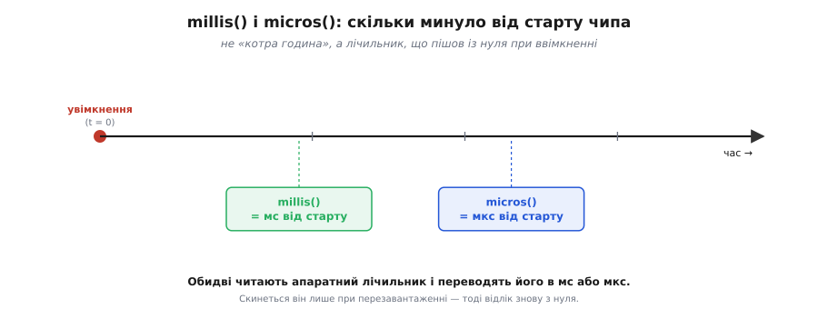
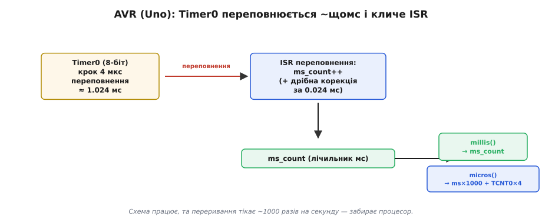
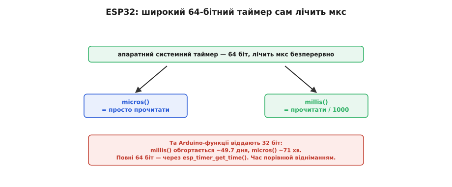
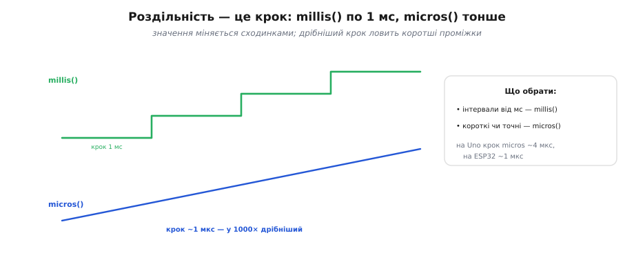
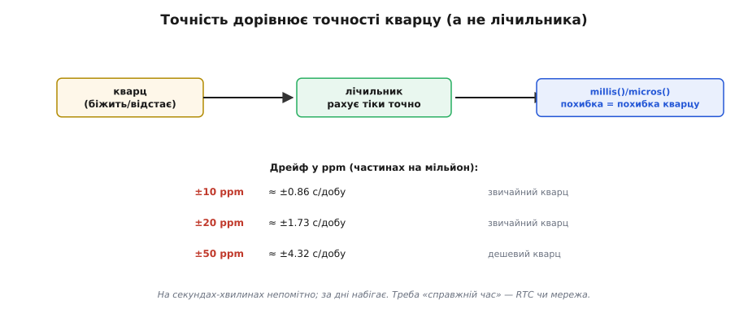
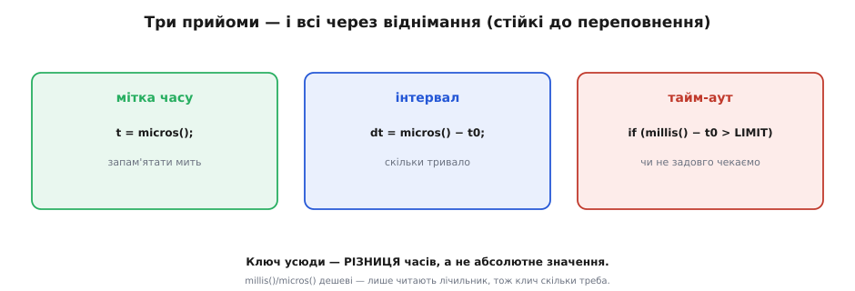

# Точний час: мілі- й мікросекунди

Функції `millis()` і `micros()` часто вживають як готову даність: викликав — дістав час. Та варто зазирнути під капот, спираючись на влаштування [таймера-лічильника](book:programming/timer-counter) всередині мікроконтролера. Виявиться, що жодної магії там нема — це проста обгортка над апаратним лічильником, який цокає від кварцу. Розберемо, що саме вони повертають, як влаштовані всередині (і чому по-різному в Arduino Uno та ESP32), яка в них роздільність і точність і як ними правильно користуватися.

### Що вони повертають: час від старту

Найперше — чітко зрозуміти, **що** це за час. `millis()` повертає, скільки **мілісекунд** минуло від моменту, коли чип увімкнувся (чи перезавантажився), а `micros()` — скільки **мікросекунд**. Це **не** «котра година» й не дата: мікроконтролер сам собою не знає календарного часу. Це лічильник, що пішов із нуля в мить старту й невпинно росте.


*Відлік починається з нуля в мить увімкнення. `millis()` віддає мілісекунди від старту, `micros()` — мікросекунди. Це не «котра година», а лічильник часу, що минув; скинеться він лише при перезавантаженні. Обидві функції просто читають апаратний лічильник і переводять його в потрібні одиниці.*

Звідси випливає важлива річ: щоб дізнатися **інтервал** між двома моментами, треба зробити два виміри й **відняти** їх. Саме так ці функції й вживають — не як абсолютний час, а як точки відліку для різниць. А **як** саме лічильник перетворюється на мілісекунди — залежить від чипа, і тут Arduino Uno та ESP32 ідуть різними шляхами.

Чому мікроконтролер не знає «справжнього» часу? Бо йому нема звідки його взяти: при ввімкненні в чипі немає ані календаря, ані пам'яті про те, котра зараз година, — лічильник просто стартує з нуля. Щоб дізнатися реальну дату й час, пристрою треба їх **повідомити** ззовні: узяти з мережі (інтернет-час), з окремого годинника реального часу з батарейкою або від користувача. Сам же по собі `millis()` — це **час роботи** (англ. *uptime*, «час підняття»), і для вимірювання проміжків більшого й не треба.

### Як це всередині AVR: переривання щомілісекунди

На класичному AVR (Arduino Uno) `millis()` побудовано хитро, бо таймери там вузькі (8-бітні). Працює це так: маленький таймер (Timer0) налаштовано переповнюватися приблизно **раз на мілісекунду**, і кожне його переповнення піднімає **переривання**. В обробнику цього переривання просто збільшується глобальний лічильник мілісекунд. А `millis()` лише повертає його поточне значення.


*На Arduino Uno Timer0 переповнюється приблизно кожні 1.024 мс і викликає переривання, обробник якого робить `ms_count++`. `millis()` повертає цей лічильник, а `micros()` складає `ms_count×1000` із поточним числом у Timer0 (×4, бо крок Timer0 там — 4 мкс). Це класична, але «галаслива» схема: переривання тікає весь час.*

Чому саме 1.024 мс, а не рівно мілісекунда? Бо при тактовій 16 МГц Timer0 із передільником 64 цокає кожні 4 мкс і переповнюється через 256 кроків — це 64 × 256 / 16 000 000 = 1024 мкс. Виходить трішки більше за мілісекунду, тож лічильник трохи відстає, і обробник доводиться навчати періодично «доганяти» цю дрібку — додавати зайву мілісекунду, коли накопичена похибка переросте поріг. Крок `micros()` на Uno виходить ~4 мкс — рівно крок Timer0.

Ця схема працює, та має ваду: переривання спрацьовує **тисячу разів на секунду**, віднімаючи дрібку процесора на кожному спрацюванні. Для 8-бітного чипа це прийнятний компроміс, але ESP32 робить розумніше.

У цієї схеми є ще й побічний наслідок, відомий кожному ветеранові Arduino. На Uno той самий Timer0 обслуговує не лише `millis()`/`micros()`/`delay()`, а ще й `analogWrite()` на кількох ніжках. Тому варто комусь «перенастроїти» Timer0 під свої потреби — і `millis()` починає брехати, а `delay()` ламається. Це класична пастка спільного ресурсу: один маленький таймер тягне на собі весь облік часу, тож чіпати його напряму небезпечно. ESP32 із його окремим системним таймером від цього клопоту вільний.

### Як це всередині ESP32: широкий лічильник у мікросекундах

ESP32 не мусить городити переривання щомілісекунди, бо має **широкий** (64-бітний) системний таймер, що сам безперервно лічить **мікросекунди** від старту. Тоді все стає тривіальним: `micros()` — це просто **прочитати** цей лічильник, а `millis()` — прочитати й **поділити на 1000**. Жодного обробника, жодної корекції: апаратура цокає сама, а функція лише знімає показання.


*На ESP32 системний таймер 64-бітний і лічить мікросекунди сам. `micros()` просто читає його, `millis()` ділить на 1000. Переваги: крок `micros()` ~1 мкс і лічильник майже не переповнюється. Увага: Arduino-функції повертають 32-бітне число, тож `millis()` обгортається ~49.7 дня, а `micros()` ~71 хв — хоч сам лічильник усередині 64-бітний. Тому час порівнюй відніманням.*

Це й точніше (крок 1 мкс проти 4 мкс на Uno), і чистіше (ніщо не смикає процесор щомілісекунди). Та зверни увагу на тонкість: хоч апаратний лічильник усередині й 64-бітний, звичні Arduino-функції повертають **32-бітне** число, тож назовні `millis()` усе одно обгортається через ~49.7 дня, а `micros()` — аж через ~71 хвилину. Тому правило про [переповнення лічильника](book:programming/timer-overflow) лишається залізним: порівнюй час **відніманням**.

> 🔧 **Навіщо це.** На ESP32 `micros()` дає чесні мікросекунди й безпечний для частих викликів — це швидке читання лічильника. Та пам'ятай про його швидке (~71 хв) обгортання: якщо міряєш інтервал довший за годину, бери `millis()`, а не `micros()`. І ніколи не покладайся на те, що значення «весь час росте»: і `millis()`, і `micros()` рано чи пізно перескочать через нуль, тож код має це переживати (через віднімання).

Під капотом цей системний таймер доступний і прямо — через функцію `esp_timer_get_time()`, що повертає знакове 64-бітне число (`int64_t`) мікросекунд від старту; саме його `micros()` і обрізає до 32 біт. Якщо потрібен по-справжньому довгий відлік без обгортання, беруть її, а не `micros()`: 64 знакових біти в мікросекундах переповняться хіба за сотні тисяч років. І ще: прочитати 64-бітне значення на 32-бітному ядрі — це насправді **два** читання, тож робити це треба обережно, [атомарно](book:programming/atomicity-races); на щастя, готові функції вже подбали про це за тебе.

### Роздільність: який найдрібніший крок

Роздільність — це найменша зміна часу, яку функція здатна розрізнити, тобто її **крок**. У `millis()` крок завжди 1 мілісекунда: між двома сусідніми значеннями — рівно мілісекунда, дрібніше вона не бачить. У `micros()` крок набагато тонший — близько мікросекунди на ESP32 (і ~4 мкс на Uno).


*Значення міняється сходинками: `millis()` — грубими, по 1 мс; `micros()` — дрібними, ~1 мкс (на ESP32). Для інтервалів від мілісекунд бери `millis()`, для коротких чи точних — `micros()`. На Uno крок `micros()` ~4 мкс, на ESP32 ~1 мкс.*

Звідси простий вибір. Якщо відмірюєш інтервали в мілісекундах і більше (блимнути світлодіодом раз на 500 мс, опитати давач раз на секунду) — `millis()` ідеальний і простіший. Якщо ж важать мікросекунди (зміряти короткий імпульс, точно витримати десятки мікросекунд) — потрібен `micros()`. Брати `micros()` «про всяк випадок» там, де досить `millis()`, не варто: він обгортається в тисячу разів швидше.

Тут варто чітко розвести два поняття, які раз у раз плутають: **роздільність** і **точність**. Роздільність — наскільки **дрібно** функція показує час (її крок); точність — наскільки її показання **близькі до правди**. Це різні речі: секундомір може показувати соті частки секунди (тонка роздільність) і водночас відставати на п'ять хвилин (погана точність). `micros()` має чудову роздільність (1 мкс), але його точність обмежена кварцом — і дрібний крок аж ніяк не означає, що та мікросекунда «справжня» до мікросекунди.

### Точність: вона така ж, як у кварцу

Точність `millis()`/`micros()` дорівнює точності **кварцу**: сам лічильник рахує тіки бездоганно рівно, та якщо кварц трохи «біжить» чи «відстає», то й увесь час поїде разом із ним. Похибки додає не лічба, а джерело такту.


*Лічильник не помиляється — уся похибка йде від кварцу, і її міряють у ppm (частинах на мільйон). ±10 ppm — це близько ±0.86 секунди на добу, ±50 ppm — ±4.3 с/добу. На коротких інтервалах це непомітно, та за дні набігає дрейф. Якщо треба «справжній час», беруть RTC чи звіряються з мережею.*

Похибку кварцу позначають у **ppm** (англ. *parts per million*, частин на мільйон). Звичайний кварц має десятки ppm, і це означає крихітну, але реальну розбіжність: ±20 ppm — це близько ±1.7 секунди на добу. На коротких проміжках (секунди, хвилини) така похибка зникомо мала, та за тижні безперервної роботи годинник на `millis()` помітно «попливе». Тому для **проміжків** `millis()` чудовий, а для **календарного часу на роки** беруть окремий годинник реального часу ([RTC](book:programming/rtc), англ. *real-time clock*) або звіряються з мережею. До того ж кварц «пливе» від температури й старіння — тож точність ще й залежить від умов.

Та не варто й перебільшувати проблему. Для **відносних** вимірів — «скільки минуло між двома подіями», «витримай 50 мс» — кварцу більш ніж досить: на коротких інтервалах дрейф у ppm дає похибку, яку годі помітити. Морочитися з точністю варто лише там, де час накопичується **довго** й має збігатися з реальним. Тоді беруть або точніший кварц із температурною компенсацією (TCXO, англ. *temperature-compensated crystal oscillator*, одиниці ppm), або зовнішній RTC-модуль, або періодично звіряють годинник із мережею. Для звичайної ж прошивки `millis()` від штатного кварцу — цілком надійна основа.

**Дрейф кварцу ±20 ppm за добу.** Формула дрейфу: відносна похибка × тривалість.

```
ppm = частин на мільйон = 20 / 1 000 000
доба = 86400 с

дрейф = 86400 × 20 / 1 000 000 = 1.73 с/добу
за місяць ≈ 1.73 × 30      ≈ 52 с

→ для таймерів проєкту — байдуже;
  для «годинника на стіні» — помітно.
```

### Як ними правильно вживати

`millis()`/`micros()` застосовують у трьох типових прийомах, і всі вони — про **різницю** часів, а не про абсолютне значення.


*Мітка часу: `t = micros()` — запам'ятати мить. Інтервал: `dt = micros() − t0` — скільки тривало. Тайм-аут: `if (millis() − t0 > LIMIT)` — чи не задовго чекаємо. Усі три безпечні до переповнення, бо працюють із різницею часів. І `millis()`/`micros()` дешеві — викликай скільки треба.*

Перший прийом — **мітка часу**: запам'ятати момент події. Другий — **інтервал**: відняти дві мітки й дізнатися, скільки минуло. Третій — **тайм-аут**: перевірити, чи не чекаємо ми чогось задовго. Ось усі три на реальному C:

```c
unsigned long t0 = millis();        // 1) мітка: запам'ятали мить

// ... минає якийсь час, програма займається своїм ...

unsigned long dt = millis() - t0;   // 2) інтервал: скільки минуло, мс

if (millis() - t0 > 500UL) {        // 3) тайм-аут: чекаємо вже задовго?
    // 500 мс вийшло — діємо
}
```

У всіх трьох ключ — **віднімання** беззнакових значень, що робить код стійким до переповнення: коли `millis()` перескочить через нуль, різниця `millis() - t0` усе одно дасть правильний проміжок, бо віднімання за модулем 2³² «само компенсує» обгортання. І не бійся викликати ці функції часто: вони дешеві, лише читають лічильник, тож у циклі їх можна смикати скільки завгодно.

> 🔧 **Навіщо це.** Ці три прийоми — мітка, інтервал, тайм-аут — покривають чи не всю повсякденну роботу з часом у прошивці, і саме на них будується [неблокуючий код](book:programming/nonblocking-time). Запам'ятай їх як готові заготовки. Чому вони такі важливі? Бо вони — альтернатива простому, але підступному `delay()`. Спокусливо «зачекати 500 мс» одним рядком, та поки `delay()` чекає, програма **стоїть** і нічого більше не робить. Прийоми «мітка + інтервал» дозволяють відмірювати час, **не зупиняючи** решту коду: перевірив `millis() - t0`, ще не час — пішов далі займатися іншим. Цей підхід має навіть усталену назву — «блимання без delay» (англ. *blink without delay*).

Дві пастки, на яких раз у раз спотикаються, варто розписати окремо — це найчастіша причина, чому «правильний» на вигляд код із часом раптом збивається. Їх та кілька готових шаблонів зібрано у [прикладі з кодом](book:programming/millis-micros/proj-millis-patterns.md). Коротко ж: по-перше, запам'ятовуй мітку **узгоджено** — або всюди `millis()`, або всюди `micros()`, не змішуючи одиниці в одному обчисленні. По-друге, не зберігай час у `int`: для `millis()`/`micros()` потрібен **беззнаковий** 32-бітний тип (`unsigned long`), інакше і діапазон удвічі менший, і саме та магія «віднімання через переповнення» перестане працювати.

Отже, `millis()` і `micros()` — це проста обгортка над апаратним лічильником: вони повертають час **від старту** чипа в мілі- чи мікросекундах. На AVR під ними тікає переривання щомілісекунди, на ESP32 — широкий 64-бітний лічильник у мікросекундах (тому й точніше). Їхня **роздільність** — це крок (1 мс чи ~1 мкс), а **точність** дорівнює точності кварцу (ppm, дрейф). Вживають їх трьома прийомами — мітка, інтервал, тайм-аут, — і завжди через **віднімання** беззнакових значень, що робить показання лічильника надійним інструментом часу.
