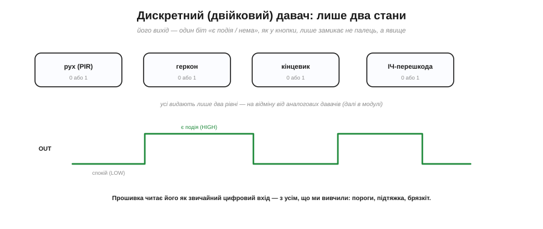
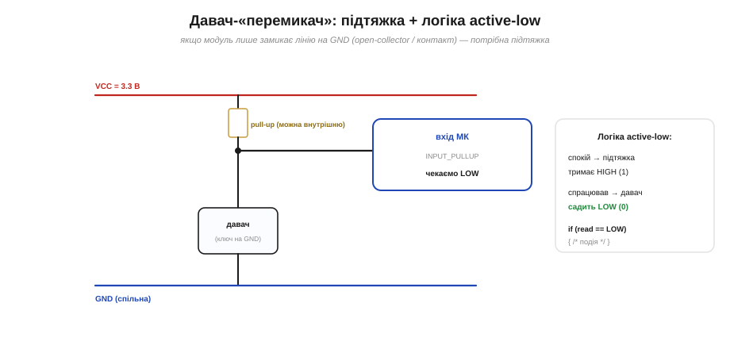
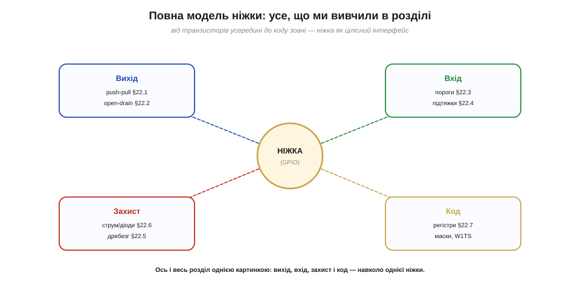

# Абстрактна модель «модуля»: підключення дискретного давача

Ніжку можна розглядати зблизька — транзистори всередині, пороги входу, підтяжки, брязкіт, межі струму, регістри. Та коли інженер підмикає щось до плати, він мислить **на практиці** рідко транзисторами — здебільшого він думає про **«модуль»**: готову цеглинку (давач, реле, дисплей, радіо) з кількома виводами й **відомою поведінкою**. Ця тема — про таку абстракцію: як бачити будь-яку периферію як коробку з пінами, які чотири питання поставити собі перед з'єднанням, і як це працює на прикладі найпростішого — **дискретного** (двійкового) давача.

### Від транзисторів — до «модуля»

Уявімо давач руху, геркон чи мікросхему годинника. Усередині в них може бути що завгодно — кілька транзисторів, цілий процесор, складна аналогова схема. Та коли ви їх **під'єднуєте**, вам це майже не цікаво: вам важать лише **виводи** й **що на них відбувається**. Живлення (VCC і GND) — щоб модуль ожив; сигнальні лінії — щоб обмінюватися даними. Решта схована всередині, за «інтерфейсом».


*Рис. Будь-яку периферію зручно бачити «чорною скринькою»: кілька виводів (живлення VCC/GND і сигнал OUT) та документована поведінка. Що там усередині — транзистори чи цілий чіп — для підключення байдуже; важать піни та їхні рівні.*

Це не спрощення «для початківців», а **фундаментальний інженерний прийом** — ховати складність за інтерфейсом. Той самий принцип діє на кількох рівнях: функція в коді ховає свої рядки за іменем і аргументами; [регістр](book:programming/memory-mapped-io) ховає залізо за адресою й бітами; обгортка [`digitalWrite`](book:programming/gpio-registers) ховає регістр за зрозумілим викликом. У програмуванні це формалізував Девід Парнас ще 1972 року під назвою «приховування інформації» (information hiding), і відтоді воно — наріжний камінь будь-якої складної системи. «Модуль» на платі — те саме приховування, лише в залізі: ви довіряєте його документованій поведінці, не заглядаючи всередину.

Саме ця абстракція й зробила сучасну аматорську електроніку доступною. Замість того щоб із нуля проєктувати схему давача, ви купуєте готову **модуль-плату** (breakout): навколо чипа на ній уже зібрано все потрібне — підтяжки, стабілізатор, захист, — і виведено кілька зручних контактів. Ви оперуєте модулем як цеглинкою, а не як сотнею компонентів. Платою за зручність є та сама, що завжди: ви довіряєте чужому інтерфейсу, тож мусите **прочитати його опис** — яка напруга, який тип виходу, яка логіка. Абстракція не звільняє від розуміння, лише переносить його з рівня транзисторів на рівень пінів.

### Чотири питання для будь-якого з'єднання

Щоб підмкнути модуль правильно з першого разу, досить чесно відповісти собі на **чотири питання** — і кожне з них спирається на якусь тему цього розділу.


*Рис. Контрольний список для будь-якого модуля. **1) Живлення:** яка напруга — 3.3 чи 5 В ([сумісність рівнів](book:electronics/logic-thresholds))? **2) Напрям:** модуль сам жене лінію чи лишає її «відпущеною» (тоді потрібна [підтяжка](book:electronics/floating-pullups))? **3) Логіка:** активний стан — одиниця чи нуль (active-high/low)? **4) Захист:** чи в нормі [струми й пороги](book:electronics/pin-drive-limits)? І наскрізна умова — **спільна земля**.*

Розгорнімо їх. **Живлення** — найперше: 3.3-вольтовий модуль і 5-вольтовий не завжди дружать напряму, бо ESP32 не 5-вольтотерпимий ([логічні пороги](book:electronics/logic-thresholds), [межі ніжки](book:electronics/pin-drive-limits)). **Напрям** сигналу вирішує, чи треба підтяжка: якщо модуль має повноцінний двотактний вихід — він жене лінію сам; якщо ж це просто контакт або [open-drain](book:electronics/open-drain) — лінію хтось мусить [підтягувати](book:electronics/floating-pullups). **Логіка** — це чи означає «подія» високий рівень, чи низький; від цього залежить, що писати в коді (`== HIGH` чи `== LOW`). **Захист** — чи не перевищено струм, чи не треба послідовний резистор на вході. І окремо, поза цими чотирма, — **спільна земля**: «мінуси» модуля й мікроконтролера мусять бути з'єднані, інакше вони просто не «бачитимуть» рівнів одне одного.

Кожне питання — це конкретний клас аварій, якщо на нього не відповісти. Помилка в **живленні** — найдорожча: 5 В на 3.3-вольтовій ніжці тихо вбивають вхід, і плата починає поводитися дивно вже назавжди. Забута **підтяжка** дає [плаваючий вхід](book:electronics/floating-pullups) — давач «спрацьовує сам по собі». Переплутана **логіка** означає, що код реагує навпаки: двері зачинено, а програма думає, що відчинено. А відсутня **спільна земля** — найпідступніша: усе ніби з'єднано правильно, дроти на місці, та без спільного нуля рівні «висять» відносно різних опор, і сигнал то проходить, то ні. Чотири питання — це, по суті, перелік цих чотирьох пасток.

> 🔧 **Навіщо це.** Зробіть ці чотири питання звичкою — проговорюйте їх щоразу, перш ніж з'єднати дроти. Дев'ять із десяти «чомусь не працює» — це пропущена відповідь: подали 5 В на 3.3-вольтову ніжку, забули підтяжку, переплутали active-high з active-low або не з'єднали землі. Хвилина на чотири питання економить години на пошук «привида».

### Дискретний давач: вихід — один біт

Найпростіший модуль для першого досвіду — **дискретний** (двійковий) давач. Він видає лише **два** стани: «є подія» або «нема». Давач руху (PIR) каже «хтось ворушиться / тихо»; геркон — «магніт поруч / нема»; кінцевик — «важіль натиснуто / вільно»; ІЧ-давач перешкоди — «перешкода є / нема». По суті це **кнопка**, яку «натискає» не палець, а явище.


*Рис. Дискретний давач видає один біт: рух, геркон, кінцевик, ІЧ-перешкода — усі лише «0 або 1». Його вихід у часі — це проста послідовність HIGH/LOW. Прошивка читає його як звичайний цифровий вхід, з усім, що до нього належить: пороги, підтяжка, брязкіт.*

Через цю простоту дискретний давач — ідеальний полігон, аби звести все докупи: він підмикається до звичайного цифрового **входу**, а отже, до нього застосовні і [пороги](book:electronics/logic-thresholds), і [підтяжки](book:electronics/floating-pullups), і навіть [брязкіт](book:electronics/contact-debounce) — механічні давачі (геркон, кінцевик) брязкочуть так само, як кнопка. Варто чітко відрізняти **дискретний** давач від **аналогового**: аналоговий видає не «так/ні», а **плавну** величину (температуру, освітленість, відстань) у вигляді напруги, і читають його зовсім інакше. Дискретний же — це межа, поріг: спрацював чи ні. Корисно знати й термінологію контактів: **нормально розімкнений** (NO) у спокої розірваний і замикається при події, а **нормально замкнений** (NC) — навпаки, у спокої замкнений і розмикається. Від типу контакту залежить, який рівень буде «спокоєм», тож його теж дивляться в описі давача.

А його під'єднання залежить лише від одного: **сам** він жене лінію чи ні. Звідси два типові випадки.

### Випадок А: давач-«перемикач» (потрібна підтяжка)

Багато дискретних давачів усередині — це просто **ключ**: контакт, що замикає сигнальну лінію на GND, коли спрацьовує (геркон, кінцевик, давачі з «відкритим колектором»). Сам він нічого не жене вгору — отже, лінію треба **підтягнути**. Ставимо pull-up (зовнішній або внутрішній `INPUT_PULLUP`): у спокої лінія HIGH, а спрацювавши, давач садить її в LOW. Класична логіка **active-low**.


*Рис. Давач-«ключ» на GND під'єднують через підтяжку: у спокої вона тримає HIGH (1), а коли давач замикається — лінія падає в LOW (0). У коді вмикаємо `INPUT_PULLUP` і чекаємо на LOW. Це точнісінько [кнопка з підтяжкою](book:electronics/floating-pullups), лише замикає її явище, а не палець.*

Пройдімо чотири питання для геркона. **Живлення:** геркон пасивний — окремого живлення не треба, лише дві ніжки. **Напрям:** це просто контакт, сам нічого не жене → потрібна підтяжка. **Логіка:** контакт на GND → спокій HIGH, замкнено LOW → active-low. **Захист:** це вхід, струму майже нема, послідовний резистор не обов'язковий. Усе сходиться — і код виходить тривіальний:

**Підмикаємо геркон (замикається біля магніту).**

```
Схема:   GPIO ──┬── геркон ── GND
                │
         (внутрішня підтяжка: INPUT_PULLUP)

Код:
   pinMode(REED, INPUT_PULLUP);
   bool magnet = (digitalRead(REED) == LOW);  // LOW = магніт поруч
```

Окреме слово про давачі з **відкритим колектором** (open-collector) чи відкритим стоком — це той самий [open-drain](book:electronics/open-drain), лише в ролі давача: усередині транзистор, що тільки **притягує** лінію до GND, а високий рівень дає підтяжка. Зручність та сама: кілька таких давачів можна повісити на **одну** лінію (wired-AND), і вона впаде в LOW, щойно спрацює **хоч який** із них. Тому open-collector-виходи й люблять у давачах: вони прості, дешеві й легко об'єднуються в спільну лінію «тривоги».

### Випадок Б: давач із власним виходом (двотактний)

Інші давачі — «розумніші»: усередині в них є електроніка з повноцінним **двотактним виходом**, що сам жене лінію то в HIGH, то в LOW (більшість PIR-модулів, цифрові давачі). Тут підтяжка **не потрібна** — модуль і так тримає рівень. Лишається перевірити лише **напругу**: якщо модуль на 3.3 В, його вихід під'єднують до входу ESP32 **прямо**; якщо ж модуль на 5 В — діють [логічні пороги](book:electronics/logic-thresholds) і [межі ніжки](book:electronics/pin-drive-limits): 5 В прямо на ніжку **не можна**, потрібен дільник або перетворювач рівнів.


*Рис. Давач, що сам жене вихід, під'єднують без підтяжки. Ліворуч: однакова напруга (3.3 В) — просто з'єднати (і спільна земля). Праворуч: давач 5 В — лише через дільник чи перетворювач рівнів, бо 5 В прямо спалять ніжку (див. [логічні пороги](book:electronics/logic-thresholds)).*

Помітьте, як ті самі чотири питання миттєво дають відповідь і тут: живлення (3.3 чи 5?), напрям (жене сам → без підтяжки), логіка (дивимося в опис давача), захист (зсув рівнів, якщо 5 В). Один і той самий чек-лист працює для **будь-якого** модуля — у цьому й сила абстракції.

Одне «але» варто підкреслити: **тип виходу не вгадують, а читають** в описі модуля. Виробник прямо вказує, чи вихід двотактний, чи open-drain, яка робоча напруга й який активний рівень. Дешеві модулі іноді мають перемички або резистори підтяжки просто на платі — тоді треба зважати ще й на них. П'ять хвилин із даташитом рятують від годин здогадок: усі чотири питання мають відповіді саме там, у таблиці характеристик.

Для прикладу пройдімо чотири питання для типового PIR-модуля руху. **Живлення:** багато PIR-плат живляться від 3.3–5 В і вже мають на борту стабілізатор та вихід 3.3-вольтової логіки — звіряємо з описом. **Напрям:** вихід активний, модуль сам жене HIGH при русі → підтяжка **не** потрібна. **Логіка:** active-high — спокій LOW, рух дає HIGH. **Захист:** вихід 3.3 В → під'єднуємо прямо, без зсуву. Код виходить дзеркальний до геркона, лише чекаємо на HIGH: `if (digitalRead(PIR) == HIGH) { /* рух */ }`. Помітно, що єдине, що змінилося проти геркона, — це **відповіді** на ті самі питання, а не самі питання. У цьому й уся практична цінність чотирьох питань: вони однакові для будь-якого модуля.

### Повна модель ніжки

Зведімо все в одну картину. Ніжку, яку зручно мислити просто «виводом мікросхеми», варто бачити і як цілісний **інтерфейс** із чотирма гранями.


*Рис. Чотири грані ніжки однією картинкою: **вихід** ([push-pull](book:electronics/push-pull-output), [open-drain](book:electronics/open-drain)), **вхід** ([пороги](book:electronics/logic-thresholds), [підтяжки](book:electronics/floating-pullups)), **захист** ([струм і діоди](book:electronics/pin-drive-limits), [брязкіт](book:electronics/contact-debounce)) і **код** ([регістри й маски](book:programming/gpio-registers)). Опанувавши їх, ви володієте ніжкою повністю.*

Оце і є головна цінність такого погляду: ви бачите ніжку **на всіх рівнях абстракції одночасно** — як два транзистори, як вхід із порогами, як біт у регістрі та як вивід «модуля». Інженер вільно ковзає між цими рівнями: для швидкого скетчу думає «модуль і `digitalRead`», а коли треба до межі вичавити швидкість чи зрозуміти дивний баг — спускається до регістрів і транзисторів.

Від двох транзисторів, що тримають рівень, до вміння свідомо під'єднати реальний давач і прочитати його в коді — між цими точками лежать пороги, підтяжки, брязкіт, межі струму, регістри: усе, що відділяє «миготіння лампочкою за прикладом» від **розуміння**, чому воно працює і що робити, коли не працює. Ніжка GPIO — найпростіша периферія, та на ній тримається все інше: і кнопки, і давачі, і шини. Опанована на всіх рівнях — від транзистора до модуля, — вона стає надійним фундаментом.

А коли власних виводів МК уже не вистачає на всі кнопки й світлодіоди, на поміч приходить той самий принцип «модуля»: беруть [розширювач портів](book:electronics/gpio-expander) — чип, що віддає 8 чи 16 нових GPIO за дві лінії I²C, і знову ховає за інтерфейсом усе, що всередині.

> ⚙️ **Багато кнопок — мало ніжок.** Інший шлях зекономити виводи — **матриця**: 16 клавіш читаються вісьмома ніжками скануванням рядків. Як це працює, що таке «привид» і навіщо діоди — у вставці [Матриця кнопок 4×4](proj-key-matrix.md).

Реакцію мікроконтролера на ці сигнали можна зробити й по-справжньому миттєвою. Найпростіший спосіб читати ніжку — **опитування**: раз у раз питати «ну що, змінилося?». Та є кращий спосіб — дозволити самому залізу **смикнути** процесор тієї ж миті, коли сигнал змінився, відірвавши його від поточної роботи. Це [переривання](book:programming/interrupts), фундамент чуйних вбудованих систем.
