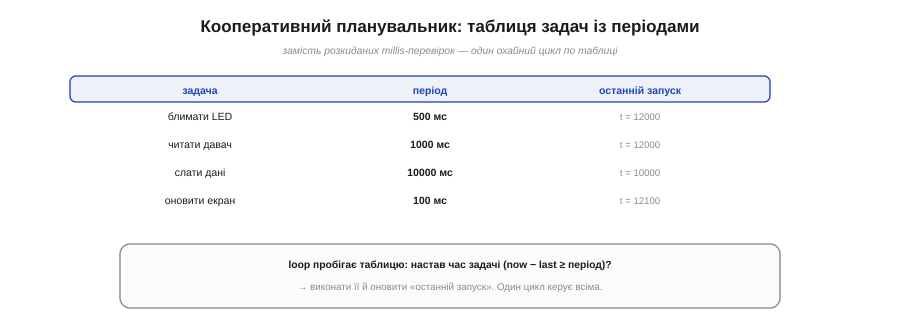
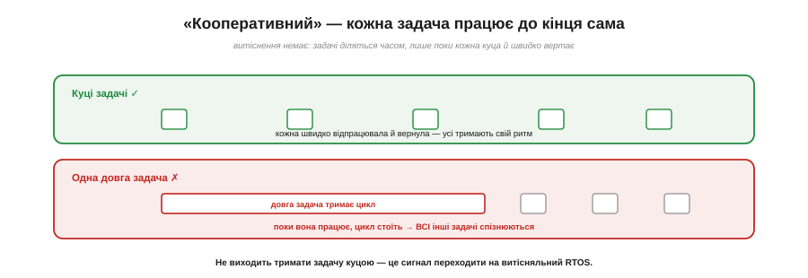

# ⚙️ Кооперативний планувальник на millis: список задач із періодами

> Алгоритмічна вставка про [неблокуючий час](book:programming/nonblocking-time). Один неблокуючий таймер «настав час? → зроби» — це вже відома основа. А коли періодичних задач — десяток? Зведімо їх у таблицю й керуймо одним циклом.

## Задача

[Неблокуючий патерн](book:programming/nonblocking-time) — «настав час? → зроби» — чудовий для **однієї** періодичної дії. Та реальний пристрій робить багато такого заразом: блимати раз на 500 мс, читати давач раз на секунду, слати дані раз на 10 секунд, оновлювати екран десять разів на секунду. Розкидати по `loop()` десяток окремих `if (now − last_i >= period_i)` — швидко стає мішаниною змінних, у якій легко помилитися. Як **організувати** багато періодичних задач охайно?

## Ідея

Складімо задачі в **таблицю**. Кожен рядок — це задача: її **функція**, її **період** і час **останнього запуску**. А `loop()` робить одне: **пробігає** таблицю й для кожної задачі питає «настав час?» — і якщо так, виконує її та оновлює мітку.


*Рис. Задачі складено в таблицю: функція, період, час останнього запуску. Цикл пробігає рядки й для кожної перевіряє now − last ≥ період; настав час — виконує й оновлює мітку. Один цикл керує всіма замість розкиданих перевірок.*

Це й зветься **кооперативний планувальник**. «Кооперативний» — бо задачі **співпрацюють**: кожна виконується **до кінця** й сама добровільно вертає керування. Витіснення тут немає — ніхто нікого не перебиває; задачі діляться процесором лише тому, що кожна **куца** й швидко звільняє цикл. Це найпростіший «диспетчер» на світі — і його вистачає для дивовижно багатьох пристроїв.

## Псевдокод

```
структура Задача { функція, період, останній }

задачі = [
    { блимати,       500,    0 },
    { читатиДавач,   1000,   0 },
    { слатиДані,      10000,  0 },
    { оновитиЕкран,   100,    0 },
]

loop():
    now = millis()
    для кожної t у задачі:
        якщо now − t.останній >= t.період:
            t.функція()
            t.останній += t.період       # (а не = now — про це нижче)
```

Додати нову задачу — це **один рядок** у таблиці, а не нова жменя розкиданих змінних. Уся механіка часу зосереджена в одному циклі.

## Тонкість: `+= період` чи `= now`

Оновлюючи мітку, є два способи. `останній = now` простий, але якщо задача запізнилася (цикл був зайнятий), наступний період відлічиться **від запізнення** — і середній темп попливе. `останній += період` тримає темп **точним** у середньому (мітки лягають на рівну сітку, без накопичення дрейфу), та якщо задача відстала надовго, вона може кілька разів «доганяти» поспіль. Для рівномірних періодичних справ зазвичай беруть `+= період`.

## Складність і пастки на МК

- **Задачі мусять бути куці.** Витіснення немає — тож **довга** задача затримує **всі** інші. Жодного `delay()` усередині, жодних довгих циклів: задача має швидко зробити своє й вернути.
- **Спільний пік.** Якщо кілька задач стають «на часі» в один тік, вони біжать **по черзі** в порядку таблиці; довга з них зсуне решту. Розкидайте важкі задачі або робіть їх коротшими.
- **Не плутати з RTOS.** Кооперативний планувальник — це RTOS **без витіснення**: простий, передбачуваний, без окремого стека на задачу. Та коли задачу **не виходить** тримати куцою, настає час **витісняльного** RTOS, що сам перерве довгу задачу.
- **Багато таймерів — інша структура.** Для **кількох** періодичних задач лінійна таблиця ідеальна. Для **сотень** динамічних таймерів є спритніша структура — [«колесо таймерів»](book:programming/periodic-scheduling).


*Рис. Витіснення немає: куці задачі швидко відпрацьовують і вертають — усі тримають ритм. Одна довга задача тримає цикл, і всі інші спізнюються. Не виходить тримати задачу куцою — час переходити на витісняльний RTOS.*

## Підсумок

Кооперативний планувальник — це **таблиця задач** {функція, період, остання мітка}, яку пробігає один цикл, запускаючи те, чому настав час. Він перетворює жменю розкиданих millis-перевірок на охайний, розширюваний список — і доти, доки задачі лишаються куці, чудово керує цілим пристроєм без жодного RTOS.
