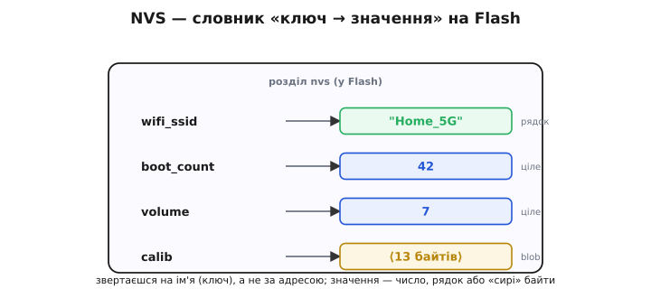
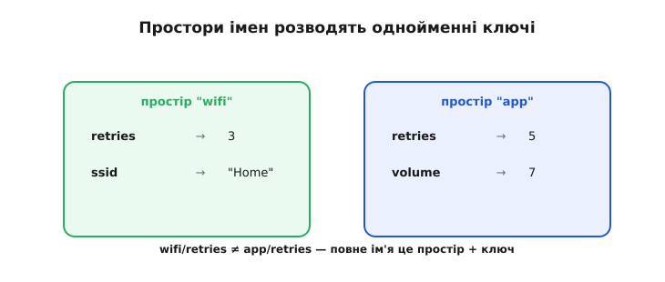
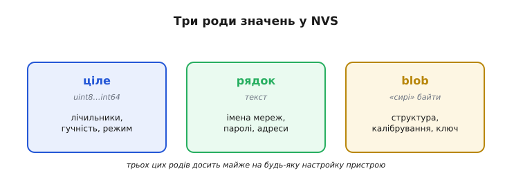
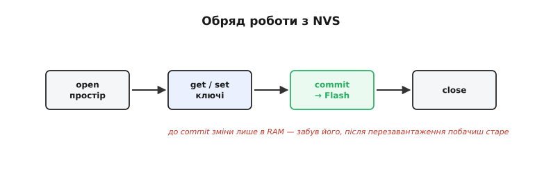
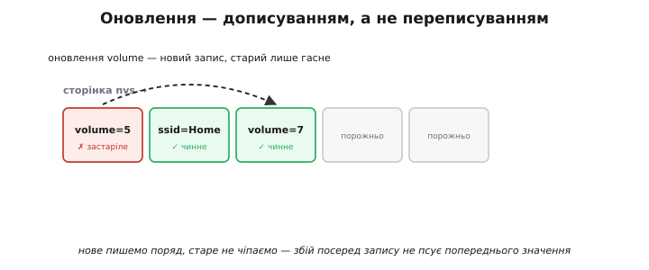
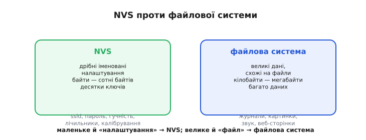

# NVS

Уявіть найзвичайнісіньку потребу: пристрій має **запам'ятати** дрібницю. Ім'я Wi-Fi-мережі, яку йому задали. Гучність, що її востаннє виставив користувач. Скільки разів його вмикали. Дрібниці ці мусять пережити вимкнення живлення — отже, їм місце у [Flash, що зберігає дані без живлення](topic:programming/why-persist). Та писати їх у Flash **власноруч** — морока: треба знайти вільну адресу, [стерти сектор перед записом](topic:programming/flash-internals), не зачепити сусідні дані, подбати про [знос комірок](topic:programming/wear-leveling), та ще й не загубити все це при раптовому збої. Робити таке щоразу для кожної дрібнички — справжнє покарання.

На щастя, цю роботу вже зроблено за вас. В ESP32 є готове сховище для таких-от дрібниць — **NVS** (від англ. *non-volatile storage* — «енергонезалежне сховище»: дані лишаються на місці й без живлення). Воно ховає всю Flash-механіку за простим і звичним образом: **словником пар «ключ → значення»**. Ви кажете «запам'ятай: гучність дорівнює сім» — і більше не думаєте ні про сектори, ні про стирання, ні про знос. Сховище саме знайде місце, саме впише, саме переживе вимкнення. Гляньмо, як воно влаштоване й чому ним так зручно користуватися.

### Словник на Flash

В основі NVS — найпростіша і найзнайоміша структура на світі: **словник**. Кожен запис — це пара: коротке ім'я (**ключ**) і прив'язане до нього **значення**. `wifi_ssid → "Home_5G"`. `boot_count → 42`. `volume → 7`. Точнісінько як записник, де навпроти кожного імені стоїть телефон, або як етикетки на банках у коморі: глянув на напис — знаєш, що всередині.


*NVS — це словник на Flash: кожен запис є парою «ключ → значення». Ключ — коротке ім'я (`volume`, `wifi_ssid`), значення — число, рядок або кілька «сирих» байтів. До даних звертаються на ім'я, а не за адресою.*

Уся принадність у тому, що ви працюєте зі **зрозумілими іменами**, а не з голими адресами Flash. Вам байдуже, на якому саме байті чипа лежить гучність, — ви звертаєтесь до неї на ім'я: «дай мені `volume`». NVS сам тримає в голові, де фізично покладено кожен ключ, і подає вам значення на перший поклик. Зникає увесь клопіт із адресами та зсувами: лишаються самі лиш імена, які легко й писати, й читати. Це класичний крок інженерної думки — сховати незручну механіку за звичною, людською моделлю.

Варто на мить спинитися на слові «енергонезалежне» в самій назві. Значення в NVS живе не в оперативній пам'яті, яку [вимкнення живлення змиває](topic:programming/why-persist) щоразу, а у Flash — отже, переживає і висмикнуту з розетки виделку, і скидання кнопкою, і розряджену батарею. Виставив користувач якось гучність на сім — і за тиждень, за місяць, за сотню перезавантажень вона все ще сім, доки хтось не змінить її навмисно. Саме ця тривкість і робить NVS тим місцем, куди складають усе, що пристрій має пам'ятати «назавжди».

### Щоб ключі не плуталися: простори імен

Коли пристрій росте, ключів стає багато, і різні частини програми починають вигадувати імена незалежно одна від одної. Модуль Wi-Fi заведе собі `retries` (скільки разів пробувати з'єднання), і модуль гри теж захоче `retries` (скільки спроб дає гравцеві). Імена збіглися — а значення геть різні. Як їх не сплутати?

NVS розв'язує це **просторами імен** (*namespaces*). Простір імен — це наче окрема шухляда чи окрема сторінка записника: усередині неї ключі живуть самі по собі й не бачать ключів з інших шухляд. Модуль Wi-Fi працює у просторі `wifi`, модуль гри — у просторі `app`, і їхні однойменні `retries` спокійно існують поряд, бо повне ім'я кожного — це **простір плюс ключ**: `wifi/retries` та `app/retries` різні, як двоє Іванів із різних сіл.


*Простори імен розводять однойменні ключі: `retries` у просторі «wifi» і `retries` у просторі «app» — різні значення, бо повне ім'я це простір + ключ. Кожна частина пристрою працює у своїй «шухляді» й не затирає чужого.*

Звідси проста й корисна звичка: давайте кожній логічній частині свого пристрою власний простір імен. Тоді ви ніколи не затрете випадково чуже налаштування, плутанини не буде, а сховище лишиться охайним і зрозумілим, навіть коли ключів набереться кілька десятків.

Якщо ж простір не назвати, NVS покладе ключ у простір за умовчанням — і доти, доки пристрій маленький, цього навіть досить. Та щойно частин стає дві чи більше, безіменне звалювання всього в одну купу починає зраджувати: рано чи пізно дві з них захочуть ключ з однаковим іменем — і одна тихо затре дані іншої. Тому звичка одразу розводити модулі по власних просторах — це та дешева обачність, що згодом економить години розплутування дивних, ніби нізвідки взятих помилок.

### Що можна покласти у значення

Значення в NVS бувають трьох родів, і цього набору вистачає на майже все, що треба пам'ятати дрібному пристрою.

Перший рід — **цілі числа**. Лічильник увімкнень, гучність, номер режиму, яскравість. NVS розрізняє цілі різного розміру — від однобайтового до восьмибайтового, зі знаком і без, — але вам зазвичай досить знати, що «число туди кладеться й звідти береться незмінним».

Другий рід — **рядки**: будь-який текст. Ім'я мережі, пароль, назва пристрою, адреса сервера. Кладете рядок під ключем — дістаєте той самий рядок після перезавантаження.

Третій рід — **blob** (від англ. *binary large object* — «велика двійкова грудка»): просто кілька «сирих» байтів, зміст яких знаєте лише ви. Сюди добре лягає невелика структура налаштувань цілком, або табличка калібрування датчика, або ключ шифрування. NVS не вникає, що то за байти, — він чесно зберігає їх і повертає байт у байт.

Розміри тут промовисті й самі підказують, для чого NVS: рядок обмежений приблизно чотирма тисячами байтів, а blob — сотнями кілобайтів. Тобто навіть найбільший допустимий blob — це радше «грудка», ніж «файл»: під дрібні налаштування місця вдосталь, а от ціле відео туди вже не покладеш, і це не випадковість, а навмисна межа призначення.


*Значення бувають трьох родів: ціле (лічильники, гучність), рядок (імена, паролі) і blob — «сирі» байти (структура, ключ, калібрування). Трьох цих родів досить, щоб описати майже будь-яке налаштування пристрою.*

Трьох цих родів — число, рядок, грудка байтів — досить, щоб описати майже будь-яке налаштування. А якщо налаштувань багато й вони пов'язані, їх часто складають в одну структуру й кладуть однією грудкою-blob, щоб зберегти й прочитати все разом.

### Як цим користуються

Користуватися NVS просто, і весь обряд складається з кількох кроків. Спершу ви **відкриваєте** потрібний простір імен — кажете «працюватиму з шухлядою `app`». Потім **читаєте** значення за ключем (`get`) або **задаєте** його (`set`): «постав `volume` на сім». А насамкінець — і це найважливіше — робите **commit**: команду «а тепер справді запиши все це у Flash».


*Обряд роботи з NVS: відкрити простір → читати/задавати ключі → commit (записати у Flash) → закрити. До commit зміни живуть лише в RAM; забудеш його — і після перезавантаження побачиш старе значення.*

На цьому commit варто спинитися, бо тут ховається класична пастка новачка. Доки ви не викликали commit, ваші зміни живуть лише в оперативній пам'яті — швидкій, але такій, що зникає при вимкненні. Забули закріпити їх через commit — і після перезавантаження побачите старе значення, наче нічого й не міняли. Тож правило просте: **поміняв — закріпи**. Робиться commit нечасто й гуртом (одразу по кількох змінах), бо саме він торкається Flash, а кожен дотик до Flash — це і час, і крихта зносу.

Є й друга зручність, про яку легко не здогадатися: читаючи ключ, ви подаєте **значення-замовчування** на випадок, якщо його ще немає. Перший запуск нового пристрою — ключів іще нема жодного; і замість того щоб щоразу перевіряти «а чи існує вже `volume`?», ви просто кажете: «дай `volume`, а як його нема — вважай, що сім». Першого разу повернеться сім, далі — те, що збережено. Це позбавляє код купи марудних перевірок «перший це запуск чи ні» й робить читання налаштувань коротким і охайним.

> 🔧 **Навіщо це.** Розділення на «задати в пам'яті» (`set`) і «записати у Flash» (`commit`) — не зайва церемонія, а захист вашого Flash. Якби кожне `set` бігло одразу у Flash, то, міняючи десять налаштувань поспіль, ви зробили б десять записів замість одного. NVS дає вам згрупувати зміни й закріпити їх **разом**, одним дотиком, — менше записів, менше зносу, довше життя чипа.

З цього випливає й практична осторога щодо **частоти** записів. NVS бережливий, але не чарівний: щоразу, коли ви робите commit, десь у Flash таки лягає новий запис, а Flash має [скінченний ресурс стирань](topic:programming/wear-leveling). Тому не закріплюйте налаштування в кожному оберті головного циклу чи на кожен дотик датчика — збирайте зміни й commit'те їх зрідка: коли користувач справді щось перемкнув, перед самим вимкненням, раз на хвилину. Лічильник, що тисне commit десять разів на секунду, з'їсть ресурс свого сектора за лічені дні; той самий лічильник, закріплюваний раз на хвилину, переживе сам пристрій.

### Чому NVS надійний і береже Flash

Тут варто прочинити дверцята й глянути, як NVS поводиться з Flash усередині, — бо саме звідти його надійність. Здавалося б, оновити ключ просто: знайди старе значення й перепиши на те саме місце. Та [у Flash **не можна** просто так переписати](topic:programming/flash-internals) — спершу довелося б стерти весь сектор, а під час того стирання, обірвись живлення, ви лишилися б і без старого, і без нового значення.

Тому NVS чинить розумніше. Оновлюючи ключ, він **не чіпає** старий запис, а **дописує новий** у вільне місце далі по сторінці. Старий запис лише позначається застарілим — мовляв, «це вже не чинне». Нове значення з'являється цілим **перш ніж** старе оголошено недійсним, тож у будь-яку мить — навіть якщо живлення обірветься рівно посеред оновлення — на чипі є щонайменше одне справне значення ключа. Збій не псує того, що вже було записано.

Аби це справді працювало, кожен запис NVS несе при собі маленьку **позначку цілості** — щось на кшталт прапорця «запис завершено». Якщо живлення обірвалося рівно посеред дописування, новий запис вийде недописаним — і за цією позначкою NVS при наступному старті впізнає його як **зіпсований**, просто його зігнорує й лишить чинним попереднє, ціле значення. Виходить акуратний ланцюжок: нове пишемо поряд, старе не чіпаємо, а позначка цілості розсуджує, чи можна новому довіряти. Саме тому раптове вимкнення посеред запису для NVS не катастрофа, а буденність, до якої він готовий за самою своєю будовою. Це окремий випадок ширшої теми — [цілості запису й поведінки при втраті живлення](topic:programming/write-integrity).


*Оновлюючи ключ, NVS дописує новий запис у кінець, а старий лише позначає застарілим (✗) — не переписує на місці. Тому збій під час запису не псує попереднього значення (бо у Flash чинне правило «стерти перед записом»), а записи самі розповзаються по сторінці, розмазуючи знос.*

У цього прийому є приємний побічний наслідок. Оскільки кожне оновлення лягає у **нове** місце, записи самі собою розповзаються по сторінці, а не б'ють раз у раз в одну комірку, — а це ж і є те саме [**розмазування зносу**](topic:programming/wear-leveling). NVS, виходить, дбає про ресурс Flash автоматично, просто за своєю будовою. Звісно, застарілі записи поступово з'їдають місце; коли сторінка заповнюється, у дію вступає **збирання сміття**: NVS переносить чинні записи на чисту сторінку, а стару цілком стирає й повертає у вжиток. Уся ця кухня прихована від вас — ви бачите лише охайний словник, а сектори, стирання й переїзди NVS улаштовує сам.

> ⚙️ **Як це влаштовано всередині.** Журнал записів, сторінки, позначки «застаріло» і збирання сміття в NVS — у вставці [NVS зсередини](topic:programming/nvs/proj-nvs-internals.md). Тут досить запам'ятати головне: NVS **дописує**, а не переписує, і прибирає за собою сам.

### NVS чи файлова система?

NVS чудовий, але не всемогутній, і важливо відчувати межу його застосунку. Він створений для **дрібних іменованих налаштувань**: ім'я мережі, пароль, гучність, лічильники, прапорці, табличка калібрування. Це одиниці чи сотні байтів під коротким ключем, кілька десятків ключів — і не більше. У такій ролі NVS неперевершений.


*NVS — для дрібних іменованих налаштувань (байти–сотні байтів, десятки ключів). Файлова система — для великих даних, схожих на файли (журнали, картинки, сторінки; кілобайти–мегабайти). Правило: маленьке й «налаштування» → NVS; велике й «файл» → файлова система.*

Та коли даних стає **багато** й вони схожі радше на **файли** — журнал подій на тисячі рядків, картинка, звук, ціла веб-сторінка, велика таблиця, — NVS уже не годиться: він не для того зроблений, і пхати туди мегабайти означало б боротися з інструментом. Для такого є [**файлова система** на Flash](topic:programming/flash-filesystems). Правило, що його варто закарбувати: **маленьке й «налаштування» → NVS; велике й «файл» → файлова система**. Сплутаєте ці двоє — і або мучитимете NVS завеликими грудками, або городитимете цілу файлову систему там, де вистачило б трьох ключів.

### Маленький приклад: лічильник увімкнень

Зберімо все докупи на крихітному, але повчальному прикладі — лічильнику того, скільки разів пристрій вмикали. При кожному старті ми хочемо прочитати збережене число, додати одиницю й покласти назад, щоб воно пережило наступне вимкнення. Ось як це виглядає справжнім кодом ESP-IDF — увесь обряд «відкрити → прочитати → змінити → закріпити → закрити» на долоні:

**Прочитати лічильник увімкнень, збільшити на одиницю й зберегти назад у NVS.**

```c
#include "nvs.h"

void bump_boot_count(void)
{
    nvs_handle_t h;
    // відкриваємо простір "app" на читання й запис
    nvs_open("app", NVS_READWRITE, &h);

    int32_t n = 0;                              // значення-замовчування на перший запуск
    esp_err_t err = nvs_get_i32(h, "boot_count", &n);
    if (err == ESP_ERR_NVS_NOT_FOUND) {
        n = 0;                                  // ключа ще нема — лічильник стартує з нуля
    }

    n = n + 1;                                  // порахували це ввімкнення
    nvs_set_i32(h, "boot_count", n);            // поки що лише в RAM
    nvs_commit(h);                              // ось тепер n справді у Flash
    nvs_close(h);
}
```

Простежмо за числом крок за кроком на перших увімкненнях:

```
1-ше ввімкнення: get → NOT_FOUND → n=0 → +1 → set 1 → commit
2-ге ввімкнення: get → 1         →      → +1 → set 2 → commit
3-тє ввімкнення: get → 2         →      → +1 → set 3 → commit
```

Перший запуск особливий: ключа ще немає, тож `nvs_get_i32` повертає `ESP_ERR_NVS_NOT_FOUND`, ми лишаємо наперед домовлений нуль, робимо з нього одиницю й закріплюємо. Кожне наступне ввімкнення вже бачить збережене число й нарощує його на одиницю. Просте читання-плюс-один-запис, а пристрій уже **пам'ятає свою історію** між вимкненнями. На цьому ж кістяку — «прочитати, змінити, закріпити» — будуються й усі серйозніші налаштування: відмінність лише в тому, скільки ключів ви чіпаєте за один `nvs_commit`.

Зверніть увагу, як мало тут коду й як багато він робить. Жодного слова про адреси, сектори, стирання чи знос — усе це NVS узяв на себе, лишивши вам три рядки змісту: прочитати, додати, закріпити. Саме в цьому й суть гарної бібліотеки сховища: вона не дає вам можливостей, яких не дав би «голий» Flash, — вона **прибирає клопіт**, дозволяючи думати про сам пристрій, а не про фізику пам'яті під ним.

> 🔧 **Навіщо це.** Той самий каркас «відкрити простір → `nvs_get_*` із замовчуванням → змінити → `nvs_set_*` → `nvs_commit`» лягає під будь-яке збережене налаштування пристрою — гучність, ім'я Wi-Fi, прапорець «перший запуск пройдено». Запам'ятавши цей один шаблон, ви вмієте зберігати **все**, що пристрій має пам'ятати між вимкненнями; міняється тільки тип (`_i32`, `_str`, `_blob`) і кількість ключів між відкриттям і `nvs_commit`.

Підсумуймо. **NVS** — це готове сховище для дрібних постійних даних, що ховає всю складність Flash за простим словником «ключ → значення». Воно саме шукає місце, само бережно оновлює дописуванням, само розмазує знос і прибирає за собою — а вам лишає тільки імена та значення. Для дрібних налаштувань кращого годі й шукати. А коли даних забагато й вони схожі на файли — настає черга [файлової системи](topic:programming/flash-filesystems).
