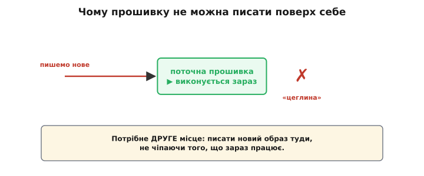
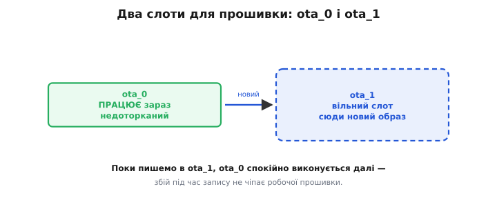
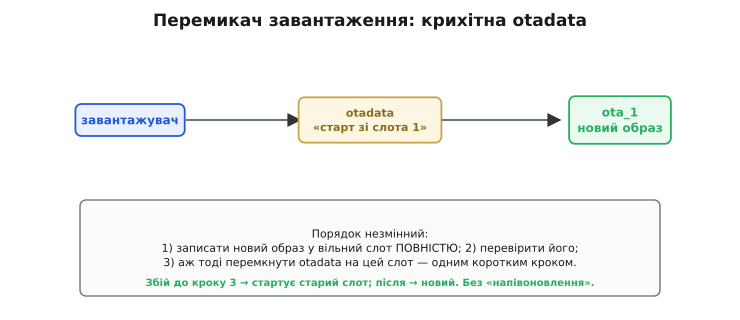
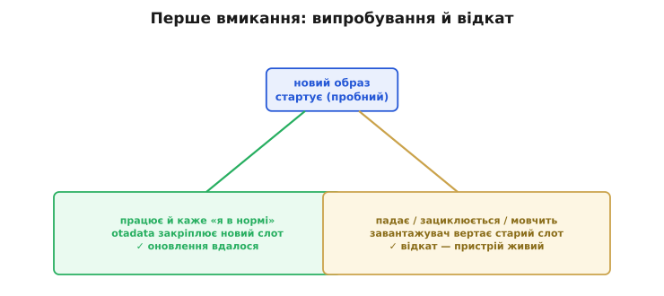
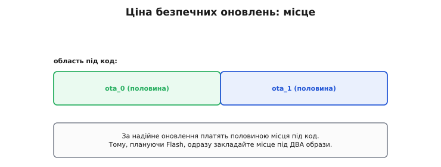

# Два OTA-слоти: механіка подвійного образу

Уявіть: ваш термостат висить на стіні, працює, а ви хочете залити в нього нову версію коду — виправити помилку, додати можливість. Як це зробити, не лишивши пристрій мертвою «цеглиною», якщо щось піде не так? Найбільше й найризикованіше, що зберігає пристрій, — це **сама прошивка**, і безпечно підмінити її на ходу складніше, ніж будь-що інше у Flash.

Одразу домовмося про межу теми. **Як** нова прошивка дістається до пристрою — по Wi-Fi, із сервера, шматками — це окрема велика історія про [оновлення «по повітрю»](topic:programming/ota-update) (*OTA, англ. over-the-air* — «крізь ефір»). Тут нас цікавить інше, ближче до Flash: **де** новий образ зберігається й **як** пристрій безпечно на нього перемикається. Тобто механіка зберігання, а не доставка.

Чому взагалі стільки уваги одному оновленню? Бо для підключеного пристрою це питання майже життя і смерті: оновлення, яке інколи лишає «цеглину», — не зручність, а лотерея, у яку ніхто не захоче грати з тисячею пристроїв, розкиданих по полю. Механіка, яку ми розберемо, відрізняє іграшку на столі від виробу, якому можна довірити роботу роками без нагляду.

### Чому прошивку не можна писати поверх себе

Почнімо з пастки, яка й породжує всю конструкцію. Прошивка — це код, що **виконується просто зараз**: процесор крок за кроком читає з Flash інструкції чинної програми. Спробувати переписати цей самий Flash новою прошивкою — однаково що міняти двигун літакові в польоті чи пиляти гілку, на якій сидиш. У найкращому разі процесор спіткнеться, дочитавши до місця, яке щойно затерли; а якщо живлення обірветься посеред такого запису — а це [небезпечне вікно, коли пів-записаний блок гірший за обидва цілих стани](topic:programming/write-integrity), — на чипі лишиться напівстара-напівнова прошивка, нежиттєздатне місиво. Пристрій більше не завантажиться. Це і є страшна «цегла» (*англ. brick* — «цеглина»): пристрій, що перетворився на дорогий шматок пластику.


*Поточна прошивка виконується просто зараз; переписати її поверх — однаково що пиляти гілку, на якій сидиш. Збій посеред такого запису лишає напівстару-напівнову прошивку, «цеглину». Потрібне друге місце, щоб писати нове, не чіпаючи робочого.*

Щоб відчути це до кінця, придивімося, як процесор бере код. Він **раз у раз** читає інструкції просто з Flash, по ходу виконання (це зветься *execute-in-place* — «виконання на місці»). Тобто Flash із робочою прошивкою — не архів, який чіпають зрідка, а жива стрічка, з якої щомиті зчитується наступний крок. Затерти в ній щось — означає вибити з-під процесора сходинку рівно тоді, коли він на неї ступає. Ось чому робочий слот має лишатися абсолютно недоторканим аж до самого перемикання.

Висновок очевидний: писати нову прошивку **поверх робочої** не можна. Потрібне **друге місце** — окрема ділянка Flash, куди можна спокійно скласти новий образ, доки старий працює собі далі, нічого не підозрюючи.

### Два слоти для прошивки

Це друге місце задає [таблиця розділів](topic:programming/partition-table): саме там оголошено app-розділи `ota_0` і `ota_1`. Ось вони й є двома **слотами** під прошивку — двома однаковими банками, у кожну з яких влазить повний образ. У будь-яку мить один слот — **робочий**: із нього зараз виконується пристрій. Другий — **запасний**: саме в нього заливають новий образ.


*У будь-яку мить один слот (ota_0) працює, другий (ota_1) вільний — у нього й пишуть новий образ. Поки триває запис, робочий слот недоторканий, тож збій під час заливання не чіпає чинної прошивки.*

Механіка проста й безпечна. Пристрій працює, скажімо, зі слота `ota_0`. Нову прошивку записують у **вільний** `ota_1` — поки йде запис, робочий `ota_0` стоїть цілий і незмінний, а програма з нього спокійно крутиться далі. Обірвись живлення посеред заливання `ota_1` — і байдуже: робочий слот не зачеплено, пристрій просто перезавантажиться зі старої, доброї прошивки, наче нічого й не починалося. Ось де ключ: **той, що пишемо, і той, що виконуємо, — завжди різні**. Ризикуємо лише запасним слотом, ніколи — робочим.

А що після наступного оновлення? Ролі просто **міняються місцями**. Цього разу працював `ota_0`, новий образ ліг у `ota_1`; під час дальшого оновлення вже `ota_1` буде робочим, а новий образ ляже в `ota_0`. Слоти ніби пінг-понг: щоразу пишемо в той, що зараз не зайнятий. Завдяки цьому ще й знос розкладається на обидва слоти порівну, а не б'є в один. У деяких розкладках є й третій, незмінний слот `factory` — заводська прошивка як остання лінія оборони, на яку можна впасти, якщо обидва робочі образи раптом зіпсуються (його, до речі, відкат ніколи не чіпає — на те він і недоторканний запас).

### Перемикач: крихітна otadata

Гаразд, новий образ повністю лежить у `ota_1`. Як тепер сказати пристроєві «віднині завантажуйся звідси»? Тут на сцену виходить ще один мешканець [таблиці розділів](topic:programming/partition-table) — крихітний розділ **otadata**. Це і є той самий **перемикач**: маленький запис, що каже завантажувачу, з якого слота стартувати наступного разу.


*otadata — крихітний розділ-перемикач: каже завантажувачу, з якого слота стартувати. Порядок незмінний: записати образ повністю → перевірити → і лише тоді перемкнути otadata одним коротким кроком. Без проміжного «напівоновлення».*

Порядок дій — точнісінько [атомарний перемикач](topic:programming/write-integrity), лише застосований до прошивки. Спершу записуємо новий образ у вільний слот **повністю**. Тоді **перевіряємо** його (тут стане в пригоді контрольна сума — чи цілий образ доїхав). І аж насамкінець — **перемикаємо otadata** на новий слот, одним коротким кроком. Доти, доки цей крок не зроблено, пристрій завантажується зі старого слота; щойно зроблено — з нового. Проміжного «напівоновленого» стану не буває: збій до перемикача лишає стару прошивку, після — нову, обидві цілі. Ідея «пиши нове поряд, перемкни одним кроком» працює тут не з числом налаштування, а з мегабайтом коду.

Сама otadata, до речі, теж зроблена надійно — інакше вона була б ахіллесовою п'ятою всієї схеми. Це ж єдиний запис, що вирішує долю завантаження; зіпсуйся він посеред перемикання — і пристрій не знав би, звідки стартувати. Тому otadata займає **два флеш-сектори** й оновлює їх по черзі: кожен запис лягає в той сектор, що зараз не активний, а в записі є лічильник-номер. Завантажувач читає **обидва** сектори й, коли вони розходяться, довіряє тому, чий лічильник більший, — тобто записаному пізніше. Збій посеред оновлення otadata зачепить лише один сектор; другий лишиться цілим, і завантажувач спокійно візьме його. Перемикач, який береже інших, сам захищений тим самим прийомом «нове поряд, потім перемкни».

### Перше вмикання й відкат

Та з прошивкою є тонкість, якої не було в налаштуваннях. Конфіг або цілий, або ні — це видно по контрольній сумі. А прошивка може бути **цілою як файл**, але **поганою як програма**: образ доїхав без жодного зіпсованого байта, перемкнулися ми на нього — а він через помилку в коді одразу падає чи зациклюється в нескінченних перезавантаженнях. Контрольна сума тут безсила: байти ж правильні, поганий сам код. Як уберегтися від цього?

Відповідь — **пробний запуск із відкатом**. Перемкнувшись на новий образ, пристрій запускає його не остаточно, а **на випробуванні**. Якщо нова прошивка успішно піднялася, попрацювала й сама **підтвердила**: «я в нормі» — тоді otadata закріплює її назавжди, оновлення вдалося. А якщо новий образ падає, зависає чи так і не дійшов до свого «я в нормі» (приміром, застряг у циклі перезавантажень), завантажувач розуміє: щось не так — і **відкочується** на старий, перевірений слот, який нікуди не дівся.


*Новий образ стартує «на випробуванні». Підтвердив «я в нормі» — otadata закріплює його. Упав, завис чи мовчить — завантажувач відкочується на старий, робочий слот. Відкат рятує навіть від цілого, але поганого коду — пристрій лишається живий.*

Оце і є **відкат** (*англ. rollback* — «відкочування»), страхувальна сітка всієї конструкції. Завдяки їй навіть прошивка з прикрою помилкою не перетворює пристрій на цеглину: у найгіршому разі він повернеться до попередньої робочої версії й житиме далі, чекаючи на виправлене оновлення. Старий слот навмисно **не стирають** одразу — він лишається як запас саме доти, доки новий не довів, що він добрий.

Тут варто наголосити на обов'язку, що лягає на вас, автора прошивки. Відкат спрацює лише тоді, коли новий образ **зобов'язаний сам себе підтвердити** — десь у коді, піднявшись і переконавшись, що головне працює (мережа є, датчики відповідають), він має явно гукнути «я справний». Забудете цей виклик — і навіть бездоганна прошивка вічно лишатиметься «на випробуванні», а завантажувач, не дочекавшись підтвердження, відкотить її назад, ніби вона зламана. Тож пробний режим — це угода: система дає вам сітку безпеки, але ви маєте подати їй знак, що приземлилися вдало.

Намалюймо найгірший випадок до кінця. Залили новий образ, перемкнули otadata, пристрій стартує з нього — і той одразу падає, перезавантажується, знову падає. Здавалося б, вічна петля. Та ні: завантажувач **позначає** свіжий образ як «новий, ще не підтверджений», і якщо після першого ж старту не почув «я справний», виносить вирок — образ поганий — і сам повертає otadata на старий слот. Наступний старт уже піднімає стару, перевірену прошивку. Користувач у гіршому разі помітив, що пристрій на хвилину «задумався» й перезавантажився, — і по всьому; цеглини не сталося.

### Як це виглядає в коді

Зведімо механіку слотів у короткий, реальний приклад на ESP-IDF. Він свідомо опускає доставку образу по мережі (це тема [OTA](topic:programming/ota-update)) і показує саме те, що нас цікавить: запис у **пасивний** слот і атомарне перемикання на нього.

**Умова: у нас у руках уже є буфер із новим образом; залити його в запасний слот і перемкнутися на нього.**

```c
#include "esp_ota_ops.h"

esp_err_t install_image(const uint8_t *image, size_t len) {
    // 1. Беремо ПАСИВНИЙ слот — ніколи не той, з якого виконуємось зараз.
    const esp_partition_t *slot = esp_ota_get_next_update_partition(NULL);

    // 2. Готуємо слот і пишемо образ (у житті — шматками з мережі).
    esp_ota_handle_t h = 0;
    esp_err_t err = esp_ota_begin(slot, len, &h);   // стирає пасивний слот
    if (err != ESP_OK) return err;
    err = esp_ota_write(h, image, len);             // робочий слот недоторканий
    if (err != ESP_OK) { esp_ota_abort(h); return err; }

    // 3. esp_ota_end перевіряє цілість образу (а при secure boot — і підпис).
    err = esp_ota_end(h);                           // битий образ далі не пройде
    if (err != ESP_OK) return err;

    // 4. Аж ТЕПЕР — атомарний перемикач otadata на новий слот.
    return esp_ota_set_boot_partition(slot);        // стан слота → "новий"
}
```

Уся вага — у порядку кроків. Слот вибирає `esp_ota_get_next_update_partition()` — він **завжди** повертає пасивний слот, тож робочий випадково не зачепиш. Запис іде в нього, а перевірку цілості робить `esp_ota_end()`: до цього місця нічого не закріплено, і обрив на будь-якому ранньому кроці лишає робочий слот цілим. І лише `esp_ota_set_boot_partition()` чіпає otadata — це і є той самий один короткий крок, після якого завантаження піде з нового слота.

Тепер друга половина угоди — підтвердження після першого старту. Цей код виконується **вже з нового образу**, коли він піднявся:

```c
#include "esp_ota_ops.h"

void confirm_or_rollback(void) {
    const esp_partition_t *run = esp_ota_get_running_partition();
    esp_ota_img_states_t st;
    esp_ota_get_state_partition(run, &st);

    // Образ стартує у стані PENDING_VERIFY — він «на випробуванні».
    if (st == ESP_OTA_IMG_PENDING_VERIFY) {
        if (self_test_ok()) {                          // мережа є, датчики живі?
            esp_ota_mark_app_valid_cancel_rollback();  // «я справний» → закріпити
        } else {
            esp_ota_mark_app_invalid_rollback_and_reboot(); // «зі мною біда» → відкат
        }
    }
}
```

Свіжий образ завантажувач позначає станом `ESP_OTA_IMG_NEW`, а на першому старті переводить у `ESP_OTA_IMG_PENDING_VERIFY` — «на випробуванні». Виклик `esp_ota_mark_app_valid_cancel_rollback()` — це і є явне «я справний», що закріплює образ назавжди. Якщо ж замість нього викликати `esp_ota_mark_app_invalid_rollback_and_reboot()` (або просто впасти, так і не підтвердившись), завантажувач на наступному старті побачить непідтверджений образ, позначить його `ESP_OTA_IMG_ABORTED` і повернеться на старий слот. Забути перший виклик — типова й болісна пастка: прошивка чудова, а пристрій уперто відкочується, бо так і не почув знаку, що вона приземлилася вдало.

> 🔧 **Навіщо це.** Вибір саме `esp_ota_get_next_update_partition()`, а не «слота номер 1» руками, — не дрібниця: тільки так гарантовано, що ви пишете в пасивний, а не зносите під собою робочий. А пара `mark_valid` / `mark_invalid` — ваш єдиний важіль над відкатом: ставте `mark_valid` лише **після** справжньої самоперевірки (мережа, датчики, критичні периферії), бо передчасне «я справний» вимикає сітку безпеки рівно тоді, коли вона найпотрібніша.

### Чому це коштує місця

За все добре треба платити, і плата тут — **місце**. Два повні слоти під прошивку означають, що ваш код мусить уміститися щонайбільше в **половину** області, відведеної під застосунок: адже друга половина зайнята слотом-близнюком. Якщо весь app-простір — два мегабайти, то на одну прошивку лишається близько одного.


*Два повні слоти ділять область під код навпіл: прошивка вміщається щонайбільше в половину. За надійне оновлення з відкатом платять половиною місця, тож закладати його треба наперед.*

Ось де проступає сенс [поділу Flash на розділи](topic:programming/partition-table): той самий поділ пирога, тільки тепер видно, **навіщо** він такий. Хочеш безпечні оновлення з відкатом — закладай під код **удвічі** більше місця, ніж займає сама прошивка. Це свідомий вибір: трохи тісніше з кодом — зате оновлення, яке ніколи не лишить пристрій мертвим. Серйозний пристрій одразу резервує місце під **два** образи, а не дізнається про цю потребу болісно, коли прошивка вже не влазить.

Є, звісно, й дешевший шлях — **один** слот, без близнюка: оновлюйся прямо поверх, заощаджуй половину Flash. Так інколи й роблять там, де оновлення рідкісні, живлення надійне, а пристрій легко дістати й перепрошити вручну, якщо не пощастить. Але за цю ощадливість платять страхом: будь-яка обірвана заливка чи лиха помилка стають фатальними. Подвійний слот — це усвідомлений обмін **місця на спокій**, і для пристрою, до якого не дотягнешся рукою, спокій майже завжди дорожчий.

### Налаштування переживають оновлення

Може зринути тривога: якщо ми перемикаємо цілу прошивку, чи не зітруться часом усі збережені налаштування й файли? Ні — і це навмисно. У [таблиці розділів](topic:programming/partition-table) прошивка живе в app-слотах, а [сховище ключ-значення](topic:programming/nvs) і файлова система — в **окремих** data-розділах, яких оновлення коду **не чіпає**. Тому, залив нову версію, пристрій бачить ті самі налаштування Wi-Fi, ті самі лічильники, ті самі файли, що й до оновлення. Код змінився — пам'ять користувача лишилась. Саме цей чіткий поділ «код окремо, дані окремо» й робить оновлення непомітним для того, хто пристроєм користується: ні наново налаштовувати, ні втрачати нажите йому не доводиться. Через те оновлення й відчувається як легке «пристрій трохи моргнув і поновішав», а не як болісне скидання до заводського стану.

### Та сама ідея, більший масштаб

[Надійне оновлення конфігу](topic:programming/write-integrity) і надійне оновлення прошивки — це **одна й та сама ідея**, лише різного розміру. Там — два маленькі слоти й перемикач-версія; тут — два великі слоти й перемикач-otadata. Там берегли число налаштування, тут — мегабайт коду. Кістяк ідентичний: **пиши нове поряд зі старим → перемкни одним коротким кроком → тримай старе як запас на випадок відкату**.


*Той самий прийом у двох масштабах: конфіг — два маленькі слоти + перемикач-версія; прошивка — два великі слоти + перемикач-otadata. Кістяк один: пиши нове поряд, перемкни одним кроком, тримай старе на відкат.*

Це не випадковість, а глибокий принцип надійних систем, який варто закарбувати: ніколи не руйнуй єдину добру копію, поки не маєш готової й перевіреної заміни. Той самий кістяк працює в базах даних і в системах розгортання застосунків — усюди, де оновлення не сміє лишити систему без чогось робочого.

Корисно й тримати в голові, чому цей принцип такий живучий. Він нічого не прискорює й не здешевлює — навпаки, коштує зайвого місця та зайвого кроку. Купує він одне: **певність**, що хоч би що сталося посеред оновлення — обрив, помилка, збій, — у вас завжди лишиться щось ціле, на що можна спертися. У світі, де живлення зникає без попередження, а оновлення прилітають по ненадійній мережі, ця певність варта і місця, і кроку.

> 🔧 **Навіщо це.** Без двох слотів і відкату будь-яке оновлення «в полі» — рулетка: одна обірвана заливка чи одна лиха помилка — і пристрій на стіні (чи на вишці, чи в глибині приладу) стає цеглиною, по яку треба їхати з викруткою. Саме тому **кожен** серйозний підключений пристрій — від розумної лампочки до автомобіля — оновлюється через подвійний образ. Платить він за це половиною місця під код — і вважає це найвигіднішою угодою на світі: місце на Flash дешеве й одноразове, а виїзд до пристрою по його «оживлення» — дорогий і щоразу новий.

Підсумуймо. Щоб безпечно оновлювати прошивку, її тримають у **двох слотах** (`ota_0`/`ota_1`): один працює, у другий пишуть новий образ, не чіпаючи робочого. Крихітна **otadata** — атомарний перемикач, що каже, звідки завантажуватись; його перемикають **останнім** кроком, уже після повного запису й перевірки, а сама вона захищена двома секторами. А **пробний запуск із відкатом** рятує навіть від цілого, але поганого образу: не підтвердив себе — повертаємось до старого. Усі ці захисти оберігають від **випадкового** збою; від зловмисника ж, який захоче не зіпсувати, а навмисне **підмінити** прошивку чи підгледіти дані, пристрій боронить уже інший рубіж — [secure boot і шифрування Flash](topic:programming/firmware-secure-boot).
