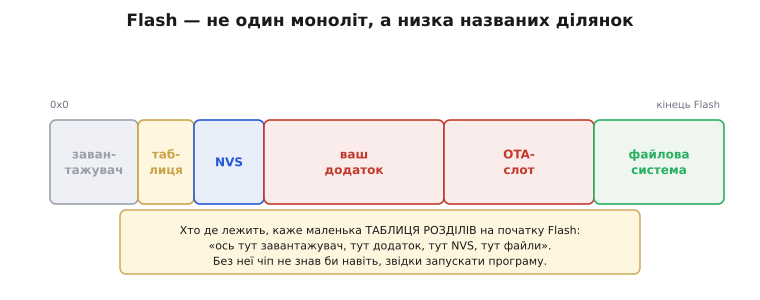
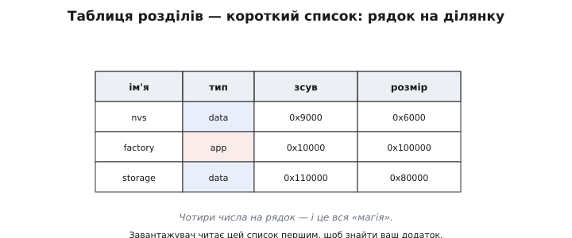
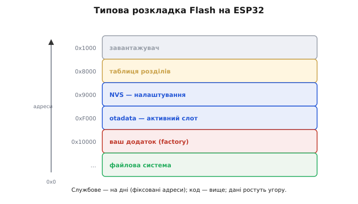
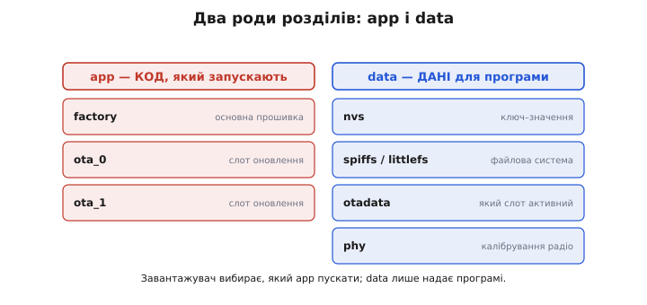
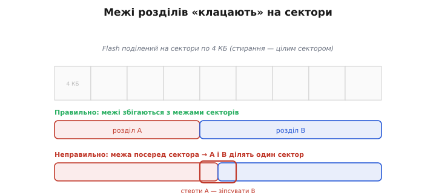
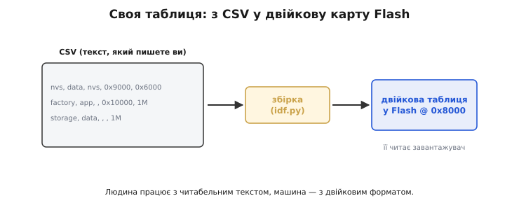

# Таблиця розділів (partition table) ESP32

Flash легко уявляти собі як один суцільний простір. Але на справжньому чипі він **не один** — у ньому одночасно живе кілька геть різних речей: і завантажувач, і ваш додаток, і сховище налаштувань NVS, і, можливо, файлова система та слоти для оновлень. Кожному з них потрібна своя, чітко окреслена ділянка Flash із власним початком і розміром. А щоб ніхто нікому не наступав на п'яти й кожен знав, де його межі, існує **таблиця розділів** (*partition table*) — карта, що ділить Flash на іменовані шматки. Розберімо, як вона влаштована й навіщо вам про неї знати.

### Flash — не один моноліт, а карта ділянок

Уявіть Flash як довгу смугу пам'яті. На самому її початку сидить [завантажувач](topic:programming/bootloader) — той розпорядник, що першим бере керування. Десь далі лежить **ваш додаток** — власне прошивка. Окрему зону займає [**NVS**](topic:programming/nvs) для дрібних налаштувань, ще одну — [**файлова система**](topic:programming/flash-filesystems) для великих даних. А якщо пристрій уміє оновлюватися «по повітрю», то під додаток виділено навіть [**два** слоти](topic:programming/ota-slots), щоб нову прошивку прийняти, не стираючи стару. Усе це — на одному чипі, поряд.

Різноманіття цих мешканців варто оцінити окремо, бо саме воно й створює всю потребу в карті. Тут поряд лежать речі **геть несхожої** природи: незмінний завантажувач, який чіпають хіба раз на виробництві; ваш додаток, що оновлюється з кожною новою прошивкою; налаштування, що міняються від руки користувача; файли, що ростуть у роботі; службове калібрування радіо, зашите назавжди. У кожного — свій ритм життя, свій розмір, свої права на запис. Звалити їх в одну купу без меж означало б, що, оновлюючи додаток, ви ризикуєте затерти налаштування, а пишучи файл — зачепити код. Межі між ними — не бюрократія, а **захист** одного від іншого: кожен має жити у власній кімнаті, за власними дверима.


*Flash — не суцільний шматок, а низка названих ділянок: завантажувач, таблиця, NVS, ваш додаток, OTA-слот, файлова система. Хто де лежить, каже маленька таблиця розділів на початку Flash — карта, без якої чіп не знав би навіть, звідки запускати програму.*

І ось ключове питання: **звідки** кожен учасник знає, де його зона? Адже Flash — це просто послідовність байтів; самі по собі вони не підписані «тут починається додаток». Відповідь — у тій самій **таблиці розділів**: невеликій структурі на початку Flash, що буквально каже «з адреси такої-то й завдовжки стільки-то лежить додаток; ось тут NVS; ось тут файлова система». Це карта чипа — і без неї завантажувач не знав би навіть, звідки запускати вашу програму.

### Таблиця розділів: маленький список-карта

Сама таблиця проста до краю. Це короткий список, де кожен **рядок** описує одну ділянку чотирма речами: **ім'я** (як її звати — `nvs`, `factory`, `storage`), **тип** (що це за рід даних), **зсув** (offset, від англ. «зміщення» — з якої адреси Flash вона починається) і **розмір** (скільки байтів займає). От і все. Завантажувач, прокидаючись, читає цю таблицю **першою** — і з неї дізнається, де лежить додаток, який треба запустити, і де всі інші зони.


*Таблиця розділів — короткий список, по рядку на ділянку: ім'я, тип, зсув (де починається) і розмір. Завантажувач читає її першою, щоб знайти ваш додаток. Чотири числа на рядок — і це вся «магія».*

Жодної магії тут немає — лише охайний облік. Та саме завдяки цьому простому списку Flash із безликої смуги байтів перетворюється на впорядкований простір, де в кожного мешканця своя адреса й свої межі. Поміняти розкладку — означає просто переписати цей список; додати нову зону — додати рядок.

Простежмо, як цей список оживає при старті. Завантажувач, узявши керування після скидання, знає **одну** зашиту в нього адресу — 0x8000, де лежить таблиця. Він читає її, пробігає рядки й знаходить, який app-розділ запускати (`factory` чи активний [OTA-слот](topic:programming/ota-slots)). Тоді стрибає на початок того розділу й передає керування вашому коду. Тобто таблиця — це **перший довідник**, з якого починається все життя прошивки: помилишся в ньому, і чіп або не знайде додатка, або стрибне не туди. Саме тому її розташування й формат сталі та строгі — це фундамент, на якому стоїть решта.

Ідея, до речі, не нова й не унікальна для ESP32. Так само влаштований і ваш комп'ютер: на його диску є таблиця розділів (колись MBR, тепер GPT), що ділить диск на томи — «тут система, тут дані». Espressif просто переніс цей давній і перевірений підхід на крихітний Flash мікроконтролера. Скрізь, де один носій тримає різні речі, рано чи пізно з'являється така карта-таблиця — це універсальний спосіб дати лад спільному простору.

### Типова розкладка ESP32

Щоб це не лишалося абстракцією, гляньмо на типову розкладку Flash на ESP32 «за умовчанням». Знизу, від найменших адрес, ідуть службові речі. Найперше — **завантажувач** (десь біля 0x1000). За ним, на фіксованій адресі **0x8000**, — сама **таблиця розділів** (її місце сталі, бо завантажувач має знати, де її шукати). Далі — **NVS** (зазвичай від 0x9000), невеличка зона для налаштувань. Потім крихітна **otadata** (від 0xF000) — лічильник, що каже, який саме OTA-слот зараз активний. І нарешті, від круглої адреси **0x10000**, починається **ваш додаток** — основна частина Flash. А за додатком, до самого кінця чипа, часто простягається **файлова система**.


*Типова розкладка ESP32 від нульової адреси вгору: завантажувач (~0x1000), таблиця (0x8000), NVS (0x9000), otadata (0xF000), ваш додаток (0x10000), а далі — файлова система до кінця чипа. Службове на дні, ваш код і дані — вище.*

Запам'ятовувати ці числа напам'ять не треба — їх дає середовище за умовчанням. Важливо інше: **бачити загальну логіку**. Дно Flash — під службове (завантажувач, таблиця, дрібні дані); більша середина — під ваш код; а верх — під дані, що ростуть. Коли ви побачите ці адреси в логах прошивання чи в помилці «не влізло», ви знатимете, на що дивитесь.

Чому службове тулиться саме на дні, до найменших адрес? Бо завантажувач має знаходити його **завжди й одразу**, не маючи ще жодної карти: він стартує з фіксованих, заздалегідь відомих адрес (0x1000 для себе, 0x8000 для таблиці). Якби ці адреси «плавали», курка-яйце замкнулося б — щоб прочитати карту, треба знати, де карта. Тому найнижчі адреси віддано тому, що мусить бути на місці безумовно, а все змінне й рухоме виштовхнуто вище, де його вільно совати, не зачіпаючи цей непорушний фундамент.

### Два роди розділів: app і data

Розділи бувають двох головних родів, і це поділ не формальний. Розділи типу **app** тримають **код**, який завантажувач може **запустити**: серед них `factory` (основна, заводська прошивка) і `ota_0`/`ota_1` (два слоти під оновлення «по повітрю»). Завантажувач дивиться саме на app-розділи, вирішуючи, **що** цього разу пускати. Розділи типу **data** тримають **дані**, а не виконуваний код: сюди належать `nvs` ([сховище ключ–значення](topic:programming/nvs)), `spiffs` чи `littlefs` ([файлова система](topic:programming/flash-filesystems)), `otadata` (той лічильник активного слота) і `phy` (заводське калібрування радіо).


*Два роди розділів. **app** тримає код, який запускає завантажувач: factory (основна) і ota_0/ota_1 (слоти оновлення). **data** тримає дані: nvs (ключ–значення), файлова система, otadata (який слот активний), phy (калібрування радіо).*

Цей поділ важить, бо завантажувач поводиться з ними **по-різному**: app-розділи він уміє запускати (і вибирає між ними), а data-розділи лише надає у користування вашій програмі. Сплутати їх не можна: оголосити сховище налаштувань як app — і завантажувач спробує «запустити» ваші налаштування, мов код, що, звісно, нічим добрим не скінчиться.

Підтипів data насправді більше, ніж видно в простій розкладці: бувають окремі розділи під [**аварійний дамп**](root:embedded/core-dump) (куди прошивка скидає стан при паніці), під **ключі шифрування** NVS, під заводські дані. Вам рідко доведеться їх чіпати, але побачивши незнайому назву в таблиці, не лякайтеся: це просто ще одна спеціалізована зона зі своїм призначенням, описана тим самим рядком «ім'я-тип-зсув-розмір». Уся сила цієї системи саме в одноманітності: хоч би що ви додавали — лічильник, дамп, файли, — формат рядка той самий.

### Скільки всього Flash і як його поділити

Уся ця розкладка існує в межах **сукупного** обсягу Flash чипа — типово 4 МБ на поширених модулях ESP32, інколи 8 чи 16. Це і є той пиріг, що його треба поділити між усіма претендентами, і сума всіх розділів не може його перевищити. Звідси й щоденна арифметика планувальника.

Прикиньмо для уявного пристрою з 4 МБ Flash. Службове (завантажувач, таблиця, otadata) з'їдає десь 64 КБ. NVS під налаштування — ще 24 КБ, з запасом. Лишається близько 3.9 МБ на «велике»: ваш додаток і файлову систему. Хочете звичайний додаток без оновлень? Віддайте йому, скажімо, 1.5 МБ, а решту — під файли. Хочете оновлення по повітрю? Тоді під додаток треба **два** однакові слоти — а отже, по ~1.5 МБ кожен, разом 3 МБ, і на файли лишиться куди менше. Кожне «хочу» відкушує від спільного пирога, і таблиця розділів — це саме той документ, де ви чесно ділите його між бажаннями. Тому планувати розкладку варто **наперед**, ще до того, як додаток і файли почнуть тіснитися й виштовхувати одне одного.

### Чому межі «клацають» на секторах

Є в розділах одна непомітна, але важлива дисципліна: їхні межі не можна ставити будь-де — вони мусять **збігатися з межами секторів**. Звичайний розділ вирівнюють на межу **4 КБ** (розмір сектора), а app-розділи — навіть на **64 КБ**. Причина пряма й випливає з того, як [влаштований Flash](topic:programming/flash-internals): **стирання йде цілими секторами**. Якби розділ починався чи закінчувався **посеред** сектора, то, стираючи один розділ, ви неминуче зачепили б сусідній, що ділить із ним той самий сектор, — і зіпсували б його дані.


*Межі розділів «клацають» на межу секторів (4 КБ), а app-розділи — навіть на 64 КБ. Причина: стирання йде секторами, тож якби розділ починався посеред сектора, стирання одного зачіпало б сусіда. Вирівнювання тримає розділи незалежними.*

Тому вирівнювання — не примха, а умова **незалежності** розділів: кожен можна стерти й переписати, не торкаючись сусідів, лише якщо їхні межі чисто збігаються з межами секторів. Це гарний приклад того, як примха нижнього рівня (секторне стирання) піднімається вгору й диктує правило вищому (розкладці розділів).

Є тут і практичний наслідок, на який натикаються, складаючи власну таблицю: якщо вказати розділові зсув чи розмір, не кратний 4 КБ, інструмент або **відмовиться** будувати таблицю, або мовчки округлить — і ваша ретельно порахована розкладка попливе. Тому всі числа в таблиці прийнято писати «круглими» в одиницях сектора: 0x1000 (4 КБ), 0x10000 (64 КБ) тощо. Коли бачите в чужих розкладках саме такі адреси — тепер знаєте, що це не випадковість, а данина секторному стиранню.

### Своя таблиця: з CSV у двійкову карту

Звідки ж береться сама таблиця? Її **описують текстом** — простим файлом CSV, де кожен рядок це «ім'я, тип, підтип, зсув, розмір». Ви правите цей зрозумілий текст, а **збірка** під час компіляції перетворює його на компактну **двійкову** таблицю, яку й кладуть у Flash на адресу 0x8000 — і яку читає завантажувач. Зручний поділ: людина працює з читабельним CSV, а машина — з двійковим форматом.


*Свою розкладку описують текстом — CSV із рядками «ім'я, тип, підтип, зсув, розмір», — а збірка перетворює його на двійкову таблицю у Flash. Правлять CSV, коли додаток виріс і не влазить, треба два OTA-слоти або більше місця під файлову систему.*

> ⚙️ **Як писати CSV самотужки.** Тонкощі формату, зсувів і вирівнювання на 4 КБ — коли стандартної розкладки бракує — розбираємо у вставці [Власна таблиця розділів](topic:programming/partition-table/proj-partition-table.md).

Навіщо взагалі лізти в цей CSV? Здебільшого через три потреби. Перша — **додаток виріс** і не вміщається у свій розділ: треба збільшити app-розділ (а отже, посунути решту). Друга — ви хочете [**оновлення по повітрю**](topic:programming/ota-slots), а для нього потрібні **два** app-слоти замість одного. Третя — вам потрібно **більше місця** під файлову систему чи, навпаки, під більший NVS. У всіх трьох випадках ви відкриваєте CSV і перерозподіляєте Flash між тими, хто на нього претендує.

Правлячи CSV руками, легко й помилитися, тож варто знати про три класичні граблі. **Перекриття**: два розділи ненароком налазять адресами один на одного — і, пишучи в один, ви нишком трощите інший. **Дірки**: між розділами лишилося невикористане місце — не страшно, та шкода. І **вихід за межі чипа**: сума розділів перевищила фізичний Flash, і останній розділ просто нема куди покласти. Усі три інструмент зазвичай ловить уже при збірці й свариться — але зрозуміти його скарги набагато легше, коли тримаєш у голові, що таблиця — це чесний поділ обмеженого простору, без перекриттів і без виходів за край.

Прокладімо розкладку до кінця на живому прикладі — побачимо, як зсуви складаються в ланцюжок і чи все вміщається.

**Чип на 4 МБ (0x400000); треба додаток із оновленням по повітрю — отже, два рівні слоти `ota_0`/`ota_1` по 1 МБ, плюс `nvs` і `otadata`. Куди що лягає й чи влізе?**

```
обсяг Flash         = 0x400000        (4 МБ)
службове на дні: завантажувач + таблиця займають низ до 0x9000

# рахуємо зсув кожного = зсув попереднього + його розмір:
nvs      0x9000  + 0x6000   = 0xF000     ← звідси починається наступний
otadata  0xF000  + 0x2000   = 0x11000    (далі треба app: вирівняти на 64 КБ)
ota_0    0x20000 + 0x100000 = 0x120000   ← app лягає на межу 0x10000
ota_1    0x120000+ 0x100000 = 0x220000

# перевірка «чи влізло»: верхня межа останнього розділу проти обсягу чипа
0x220000 ≤ 0x400000  →  так, лишається 0x1E0000 (~1.9 МБ) під файлову систему
```

Зверніть увагу на стрибок від 0x11000 до 0x20000: `otadata` закінчилася на 0x11000, але `ota_0` — це **app**, а app мусить лягти на межу 64 КБ, тож найближча придатна адреса вище — 0x20000. Дірка між ними (0x11000…0x20000) — це і є плата за вирівнювання; її лишають порожньою. Далі обидва app-слоти стикуються «впритул», а під файлову систему лишається весь хвіст до 0x400000. Навчившись отак додавати зсув із розміром і звіряти верхівку з обсягом чипа, ви прочитаєте чи складете будь-яку розкладку, як розклад поверхів у під'їзді.

> 🔧 **Навіщо це.** Найчастіша зустріч новачка з таблицею розділів — це помилка «**не влізло**»: додаток розрісся більше за свій розділ, і збірка відмовляється заливатися. Тоді й доводиться вперше зазирнути в розкладку й зрозуміти, що Flash — обмежений простір, поділений між учасниками, і додати одному — означає відняти в іншого. Тримати в голові цю «карту» корисно ще до першої такої помилки: коли плануєте великий додаток плюс файлову систему плюс OTA, варто наперед прикинути, чи вистачить Flash усім, і як його поділити.

Підсумуймо. Таблиця розділів — це **карта Flash**: маленький список, що ділить чіп на іменовані зони (код, налаштування, файли, OTA-слоти), кожній відводячи початок і розмір. Завантажувач читає її, щоб знати, що запускати; ви правите її, коли треба перерозподілити місце. А найперша з тих зон, у яку ви зазвичай складаєте дані власноруч, — це [**NVS**](topic:programming/nvs), сховище «ключ–значення».
