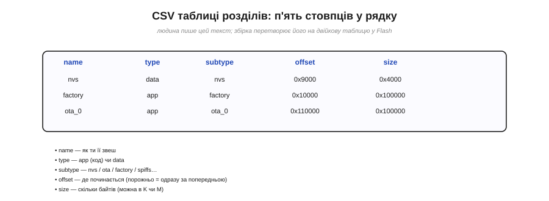
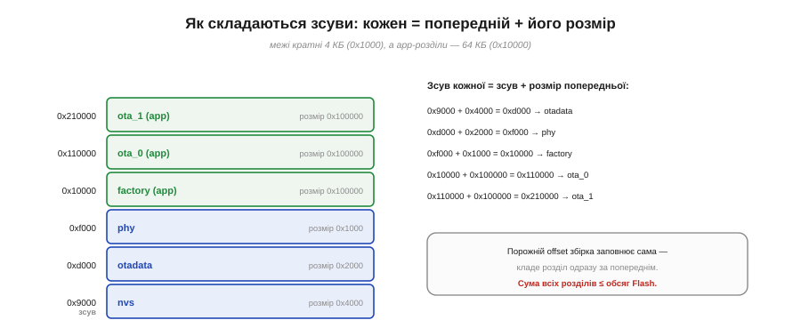

# ⚙️ Власна таблиця розділів: CSV, зміщення, вирівнювання на 4 КіБ

> Таблиця розділів — це карта Flash: вона каже завантажувачу, де лежить код, а де дані. Тут — як скласти свою таку карту, коли стандартної розкладки бракне.

## Задача

Рано чи пізно стандартна розкладка перестає влаштовувати: додаток **виріс** і не влазить у свій розділ; ви хочете **оновлення по повітрю** й вам треба два app-слоти; або потрібно **більше місця** під файлову систему. Тоді доводиться скласти **власну** таблицю розділів. Зробити це треба так, щоб розділи не налазили один на одного, не вийшли за межі чипа й чисто лягли на сектори.

## Ідея

Свою розкладку **описують текстом** — простим CSV-файлом, де кожен рядок це один розділ із п'яти полів:

```
# name,    type, subtype, offset,   size
nvs,       data, nvs,     0x9000,   0x4000
otadata,   data, ota,     0xd000,   0x2000
phy_init,  data, phy,     0xf000,   0x1000
factory,   app,  factory, 0x10000,  0x100000
ota_0,     app,  ota_0,   0x110000, 0x100000
ota_1,     app,  ota_1,   ,         0x100000
```


*Рис. Кожен рядок CSV описує один розділ п'ятьма полями: ім'я, тип (app/data), підтип, зсув і розмір. Людина пише цей зрозумілий текст, а збірка перетворює його на двійкову таблицю у Flash на адресі 0x8000.*

`name` — як ви її звете; `type` — `app` (код) чи `data`; `subtype` уточнює рід (`nvs`, `ota`, `factory`, `spiffs`…); `offset` — з якої адреси починається; `size` — скільки байтів (можна писати в `K`/`M`). Ви правите цей текст, а **збірка** перетворює його на компактну двійкову таблицю й кладе на адресу 0x8000, де її читає завантажувач.

## Рецепт: як порахувати зсуви

Головна робота — правильно розкласти **зсуви**. Правило одне:

```
зсув кожного розділу = зсув попереднього + його розмір
```

Низ Flash зайнятий службовим (завантажувач, а таблиця сидить на 0x8000), тож перший ваш розділ починається близько 0x9000. Далі складаєте по ланцюжку: `nvs` на 0x9000 розміром 0x4000 кінчається на 0xd000 — звідти й починається наступний, і так аж до app на круглій адресі 0x10000.


*Рис. Зсув кожного розділу дорівнює зсуву попереднього плюс його розмір; межі кратні 4 КБ, а app-розділи — 64 КБ. Поле offset можна лишити порожнім — збірка покладе розділ одразу за попереднім сама. Сума всіх розділів не сміє перевищити обсяг Flash.*

**Зручність:** поле `offset` можна лишити **порожнім** — тоді збірка покладе розділ одразу за попереднім сама, і рахувати руками не доведеться. А от `size` порожнім лишати не можна.

## Пастки

- **Вирівнювання.** Кожен `offset` і `size` мусять бути кратні **4 КБ** (0x1000) — бо [стирання Flash іде цілими секторами](book:programming/flash-internals); а app-розділи — кратні **64 КБ** (0x10000). Некратне число — і збірка свариться або мовчки округлить, зсунувши всю розкладку.
- **Перекриття й дірки.** Якщо розділ налазить на сусідній — пишучи в один, трощиш інший. Якщо лишається дірка — не страшно, та марно місце. Лічити суми зсувів і розмірів — найкращий захист.
- **Вихід за межі.** Сума всіх розділів мусить **уміститися** у фізичний Flash (наприклад, 0x400000 на 4 МБ). Перебрав — останньому розділу нема куди лягти.
- **Обов'язкові мешканці.** Має бути рівно один app для запуску — `factory` або хоча б один `ota_*`. Для [оновлення по повітрю](book:programming/ota-slots) потрібні **два** app-слоти однакового розміру **плюс** `otadata`: без неї завантажувач не знатиме, який слот активний.
- **Одиниці.** `size` зручніше писати в `K`/`M` (наприклад, `1M` замість `0x100000`) — менше нагод помилитися в нулях.

## Підсумок

Власна таблиця — це акуратний поділ обмеженого Flash між учасниками: опишіть рядки, дайте збірці порахувати зсуви (лишивши `offset` порожнім), тримайте все кратним 4 КБ — і не дайте сумі перевищити чип. Решту — переведення в двійкову карту й запис на 0x8000 — зробить інструмент.
