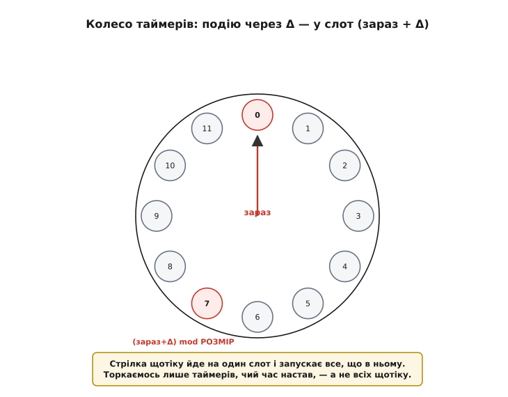
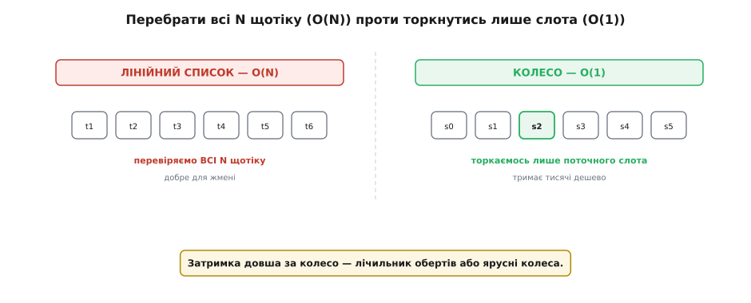

# ⚙️ Колесо таймерів: як планувальник тримає тисячі відкладених подій

[Лінійний список задач](book:programming/nonblocking-time) чудовий для жмені. А коли таймерів — тисячі? Перебирати всі щотіку марнотратно. Є спритніша структура — **колесо таймерів** (англ. *timing wheel*; буквально «колесо таймінгу»).

## Задача

Уявімо систему з **безліччю** відкладених подій: «зроби це через 30 мс», «надішли через 2 с», «повтори через хвилину» — і так тисячі разом (мережеві таймаути, ігрові ефекти, ядро ОС). Простий планувальник на [неблокуючому часі](book:programming/nonblocking-time) щотіку перебирає **весь** список — O(N). Для десятка задач це дрібниця, та для тисяч таймерів означає тисячі перевірок **щотіку**, більшість із яких «ще не на часі». Порахуймо ціну: тисяча таймерів і тік на мілісекунду — це мільйон порівнянь за секунду, з'їдених лише на те, щоб щоразу пересвідчитися, що майже нічого не настало. На скромному МК це відчутна частка процесора, спалена даремно. Як додавати, скасовувати й запускати безліч таймерів, **не** торкаючись усіх щоразу?

## Ідея

Колесо таймерів — кільцевий масив «слотів», як числа на циферблаті. Кожен слот тримає **список** таймерів, чий час настає саме на цьому тіку. Є «стрілка» — поточна позиція, що щотіку посувається на **один** слот уперед. Щоб запланувати подію через Δ тіків, кладемо її у слот **(зараз + Δ) mod РОЗМІР**. А на кожному тіку стрілка переходить на наступний слот і запускає **все**, що в ньому лежить.


*Кільце слотів, як циферблат. Подію через Δ кладуть у слот (зараз + Δ). Стрілка щотіку йде на один слот і запускає все, що в ньому. Торкаємось лише таймерів, чий час настав, — а не всіх щотіку.*

Уся принада в тому, що ми торкаємося **лише** таймерів, чий час **настав** (тих, що в поточному слоті), а не всіх підряд. Додати таймер — кинути в слот, O(1). Запустити — пройти один слот, не весь масив. Скасувати — викинути зі свого слота, O(1).


*Лінійний список перебирає всі N таймерів щотіку — O(N), добре для жмені. Колесо торкається лише поточного слота — O(1), тримає тисячі дешево. Затримка довша за колесо — лічильник обертів або ярусні колеса.*

Перш ніж кодувати, прорахуймо розкладку руками, щоб формула слота й обертів стала наочною.

**Куди ляже подія через 700 тіків у колесі на 256 слотів, якщо стрілка зараз на 100.** Дві величини: у який слот покласти й скільки повних кіл перечекати.

```
РОЗМІР колеса:   256 слотів
стрілка зараз:   cursor = 100
затримка:        delta  = 700 тіків

слот  = (100 + 700) mod 256 = 800 mod 256 = 32
оберти = 700 / 256 (цілочислово) = 2
```

Висновок: таймер лягає у слот 32 з лічильником `rounds = 2`. Стрілка дійде до слота 32 уже за 700−512 = 188 тіків (бо 800 = 3·256 + 32), та перші **два** влучання у цей слот лише зменшать `rounds` (2 → 1 → 0), і тільки на третьому, рівно на 700-му тіку, подія спрацює. Так одне коло на 256 слотів обслуговує будь-яку затримку — ціною того, що «довгі» таймери кілька разів торкнуться свого слота вхолосту.

## Робочий C

Ось мінімальне колесо на чистому C. Кожен слот — однозв'язний список таймерів; поле `rounds` лічить повні кола колеса, які ще треба перечекати, перш ніж таймер спрацює.

:::tabs
```cpp
#define WHEEL_SIZE 256          // степінь двійки → mod = маска

typedef struct Timer {
  uint32_t rounds;              // скільки повних кіл ще чекати
  void (*cb)(void*);            // що зробити, коли настане час
  void *arg;
  struct Timer *next;           // наступний у тому ж слоті
} Timer;

static Timer *wheel[WHEEL_SIZE];
static uint32_t cursor;          // «стрілка» — поточний слот

// запланувати подію через delta тіків
void schedule(Timer *t, uint32_t delta) {
  uint32_t slot = (cursor + delta) & (WHEEL_SIZE - 1);
  t->rounds = delta / WHEEL_SIZE;     // повних обертів колеса
  t->next = wheel[slot];              // вставляємо в голову списку слота — O(1)
  wheel[slot] = t;
}

// викликати рівно раз на тік (з обробника системного тіку)
void tick(void) {
  cursor = (cursor + 1) & (WHEEL_SIZE - 1);
  Timer **pp = &wheel[cursor];        // ідемо лише по ОДНОМУ слоту
  while (*pp) {
    Timer *t = *pp;
    if (t->rounds == 0) {
      *pp = t->next;                   // знімаємо зі слота
      t->cb(t->arg);                   // час настав — запускаємо
    } else {
      t->rounds--;                     // ще одне коло перечекати
      pp = &t->next;
    }
  }
}
```
```py
WHEEL_SIZE = 256                 # степінь двійки → mod = маска

class Timer:
    def __init__(self, cb, arg):
        self.rounds = 0          # скільки повних кіл ще чекати
        self.cb = cb             # що зробити, коли настане час
        self.arg = arg
        self.next = None         # наступний у тому ж слоті

wheel = [None] * WHEEL_SIZE
cursor = 0                       # «стрілка» — поточний слот

# запланувати подію через delta тіків
def schedule(t, delta):
    slot = (cursor + delta) & (WHEEL_SIZE - 1)
    t.rounds = delta // WHEEL_SIZE   # повних обертів колеса
    t.next = wheel[slot]             # вставляємо в голову списку слота — O(1)
    wheel[slot] = t

# викликати рівно раз на тік (з обробника системного тіку)
def tick():
    global cursor
    cursor = (cursor + 1) & (WHEEL_SIZE - 1)
    prev, t = None, wheel[cursor]    # ідемо лише по ОДНОМУ слоту
    while t:
        if t.rounds == 0:
            nxt = t.next             # знімаємо зі слота
            if prev is None:
                wheel[cursor] = nxt
            else:
                prev.next = nxt
            t.cb(t.arg)              # час настав — запускаємо
            t = nxt
        else:
            t.rounds -= 1            # ще одне коло перечекати
            prev, t = t, t.next
```
:::

`WHEEL_SIZE` — степінь двійки, тож дороге `mod` стає дешевою бітовою маскою `& (WHEEL_SIZE - 1)`, а ділення `delta / WHEEL_SIZE` — зсувом. `tick()` чіпає рівно один слот, а не весь масив; `schedule()` лише вставляє в голову списку — обидва дешеві.

Дві деталі, що відрізняють іграшку від робочого коду. **Скасування** має лишитися дешевим: щоб викинути таймер зі слота за O(1), список роблять двозв'язним (тоді не треба шукати попередника) — інакше скасування деградує до O(довжина слота). А **періодичний** таймер легко зробити так: у кол-беку, замість просто зняти таймер, одразу перепланувати його на той самий період — `schedule(t, t->period)`. Виходить регулярне повторення без жодного окремого механізму. Одне застереження: кол-бек біжить усередині `tick()`, тобто фактично в обробнику переривання, тож він має бути коротким і не чіпати самого колеса абияк — довгу роботу краще лише позначити прапорцем, а виконати у фоновій задачі.

## Затримки, довші за колесо

А що, як подію треба за **більше** тіків, ніж слотів у колесі? Два класичні розв'язки.

Простіший — **лічильник обертів**: таймер у слоті пам'ятає, скільки повних кіл колеса лишилось, і спрацьовує, лише коли їх стане нуль (саме це й робить поле `rounds` вище). Дешево й просто, але має ваду: слот із кількома «довгими» таймерами доводиться проходити на кожному оберті лише заради того, щоб зменшити лічильники, — тобто на довгих затримках це вже не зовсім O(1).

Потужніший — **ярусні колеса**: кілька колес різної ціни поділки, складених, як стрілки годинника. Скажімо, чотири колеса по 256 слотів: перше міряє тіки, друге — кроками по 256 тіків, третє — по 256², четверте — по 256³. Затримку розкладають за цими «розрядами», як число за розрядами системи числення, і кладуть таймер у найгрубіше потрібне колесо. Коли стрілка грубого колеса доходить до слота, усі таймери з нього **переносять (каскадують)** на дрібніше колесо — там їх уточнюють до конкретного тіка. Так таймер «спадає» згори вниз, наближаючись до спрацювання, і жоден слот не доводиться проходити вхолосту. Саме ярусні колеса дають справжнє амортизоване O(1) на будь-яку затримку — їх і беруть ядра операційних систем (класичні таймери ядра Linux) та мережеві стеки для мільйонів одночасних таймаутів.

## Складність і пастки на МК

- **O(1) проти O(N) — у цьому суть.** Колесо варто заводити лише тоді, коли таймерів **багато**. Для жмені — [лінійний список](book:programming/nonblocking-time) простіший і не гірший.
- **Оберти псують чистоту O(1).** Слот із `rounds > 0` усе одно треба пройти, щоб зменшити лічильник, — тож при довгих затримках простий лічильник обертів уже не зовсім O(1); ярусні колеса це лікують, ціною складності.
- **Роздільність — один тік на слот.** Дрібніше за тік колесо не міряє; розмір тіка задає й точність, і пам'ять (слотів завжди `WHEEL_SIZE`).
- **Пам'ять — це сам масив слотів.** Колесо завжди тримає `WHEEL_SIZE` покажчиків, незалежно від того, скільки таймерів зараз живе. На 32-бітному МК масив на 256 слотів — це лише 1 КБ, тож широке одноярусне колесо там цілком по кишені; а от наївне «один слот на кожен можливий тік» (аби обійтися без обертів) роздуло б пам'ять до неможливого — тому й беруть скромний РОЗМІР плюс оберти або яруси.
- **Кол-бек біжить у контексті тіку.** Оскільки `tick()` зазвичай висить на перериванні таймера, усе зроблене в кол-беку успадковує всі правила [обробника переривання](book:programming/isr): коротко, без блокувань, важку роботу — у фон.
- **Це структура «дорослих» систем.** На МК із десятком таймерів колесо — надмір. Воно сяє там, де таймерів сотні й тисячі: TCP-ретрансмісії, планувальники ОС, ігрові рушії.

## Підсумок

Колесо таймерів міняє «перебрати всі N щотіку» на «торкнутися лише слота, що настав» — O(1) замість O(N). Циферблат зі слотами, стрілка на тік, подія в слот (зараз+Δ); довгі затримки — обертами чи ярусними колесами. Проєктуючи його, ви балансуєте три величини: роздільність (розмір тіка), найбільшу затримку (розмір колеса й кількість ярусів) і пам'ять (масив слотів). Для жмені таймерів усе це зайве, для тисяч — незамінне.
