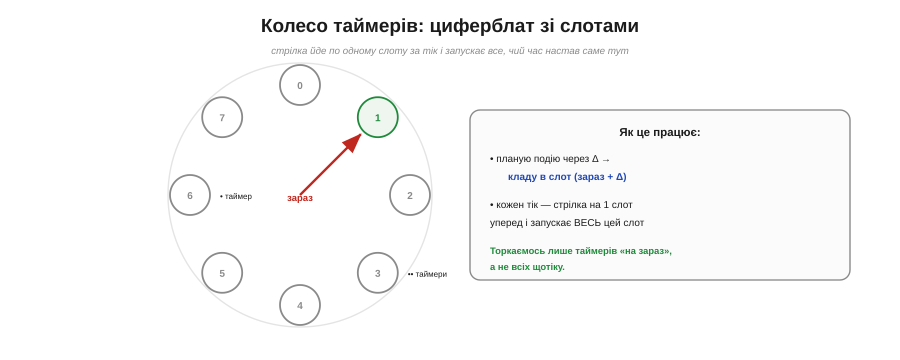
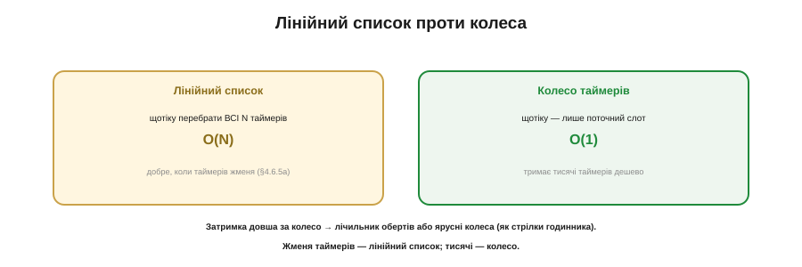

# ⚙️ Колесо таймерів: як планувальник тримає тисячі відкладених подій

> Алгоритмічна вставка до теми [періодичних подій і планування](book:programming/periodic-scheduling). [Лінійний список задач](book:programming/nonblocking-time) чудовий для жмені. А коли таймерів — тисячі? Перебирати всі щотіку марнотратно. Є спритніша структура.

## Задача

Уявімо систему з **безліччю** відкладених подій: «зроби це через 30 мс», «надішли через 2 с», «повтори через хвилину» — і так тисячі разом (мережеві таймаути, ігрові ефекти, ядро ОС). Простий планувальник на [неблокуючому часі](book:programming/nonblocking-time) щотіку перебирає **весь** список — O(N). Для десятка задач це дрібниця, та для тисяч таймерів означає тисячі перевірок **щотіку**, більшість із яких «ще не на часі». Як додавати, скасовувати й запускати безліч таймерів, **не** торкаючись усіх щоразу?

## Ідея

**Колесо таймерів** (*timing wheel*) — кільцевий масив «слотів», як числа на циферблаті. Кожен слот тримає **список** таймерів, чий час настає саме на цьому тіку. Є «стрілка» — поточна позиція, що щотіку посувається на **один** слот уперед. Щоб запланувати подію через Δ тіків, кладемо її у слот **(зараз + Δ) mod РОЗМІР**. А на кожному тіку стрілка переходить на наступний слот і запускає **все**, що в ньому лежить.


*Рис. Кільце слотів, як циферблат. Подію через Δ кладуть у слот (зараз + Δ). Стрілка щотіку йде на один слот і запускає все, що в ньому. Торкаємось лише таймерів, чий час настав, — а не всіх щотіку.*

Уся принада в тому, що ми торкаємося **лише** таймерів, чий час **настав** (тих, що в поточному слоті), а не всіх підряд. Додати таймер — кинути в слот, O(1). Запустити — пройти один слот, не весь масив. Скасувати — викинути зі свого слота, O(1).


*Рис. Лінійний список перебирає всі N таймерів щотіку — O(N), добре для жмені. Колесо торкається лише поточного слота — O(1), тримає тисячі дешево. Затримка довша за колесо — лічильник обертів або ярусні колеса.*

## Псевдокод

```
schedule(таймер, Δ):
    слот = (зараз + Δ) mod РОЗМІР
    таймер.оберти = Δ / РОЗМІР         # скільки повних кіл ще чекати
    колесо[слот].додати(таймер)

tick():
    зараз += 1
    для t у колесо[зараз mod РОЗМІР]:
        якщо t.оберти == 0:
            запустити(t); прибрати(t)
        інакше:
            t.оберти −= 1
```

## Затримки, довші за колесо

А що, як подію треба за **більше** тіків, ніж слотів у колесі? Два класичні розв'язки. Простіший — **лічильник обертів**: таймер у слоті пам'ятає, скільки повних кіл колеса лишилось, і спрацьовує, лише коли їх стане нуль (так у псевдокоді вище). Потужніший — **ярусні колеса**: кілька колес різної ціни поділки, як стрілки годинника (секунди, хвилини, години); таймер «спадає» з грубого колеса на дрібніше, коли його час наближається. Саме ярусні колеса дають справжнє O(1) на будь-яку затримку — їх і беруть ядра ОС та мережеві стеки.

## Складність і пастки на МК

- **O(1) проти O(N) — у цьому суть.** Колесо варто заводити лише тоді, коли таймерів **багато**. Для жмені — [лінійний список](book:programming/nonblocking-time) простіший і не гірший.
- **Оберти псують чистоту O(1).** Слот із «оберти > 0» усе одно треба пройти, щоб зменшити лічильник, — тож при довгих затримках простий лічильник обертів уже не зовсім O(1); ярусні колеса це лікують, ціною складності.
- **Роздільність — один тік на слот.** Дрібніше за тік колесо не міряє; розмір тіка задає й точність, і пам'ять (слотів завжди РОЗМІР).
- **Це структура «дорослих» систем.** На МК із десятком таймерів колесо — надмір. Воно сяє там, де таймерів сотні й тисячі: TCP-ретрансмісії, планувальники ОС, ігрові рушії.

## Підсумок

Колесо таймерів міняє «перебрати всі N щотіку» на «торкнутися лише слота, що настав» — O(1) замість O(N). Циферблат зі слотами, стрілка на тік, подія в слот (зараз+Δ); довгі затримки — обертами чи ярусними колесами. Для жмені таймерів зайве, для тисяч — незамінне.
