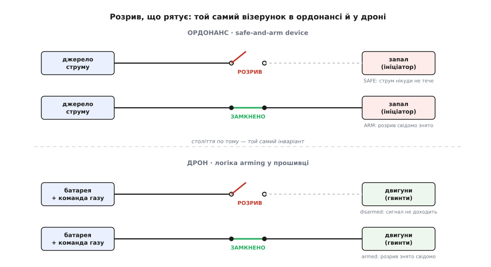

# 📜 Розрив, який рятує: як «safe-and-arm» дійшов від запалу до дрона

Є одна інженерна ідея, така проста, що її легко проґавити, і така міцна, що вона пережила зміну кількох технологічних епох майже без правок. Ось вона: **розірви шлях від джерела енергії до того, що ця енергія запускає, — і система стане безпечною сама собою, доки хтось свідомо не з'єднає розрив назад.** Не «будь обережний», не «не натискай не туди», а фізичний, видимий обрив у ланцюзі, після якого будь-яка помилка, будь-який випадковий струм, будь-яка команда «не туди» просто нікуди не доходить.

Ця думка народилася в артилерійських майстернях і на снарядних заводах, де ціна необережного з'єднання вимірювалась відірваними руками, а тоді через ціле століття, майже незмінна, опинилася в прошивці квадрокоптера — у тому місці, де рядок коду вирішує, чи закрутиться гвинт. Слово, яким її називають, теж мандрувало з ланцюга в ланцюг: те саме `arm`, що колись означало «поставити запал у бойове положення», сьогодні пише автопілот, коли дозволяє двигунам ожити. Простежмо цю тяглість — бо зрозуміти, звідки взявся `arm` у дроні, означає зрозуміти, **чому** він саме такий, а не інакший.

## Слово, що несе в собі зброю

Почнімо зі слова, бо в ньому вже захована вся логіка. Англійське `to arm` — «озброїти, привести в бойову готовність» — прийшло близько 1200 року через старофранцузьке *armer* («дати зброю, взятися за зброю»), а те — прямо з латинського *armāre* («споряджати зброєю»). Корінь — латинське *arma*, «зброя», але буквальніше «знаряддя, приладдя» (того, що для війни). А ще глибше, у праіндоєвропейському корені *\*ar-* «прилаштовувати, припасовувати одне до одного», лежить геть несподіваний для «зброї» відтінок: *arma* — це **«те, що припасоване», зладнане, зібране докупи й готове до діла.**

Це не просто етимологічна цікавинка. Придивіться, що виходить: у самому слові `arm` уже сидить думка про **готовність через складання докупи**. Озброїти — значить звести розрізнені частини в діючу цілість. І коли за вісім століть інженери шукатимуть, як назвати перехід апарата зі стану «зібрано, але безпечно» у стан «зведено докупи й готове діяти», слово вже чекатиме на них із точно потрібним значенням. Латина ніби наперед описала перехід `disarmed → armed`: не «увімкнути», а саме «зладнати частини в готову до дії цілість».

> 🔧 **Навіщо це.** Термін у прошивці — не випадкова наліпка. Коли автопілот пише `Armed`, він каже буквально те саме, що казав артилерист про заряджений запал: система зведена в бойову готовність, і тепер може діяти. Розуміння цього рятує від найпоширенішої помилки новачка — сприймати `arm` як просто «увімкнути живлення». Ні: живлення могло бути ввімкнене весь час. `arm` — це про **готовність завдати дії**, а не про наявність струму. Саме тому обеззброєний апарат під повною напругою — усе одно безпечний.

## Що бентежило зброярів: запал занадто охоче спрацьовує

Тепер — до заліза, і до проблеми, яка це залізо породила. Щоб зрозуміти safe-and-arm, треба спершу відчути жах, з якого він виріс.

Будь-який боєприпас — снаряд, бомба, граната — має **вибуховий ланцюг**: маленький, дуже чутливий ініціатор (запал, детонатор, капсуль) підпалює трохи більший проміжний заряд (бустер), а той уже піднімає основний заряд. Логіка сходинок неминуча: основний заряд навмисне роблять *тупим* — щоб він не здетонував від удару, вогню чи падіння; а щоб його все ж підірвати, потрібен ланцюжок дедалі чутливіших ланок, на вершині якого — ініціатор, чутливий до найменшого поштовху.

І тут проступає моторошний парадокс. **Те, що робить боєприпас надійним у ділі, робить його смертельно небезпечним у руках.** Ініціатор мусить бути чутливим — інакше зброя не спрацює тоді, коли треба. Але саме ця чутливість означає, що впустив ящик, іскра статики, тряска у вагоні — і ланцюг пішов сам собою, на складі чи в руках у того, хто його ніс. Історія раннього боєприпасу — це історія передчасних вибухів: на транспортуванні, при спорядженні, від грубого поводження. Проблема не в тому, що хтось «натиснув не туди». Проблема в тому, що чутливий ініціатор **не має права бути з'єднаним** із рештою ланцюга, доки боєприпас не там, де має спрацювати.

Звідси й народилося питання, на яке відповідає вся ця історія: **як зробити, щоб боєприпас був абсолютно безпечним доти, доки він свідомо не приведений у бойове положення, — і при цьому надійно спрацював, коли треба?** Не «як зменшити ймовірність», а «як зробити передчасне спрацювання фізично неможливим».

## Дві відповіді: розірви шлях або зсунь ланки вбік

Інженери знайшли дві відповіді, і обидві — про той самий **свідомий розрив**, тільки по-різному втілений.

**Механічна відповідь: тримай ланки не на одній лінії.** Найчутливішу ланку — детонатор — фізично **зсовують убік**, щоб вона не була навпроти наступної. Спалахне детонатор випадково — його полум'я вдарить у глуху стінку корпусу, а не в бустер, і ланцюг обірветься на першій же ланці. Цей принцип називають **out-of-line** («не на одній лінії»): вибуховий ланцюг навмисно розірваний геометрично. Щоб боєприпас озброївся, спеціальний механізм — ротор чи повзунок — **виставляє ланки в одну лінію** (*in-line*), і аж тепер спрацювання однієї ланки доходить до наступної. Ось де знову впізнаємо латинське *arma*: озброїти — це буквально **звести ланки докупи, на одну вісь.**

**Електрична відповідь: розірви провід.** Коли ініціатор підпалюється не механічно, а електричним імпульсом (такий ініціатор звуть EED — electro-explosive device), розрив стає ще нагляднішим. Між джерелом струму й ініціатором просто **розмикають ланцюг** — фізичним перемикачем, вийнятою перемичкою, розсунутим контактом. Струм фізично **не має куди текти** до ініціатора. Замкнути цей розрив — і є акт озброєння.

Пристрій, що втілює цей розрив і керує ним, дістав пряму, без прикрас назву: **safe-and-arm device** — «пристрій безпеки-й-озброєння». Його єдина робота — тримати шлях розірваним (стан SAFE), поки не настане час, і надійно замкнути його (стан ARM) лише за правильних умов. У ракетних і космічних системах його ще звуть *ignition safety device* (ISD) або скорочено *AD-switch* — і суть та сама: він **розриває шлях від джерела енергії до ініціатора** й не пускає струм, доки розрив свідомо не знято.

Ось той самий електричний шлях у двох станах — і поруч його прямий нащадок у прошивці дрона:

*Угорі — ордонансний safe-and-arm: у стані SAFE фізичний розрив між джерелом струму й запалом; ланцюг замикається лише в ARM. Унизу — той самий візерунок у дроні: доки система обеззброєна, логіка розриває шлях від батареї до двигунів, і команда газу нікуди не доходить. Змінилося все — залишився розрив.*

Зверніть увагу, чому цей підхід настільки міцний. Він не покладається на **пильність** — на те, що хтось буде обережним. Він робить систему безпечною **за побудовою**: доки розрив на місці, немає такої послідовності подій, яка привела б до спрацювання, бо енергії просто **немає куди дійти**. Помилка оператора, збій електроніки, випадковий імпульс — усе це впирається в фізичний обрив. Безпека тут не залежить від того, що ніхто не помилиться; вона тримається на тому, що навіть помилка нічого не запускає.

## Замало одного розриву: правило двох незалежних застав

Але один розрив — це ще не вся мудрість, яку зброярі виболіли за десятиліття. Бо розрив можна зняти **випадково**. Один перемикач може замкнутися сам від тряски; одна ланка може зсунутись на лінію від удару. Якщо вся безпека тримається на **одній** заставі, то один-єдиний збій цієї застави відкриває шлях до катастрофи.

Відповідь, до якої дійшла ордонансна інженерія, стала залізним правилом, і її варто прочитати уважно, бо саме вона потім дослівно повториться в дроні. Стандарт на проєктування підривників (MIL-STD-1316, «Fuze Design, Safety Criteria For») вимагає: у системі має бути **щонайменше дві незалежні застави безпеки**, кожна сама здатна не дати озброїтися. Але — і ось де тонкість — цього замало. Стандарт вимагає ще, щоб ці дві застави спрацьовували **від різних середовищ** (*different environments*): різних фізичних явищ, різних сигналів. Бо якщо обидві реагують на одне й те саме, то одна причина може зняти обидві разом — і незалежність виявиться уявною.

Вдумаймося, чому це геніально. Уяви, що обидві застави відкриваються від прискорення пострілу. Тоді досить сильного удару при падінні — і **обидві** знімуться заразом, боєприпас озброїться сам. А тепер зроби так, щоб одна відкривалася від прискорення пострілу, а друга — від, скажімо, обертання снаряда чи набутої дистанції. Тепер жодна **одна** випадкова подія не зніме обидві: падіння дасть прискорення, але не обертання; тряска на складі — ні того, ні того. Щоб озброїтися, боєприпас має пережити **саме ту комбінацію умов, яка буває лише в справжньому пострілі** — і майже ніколи в аварії.

> 🔧 **Навіщо це.** Правило «дві незалежні застави від різних середовищ» — це не бюрократія, а глибоко продумана оборона від **спільної причини відмови** (common-cause failure). Два замки, що відкриваються однаковим ключем, — насправді один замок. Ця думка виходить далеко за межі зброї: щоразу, коли ви хочете, аби система не могла зробити небезпечне через один-єдиний збій, ви ставите кілька застав — і **навмисно робите їх різними за природою**, щоб їх не зняло одне й те саме. Тримайте це в голові: рівно цей принцип за мить проступить у дроні.

## Як воно взводилося: живий приклад проміжного заряду

Щоб принцип став дотикальним, погляньмо на один із найвитонченіших його зразків — радіопідривник (VT-, proximity fuze), який союзники довели до діла під час Другої світової. Це був складний прилад — по суті, крихітний радар у голівці снаряда, що підривав заряд поблизу цілі, — і саме тому його безпека мусила бути бездоганною: занадто багато чутливої електроніки, занадто легко спрацювати завчасно.

Подивіться, як багатошарово там знято розрив — і як точно кожен шар прив'язаний до **свого** середовища:

- Спершу треба **розкрутити** невеликий вітрячок у потоці повітря (для бомбового підривника) — або відпустити генератор прискоренням пострілу (для снарядного). Немає польоту — немає живлення. Це перша перевірка: «я справді в польоті».
- Далі генератор має **напрацювати достатньо енергії** й накопичити її в конденсаторі — на це йде частка секунди. Немає накопиченої енергії — нема чим підпалювати.
- Потім, після певного числа обертів вітрячка (тобто після певної **пройденої відстані**), у ланцюг вмикають електричний детонатор. Ось де знімається електричний розрив — і не одразу, а **лише коли снаряд відлетів на безпечну дистанцію** від того, хто стріляв.
- А в снарядному підривнику окремо працює **ртутний перемикач**: відцентрова сила пострілу жене крапельку ртуті крізь пористу перегородку, і аж тоді вона замикає контакт, що доти закорочував запал. Немає обертання снаряда — ртуть не рушить.

Полічіть середовища: **обертання** вітрячка, **прискорення** пострілу, **пройдена відстань**, **обертання** снаряда. Кожна застава слухає своє явище. Щоб підривник озброївся, мусить збігтися **вся** ця комбінація — а вона буває лише в справжньому пострілі. На складі, при падінні, від удару — ніколи. Саме тому радіопідривник, напханий чутливою електронікою, був безпечніший у поводженні, ніж прості ударні підривники, які він заміняв.

Зверніть увагу на глибшу річ, яка тут проступає. Кожна застава не просто «блокує» — вона **звіряє припущення про те, що боєприпас справді там, де має спрацювати**: летить, пройшов дистанцію, обертається. Це вже не просто розрив — це **розрив, знятий лише тоді, коли підтверджено правильні умови.** І ось ця думка — «знімай захист тільки коли умови підтверджені» — і є той місток, яким принцип перейде з боєприпасу в автопілот.

## Простіший родич: граната, яку тримає рука

Не думайте, що вся ця мудрість жила лише в дорогих снарядах. Найнаочніший safe-and-arm носили в кишені мільйони солдатів — це ручна граната, і її історія добре датована.

1915 року британський інженер Вільям Міллс (William Mills) налагодив у Бірмінгемі випуск гранати, яку назвали його ім'ям — *Mills bomb*, No. 5. До неї гранати часто були небезпечніші для того, хто кидав, ніж для ворога. Міллс дослідив типові вади й зробив просту, надійну конструкцію: підпружинений ударник, притиснутий важелем, а важіль замкнено **запобіжною чекою** (safety pin). Логіка знову та сама — **два розриви, зняті послідовно й свідомо**:

- Чека фізично не дає важелю зіскочити. Поки вона на місці, ударник замкнений — граната абсолютно безпечна, хоч кидай, хоч упусти.
- Виймаєш чеку — але важіль ще притиснутий **твоєю рукою**. Другий розрив тримає сама долоня. Доки не кинув — нічого не сталося.
- І лише коли граната **полишила руку**, важіль зіскакує, звільняє ударник, і починається відлік запалу (у Mills — близько чотирьох секунд, щоб кидач устиг сховатися).

Придивіться до краси цього рішення. Тут теж **дві незалежні застави від різних «середовищ»**: свідома дія (вийняти чеку) і фізичний стан (рука відпустила важіль). Одного замало: вийняв чеку, але тримаєш — безпечно; відпустив би без виймання чеки — теж нічого. Небезпека вмикається лише на **перетині** — свідомо роззброїв *і* випустив із руки. І затримка запалу — це знову «безпечна дистанція»: розрив між дією і наслідком, щоб устигнути прибрати руку.

Ця граната — той самий safe-and-arm, зведений до кишенькової простоти. І в ній, як під лупою, видно всі три складники, які потім успадкує дрон: **безпека за побудовою** (ударник замкнений, доки не звільнений), **свідома дія людини** як окрема застава (вийняти чеку) і **тверде правило** — небезпека тільки на перетині кількох незалежних умов.

## Стрибок у прошивку: коли розрив став рядком коду

А тепер — головний перехід усієї цієї історії. У другій половині XX століття ланцюги дедалі частіше ставали **електричними й цифровими**, а не суто механічними. Розрив із фізичного проміжка перетворювався на **розімкнене реле, незамкнений транзистор, а зрештою — на змінну в пам'яті**, яка вирішує, пускати енергію чи ні. Слово `arm` поїхало разом із залізом: у ракетній і космічній техніці командою *arm* уже давно вмикали здатність систем спрацювати, а *disarm* — відбирали її.

Коли на початку XXI століття виросли аматорські й дослідницькі автопілоти для мультикоптерів — насамперед відкриті ArduPilot і PX4, — їхні творці зіткнулися рівно з тією самою проблемою, що й зброярі століттям раніше, тільки в мирній подобі. Квадрокоптер у спокої безпечний, а щойно гвинти беруть тягу — стає машиною, здатною порізати руки й полетіти «кудись у нікуди». Отже, потрібен **охоронюваний перехід** між «зібрано, безпечно» і «готове діяти». Готовий термін і готова ідея вже лежали в інженерній культурі — і автопілоти взяли їх майже дослівно.

Ось як ордонансна лінія проступає в дроні, ланка за ланкою:

- **Обеззброєний стан = знятий розрив.** Доки апарат `disarmed`, керуючий сигнал до двигунів **не доходить** — рівно як струм не доходив до запалу через розімкнений safe-and-arm. Це стан, безпечний за побудовою: жодна команда газу, жоден збій не крутне гвинт, бо шлях розірваний у логіці.
- **Дві незалежні застави — точнісінько як у MIL-STD-1316.** Щоб озброїтися, апарат має пройти дві незалежні перевірки, і вони — від «різних середовищ»: (1) **передпольотні перевірки** підтверджують, що система придатна (давачі, GPS, батарея), і (2) **свідома команда людини** підтверджує, що цього справді хтось захотів. Одна боронить від несправного апарата, друга — від ненавмисного запуску справного. Не збіг обидві — лишаємось обеззброєними. Це той самий принцип «дві застави, різні причини», тільки в коді.
- **Апаратний запобіжний вимикач = запобіжна чека.** Багато польотних плат мають окрему фізичну кнопку-запобіжник (safety switch, часто вбудовану в GPS-модуль), яку треба натиснути, перш ніж апарат дасть себе озброїти. Це прямий нащадок Міллсової чеки: **фізична, свідома дія рукою** як окрема застава, незалежна від будь-якої логіки.
- **`arm` — це замкнути розрив.** Сам перехід у стан `armed` — це та мить, коли розрив свідомо знято: тепер, і лише тепер, керуючий сигнал доходить до двигунів. Точний аналог того, як замикання safe-and-arm вперше пускало струм до запалу.

Тяглість тут не метафорична, а буквальна. Змінилося все — механіка стала логікою, порох поступився літій-полімеру, снаряд — квадрокоптеру. А **інваріант** — незмінне ядро ідеї — лишився той самий: тримай систему безпечною за побудовою через свідомо знімний розрив; став **дві незалежні застави**, щоб один збій не зняв обидві; **знімай захист лише тоді, коли підтверджено правильні умови.** Артилерист XIX століття, зброяр Другої світової і програміст автопілота розв'язують одну задачу — і приходять до однієї відповіді, бо задача, по суті, вічна: **як дати системі здатність діяти, не даючи їй діяти передчасно.**

## Що з цього винести

Наступного разу, коли автопілот відмовиться `arm`, згадайте, звідки в цього слова родовід. За рядком коду, що не пускає гвинт крутитися, стоїть століття виболеного досвіду — відірвані на снарядних заводах руки, гранати, небезпечніші для кидача, ніж для ворога, стандарти, писані кров'ю передчасних вибухів. Уся ця історія скристалізувалась у кілька залізних правил, які прошивка дрона успадкувала майже без змін:

**Безпека — за побудовою, а не за домовленістю.** Не «будь обережний», а фізичний (чи логічний) розрив, після якого помилка нікуди не доходить. Обеззброєний апарат безпечний не тому, що оператор пильний, а тому, що шлях до двигунів **розірваний**.

**Дві незалежні застави, і навмисно різні.** Один замок — це один збій до біди. Тому їх щонайменше два, і вони слухають різні речі: система придатна (перевірки) *і* людина свідомо цього захотіла (команда). Щоб їх зняло одне випадкове? Ні — вони від різних середовищ.

**Свідома дія людини — окрема застава.** Вийнята чека, натиснута кнопка, витриманий стік — жест, який не можна зробити ненароком. Машина не озброюється сама; її озброює людина, і саме тому цю дію роблять помітною.

**Знімай захист лише коли умови підтверджені.** Розрив знімається не «на команду», а «на команду **за правильних умов**»: підривник — коли летить і пройшов дистанцію; дрон — коли давачі справні й оператор захотів. Захист відступає точно тоді, коли доведено, що діяти вже безпечно.

Ось чому `arm` у дроні — не випадкове модне слівце й не просто «увімкнути». Це найдавніша інженерна відповідь на найдавніше інженерне питання про небезпечні машини, донесена крізь століття майже недоторканою: **розрив, який рятує, — і знімається лише свідомо.**
