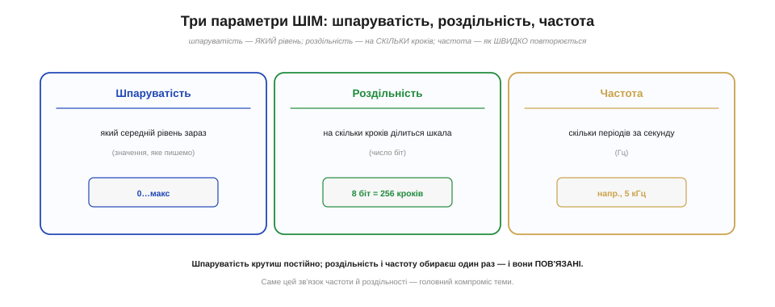
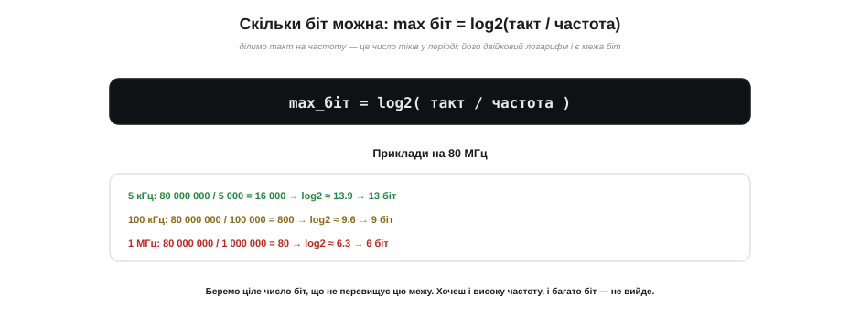

# Шпаруватість, роздільність, частота (компроміси)

ШІМ описують **три** числа, і важливо не плутати їх. **Шпаруватість** — який середній рівень ви хочете зараз (значення, яке записуєте). **Роздільність** — на скільки кроків поділено шкалу шпаруватості (наскільки тонко нею можна керувати). **Частота** — скільки разів на секунду повторюється імпульс. Перше крутять постійно, а друге й третє обирають раз — і вони **пов'язані**: не можна одночасно мати дуже високу частоту й дуже тонку роздільність. Ця тема — про ці три параметри, головний компроміс між ними й про те, як обирати їх під конкретну задачу. А наприкінці — про пастку людського зору, через яку «рівні кроки» виглядають нерівними.

### Три параметри: що є що

Спершу чітко розкладімо три величини по полицях, щоб далі не плутати.


*Рис. Три параметри ШІМ. **Шпаруватість** — який середній рівень зараз (значення, яке пишемо). **Роздільність** — на скільки кроків ділиться шкала (число біт: 8 біт = 256 кроків). **Частота** — скільки періодів за секунду (наприклад, 5 кГц). Шпаруватість крутимо постійно; роздільність і частоту обираємо раз — і вони пов'язані.*

Ключова помилка, якої варто уникати: **роздільність — це не точність напруги, а кількість кроків шпаруватості**. Вісім біт означає, що між повним вимкненням і повним увімкненням є 256 ступенів — не більше й не менше. Чим більше біт, тим дрібніший крок між сусідніми рівнями шпаруватості — тим плавніше керування. Розберімо це докладніше.

Підкреслімо ще раз, бо це часто плутають: роздільність ШІМ ділить на кроки **час** (частку періоду), а не напругу безпосередньо. «256 рівнів» означає 256 можливих **ширин** імпульсу; а в яку середню напругу це виллється — залежить від [живлення навантаження](book:programming/pwm). Тому не сприймайте роздільність ШІМ як «точність у вольтах» — це радше «дрібність ручки» шпаруватості. Справжню напругу зі ШІМ дістають згладжуванням через [RC-фільтр](book:electronics/rc-filter), і її рівність залежить не лише від кількості біт, а й від фільтра.

Зручна аналогія — фотоапарат: там теж три взаємопов'язані ручки (витримка, діафрагма, чутливість), і зміна однієї тягне за собою інші. У ШІМ так само: шпаруватість — це «що знімаємо» (конкретна картинка), а роздільність і частота — «налаштування камери», які ділять один бюджет і впливають одне на одне. Розібравшись, як ці троє взаємодіють, ви керуватимете ШІМ свідомо, а не навмання підбираючи числа, доки «запрацює».

### Роздільність — на скільки кроків ділиться шпаруватість

Уявімо регулятор яскравості. Якщо в нього лише **4** положення (2 біти) — вимк., третина, дві третини, повна — то керувати яскравістю можна тільки цими грубими сходинками; плавного переходу не вийде. А якщо положень **256** (8 біт), сусідні ступені майже не відрізняються, і яскравість змінюється практично неперервно.


*Рис. Роздільність — це кількість кроків шпаруватості. 2 біти — лише 4 рівні (груба «сходинка»: вимк./33%/66%/повна). 8 біт — 256 рівнів (майже неперервна, плавна шкала). Для світлодіода 8 біт зазвичай досить; для звуку чи точного керування беруть більше (10–12 біт).*

Скільки біт потрібно — залежить від задачі. Для дімування світлодіода 8 біт (256 кроків) майже завжди вистачає: око все одно не розрізнить тонших градацій (з поправкою на гамму, про яку нижче). Для відтворення звуку через ШІМ чи точного керування беруть більше — 10, 12 біт. Але скільки б біт ви не захотіли, є межа, і ставить її **частота**.

Замала роздільність дається взнаки **видимими стрибками**. У дімера на 4–8 рівнях око ловить різкі зміни яскравості замість плавного переходу; у ШІМ-звуці брак біт чути як «зернистий» шум квантування. Це та сама причина, чому якісний звук записують 16-бітним, а не двобітним форматом: чим грубіша шкала, тим помітніша «сходинковість». Тож роздільність беруть із запасом — не «скільки мінімально працює», а «скільки треба, щоб кроки стали непомітними для ока чи вуха».

### Головний компроміс: частота × кроки ≤ такт

Ось серцевина теми. Як влаштовано [апаратний ШІМ на таймері](book:programming/hardware-pwm): період таймера в тіках дорівнює числу кроків (2^роздільність), а частота = такт / період. Складемо це разом — і дістанемо залізне правило: **частота × 2^роздільність ≤ частота такту**. Інакше кажучи, за один період ШІМ має вміститися 2^роздільність тіків лічильника; що вища частота, то коротший період, то менше тіків у ньому — і то менше біт роздільності лишається.


*Рис. За один період ШІМ має вміститися 2^роздільність тіків. На 80 МГц: на 1 кГц у періоді 80 000 тіків (аж 16 біт), на 5 кГц — 16 000 (13 біт), на 100 кГц — лише 800 (9 біт), на 1 МГц — 80 (6 біт). Вища частота «з'їдає» роздільність — тому беруть якнайнижчу частоту, що ще годиться навантаженню.*

Подивіться на таблицю: підняли частоту вдесятеро — і втратили ~3 біти роздільності. Це прямий, неминучий компроміс: частота й роздільність ділять той самий «бюджет» тіків у періоді. Не можна мати водночас і мегагерцову частоту, і 16-бітну плавність — на це просто не вистачає швидкості такту.

Чи є вихід із цього компромісу? Частково. По-перше, на **низьких** частотах біт стає аж надміру (для сервопривода на 50 Гц формула дає близько 20 біт — більше, ніж будь-коли потрібно). По-друге, апаратний максимум LEDC — 20 біт, тож угору роздільність теж обмежена. А коли потрібні водночас і висока частота, і тонкі градації, вдаються до хитрощів на кшталт **дизерингу** — швидкого чергування двох сусідніх рівнів шпаруватості, чиє середнє лягає між ними й дає «ефективно» більше кроків. Але для типових задач досить просто розумно обрати пару «частота — роздільність».

### Скільки біт можна: формула

Перетворимо правило на просту формулу для розрахунку. Поділивши частоту такту на бажану частоту ШІМ, дістаємо число тіків у одному періоді; а скільки біт у це число вкладається — показує двійковий логарифм: **max біт = log₂(такт / частота)**.


*Рис. Максимум біт = log₂(такт / частота). На 80 МГц: для 5 кГц виходить log₂(16000) ≈ 13.9 → 13 біт; для 100 кГц — log₂(800) ≈ 9.6 → 9 біт; для 1 МГц — log₂(80) ≈ 6.3 → 6 біт. Беремо ціле число біт, що не перевищує цю межу.*

Користуватися формулою просто: підставте частоту такту (на ESP32 зазвичай 80 МГц) і бажану частоту ШІМ — і дізнаєтеся стелю роздільності. Беруть ціле число біт **не вище** цієї стелі. На практиці середовище само перевірить сумісність і повідомить, якщо пара неприпустима, — але розуміти причину корисно, щоб одразу обирати робочі значення.

> 🔧 **Навіщо це.** Якщо ESP32 «не приймає» вашу пару частоти й роздільності або ШІМ поводиться дивно — майже завжди це порушений компроміс: ви замовили забагато біт для такої високої частоти. Лік простий: або **знизьте частоту** (якщо навантаження дозволяє), або **зменште роздільність**. Тримайте в голові орієнтир: на 80 МГц «8 біт + кілька кілогерц» завжди влізе з запасом, а от «16 біт + сотні кілогерц» — ні.

Формулу зручно читати й у зворотний бік. Якщо знаєте, скільки біт **потрібно**, — одразу бачите **стелю частоти**: вона дорівнює такт / 2^біт. Хочете 12 біт? Тоді частота не вища за 80 000 000 / 4096 ≈ 19.5 кГц. Хочете повних 16 біт? Стеля падає до ~1.2 кГц. Компроміс працює в обидва боки: задавши одне з двох — отримуєте обмеження на друге. Зручно прикинути обидві стелі ще до написання коду.

### Як обирати: спершу частота, тоді роздільність

Звідси готовий рецепт вибору, де порядок важливий. **Спершу** обирають частоту — її диктує **фізика навантаження**: для світлодіода понад ~200 Гц (щоб не блимало навіть на відео), для мотора найчастіше одиниці-десятки кілогерц (щоб [не свистів](book:programming/pwm)), для звуку — вище за поріг чутності. **Потім** беруть роздільність — найбільшу, що вміщається за формулою.


*Рис. Порядок вибору: (1) частоту визначає навантаження (LED > 200 Гц; мотор 1–20 кГц; звук за чутністю); (2) роздільність беруть найбільшу, що вкладається за формулою (для LED 8 біт майже завжди досить). Правило — **найнижча частота, що годиться навантаженню**: так лишається найбільше біт на плавність.*

Золоте правило звідси таке: беріть **якнайнижчу** частоту, яка ще задовольняє навантаження. Що нижча частота — то більше тіків у періоді — то більше біт роздільності лишається на плавне керування. Надто висока частота дарма «з'їдає» роздільність. Задовольніть навантаження мінімально достатньою частотою, а решту «бюджету» віддайте плавності.

**Порахуймо: ШІМ-дімер для світлодіода.**

```
Ціль: плавне дімування світлодіода.

  1) Частота: 1 кГц — без видимого блимання, з великим запасом.
  2) Стеля роздільності: log2(80 000 000 / 1000) = log2(80000) ≈ 16 біт
  3) Беремо, скажімо, 10 біт — шкала 0…1023, більш ніж плавно для ока.

  ledcAttach(pin, 1000, 10);   // 1 кГц, 10 біт
  ledcWrite(pin, 512);         // ~50% яскравості

Для звуку через ШІМ: частота 40 кГц (за чутністю),
  стеля = log2(80M/40k) = log2(2000) ≈ 11 біт — теж досить.
```

Щоб не рахувати щоразу, запам'ятайте кілька робочих орієнтирів. **Світлодіод**: 1–5 кГц, 8–10 біт (понад 1 кГц ще й позбавляє смуг на відеозаписі). **RGB-світлодіод**: те саме, три канали. **Сервопривід**: рівно 50 Гц (період 20 мс), біт там удосталь. **Колекторний мотор або вентилятор**: 20 кГц і вище — за порогом чутності, щоб не свистів, 8–10 біт. **Звук через ШІМ**: десятки кілогерц і якомога більше біт (тут компроміс відчутний). Ці кілька цифр закривають більшість проєктів.

### Підступ сприйняття: око бачить нелінійно

Наостанок — практична пастка, що дивує всіх, хто вперше робить «плавне затемнення». Здавалося б, рівні кроки шпаруватості мають давати рівні кроки яскравості. Та **око так не працює**: воно сприймає яскравість приблизно **логарифмічно**. Тому за лінійної зміни шпаруватості внизу шкали світло різко «стрибає» (від ледь видимого до помітного), а вгорі майже не змінюється (між 80% і 100% різниці не видно).


*Рис. Лінійні кроки шпаруватості (сіра пряма) дають нерівне сприйняття: око (червона крива) бачить різкий стрибок унизу й майже сталий рівень угорі. Лік — **гамма-корекція**: поріг = (рівень/макс)^гамма, або таблиця перерахунку. Більша роздільність теж допомагає, бо дає тонші кроки внизу. Тоді дімування виглядає справді рівним.*

Засіб відомий — **гамма-корекція**: замість записувати шпаруватість прямо пропорційно бажаній яскравості, її пропускають через степеневу криву (поріг = (рівень/максимум)^гамма, де гамма ≈ 2). Це «розтягує» нижню частину шкали (де око найчутливіше) і стискає верхню. На практиці часто беруть готову **таблицю перерахунку** «рівень → шпаруватість». Більша роздільність тут теж до речі: вона дає тонші кроки внизу, де гамма-крива найкрутіша.

> 🔧 **Навіщо це.** Якщо ваше «плавне затемнення» виглядає так, ніби світло різко спалахує на старті й «застигає» в кінці, — це не баг, а **гамма** людського зору. Не намагайтеся «полагодити» це лінійними кроками — застосуйте гамма-криву чи таблицю перерахунку, і дімування стане візуально рівним. Те саме стосується звуку (гучність теж сприймається логарифмічно). Запам'ятайте: **рівне для приладу ≠ рівне для людини**.

Цю нелінійність давно стандартизовано: для світла є крива світлоти CIE L* (стандарт CIELAB, 1976), за якою будують таблиці гамма-корекції в серйозних драйверах світлодіодів. Звук іде тим самим шляхом: гучність ми чуємо логарифмічно (звідси й шкала децибел), тож регулятор гучності на ШІМ теж роблять логарифмічним, а не лінійним. А от у керуванні **положенням** (сервопривід, позиція мотора) нелінійності сприйняття нема — там шпаруватість має бути саме лінійною, бо вимірюємо фізичну величину, а не відчуття. Коротко: гамма потрібна там, де є **відчуття** (світло, звук), але не там, де є **механіка**.

Цей трикутник «шпаруватість — роздільність — частота» — окремий прояв загального інженерного закону: ресурс (тут — тіки такту за секунду) скінченний, і його доводиться **ділити** між суперечливими бажаннями (швидко повторювати проти тонко градуювати). Той самий компроміс діє і в зворотному напрямку — при [перетворенні аналогу на цифру](book:electronics/adc), де він постає як «частота вимірів проти роздільності». Вміючи свідомо розподіляти такий бюджет, ви отримуєте ключ до багатьох тем цифрової електроніки.

Отже, ШІМ описують три числа: **шпаруватість** (який рівень), **роздільність** (на скільки кроків) і **частота** (як швидко). Роздільність і частота пов'язані залізним компромісом «частота × 2^роздільність ≤ такт», а стелю біт дає формула max біт = log₂(такт / частота). Обирають у порядку «спершу частота під навантаження, тоді роздільність, що вміщається»: найнижча прийнятна частота залишає найбільше тіків у бюджеті на плавність. І пам'ятайте про гамму: сприйняття ока й вуха нелінійне, тож «плавне» для людини — це крива, а не пряма. А коли від ШІМ потрібне не середнє по навантаженню, а справжня рівна **аналогова напруга** без миготіння, імпульси [згладжують RC-фільтром](book:electronics/rc-filter) — простим колом із резистора й конденсатора.
