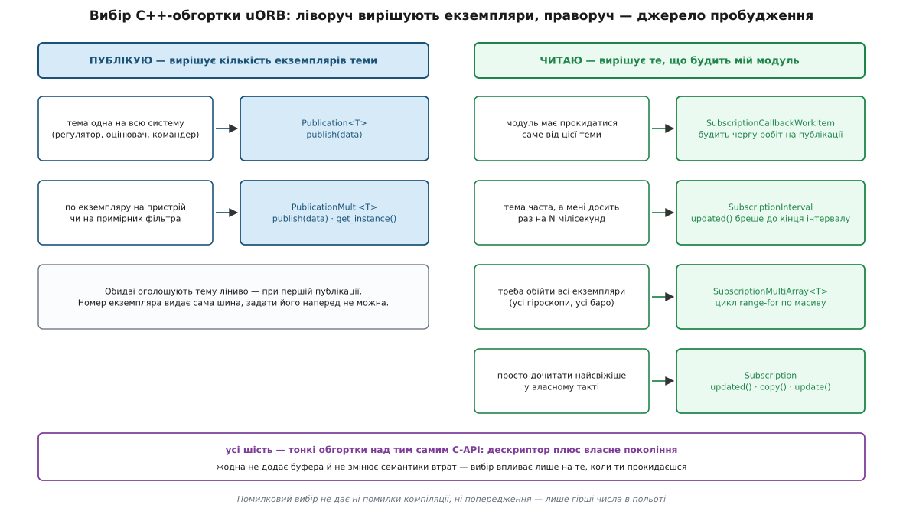

# 📋 Контракт uORB: опис теми, виклики, консоль

Це довідник тієї частини uORB, що стирчить назовні й до якої компілятор безжальний: як пишеться опис повідомлення, які саме сигнатури дає C-API, яку з шести C++-обгорток брати під конкретну потребу і що показують чотири консольні команди. Шина всередині тонка, тому майже всі помилки живуть саме тут — у контракті, а не в реалізації.

## Опис повідомлення: файл у `msg/`

Тема починається не з коду, а з текстового файла. Правило іменування розводить три різні назви, і плутанина між ними — перша річ, на якій спотикаються:

| що | приклад | звідки береться |
|---|---|---|
| файл опису | `msg/VehicleAttitude.msg` | пишеш ти, ВеликимиГорбами |
| ім'я теми | `vehicle_attitude` | ім'я файла, переведене в підкреслення |
| C-структура | `struct vehicle_attitude_s` | ім'я теми плюс суфікс `_s` |
| заголовок | `<uORB/topics/vehicle_attitude.h>` | генерується у теку складання |

Синтаксис усередині файла — рядок на поле, `#` починає коментар:

```
# Quaternion rotation from the FRD body frame to the NED earth frame

uint32 MESSAGE_VERSION = 0

uint64 timestamp                # час публікації, мкс від старту системи
uint64 timestamp_sample         # час, коли фізично взято вимір

float32[4] q                    # кватерніон, порядок (w, x, y, z)
float32[4] delta_q_reset        # наскільки кватерніон стрибнув на скиданні
uint8 quat_reset_counter        # лічильник скидань

# TOPICS vehicle_attitude vehicle_attitude_groundtruth external_ins_attitude
# TOPICS estimator_attitude
```

Типи полів — рівно ті, що мають однозначний машинний розмір:

| категорія | типи |
|---|---|
| цілі | `int8` `uint8` `int16` `uint16` `int32` `uint32` `int64` `uint64` |
| дробові | `float32` `float64` |
| інші скалярні | `bool` `char` |
| масив сталої довжини | `float32[3] xyz`, `char[127] text` |
| вкладене повідомлення | `PositionSetpoint current` |

Списку немає навмисно: рядків немає, масивів змінної довжини немає, вкладених масивів повідомлень змінної довжини теж немає. Причина одна на всіх — [розмір структури мусить бути відомий компілятору](topic:programming/data-serialization), бо буфер вузла теми виділяється один раз назавжди. Текст передають фіксованим `char[N]` і мовчки ріжуть довше.

Рядок із **ВЕЛИКИМ** іменем і знаком `=` — це не поле, а стала: вона потрапляє в структуру як `static constexpr`, місця в повідомленні не займає й на шину не їде.

```
uint8 NUM_ACTUATOR_OUTPUTS = 16      # стала, доступна як actuator_outputs_s::NUM_ACTUATOR_OUTPUTS
uint32 noutputs                      # поле, займає 4 байти в кожному повідомленні
```

Дві сталі з цієї родини генератор розпізнає особисто, і вони міняють саму поведінку теми:

| стала | що робить | обмеження |
|---|---|---|
| `uint8 ORB_QUEUE_LENGTH = N` | тема тримає не одне останнє значення, а кільце на `N` | `N` — степінь двійки (2, 4, 8, 16…); без цього рядка глибина 1 |
| `uint32 MESSAGE_VERSION = N` | оголошує версію опису для зовнішнього світу | лише у файлах із `msg/versioned/` |

Вимога степеня двійки не декоративна: індекс у [кільцевому буфері](topic:algorithms/ring-buffer) вузла береться маскуванням молодших бітів, а не діленням із остачею. Число 6 у цьому рядку дасть тему, що поводиться незрозуміло, а не помилку складання.

Два синтаксичні прийоми лишаються, і обидва виглядають як коментар, хоч коментарем не є.

**`# TOPICS a b c`** створює з одного опису кілька **різних тем** з однаковою структурою. Це не те саме, що екземпляри: `vehicle_attitude` і `estimator_attitude` — окремі вузли з окремими іменами, і `ORB_ID(estimator_attitude)` існує як самостійний символ. Рядків `# TOPICS` може бути кілька; імена з них просто складаються. Якщо жодного немає, тема одна й зветься як файл.

**Вкладення** підставляє одну структуру в іншу цілком:

```
uint64 timestamp
PositionSetpoint previous
PositionSetpoint current
PositionSetpoint next
```

У C це дає `struct position_setpoint_s previous;` усередині `position_setpoint_triplet_s`. Вкладене повідомлення саме собою темою не стає — воно лише тип.

### Версіоновані описи

Тека `msg/versioned/` — це обіцянка сумісності назовні. Опис у ній несе `uint32 MESSAGE_VERSION = N`; щойно поле міняється несумісно, число росте, а стара редакція лягає в `msg/px4_msgs_old/msg/` під іменем із суфіксом версії — `VehicleAttitudeV3.msg`. У просторі імен ROS 2 така тема виходить із суфіксом: `vehicle_attitude_v3` (версія 0 суфікса не має), а вузол-перекладач між версіями шукає найкоротший шлях перетворень від того, що публікує прошивка, до того, чого хоче застосунок. Механізм з'явився в PX4 v1.16 і накриває лише те, що лежить у `versioned/` — усі інші теми лишаються приватною справою прошивки й можуть мінятися між релізами без попередження. Це звичайне [версіонування API](topic:programming/api-versioning), просто вирішене поділом дерева на публічну й внутрішню частини.

## Що з опису робить складання

Генератор проходить `msg/` і на кожну тему випускає чотири речі. Разом вони й утворюють те, чим тема є для лінкера.

```c
struct orb_metadata {
    const char    *o_name;            // "vehicle_attitude"
    const uint16_t o_size;            // sizeof(struct vehicle_attitude_s)
    const uint16_t o_size_no_padding; // корисні байти без хвостового вирівнювання
    uint32_t       message_hash;      // хеш опису — перевірка сумісності
    orb_id_size_t  o_id;              // номер теми в наскрізній таблиці (uint16_t)
    uint8_t        o_queue;           // глибина черги з ORB_QUEUE_LENGTH
};
```

Поле `o_size_no_padding` існує тому, що компілятор доклеює до структури байти [вирівнювання](topic:programming/memory-alignment), а логеру писати їх на картку немає сенсу. `message_hash` рахується з тексту опису — імен і типів полів; саме його звіряють обидва боки мосту до ROS 2, тож розбіжність описів видно як відмову з'єднатися, а не як дивні числа в польоті.

Далі — пастка на рівному місці. Генератор випускає **два** різні `ORB_ID`, і вони співіснують:

```c
#define ORB_ID(_name)  &__orb_##_name         // макрос: дає const struct orb_metadata *
enum class ORB_ID : uint16_t { ... };          // перелік: дає номер теми
```

Конфлікту немає лише тому, що `ORB_ID` — макрос **функційний**: він розкривається тільки тоді, коли за ним стоїть дужка. Тому `ORB_ID(vehicle_attitude)` — це покажчик на метадані, а `ORB_ID::vehicle_attitude` — елемент переліку, і обидва рядки в одному файлі законні. Практичний наслідок: більшість конструкторів обгорток бере покажчик, тобто форму з дужками, а `SubscriptionMultiArray` бере перелік — і саме там форма з дужками не збереться.

Помилитися в імені теми при цьому неможливо: обидві форми — символи, а не рядки, тож друкарська помилка падає на етапі складання.

## C-API

Це весь інтерфейс. Заголовок один — `<uORB/uORB.h>`; типи дескрипторів навмисно різні, щоб не переплутати видавця з передплатником:

```c
typedef void *orb_advert_t;                  // дескриптор видавця; NULL = невдача
typedef int   orb_sub_t;                     // дескриптор передплатника
#define ORB_SUB_INVALID ((orb_sub_t)-1)
static inline bool orb_sub_valid(orb_sub_t handle) { return handle >= 0; }
```

| виклик | сигнатура | повертає |
|---|---|---|
| оголосити тему | `orb_advert_t orb_advertise(const struct orb_metadata *meta, const void *data)` | дескриптор або `NULL` |
| оголосити екземпляр | `orb_advert_t orb_advertise_multi(const struct orb_metadata *meta, const void *data, int *instance)` | дескриптор або `NULL`; номер екземпляра — в `*instance` |
| зняти оголошення | `int orb_unadvertise(orb_advert_t handle)` | `PX4_OK` / `PX4_ERROR` |
| опублікувати | `int orb_publish(const struct orb_metadata *meta, orb_advert_t handle, const void *data)` | `PX4_OK` / `PX4_ERROR` |
| опублікувати, оголосивши за потреби | `int orb_publish_auto(const struct orb_metadata *meta, orb_advert_t *handle, const void *data, int *instance)` | `0` / `-1`; інлайн-обгортка над двома попередніми |
| підписатися | `orb_sub_t orb_subscribe(const struct orb_metadata *meta)` | дескриптор або `PX4_ERROR` |
| підписатися на екземпляр | `orb_sub_t orb_subscribe_multi(const struct orb_metadata *meta, unsigned instance)` | дескриптор; `-1` і `errno = ENOENT`, якщо теми немає |
| відписатися | `int orb_unsubscribe(orb_sub_t handle)` | `PX4_OK` / `PX4_ERROR` |
| прочитати | `int orb_copy(const struct orb_metadata *meta, orb_sub_t handle, void *buffer)` | `PX4_OK` / `PX4_ERROR`; **єдиний** виклик, що скидає позначку оновлення |
| спитати, чи є нове | `int orb_check(orb_sub_t handle, bool *updated)` | `PX4_OK` / `PX4_ERROR`; відповідь — у `*updated` |
| чи існує екземпляр | `int orb_exists(const struct orb_metadata *meta, int instance)` | `PX4_OK`, якщо тему вже оголошено |
| скільки екземплярів | `int orb_group_count(const struct orb_metadata *meta)` | кількість оголошених |
| обмежити частоту | `int orb_set_interval(orb_sub_t handle, unsigned interval)` | `PX4_OK` / `PX4_ERROR`; **інтервал у мілісекундах** |
| прочитати обмеження | `int orb_get_interval(orb_sub_t handle, unsigned *interval)` | `PX4_OK` / `PX4_ERROR` |

Дві речі в цій таблиці варто прочитати двічі. По-перше, `orb_check` **не читає даних** — він лише каже, чи змінилося покоління; поки не викликано `orb_copy`, відповідь лишатиметься `true`. По-друге, `orb_set_interval` бере **мілісекунди**, тоді як увесь інший час у PX4 — мікросекунди; помилка в тисячу разів тут не помітна нічим, крім гірших чисел у польоті.

Дескриптор передплатника — це справжній файловий дескриптор, тому його можна віддати в `px4_poll()` і чесно спати, доки не прийде публікація. Це той самий механізм, що [select/poll/epoll](topic:unix-linux/select-poll-epoll) у великих системах.

### Мінімальний робочий виклик

```c
#include <uORB/uORB.h>
#include <uORB/topics/vehicle_attitude.h>
#include <drivers/drv_hrt.h>

/* ── видавець ─────────────────────────────────────────── */
struct vehicle_attitude_s att = {0};        /* {0} обов'язково: сміття в невживаних полях поїде на шину */
att.timestamp_sample = hrt_absolute_time();
att.q[0] = 1.0f;
att.timestamp = hrt_absolute_time();

orb_advert_t pub = orb_advertise(ORB_ID(vehicle_attitude), &att);
if (pub == NULL) {
    return PX4_ERROR;                        /* тема не оголосилася — далі публікувати нікуди */
}

att.timestamp = hrt_absolute_time();         /* далі — щоразу свіжа позначка */
orb_publish(ORB_ID(vehicle_attitude), pub, &att);

/* ── передплатник ─────────────────────────────────────── */
orb_sub_t sub = orb_subscribe(ORB_ID(vehicle_attitude));
if (!orb_sub_valid(sub)) {
    return PX4_ERROR;
}
orb_set_interval(sub, 10);                   /* не частіше ніж раз на 10 МІЛІсекунд */

px4_pollfd_struct_t fds[1];
fds[0].fd = sub;
fds[0].events = POLLIN;

if (px4_poll(fds, 1, 100) > 0) {             /* тайм-аут теж у мілісекундах */
    struct vehicle_attitude_s in;
    orb_copy(ORB_ID(vehicle_attitude), sub, &in);
    const hrt_abstime age = hrt_absolute_time() - in.timestamp_sample;
    /* age — вік виміру, а не час прийому; саме на ньому будують компенсацію запізнення */
}

orb_unsubscribe(sub);
```

## C++-обгортки

У самій прошивці C-API майже не викликають. Причина проста: дескриптор треба десь тримати, звільняти в деструкторі й не забути про `orb_check` перед `orb_copy`. Шість тонких класів роблять це за тебе, і вибір між ними — не питання смаку.


*Два питання розводять шість класів без залишку. Помилковий вибір компілюється й запускається — він проявиться лише як зайва затримка або зайве прокидання.*

| клас | заголовок | конструктор | коли брати |
|---|---|---|---|
| `uORB::Publication<T>` | `Publication.hpp` | `{ORB_ID(topic)}` | тема одна на систему; `publish(data)` |
| `uORB::PublicationMulti<T>` | `PublicationMulti.hpp` | `{ORB_ID(topic)}` | по екземпляру на пристрій; номер дає шина через `get_instance()` |
| `uORB::PublicationData<T>` | `Publication.hpp` | `{ORB_ID(topic)}` | коли структуру зручно тримати всередині: `get()`, `set()`, `update()` |
| `uORB::Subscription` | `Subscription.hpp` | `{ORB_ID(topic), instance = 0}` | звичайне читання у власному такті |
| `uORB::SubscriptionInterval` | `SubscriptionInterval.hpp` | `{ORB_ID(topic), interval_us, instance = 0}` | тема часта, а тобі досить рідше |
| `uORB::SubscriptionCallbackWorkItem` | `SubscriptionCallback.hpp` | `{this, ORB_ID(topic), instance = 0}` | модуль має прокидатися **від** цієї теми |
| `uORB::SubscriptionMultiArray<T, SIZE>` | `SubscriptionMultiArray.hpp` | `{ORB_ID::topic}` | обійти всі екземпляри одразу |

Три деталі з цієї таблиці коштують налагоджувальної години кожна.

**`SubscriptionInterval` міряє в мікросекундах** — `uint32_t interval_us`, — на відміну від мілісекундного `orb_set_interval`. У коді PX4 інтервал майже завжди пишуть літералом на кшталт `1_s`, і це не випадковість, а спосіб не помилитися в нулях.

**`SubscriptionMultiArray` бере перелік, а не покажчик** — `{ORB_ID::sensor_gyro}`, а не `{ORB_ID(sensor_gyro)}`. Конструктор одразу підписується на всі `SIZE` екземплярів (типово `ORB_MULTI_MAX_INSTANCES` — 10, або 4 у складанні для тісної пам'яті), а `advertised_count()` каже, скільки з них реально існує.

**`copy()` і `update()` — не синоніми.** Обидва посувають власне покоління передплатника, але `update(&dst)` копіює **тільки якщо є нове**, а `copy(&dst)` копіює завжди — навіть якщо це те саме значення, що ти вже читав. Для контуру керування правильний майже завжди `update()`; `copy()` доречний, коли треба просто дізнатися поточний стан.

```cpp
#include <uORB/Publication.hpp>
#include <uORB/Subscription.hpp>
#include <uORB/SubscriptionCallback.hpp>
#include <uORB/topics/parameter_update.h>
#include <uORB/topics/vehicle_angular_velocity.h>
#include <uORB/topics/vehicle_torque_setpoint.h>

class RateLoop : public px4::WorkItem
{
public:
    // registerCallback() кличуть у init(), а НЕ в конструкторі: об'єкт має бути
    // добудований, інакше вузол теми покличе Run() у недобудований модуль.
    bool init() { return _gyro_sub.registerCallback(); }

private:
    void Run() override
    {
        vehicle_angular_velocity_s gyro;

        if (!_gyro_sub.update(&gyro)) {
            return;                            // прокинулися не через нашу тему
        }

        if (_param_sub.updated()) {            // не частіше ніж раз на секунду
            parameter_update_s dummy;
            _param_sub.copy(&dummy);
            updateParams();
        }

        vehicle_torque_setpoint_s torque{};    // фігурні дужки — обнулення padding
        torque.timestamp_sample = gyro.timestamp_sample;   // вік ВИМІРУ тягнемо далі
        // …тут рахують ПІД…
        torque.timestamp = hrt_absolute_time();
        _torque_pub.publish(torque);
    }

    uORB::SubscriptionCallbackWorkItem _gyro_sub{this, ORB_ID(vehicle_angular_velocity)};
    uORB::SubscriptionInterval         _param_sub{ORB_ID(parameter_update), 1_s};
    uORB::Publication<vehicle_torque_setpoint_s> _torque_pub{ORB_ID(vehicle_torque_setpoint)};
};
```

Ланцюжок `timestamp_sample` у цьому фрагменті — не косметика. Публікуючи наслідок чужого виміру, ти зобов'язаний перенести його `timestamp_sample` як є: тільки так споживач за три кроки далі знатиме справжній вік даних, а не час останнього перекладання.

`registerCallback()` вимагає, щоб модуль був [робочим елементом](topic:programming/work-queue) — саме тому конструктор бере `this`. Задача з власним стеком зворотних викликів не отримує: вона спить на `px4_poll()`.

## Консоль

Чотири команди в оболонці політного контролера (або в терміналі SITL) закривають більшість питань «чи взагалі йдуть дані».

| команда | що показує |
|---|---|
| `listener <тема> [-i екз] [-n скільки] [-r Гц]` | друкує вміст повідомлень теми полями |
| `uorb top [-a] [-1] [фільтр…]` | живу таблицю частот публікації |
| `uorb status` | усі теми, що існують зараз, із розміром і глибиною черги |
| `work_queue status` | черги робіт і всі їхні елементи з фактичною частотою |

`listener` за замовчуванням друкує **одне** повідомлення. Кількість задають прапорцем:

```
listener vehicle_attitude -n 5        # п'ять наступних повідомлень
listener sensor_accel -i 1 -n 10      # десять повідомлень другого екземпляра
listener vehicle_status -r 2 -n 20    # не частіше ніж 2 Гц
```

Форма `listener vehicle_attitude 5` трапляється у старих прикладах і **не працює**: розбір аргументів іде через `px4_getopt`, число без прапорця в нього не потрапляє, і команда мовчки друкує один запис. Це не помилка, а тиша, тож її легко прийняти за «тема не публікується».

`uorb top` дає таблицю з шістьма стовпцями й підсумковим рядком над нею:

```
update: 1s, topics: 94, total publications: 1206, 41.3 kB/s
TOPIC NAME                     INST #SUB RATE #Q SIZE
sensor_gyro                       0    3 1000  1   48
vehicle_attitude                  0    5  250  1   56
vehicle_command                   0    4    0  8   72
```

Читається так: `INST` — номер екземпляра, `#SUB` — скільки передплатників зараз тримає підписку, `RATE` — публікацій за секунду, `#Q` — глибина черги з `ORB_QUEUE_LENGTH`, `SIZE` — байтів у повідомленні. Стовпця «втрачено» тут **немає** — усупереч тому, що іноді пишуть: скільки саме повідомлень проґавив конкретний передплатник, видно лише зсередини, з різниці поколінь (`get_last_generation()`), і в журналі як розриви. `uorb top` відповідає на інше питання — «хто публікує і як часто».

Без прапорців таблиця показує лише теми, що зараз публікуються; `-a` додає мовчазні, `-1` друкує один знімок і виходить, а список фільтрів залишає тільки названі теми.

`uorb status` показує ті самі теми без частот, зате всі — це швидкий спосіб перевірити, чи тема взагалі оголошена, і побачити її розмір та глибину черги.

`work_queue status` відповідає на суміжне питання — не «чи йдуть дані», а «чи хтось їх обробляє»:

```
Work Queue: 3 threads                        RATE        INTERVAL
|__ 0) wq:rate_ctrl
|    |__ 0) mc_rate_control                 987.4 Hz         1013 us
|    \__ 1) control_allocator               987.4 Hz         1013 us
```

Фактична частота тут — виміряна, а не заявлена. Якщо в описі модуля стоїть тисяча герц, а тут видно чотириста, шукати треба не в математиці регулятора, а в тому, хто саме його будить.

> 🔧 **Навіщо це.** Три команди розводять три різні відмови за півхвилини. Тема відсутня в `uorb status` — її ніхто не оголосив, тобто видавець не запустився. Тема є, `RATE` нульова — видавець живий, але мовчить. `RATE` нормальна, а модуль у `work_queue status` крутиться повільніше — підписку зроблено, але прокидання не налаштовано, тобто десь забуто `registerCallback()`. Жоден із трьох випадків не дає повідомлення про помилку, і жоден не видно в налагоджувачі.

## Обмеження й типові помилки

| що ламається | чому | що робити |
|---|---|---|
| `orb_set_interval(sub, 5000)` замість 5 мс | інтервал у **мілісекундах**, решта PX4 — у мікросекундах | звіряти одиниці; у C++ брати `SubscriptionInterval` з `_ms`/`_s`-літералами |
| `ORB_QUEUE_LENGTH = 6` | індекс кільця береться маскуванням | лише степінь двійки |
| `listener тема 5` друкує один запис | число без `-n` не розбирається | `listener тема -n 5` |
| `updated()` вічно `true` | `orb_check` не скидає позначку | скидає лише `orb_copy` (у C++ — `copy()`/`update()`) |
| `registerCallback()` у конструкторі | вузол може покликати `Run()` у недобудований об'єкт | кликати в `init()` |
| поле `timestamp` нульове | логер і міст до DDS вважають таке повідомлення непридатним | ставити `hrt_absolute_time()` перед кожною публікацією |
| `timestamp_sample` не перенесено далі ланцюгом | споживач бачить час перекладання замість віку виміру | тягнути `timestamp_sample` джерела через усі проміжні теми |
| структуру не обнулено | у padding їде сміття зі стека, `message_hash` цього не ловить | `vehicle_torque_setpoint_s x{};` |
| два модулі пишуть в одну тему | у теми рівно один законний видавець на екземпляр | розвести екземплярами (`PublicationMulti`) або зробити одного власника |
| дані «зникають» під навантаженням | зворотного тиску немає, повільний читач просто губить | дивитися різницю поколінь; за потреби — `ORB_QUEUE_LENGTH` |
| рядок або масив змінної довжини в описі | розмір повідомлення мусить бути сталим | `char[N]` із запасом або окрема тема на кожен варіант |
| агент DDS відмовляється з'єднатися | розійшовся `message_hash`: прошивка й `px4_msgs` зібрані з різних описів | звести редакції описів або оновити версіоновані повідомлення з обох боків |

Останній рядок таблиці — єдина перевірка сумісності, яку uORB робить сам. Усередині прошивки вона не потрібна: усі модулі зібрані з одного дерева `msg/`, тож розійтися не можуть за побудовою. А от щойно тема виходить за плату — до агента на бортовому комп'ютері, у [симуляцію](topic:programming/sitl-simulation) чи в записаний журнал — описи з двох боків стають незалежними, і `message_hash` лишається єдиним, що відрізняє «інша версія» від «незрозумілі числа».
