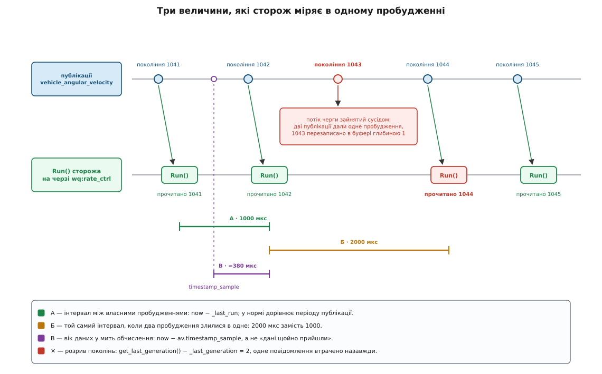

# ⚙️ Свій модуль PX4: сторож швидкого контуру від порожньої теки до консолі

Тут ми складаємо справжній модуль прошивки — від файлу опису теми до рядка в скрипті старту — і робимо його корисним: він сідає на ту саму чергу робіт, де живе регулятор кутової швидкості, міряє власними лічильниками, чи рівно його будять і чи не губляться дані дорогою, і публікує свою тему з оцінкою здоров'я контуру. Мова тут одна — C++: це прошивка, і жодного вибору немає, бо весь каркас модуля (`ModuleBase`, `ModuleParams`, `ScheduledWorkItem`) — це C++-класи, а обчислення живе на черзі, де кожна зайва мікросекунда відбирається в регулятора.

## Що міряємо і чому цього не видно ззовні

Консольна команда `uorb top` показує, з якою частотою публікується тема й скільки повідомлень загублено на вузлі. Здається, цього досить. Але вона відповідає з місця **вузла теми**, а питання, яке справді болить, ставиться з місця **споживача**: коли мій `Run()` нарешті почав рахувати, скільки часу минуло від попереднього разу і якого віку дані в мене на руках?

Ці два погляди розходяться саме тоді, коли треба. Гіроскоп може публікувати ідеально рівно на 1000 Гц — а модуль на черзі робіт прокидатиметься нерівно, бо сусід по черзі раз на секунду затримується на кілька мілісекунд. Вузол при цьому нічого не втратить у своєму рахунку, бо для нього втрата — це коли **ніхто** не забрав. Побачити нерівність можна лише зсередини споживача, власним годинником.

Отже, сторож міряє три речі, і кожна відповідає на своє питання.

**Інтервал між власними пробудженнями.** Різниця показань годинника на початку двох сусідніх `Run()`. Її середнє значення каже, з якою частотою нас насправді будять; найгірше за вікно — наскільки далеко вона стрибала. Це і є [джитер](topic:communications/jitter) — варіація затримки, яка для контуру керування шкідливіша за саму затримку, бо стала затримка враховується в налаштуванні регулятора, а плаваюча — ні.

**Вік даних у мить обчислення.** Різниця між «зараз» і полем `timestamp_sample` повідомлення. Вона каже, скільки часу минуло від фізичного виміру до того моменту, коли ми з ним щось робимо, — з урахуванням шини, фільтрів і черги.

**Розрив поколінь.** Лічильник публікацій вузла зростає на одиницю за публікацію, а передплатник тримає своє число. Якщо після читання наше число стрибнуло на два, одну публікацію перезаписано в буфері й вона втрачена назавжди. Це стається, коли черга робіт не встигла дійти до нас між двома публікаціями: обидва пробудження злилися в одне.


*Усі три величини вимірні лише з місця споживача. Ззовні контур виглядає здоровим: вузол публікує рівно, а що з цього дійшло до обчислення — інша історія.*

Головне рішення конструкції: сторож живе на черзі `wq:rate_ctrl` і будиться від публікації `vehicle_angular_velocity` — тобто рівно там і рівно тим, чим будиться сам регулятор. Тоді його числа — це числа регулятора. Посадіть сторожа на низькопріоритетну чергу, і він міряти буде себе, а не те, що цікавить.

За це доводиться платити: сторож додає навантаження на ту саму чергу, яку спостерігає. Прилад спотворює вимірюване. Тому весь сенс — тримати `Run()` мізерним: кілька віднімань і порівнянь, ніякого форматування рядків, ніякого запису.

## Мапа файлів

Модуль на ім'я `loop_watch` — це шість нових файлів і два рядки, дописані в чужі:

```
msg/LoopHealth.msg                       ← опис нової теми
msg/CMakeLists.txt                       ← +1 рядок: реєстрація опису

src/modules/loop_watch/LoopWatch.hpp     ← клас
src/modules/loop_watch/LoopWatch.cpp     ← реалізація
src/modules/loop_watch/CMakeLists.txt    ← px4_add_module
src/modules/loop_watch/Kconfig           ← символ увімкнення
src/modules/loop_watch/params.yaml       ← два параметри

boards/px4/fmu-v6x/default.px4board      ← +1 рядок: увімкнути на цій платі
```

## Опис теми

Тема починається з текстового файлу. Складання перетворить його на структуру `loop_health_s`, на заголовок `<uORB/topics/loop_health.h>` і на метадані, доступні через `ORB_ID(loop_health)`.

```
# msg/LoopHealth.msg
# Здоров'я швидкого контуру з погляду споживача на черзі wq:rate_ctrl.

uint64 timestamp             # час публікації, мкс від старту системи
uint64 timestamp_sample      # час останнього пробудження, на якому побудовано оцінку

uint32 interval_mean_us      # середній інтервал між пробудженнями за вікно
uint32 interval_max_us       # найгірший інтервал за вікно
uint32 sample_age_max_us     # найбільший вік даних у мить обчислення
uint32 wakeups               # скільки пробуджень увійшло у вікно
uint32 gaps                  # скільки разів покоління стрибнуло більше ніж на одиницю
uint32 missed                # скільки публікацій утрачено безповоротно

uint8 STATE_OK = 0
uint8 STATE_DEGRADED = 1
uint8 STATE_BROKEN = 2

uint8 state                  # оцінка контуру за константами вище
bool armed                   # чи був апарат озброєний наприкінці вікна
```

Три дрібниці, у яких помиляються найчастіше.

**Ім'я файлу й ім'я теми — різні речі.** Починаючи з версії 1.14 файли в `msg/` називають у верблюжому регістрі (`LoopHealth.msg`), а тема, структура й заголовок лишаються в нижньому з підкресленнями: `ORB_ID(loop_health)`, `loop_health_s`, `<uORB/topics/loop_health.h>`. У гілці 1.13 і старіших той самий файл звався `loop_health.msg` — перейменування видно просто в списку `msg/CMakeLists.txt` тих гілок. Перетворення імені робить генератор, руками писати обидві форми не треба — але знати, що вони різні, треба.

**Поле `timestamp` обов'язкове.** Без нього опис не збереться, і це добре: тема без позначки часу непридатна ні для журналу, ні для мосту в ROS 2.

**Порядок полів має значення для розміру.** Генератор кладе поля так, як написано, і додає вирівнювання. Вісім байтів, потім чотири, потім по одному — і структура виходить без дірок. Змішайте `uint8` між `uint64` — і кожне повідомлення понесе кілька зайвих байтів у буфері, який живе в оперативній пам'яті вічно.

Далі опис треба зареєструвати — інакше генератор його просто не побачить. У `msg/CMakeLists.txt` є список, впорядкований за абеткою:

```cmake
set(msg_files
	...
	LandingGearWheel.msg
	LoopHealth.msg          # ← наш рядок
	MagWorkerData.msg
	...
	)
```

## Клас модуля

Тепер заголовок. Модуль успадковується від трьох різних речей, і кожне спадкування дає одну здатність.

```cpp
// src/modules/loop_watch/LoopWatch.hpp
#pragma once

#include <px4_platform_common/atomic.h>
#include <px4_platform_common/defines.h>
#include <px4_platform_common/module.h>
#include <px4_platform_common/module_params.h>
#include <px4_platform_common/posix.h>
#include <px4_platform_common/px4_work_queue/ScheduledWorkItem.hpp>

#include <drivers/drv_hrt.h>
#include <lib/perf/perf_counter.h>

#include <uORB/Publication.hpp>
#include <uORB/Subscription.hpp>
#include <uORB/SubscriptionCallback.hpp>
#include <uORB/topics/loop_health.h>
#include <uORB/topics/parameter_update.h>
#include <uORB/topics/vehicle_angular_velocity.h>
#include <uORB/topics/vehicle_status.h>

using namespace time_literals;

class LoopWatch : public ModuleBase<LoopWatch>, public ModuleParams, public px4::ScheduledWorkItem
{
public:
	LoopWatch();
	~LoopWatch() override;

	/** @see ModuleBase */
	static int task_spawn(int argc, char *argv[]);
	static int custom_command(int argc, char *argv[]);
	static int print_usage(const char *reason = nullptr);

	bool init();
	int print_status() override;

private:
	void Run() override;
	void publishHealth(hrt_abstime now);
	void resetWindow(hrt_abstime now);

	static constexpr uint32_t WINDOW_US   = 1000000;      // вікно спостереження — 1 с
	static constexpr uint32_t BACKSTOP_US = 2 * WINDOW_US; // запобіжник, якщо публікації спиняться

	// Публікації
	uORB::Publication<loop_health_s> _loop_health_pub{ORB_ID(loop_health)};

	// Підписки
	uORB::SubscriptionCallbackWorkItem _angular_velocity_sub{this, ORB_ID(vehicle_angular_velocity)};
	uORB::SubscriptionInterval         _parameter_update_sub{ORB_ID(parameter_update), 1_s};
	uORB::Subscription                 _vehicle_status_sub{ORB_ID(vehicle_status)};

	// Лічильники продуктивності
	perf_counter_t _cycle_perf{perf_alloc(PC_ELAPSED, MODULE_NAME": cycle")};
	perf_counter_t _interval_perf{perf_alloc(PC_INTERVAL, MODULE_NAME": interval")};
	perf_counter_t _gap_perf{perf_alloc(PC_COUNT, MODULE_NAME": generation gap")};

	// Накопичувачі вікна
	hrt_abstime _last_run{0};
	hrt_abstime _window_start{0};
	unsigned    _last_generation{0};
	bool        _primed{false};

	uint64_t _interval_sum{0};
	uint32_t _interval_max{0};
	uint32_t _sample_age_max{0};
	uint32_t _wakeups{0};
	uint32_t _gaps{0};
	uint32_t _missed{0};
	bool     _armed{false};

	px4::atomic<bool> _reset_request{false};

	DEFINE_PARAMETERS(
		(ParamInt<px4::params::LW_INT_MAX>) _param_lw_int_max,
		(ParamInt<px4::params::LW_AGE_MAX>) _param_lw_age_max
	)
};
```

`ModuleBase<LoopWatch>` — це консольне життя: `start`, `stop`, `status`, зберігання єдиного примірника, `should_exit()`. Шаблонний параметр — власне ім'я класу: базі треба знати тип, щоб її статичні методи повертали правильний покажчик.

`ModuleParams` — це дерево параметрів: макрос `DEFINE_PARAMETERS` оголошує поля-обгортки, а виклик `updateParams()` перечитує їхні значення з [сховища параметрів](topic:programming/params-gcs), коли ті змінилися.

`px4::ScheduledWorkItem` — це виконання: віртуальний `Run()`, який чужий потік викличе за нас, плюс методи `ScheduleNow()`, `ScheduleDelayed()`, `ScheduleOnInterval()`, `ScheduleClear()`.

Три підписки навмисно трьох різних типів, і різниця не косметична. `SubscriptionCallbackWorkItem` — це та підписка, що **будить** модуль: вона реєструється в списку зворотних викликів вузла й на кожній публікації планує наш `Run()`. `SubscriptionInterval` із параметром `1_s` — підписка з обмеженням частоти: навіть якщо параметри оновлюють щомиті, вона віддасть щонайбільше одне оновлення на секунду. Звичайна `Subscription` — просто читання при нагоді, без жодного впливу на розклад.

> ⚠️ **Про версії.** Наведена форма (`ModuleBase<LoopWatch>`, поля `_object` і `_task_id`, виклик `LoopWatch::main(argc, argv)`) — це те, що ви побачите у всіх випущених гілках аж до 1.17 включно. У гілці `main`, з якої росте 1.18, каркас переписано: базовий клас перестав бути шаблоном, а замість статичних полів класу з'явився окремий об'єкт-опис `ModuleBase::Descriptor desc{task_spawn, custom_command, print_usage}`, у який складено ті самі три статичні методи; його передають у `exit_and_cleanup(desc)` і в `ModuleBase::main(LoopWatch::desc, argc, argv)`, а `_object`/`_task_id` стають його полями (`desc.object`, `desc.task_id`). Логіка та сама, синтаксис різний — звіряйтеся з текою `src/examples/work_item/` вашої гілки, вона і є еталоном.

## Оживлення: конструктор і init()

```cpp
// src/modules/loop_watch/LoopWatch.cpp
#include "LoopWatch.hpp"

#include <cstring>

LoopWatch::LoopWatch() :
	ModuleParams(nullptr),
	ScheduledWorkItem(MODULE_NAME, px4::wq_configurations::rate_ctrl)
{
}

LoopWatch::~LoopWatch()
{
	perf_free(_cycle_perf);
	perf_free(_interval_perf);
	perf_free(_gap_perf);
}

bool LoopWatch::init()
{
	// прокидатися на кожній публікації vehicle_angular_velocity
	if (!_angular_velocity_sub.registerCallback()) {
		PX4_ERR("callback registration failed");
		return false;
	}

	resetWindow(hrt_absolute_time());

	// перше спрацювання запобіжника: якщо публікацій не буде взагалі,
	// нас має розбудити хоч щось — інакше ми мовчатимемо вічно
	ScheduleDelayed(BACKSTOP_US);
	return true;
}
```

Два рядки конструктора вирішують долю модуля. `MODULE_NAME` — рядок, який складач підставляє з поля `MAIN` у `CMakeLists.txt`; він же стане іменем робочого елемента у виводі діагностики. `px4::wq_configurations::rate_ctrl` — вибір черги, а отже й пріоритету: у сучасних гілках і стек, і пріоритет цієї черги задаються символами `CONFIG_WQ_RATE_CTRL_STACKSIZE` та `CONFIG_WQ_RATE_CTRL_PRIORITY` у налаштуванні збірки.

`registerCallback()` може повернути `false` — і не через помилку в коді. Список зворотних викликів вузла має скінченний розмір, і якщо на тему вже підписалося забагато охочих, місця не лишиться. Мовчки це проковтнути означає отримати модуль, який запустився й ніколи не прокинеться.

## Run(): три лічильники й один запобіжник

Ось тіло, заради якого все затівалося.

```cpp
void LoopWatch::Run()
{
	if (should_exit()) {
		_angular_velocity_sub.unregisterCallback();
		ScheduleClear();      // зняти відкладений виклик, бо об'єкт зараз помре
		exit_and_cleanup();
		return;
	}

	perf_begin(_cycle_perf);
	perf_count(_interval_perf);

	const hrt_abstime now = hrt_absolute_time();

	if (_reset_request.load()) {
		_reset_request.store(false);
		resetWindow(now);
	}

	// параметри: підписка сама обмежує себе однією перевіркою на секунду
	if (_parameter_update_sub.updated()) {
		parameter_update_s pupdate;
		_parameter_update_sub.copy(&pupdate);   // прибрати позначку оновлення
		updateParams();                         // перечитати LW_INT_MAX і LW_AGE_MAX
	}

	vehicle_status_s status;

	if (_vehicle_status_sub.update(&status)) {
		_armed = (status.arming_state == vehicle_status_s::ARMING_STATE_ARMED);
	}

	vehicle_angular_velocity_s av;

	if (_angular_velocity_sub.update(&av)) {
		const unsigned generation = _angular_velocity_sub.get_last_generation();

		if (_primed) {
			// у здоровому випадку покоління зростає рівно на одиницю
			const unsigned step = generation - _last_generation;

			if (step > 1) {
				_gaps++;
				_missed += step - 1;
				perf_count(_gap_perf);
			}

			const uint32_t interval = now - _last_run;
			_interval_sum += interval;
			_wakeups++;

			if (interval > _interval_max) {
				_interval_max = interval;
			}
		}

		const uint32_t age = now - av.timestamp_sample;

		if (age > _sample_age_max) {
			_sample_age_max = age;
		}

		_last_generation = generation;
		_last_run = now;
		_primed = true;
	}

	if (now - _window_start >= WINDOW_US) {
		publishHealth(now);
	}

	perf_end(_cycle_perf);
}
```

Порядок дій тут не довільний.

Перевірка `should_exit()` стоїть першою, бо все, що після неї, працює з полями об'єкта, який команда `stop` збирається знищити. Знімаємо зворотний виклик, знімаємо відкладене планування — і аж тоді дозволяємо базі видалити примірник.

`hrt_absolute_time()` беремо **один раз** на весь виклик. Якби ми питали годинник у трьох місцях, інтервал і вік даних міряли б із різних моментів, і різниця між ними осіла б у результаті як шум невідомого походження.

Порівняння `step > 1` працює саме тому, що `get_last_generation()` після кожного вдалого читання зростає рівно на одиницю. Це той самий прийом, яким користуються справжні модулі PX4: `VehicleIMU` так само порівнює покоління до й після читання й на розриві вмикає прапорець «дані з дірою». Зверніть увагу, що ми не питаємо шину «чи я щось загубив» — шина такого питання не розуміє. Ми питаємо лічильник.

Віднімання `generation - _last_generation` беззнакове й тому не ламається, коли `unsigned` переповниться й піде через нуль: різниця лишиться правильною. Це не випадковість, а властивість арифметики за модулем — той самий довід, на якому стоїть будь-який [кільцевий буфер](topic:algorithms/ring-buffer).

І останнє, найважливіше: `_wakeups`, `_missed`, `_interval_max` — звичайні поля без жодного захисту. Це законно рівно тому, що читає й пише їх **тільки** `Run()`, а `Run()` для одного примірника ніколи не виконується двічі одночасно: робочий елемент, який уже виконується, не буде запущений повторно. Щойно до тих самих полів захоче доступ ще хтось — консольна команда, наприклад, — ми в світі [гонок](topic:programming/atomicity-races), і саме тому прохання про скидання приходить не прямим записом, а через `px4::atomic<bool>`.

## Підсумок вікна

```cpp
void LoopWatch::resetWindow(hrt_abstime now)
{
	_interval_sum = 0;
	_interval_max = 0;
	_sample_age_max = 0;
	_wakeups = 0;
	_gaps = 0;
	_missed = 0;
	_window_start = now;
}

void LoopWatch::publishHealth(hrt_abstime now)
{
	loop_health_s health{};

	health.interval_mean_us  = (_wakeups > 0) ? (uint32_t)(_interval_sum / _wakeups) : 0;
	health.interval_max_us   = _interval_max;
	health.sample_age_max_us = _sample_age_max;
	health.wakeups = _wakeups;
	health.gaps    = _gaps;
	health.missed  = _missed;
	health.armed   = _armed;

	const uint32_t int_limit = (uint32_t)_param_lw_int_max.get();
	const uint32_t age_limit = (uint32_t)_param_lw_age_max.get();

	if (_wakeups == 0) {
		health.state = loop_health_s::STATE_BROKEN;   // за ціле вікно жодної вибірки

	} else if ((_interval_max > int_limit) || (_sample_age_max > age_limit) || (_missed > 0)) {
		health.state = loop_health_s::STATE_DEGRADED;

	} else {
		health.state = loop_health_s::STATE_OK;
	}

	health.timestamp_sample = _last_run;            // на чому побудовано оцінку
	health.timestamp = hrt_absolute_time();         // коли її поклали на шину
	_loop_health_pub.publish(health);

	resetWindow(now);
	ScheduleDelayed(BACKSTOP_US);   // переставити запобіжник на наступні дві секунди
}
```

Запобіжник — головна нетривіальна ідея всієї конструкції, і причина в ній суто причинна. Сторож будиться від того, що спостерігає. Якщо спостережуване спиниться — драйвер гіроскопа помре, шина SPI відвалиться, черга застрягне, — сторожа більше ніхто не розбудить, і він **замовкне саме тоді, коли має закричати**. Мовчазний сторож нічим не кращий за відсутнього.

Тому раз на вікно, публікуючи підсумок, ми ставимо відкладений виклик на дві секунди вперед. Поки контур живий, наступний підсумок через секунду переставляє цей виклик далі, і він ніколи не спрацьовує. Щойно підсумки припинилися, відкладений виклик спрацьовує сам, `update()` не дає нічого, `_wakeups` дорівнює нулю — і на шину лягає `STATE_BROKEN`. Це та сама логіка, що в апаратному [сторожовому таймері](topic:programming/watchdog): періодичне «я живий» скидає таймер, а мовчання його випускає.

Переставляти запобіжник у кожному `Run()` спокусливо, але дорого: на тисячі викликів за секунду це тисяча операцій із впорядкованим списком таймерів високої роздільності. Раз на секунду — рівно те, що треба.

> 🔧 **Навіщо це.** Тема `loop_health` коштує чотири десятки байтів на секунду — і за ці гроші журнал польоту отримує ряд, який неможливо відновити пізніше. Коли після падіння постане питання «регулятор рахував не те чи його не встигали годувати», відповідь буде записана: `interval_max_us` за секунду перед подією або рівний періоду гіроскопа, або втричі більший. Без такого ряду це залишиться здогадом, бо самі дані гіроскопа в журналі виглядають нормально — вони й були нормальні, просто дійшли не туди й не тоді.

## Консоль: task_spawn, custom_command, print_usage

Три статичні методи — це весь інтерфейс модуля до `nsh`.

```cpp
int LoopWatch::task_spawn(int argc, char *argv[])
{
	LoopWatch *instance = new LoopWatch();

	if (instance) {
		_object.store(instance);
		_task_id = task_id_is_work_queue;   // «власного потоку немає, я на черзі»

		if (instance->init()) {
			return PX4_OK;
		}

	} else {
		PX4_ERR("alloc failed");
	}

	delete instance;
	_object.store(nullptr);
	_task_id = -1;

	return PX4_ERROR;
}

int LoopWatch::print_status()
{
	PX4_INFO("mean %u us, worst %u us, oldest sample %u us, gaps %u, missed %u",
		 (unsigned)(_wakeups ? _interval_sum / _wakeups : 0),
		 (unsigned)_interval_max, (unsigned)_sample_age_max,
		 (unsigned)_gaps, (unsigned)_missed);
	perf_print_counter(_cycle_perf);
	perf_print_counter(_interval_perf);
	perf_print_counter(_gap_perf);
	return 0;
}

int LoopWatch::custom_command(int argc, char *argv[])
{
	if (!is_running()) {
		PX4_ERR("not running");
		return 1;
	}

	if (argc > 0 && !strcmp(argv[0], "reset")) {
		get_instance()->_reset_request.store(true);   // прохання, а не дія
		return 0;
	}

	return print_usage("unknown command");
}

int LoopWatch::print_usage(const char *reason)
{
	if (reason) {
		PX4_WARN("%s\n", reason);
	}

	PRINT_MODULE_DESCRIPTION(
		R"DESCR_STR(
### Description
Watches the fast control loop from the consumer side. Runs on wq:rate_ctrl and is
scheduled by vehicle_angular_velocity publications, so its numbers are the numbers
the rate controller sees: wake-up interval, sample age and missed generations.
Publishes loop_health once per second.

### Examples
$ loop_watch start
$ loop_watch status
$ loop_watch reset
)DESCR_STR");

	PRINT_MODULE_USAGE_NAME("loop_watch", "system");
	PRINT_MODULE_USAGE_COMMAND("start");
	PRINT_MODULE_USAGE_COMMAND_DESCR("reset", "Clear the accumulated window");
	PRINT_MODULE_USAGE_DEFAULT_COMMANDS();

	return 0;
}

extern "C" __EXPORT int loop_watch_main(int argc, char *argv[])
{
	return LoopWatch::main(argc, argv);
}
```

`_task_id = task_id_is_work_queue` — не формальність, а зізнання: «власного потоку я не маю». База за цим значенням розуміє, що зупиняти модуль треба не вбиванням задачі, а прапорцем `should_exit()`, який `Run()` побачить наступного разу.

`custom_command` виконується в **чужому** потоці — тому, що обробляє консоль. Звідси й обережність: команда `reset` не чіпає лічильників, а лише ставить атомний прапорець. Скидання зробить сам `Run()`, у своєму потоці, між двома вимірюваннями. Різниця між «прочитати чуже поле й записати нове» і «попросити власника зробити це самому» — це різниця між ледь помітно кривими числами й правильними.

`print_status`, навпаки, читає ті самі поля з консольного потоку без синхронізації. Це свідома поблажка: діагностичний друк може показати числа з двох сусідніх мікросекунд, і нікому від цього не гірше. Важливо розуміти, що це поблажка, а не правило.

Ім'я функції входу — `<ім'я модуля>_main`, і воно жорстке: саме за цим іменем NuttX зв'яже консольну команду з кодом.

## Збірка й увімкнення на платі

Складання PX4 стоїть на [CMake](topic:build-systems/cmake-language), а модуль оголошується однією функцією — власною функцією PX4, а не стандартною командою CMake:

```cmake
# src/modules/loop_watch/CMakeLists.txt
px4_add_module(
	MODULE modules__loop_watch
	MAIN loop_watch
	SRCS
		LoopWatch.cpp
		LoopWatch.hpp
	MODULE_CONFIG
		params.yaml
	DEPENDS
		px4_work_queue
	)
```

`MODULE` — унікальне ім'я цілі всередині прошивки, за домовленістю це шлях із подвійними підкресленнями. `MAIN` — ім'я консольної команди; воно ж підставляється в `MODULE_NAME`, тож усі наші лічильники продуктивності автоматично назвуться `loop_watch: cycle` і подібно. `MODULE_CONFIG` вказує на файл параметрів, `DEPENDS` — на бібліотеки, без яких код не злінкується.

Параметри описуються не в C++, а окремим файлом; збірка сама зробить із нього і сховище, і сторінку в земній станції:

```yaml
# src/modules/loop_watch/params.yaml
module_name: loop_watch
parameters:
- group: Loop Watch
  definitions:
    LW_INT_MAX:
      description:
        short: Worst allowed wake-up interval
        long: |
          If the longest interval between two wake-ups within one window exceeds
          this value, the loop is reported as degraded.
      type: int32
      default: 1500
      min: 200
      max: 100000
      unit: us
    LW_AGE_MAX:
      description:
        short: Worst allowed sample age
      type: int32
      default: 2000
      min: 200
      max: 100000
      unit: us
```

Далі — символ увімкнення. Без нього тека просто не потрапить у збірку:

```
# src/modules/loop_watch/Kconfig
menuconfig MODULES_LOOP_WATCH
	bool "loop_watch"
	default n
	---help---
		Enable support for loop_watch
```

І, нарешті, рядок у налаштуванні конкретної плати — `boards/px4/fmu-v6x/default.px4board` або `boards/px4/sitl/default.px4board`:

```
CONFIG_MODULES_LOOP_WATCH=y
```

Те саме можна зробити з меню: `make px4_fmu-v6x_default boardconfig`. Меню лише пише той самий рядок у той самий файл.

## Старт і перевірка

Модуль треба запустити. Для налагодження досить консолі: `loop_watch start`. Щоб він піднімався сам, є два шляхи. Правити скрипт у прошивці — `ROMFS/px4fmu_common/init.d/rc.mc_apps` для мультикоптерних застосунків — або, не чіпаючи прошивки, покласти на картку файл `/fs/microsd/etc/extras.txt`:

```sh
set +e
loop_watch start
set -e
```

`set +e` тут не забаганка: якщо модуль не зібрано в цю прошивку, невідома команда обірвала б увесь запуск, і апарат лишився б без телеметрії, з якої можна дізнатися, що сталося. Файл мусить мати юніксові переводи рядків — редактор із Windows-закінченнями зламає завантаження мовчки.

Далі три команди, які закривають майже всі питання.

```
nsh> loop_watch status
INFO  [loop_watch] mean 1000 us, worst 1180 us, oldest sample 512 us, gaps 0, missed 0
loop_watch: cycle: 1002 events, 4210us elapsed, 4.20us avg, min 3us max 41us
loop_watch: interval: 1002 events, 998.94us avg, min 941us max 1183us
loop_watch: generation gap: 0 events

nsh> listener loop_health 3

nsh> uorb top -1 loop_health vehicle_angular_velocity
```

`listener` друкує наступні повідомлення теми просто в термінал — це найшвидша відповідь на питання «а моя тема взагалі публікується». `uorb top` показує частоту, кількість передплатників і втрати на вузлі. `top` показує потоки, зокрема `wq:rate_ctrl`, разом із витратою стека. Усе це працює й на реальній платі, і в [SITL](topic:programming/sitl-simulation), де той самий модуль збирається під настільну систему й читає теми симулятора — саме там і варто зробити перший запуск, бо ціна помилки нульова.

## Скільки це коштує

Оцінімо, чи має сторож право сидіти на найпріоритетнішій черзі.

**Вартість сторожа на черзі rate_ctrl.**

```
частота пробуджень            = 1000 Гц      (частота vehicle_angular_velocity)
середній час Run()            ≈ 4.2 мкс      (з лічильника cycle на STM32H7)
процесорний час за секунду    = 1000 · 4.2   = 4200 мкс = 4.2 мс
частка процесора              = 4200 / 1000000 = 0.42 %

публікація loop_health        = 1 Гц · 44 Б  = 44 Б/с трафіку в журнал
буфер теми в RAM              = 44 Б · 1     = 44 Б (глибина черги 1)
пам'ять під сам модуль        ≈ 120 Б полів  + 3 лічильники продуктивності
власного стека                = 0            (живе на стеку черги)
```

Менш ніж піввідсотка процесора й пів сотні байтів пам'яті — прийнятна ціна за ряд у журналі, якого інакше не буде. Порівняйте з альтернативою: окрема задача коштувала б щонайменше два кілобайти стека, які простоювали б увесь політ.

Але число 4.2 мкс варте окремої уваги. Воно мале лише тому, що в `Run()` немає нічого, крім віднімань. Один `PX4_INFO` у гарячій гілці — і замість чотирьох мікросекунд буде кількадесят, бо форматування рядка й вивід у консоль коштують дорого й непередбачувано. Це вже не вимірювальний прилад, а джерело того самого джитера, який він мав ловити. [Профілювання](topic:programming/profiling) тут вбудоване в саму систему: лічильник `cycle` показує середнє й максимум, і максимум цікавіший.

## Пастки, на яких спотикаються всі

**Блокування в робочому елементі.** `Run()` виконується на потоці, спільному з усіма сусідами по черзі. Заснути на мілісекунду, зачекати на м'ютекс, синхронно записати у файл — і кожен сусід простоїть рівно стільки ж. На `wq:rate_ctrl` сусід — це регулятор кутової швидкості. Найгірший різновид цієї помилки — узяти замок, який тримає низькопріоритетний код: тоді високопріоритетна черга чекає на низькопріоритетну задачу, і це класична [інверсія пріоритетів](topic:programming/priority-inversion). Симптом підступний: збою немає, є загадкове тремтіння в чужому модулі. Якщо роботі потрібне блокування — їй потрібна окрема задача, а не робочий елемент. Проміжний варіант — [черга робіт](topic:programming/work-queue) низького пріоритету, `wq:lp_default`, куди виносять усе повільне.

**Забутий `timestamp`.** `Publication::publish()` не проставляє часу — це робить автор. Структуру ми ініціалізували нулями (`loop_health_s health{}`), тож забуте поле дасть не сміття, а рівно нуль. Наслідки: `listener` показує повідомлення з нульовим часом, логер записує ряд, який не сходиться з жодним іншим за часом, оцінювачі й міст у ROS 2 вважають дані нескінченно старими й тихо їх ігнорують. Помилки складання не буде, попередження теж. Правило просте: `timestamp` — останнє, що заповнюють перед `publish()`, і завжди свіжим викликом `hrt_absolute_time()`.

**Глибина черги для подій.** Наша тема — стан: важливе останнє значення, глибина 1 доречна. Але якби `loop_health` була темою подій — «ось конкретний розрив, ось іще один», — глибина 1 губила б їх усі, крім останньої, щойно читач прокидається рідше за видавця. Для подій у описі теми ставлять рядок `uint8 ORB_QUEUE_LENGTH = 8`, і число мусить бути степенем двійки, бо індекс у кільці беруть маскуванням. Ознака, що ви обрали неправильно: читач бачить події «через одну» тим частіше, чим більше навантаження.

**`ScheduleOnInterval` замість зворотного виклику.** Спокуса замінити `registerCallback()` на `ScheduleOnInterval(1000)` виглядає нешкідливо: та сама частота, менше коду. Але тоді нас будить власний таймер, а дані приходять від гіроскопа, і два незалежні генератори ніколи не збігаються точно. Порахуймо, що з цього виходить.

**Биття двох майже однакових частот.**

```
таймер пробудження   = 1000.0 Гц   →  період 1000.0 мкс
публікація гіроскопа =  999.7 Гц   →  період 1000.3 мкс
розбіжність періодів = 1000.3 − 1000.0 = 0.3 мкс за такт
накопичення до цілого періоду = 1000.3 / 0.3 ≈ 3334 такти
у часі                        = 3334 · 0.001 с ≈ 3.3 с
```

Раз на три секунди ми або прочитаємо те саме повідомлення двічі, або пропустимо одне. Вік даних при цьому плаватиме від нуля до цілого періоду, і ця пила накладеться просто в контур керування як періодичне збурення. Ось чому у справжніх модулях швидкого контуру PX4 такт задає публікація, а не таймер: коли джерело такту одне, розбігатися нема чому. Це той самий довід, з якого росте вся вимога [детермінованості](topic:programming/realtime-determinism) в контурі. `ScheduleOnInterval` доречний там, де власний період і є суттю роботи, — телеметрія, підсумки, повільна періодика.

**Переповнення стека черги.** Робочий елемент не має власного стека — він позичає стек потоку черги, і цей стек спільний для всіх сусідів, а розмір його задано наперед (`CONFIG_WQ_RATE_CTRL_STACKSIZE`). Локальний масив на кілограм байтів, глибока рекурсія, `printf` із багатьма аргументами — і ви з'їдаєте не свою пам'ять, а спільну. [Переповнення стека](topic:programming/stack-overflow) тут виявляється найгіршим способом: псується пам'ять сусіда, і падає він, а не ви. Тому великі буфери — статичні поля класу, а не локальні змінні, а витрату стека перевіряють командою `top`, дивлячись на рядок `wq:rate_ctrl`: вона показує, скільки стека черга справді використала за час роботи, а не скільки їй виділено.
