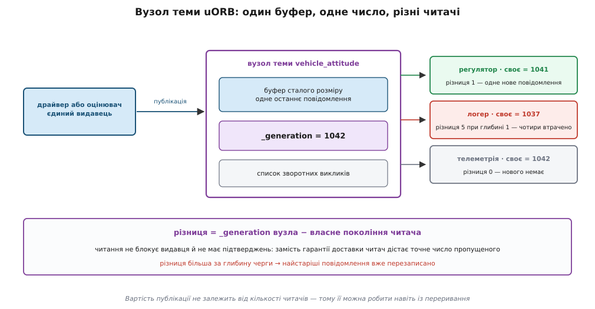
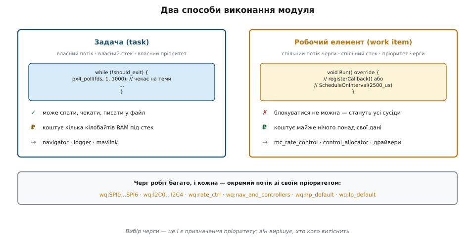
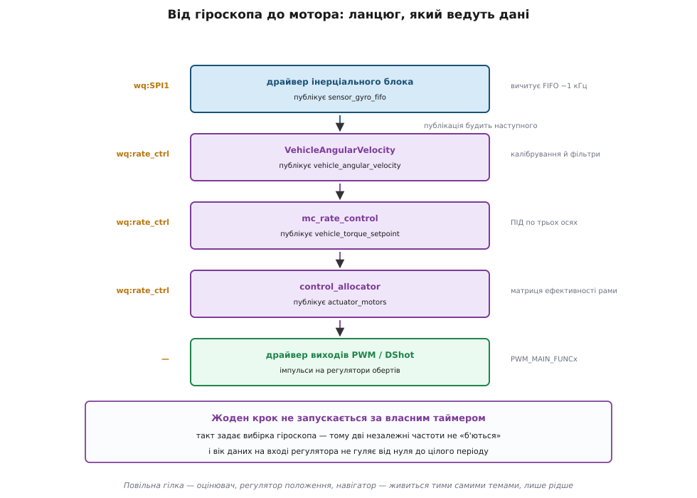
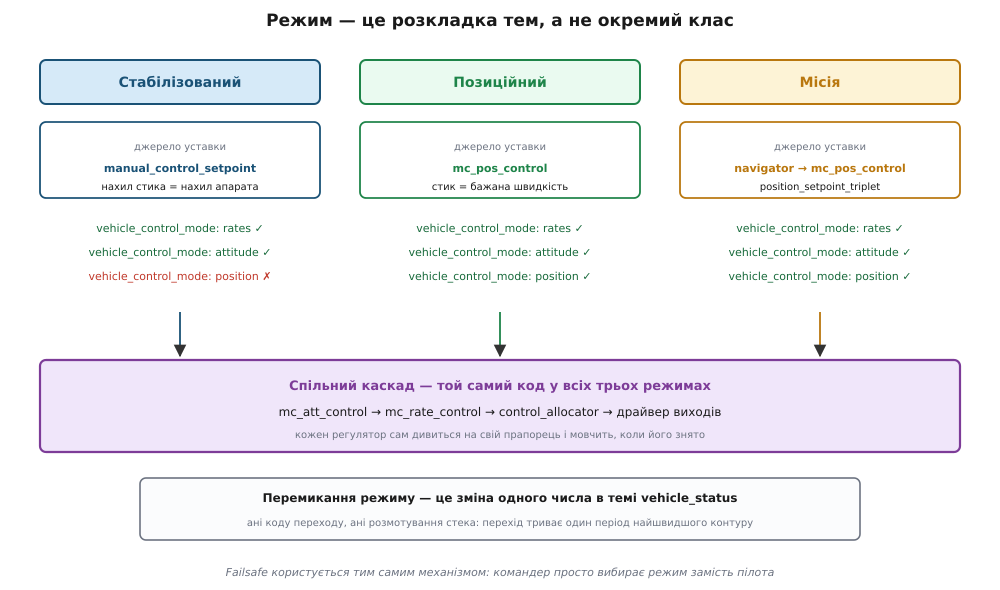

# Архітектура PX4: uORB, модулі, режими

<preknowlist>
- [Політний контролер](book:programming/flight-controller) — що це за пристрій і який мінімум він мусить робити, щоб апарат тримався в повітрі.
- [Pub/sub (тема)](book:programming/publish-subscribe) — видавець кладе повідомлення в іменовану тему, передплатники читають; сторони не знають одна одну на ім'я.
- [Детермінованість](book:programming/realtime-determinism) — дедлайн і тремтіння періоду; чому контур керування без гарантованого періоду розвалюється.
- [Планувальник](book:programming/scheduler) — витісняльне планування за пріоритетами, задача, власний стек, перемикання контексту.
- [Кільцевий буфер](book:algorithms/ring-buffer) — масив сталого розміру з індексами по колу, звідки береться перезапис найстарішого запису.
- [Каскадний регулятор: кут і кутова швидкість](book:algorithms/rate-angle-cascade) — зовнішній контур задає уставку внутрішньому, внутрішній працює швидше.
- [Атомарність і гонки](book:programming/atomicity-races) — чому одночасний доступ двох потоків до спільних даних псує їх і що таке критична секція.
</preknowlist>

Квадрокоптер тримається в повітрі лише тому, що щось усередині нього виправляє кутову швидкість корпусу кількасот разів на секунду. Пропусти цю роботу на чверть секунди — і апарат уже не вирівняється: він статично нестійкий, як олівець на пальці.

Тепер порахуй, що мусить відбуватися на тому самому процесорі одночасно з цим. Гіроскоп і акселерометр опитуються по SPI з частотою кілогерц. Магнітометр і барометр — сотні герц. GPS присилає розв'язок п'ять разів на секунду по UART. Оцінювач стану зводить усе це в одну картину «де я і як повернутий». Логіка місії раз на секунду вирішує, до якої точки летіти. Телеметрія MAVLink пише в радіомодем десятки повідомлень щосекунди й читає команди з землі. Логер зливає на microSD усе, що рухається, — і кожен запис на картку може заблокуватися на десятки мілісекунд, бо контролер картки саме стирає блок.

Усе це на одному мікроконтролері. Типовий сучасний політний контролер стандарту Pixhawk несе STM32H7 на 480 МГц із 2 МБ флешу й 1 МБ оперативної пам'яті. Динамічного виділення пам'яті в польоті немає — купа, що фрагментується, це відмова в найгіршу мить. А код пишуть сотні людей, які між собою не домовляються: драйвер нового далекоміра приходить від виробника далекоміра, оцінювач — від команди навігації, режим польоту — від когось третього.

Спробуй скласти це прямо, і одразу видно, де ламається.

**Один великий цикл.** Читаємо все підряд, рахуємо, пишемо в мотори, повторюємо. Період циклу дорівнює сумі всіх кроків, тож кожен новий датчик уповільнює керування. А коли логер вирішить дописати блок на картку, цикл стане на тридцять мілісеконд — і мотори тридцять мілісекунд отримуватимуть стару команду. Апарат цього не пробачає.

**Прямі виклики.** Драйвер гіроскопа сам кличе оцінювач, оцінювач сам кличе регулятор. Тепер драйвер знає ім'я функції оцінювача. Другий гіроскоп для резервування — правка в оцінювачі. Запустити регулятор на вищому пріоритеті, ніж драйвер GPS, неможливо: вони в одному ланцюгу викликів. Протестувати регулятор окремо теж не вийде — щоб він зібрався, треба злінкувати пів прошивки.

Обидві невдачі показують ту саму трійцю вимог, і решта архітектури PX4 — це прямий наслідок кожної з них:

1. **Кожен шматок коду живе на своїй частоті й своєму пріоритеті.** Регулятор кутової швидкості не має чекати на GPS, логер не має гальмувати регулятор.
2. **Шматки не знають одне одного на ім'я.** Регулятор знає, що йому потрібна кутова швидкість, а не те, який драйвер її дав.
3. **Шматок можна вийняти й підмінити** — іншим драйвером, симулятором, записом із попереднього польоту.

Класична відповідь на такі три вимоги — шина з іменованими темами. Шина PX4 зветься **uORB** (англ. *micro Object Request Broker* — мікроскопічний посередник запитів до об'єктів; ім'я успадковане від брокерів об'єктних запитів на кшталт CORBA, звідки взято ідею іменованого посередника між незнайомими сторонами, [як народилися PX4 і uORB](book:programming/px4-architecture/hist-px4-uorb.md)).

## Шина, зшита під саме ці умови

Загальна ідея pub/sub нічого не каже про те, як шину зробити. А умови всередині польотного контролера відсікають майже всі звичні варіанти, і кожне відсікання дає рису uORB.

**Публікація може статися всередині обробника переривання.** Драйвер, що прочитав FIFO гіроскопа, публікує дані з контексту, де не можна ні спати, ні брати м'ютекс, який тримає низькопріоритетна задача — це прямий шлях в [інверсію пріоритетів](book:programming/priority-inversion). Отже, публікація мусить бути короткою й обмеженою зверху: скопіювати кілька десятків байтів і вийти. Ніякої черги на кожного передплатника, ніякого обходу списків невідомої довжини під замком.

**Повільний передплатник не має права зупинити видавця.** Логер, що застряг на картці, і регулятор, що чекає на гіроскоп, читають ту саму тему `vehicle_attitude`. Якщо шина має зворотний тиск — тобто видавець блокується, коли найповільніший читач не встигає, — то картка керуватиме частотою контуру. Отже, зворотного тиску немає взагалі. Видавець ніколи не чекає.

**Для керування важливе найсвіжіше значення, а не вся історія.** Регулятору не потрібні п'ять пропущених вимірів кута — потрібен останній. А от команда з землі «злітай» — подія, і губити її не можна. Отже, шина має два режими: типова тема тримає одне останнє значення, а тема-подія отримує невелику кільцеву чергу.

**Пам'ять виділяється один раз.** Буфер теми з'являється при першій публікації й далі не росте. Розмір повідомлення відомий на етапі компіляції.

Складіть це разом — і виходить конструкція такого вигляду: на кожну тему є **вузол** із буфером сталого розміру; публікація — це копіювання в буфер і збільшення лічильника; читання — копіювання з буфера. Втрати ловляться порівнянням лічильників, а не підтвердженнями.

Ціна названа чесно: uORB **свідомо відмовляється від гарантії доставки**, щоб отримати сталу, обмежену зверху вартість публікації. Це не недогляд, а обмін — і платить за нього кожен, хто пише модуль, власною уважністю.

## Тема: опис, структура, метадані

Тема починається з текстового опису в теці `msg/`. Файл `vehicle_angular_velocity.msg` виглядає приблизно так:

```
uint64 timestamp             # час публікації, мкс від старту системи
uint64 timestamp_sample      # час, коли фізично взято вимір

float32[3] xyz               # кутова швидкість у зв'язаній системі, рад/с
float32[3] xyz_derivative     # похідна, рад/с²
```

Складання прошивки перетворює цей опис на C-структуру `vehicle_angular_velocity_s` і на невеликий блок метаданих:

```c
struct orb_metadata {
    const char    *o_name;            // "vehicle_angular_velocity"
    const uint16_t o_size;            // розмір структури в байтах
    const uint16_t o_size_no_padding; // розмір корисних полів без вирівнювання
    uint32_t       message_hash;      // хеш опису — перевірка сумісності
    orb_id_size_t  o_id;              // номер теми в загальній таблиці
    uint8_t        o_queue;           // глибина черги (1 — тільки останнє)
};
```

Макрос `ORB_ID(vehicle_angular_velocity)` розкривається в покажчик на ці метадані. Тобто «тема» в коді — це не рядок і не число, а адреса сталої структури, відома лінкеру. Помилитися в імені теми неможливо: неправильне ім'я не збереться.

Поле `timestamp` обов'язкове в кожному повідомленні, і на ньому тримається значно більше, ніж здається з назви. Поле `message_hash` рахується з тексту опису: якщо земна станція чи компаньйон зібрані зі старим описом теми, розбіжність хешів видно одразу, а не через дивні числа в польоті.

Глибина черги задається в самому описі рядком `uint8 ORB_QUEUE_LENGTH = 8`; число мусить бути степенем двійки, бо індекс у кільці береться маскуванням, а не діленням. Без цього рядка тема тримає рівно одне останнє значення — так налаштована переважна більшість тем.

## Вузол теми зсередини: лічильник поколінь

Вузол теми (`uORB::DeviceNode`) містить менше, ніж здається:

```cpp
uint8_t            *_data{nullptr};   // буфер: o_size × глибина черги
px4::atomic<unsigned> _generation{0}; // скільки разів публікували від початку
List<uORB::SubscriptionCallback *> _callbacks; // кого будити після публікації
```

`_generation` — наскрізний лічильник публікацій, що ніколи не скидається. Публікація робить три речі: під короткою критичною секцією копіює повідомлення в буфер за індексом `_generation % глибина`, збільшує `_generation` на одиницю, а тоді — уже поза секцією — проходить списком зареєстрованих зворотних викликів і планує їх на виконання. Час усієї операції не залежить ні від кількості передплатників у сенсі очікування, ні від того, чи хтось узагалі читає.

Передплатник не має власного буфера. Він тримає єдине число — **своє** покоління, тобто ту позначку лічильника, на якій зупинився:

```cpp
unsigned _last_generation;
```

Звідси випливає вся семантика читання, і вона напрочуд економна:

- `updated()` — це перевірка `_generation != _last_generation`. Одне читання атомної змінної, без замків.
- `copy()` — це копіювання з буфера й `_last_generation = _generation` (для черги — просування на одну позицію).
- **Скільки я проґавив** — це різниця `_generation − _last_generation`.

Останній пункт і є заміною гарантії доставки. Шина не обіцяє, що ти все прочитаєш, — вона обіцяє, що ти **точно знатимеш**, скільки не прочитав. Якщо різниця перевищила глибину черги, найстаріші елементи вже перезаписані; вузол тоді підсуває читачеві найстаріший з тих, що ще живі, і розрив лишається видимим у числах.


*Спільної черги на кожного читача немає — є один буфер і одне число на видавця. Читач порівнює своє число з числом вузла: різниця 1 означає «одне нове», різниця 5 при глибині 1 означає «я проспав чотири».*

**Логер відстає від оцінювача — на скільки саме.** Оцінювач публікує `vehicle_attitude` з частотою 250 Гц, тема тримає одне останнє значення (глибина 1). Логер прокидається кожні 20 мс:

```
частота публікації       = 250 Гц   →  період 4 мс
період роботи логера     = 20 мс
публікацій за один цикл  = 20 / 4          = 5
різниця поколінь         = 5
глибина черги            = 1
доступно для читання     = 1  (найсвіжіше)
безповоротно втрачено    = 5 − 1           = 4 повідомлення
```

Логер прочитає одне значення з п'яти й побачить у різниці поколінь число 5 — тобто сам зафіксує, що записав кожну п'яту вибірку. Для журналу орієнтації це нормально й навіть бажано. Для теми `vehicle_command`, куди падають команди із землі, така поведінка була б катастрофою — тому в її описі стоїть `ORB_QUEUE_LENGTH`, і всі команди, що надійшли між двома пробудженнями, дочекаються читача.

> 🔧 **Навіщо це.** Коли модуль поводиться дивно, перше питання — не «чи є помилка в математиці», а «чи він узагалі бачить свіжі дані». Команда `uorb top` у консолі показує на кожну тему частоту публікації, кількість передплатників і кількість втрачених повідомлень; `listener vehicle_attitude 5` друкує п'ять наступних повідомлень теми просто в термінал. Дві команди, і половина здогадок відпадає, не вмикаючи налагоджувач.

## Позначка часу — те, що робить асинхронність придатною

Шина без гарантій доставки й без порядку доставки виглядає непридатною для керування. Врятовує її одна річ — обов'язкове поле `timestamp` у кожному повідомленні, а в даних із датчиків ще й `timestamp_sample`.

Різниця між ними принципова. `timestamp` каже, коли повідомлення поклали на шину. `timestamp_sample` каже, коли фізично взято вимір — до фільтрів, до інтегрування, до передавання по SPI. Споживач через це знає не «дані прийшли», а **скільки їм років**, і може врахувати запізнення.

Саме на цьому стоїть [оцінювач стану](book:algorithms/kalman-ekf): GPS-розв'язок приходить із запізненням у сотню-другу мілісекунд і рідше за інерціальні виміри, барометр — зі своїм запізненням, зорова одометрія — зі своїм. Оцінювач тримає невелику історію станів і застосовує кожен вимір до того моменту, якому вимір насправді належить за своїм `timestamp_sample`, а не до «зараз». Без цієї позначки асинхронна шина давала б кашу з даних різного віку, і жоден фільтр її не розплутав би.

## Кілька екземплярів однієї теми

Серйозний апарат несе два-три інерціальні блоки й кілька магнітометрів — це [резервування](book:programming/redundancy), і воно ставить незручне питання: як два однакові драйвери публікують «ту саму» тему?

uORB відповідає екземплярами. `orb_advertise_multi()` повертає видавцеві номер екземпляра, `orb_subscribe_multi(ORB_ID(sensor_accel), 1)` підписує на конкретний. Кожен екземпляр — окремий вузол зі своїм буфером і своїм лічильником; спільні в них лише ім'я й опис.

Це дрібна на вигляд деталь, з якої виростає весь механізм відмовостійкості. Модуль `sensors` бачить усі екземпляри `sensor_gyro`, порівнює їх між собою, знаходить того, хто збрехав, і оголошує вибраного в темі `sensor_selection`. Оцінювач може піти ще далі: запустити по власному примірнику фільтра на кожну пару «інерціальний блок + магнітометр», а окремий вибірник підписатися на всі їхні виходи, обрати основний і перевидати його вже під звичайними іменами `vehicle_attitude` і `vehicle_local_position`. Решта прошивки нічого про цю кухню не знає — вона читає одну тему, а те, скільки фільтрів під нею працює й котрий саме зараз головний, лишається деталлю реалізації.

## Модуль: два способи бути живим

Тепер друга половина архітектури. Шина розв'язала питання «як шматки говорять». Лишилося «як шматок узагалі виконується».

PX4 називає шматок **модулем** і дає рівно два способи його оживити.

**Задача.** Модуль отримує власний потік із власним стеком і власним пріоритетом. Усередині — нескінченний цикл, який блокується на `px4_poll()`, чекаючи оновлення в темах (на NuttX це той самий механізм, що [select, poll, epoll](book:unix-linux/select-poll-epoll) у великих системах, тільки над дескрипторами тем). Модуль може спати, може робити тривалі операції, може блокуватися на файлі — він нікому не заважає, бо планувальник просто зніме його з процесора.

Так живе, наприклад, `navigator` — логіка місій. Він запускається як задача з пріоритетом навігації й стеком у трохи більш ніж дві тисячі байтів, чекає на оновлення до секунди, а тоді вирішує, куди летіти далі, і публікує `position_setpoint_triplet` — трійку «попередня точка, поточна ціль, наступна точка».

**Робочий елемент.** Модуль не отримує нічого власного. Він реєструє метод `Run()` у спільній [черзі робіт](book:programming/work-queue) — це один потік із одним стеком, який по черзі виконує чужі методи. Прокидається такий модуль двома способами: за розкладом (`ScheduleOnInterval(2500_us)`) або за зворотним викликом на публікацію в темі (`_sensor_gyro_sub.registerCallback()`).

Плата за економію — сувора дисципліна. Робочий елемент **не має права заблокуватися**: ні сон, ні очікування теми, ні синхронний запис у файл. Усі, хто сидить на тій самій черзі, стоять і чекають, поки він повернеться, бо потік один. Помилка тут не дає збою — вона дає загадкове тремтіння в зовсім іншому модулі.


*Задача коштує кілька кілобайтів стека, зате може спати. Робочий елемент коштує майже нічого, зате мусить швидко повернути керування — інакше стануть усі сусіди по черзі.*

Причина, чому обидва способи існують, — оперативна пам'ять. Кожна задача забирає власний стек, і на мікроконтролері з мегабайтом RAM три десятки задач по чотири кілобайти з'їли б пристойну частку бюджету, здебільшого простоюючи. Тому все, що виконується коротко й часто — драйвери датчиків, попередня обробка, регулятори, — живе робочими елементами, а окремі задачі лишаються тим, хто справді мусить блокуватися: логеру, MAVLink, навігатору.

## Черги робіт: пріоритет замість опитування

Черг робіт у системі не одна, і це головне. Кожна черга — окремий потік зі своїм пріоритетом, і належність модуля до черги фактично призначає йому місце в порядку витіснення.

Імена черг у PX4 говорять самі за себе: `wq:SPI0`…`wq:SPI6` та `wq:I2C0`…`wq:I2C4` — по черзі на кожну шину датчиків, щоб повільний давач на I²C не затримував швидкий на SPI. `wq:rate_ctrl` — найшвидший контур керування. `wq:nav_and_controllers` — регулятори положення й навігація; у самому коді біля цієї черги стоїть коментар, що це найвищий пріоритет після датчиків. `wq:hp_default` і `wq:lp_default` — загальні черги високого й низького пріоритету для всього іншого, `wq:ttyS0`…`wq:ttyACM0` — для послідовних портів.

Тобто розділення на черги — це не організаційна дрібниця, а безпосереднє вираження реального часу: черга задає, хто кого витіснить, коли двом модулям одночасно є що робити.

## Ланцюг, який веде не таймер, а дані

Тепер обидві половини сходяться, і виходить властивість, заради якої все це будувалося.

Розглянь шлях від фізичного повороту корпусу до зміни обертів мотора — це найшвидша й найкритичніша дорога в усій прошивці.

Драйвер інерціального блока сидить на черзі своєї шини, скажімо `wq:SPI1`, вичитує FIFO гіроскопа й публікує `sensor_gyro_fifo`. Публікація будить зворотний виклик модуля `VehicleAngularVelocity`, що працює на черзі `wq:rate_ctrl`: він відкидає калібрувальні зсуви, проганяє дані через фільтри пригнічення вібрацій і публікує `vehicle_angular_velocity`. Ця публікація будить `mc_rate_control` — на тій самій черзі `wq:rate_ctrl`. У його `Run()` перший же рядок читає кутову швидкість, і коментар у коді каже прямо: регулятор працює на змінах гіроскопа. Регулятор рахує ПІД по трьох осях і публікує пару тем — `vehicle_torque_setpoint` (потрібний момент навколо кожної осі) і `vehicle_thrust_setpoint` (потрібна тяга). Їх підхоплює `control_allocator`, теж на `wq:rate_ctrl`: він множить бажані сили й моменти на матрицю ефективності конкретної рами й отримує частку тяги кожного мотора — це [розподіл керування по приводах](book:algorithms/actuator-allocation), який у PX4 з версії 1.13 замінив старі текстові файли [мікшера](book:algorithms/motor-mixer). Результат іде в `actuator_motors`. Далі його читає драйвер виходів — PWM або DShot — і перетворює числа від −1 до 1 на імпульси потрібної ширини, орієнтуючись на параметри виду `PWM_MAIN_FUNC3`, які й кажуть, який фізичний вихід яку роль грає.


*Швидкий контур повністю лежить на черзі rate_ctrl і рухається публікаціями. Повільна гілка — оцінювач, регулятор положення, навігатор — живиться тими самими темами, але прокидається значно рідше.*

Найважливіше в цьому ланцюгу — **жоден крок не запускається за таймером**. Кожен наступний модуль будить сама публікація попереднього. Частота контуру керування дорівнює частоті вибірки гіроскопа не тому, що хтось так налаштував, а тому, що вибірка гіроскопа є єдиним джерелом такту.

Різниця з таймерним розкладом не косметична. Якби регулятор прокидався за власним таймером на 1000 Гц, а гіроскоп видавав дані на 1000 Гц зі свого генератора, ці дві частоти ніколи не збіглися б точно. Розбіжність у сотні мільйонних дала б повільне «биття»: раз на кілька секунд регулятор бачив би те саме значення двічі або пропускав одне. Тремтіння віку даних гуляло б від нуля до цілого періоду. Керуючись даними, ця проблема зникає в корені: свіже значення є завжди рівно тоді, коли починається обчислення.

**Скільки часу гіроскоп їде до мотора.** Візьмімо драйвер, що читає FIFO на 1 кГц, і чотиритактний ланцюг обробки:

```
вибірка в гіроскопі → читання FIFO драйвером   ≈ 1000 мкс (гірший випадок: щойно проґавили)
драйвер: SPI-обмін і публікація                ≈   80 мкс
VehicleAngularVelocity: калібрування + фільтри ≈   40 мкс
mc_rate_control: ПІД по трьох осях             ≈   35 мкс
control_allocator: множення на матрицю         ≈   25 мкс
драйвер виходів: формування імпульсу DShot     ≈   30 мкс
                                                 ─────────
сума від фізичного руху до команди мотору      ≈ 1210 мкс
```

Понад вісімдесят відсотків затримки — це очікування наступної вибірки, а не обчислення. Висновок практичний: пришвидшувати математику регулятора майже безглуздо, а от підняти частоту вибірки гіроскопа або зменшити глибину його FIFO — дуже дієво. Саме тому в PX4 драйвери інерціальних блоків читають FIFO так часто, як дозволяє шина, і саме тому вся ця гілка сидить на найпріоритетнішій черзі.

## Режим — це не клас, а розкладка тем

Лишилася третя частина назви — режими. І тут архітектура дає найнесподіваніший висновок.

Природно уявляти режим польоту як об'єкт із методом «виконати крок»: клас `PositionMode`, клас `MissionMode`, диспетчер, що кличе поточний. У PX4 такого об'єкта немає. **Режим — це набір відповідей на два питання: які регулятори зараз працюють і звідки вони беруть уставки.** І обидві відповіді роздаються темами.

Роздає їх модуль `commander`. Він читає команди з землі (`vehicle_command`), положення стиків (`manual_control_setpoint`), стан датчиків і батареї — і публікує стан системи:

- `vehicle_status` — серед іншого поле `nav_state`, тобто номер поточного режиму, і `arming_state`;
- `vehicle_control_mode` — набір прапорців на кшталт `flag_control_rates_enabled`, `flag_control_attitude_enabled`, `flag_control_position_enabled`;
- `actuator_armed` — чи дозволено крутити мотори;
- `failsafe_flags` — які умови безпеки зараз порушено.

Регулятор не питає в командера, який режим. Він **підписаний** на `vehicle_control_mode` і на початку кожного свого циклу дивиться на власний прапорець. Знято прапорець — регулятор мовчки не публікує уставку. Тоді регулятор, що стоїть нижче в каскаді, просто перестає отримувати вхід із цього джерела й бере його з іншої теми, куди пише активний у цьому режимі модуль.

Порівняй три режими на тому самому каскаді:

- **Стабілізований.** Прапорець кута ввімкнено, положення — вимкнено. Уставку кута дає безпосередньо `manual_control_setpoint`: нахил стика стає нахилом апарата. Регулятор положення не публікує нічого, бо його прапорець знято ([ручні режими](book:programming/manual-stabilized-modes)).
- **Позиційний.** Прапорець положення ввімкнено. `mc_pos_control` прокидається на кожній публікації `vehicle_local_position` від оцінювача, перетворює нахил стика на бажану швидкість і публікує `vehicle_attitude_setpoint`. Тепер уставку куту дає він, а не стик ([режими з позицією](book:programming/position-modes)).
- **Місія.** Той самий регулятор положення, той самий регулятор кута, той самий розподільник. Змінюється лише те, хто наповнює вхід: `navigator` публікує `position_setpoint_triplet`, і `mc_pos_control` будує траєкторію вже за ним, а не за стиками.


*Внутрішні контури в усіх трьох випадках однакові — від кута донизу шлях той самий. Режим відрізняється тільки джерелом уставки й набором піднятих прапорців.*

Наслідок цієї конструкції не оцінити з першого погляду: **перемикання режиму не має ні коду переходу, ні розмотування стека**. Командер міняє одне число в темі; наступного циклу кожен регулятор сам побачить новий прапорець і сам вирішить, працювати йому чи мовчати. Перехід відбувається за один період найшвидшого контуру, і немає моменту, коли система «між режимами».

## Готовність, arming і failsafe з тієї самої тканини

Та сама розкладка пояснює й безпеку, яка інакше виглядала б окремою підсистемою.

Кожен режим оголошує свої вимоги: позиційний потребує оцінки положення, місія — ще й відомої домашньої точки, будь-який ручний — живого зв'язку з пультом. Командер безперервно рахує, які умови зараз порушено, і публікує це в `failsafe_flags`. Далі одна й та сама перевірка дає три різні поведінки залежно від того, коли умова не виконана:

- на землі — [arming не дозволено](book:programming/arming-checks);
- у повітрі, коли режим лише вибирають — режим просто не вмикається;
- у повітрі, коли режим уже активний — спрацьовує [failsafe](book:programming/failsafe).

І тут архітектура вкотре економить: failsafe — не аварійний обробник, а **звичайне перемикання режиму**, зроблене командером замість пілота. Втратили GPS у місії — командер переставляє `nav_state` на режим утримання висоти; втратили пульт і зв'язок — на повернення додому. Регулятори бачать нові прапорці й перебудовуються тим самим механізмом, що й при звичайному перемиканні. Окремої «аварійної гілки коду», яку ніхто ніколи не проганяв, тут просто немає — а саме такі гілки й відмовляють у реальному польоті.

> 🔧 **Навіщо це.** Розбір інциденту зводиться до читання журналу: у ньому лежать усі теми з позначками часу, тож видно точну послідовність — коли зникла оцінка положення, коли командер підняв прапорець у `failsafe_flags`, коли змінився `nav_state`, як після цього пішли уставки. Причина й наслідок розділяються мікросекундами, і не треба відтворювати аварію, щоб зрозуміти її.

## Шина, що виходить за межі плати

Оскільки будь-який модуль може підписатися на будь-яку тему, найпростіші способи зазирнути в систему й вивести її назовні стають самими собою.

**Логер** підписується на список тем і пише їх у файл формату ULog на microSD. Оскільки він бере вже готові повідомлення з позначками часу, у журналі опиняється не «що я вирішив залогувати», а буквально те, що бачили модулі.

**MAVLink** — модуль-перекладач між внутрішніми темами й [пакетами MAVLink](book:communications/mavlink-packet) у радіоканалі. В один бік він бере `vehicle_attitude`, `vehicle_global_position`, `battery_status` і пакує в потоки телеметрії; в інший — розбирає команди й публікує їх у `vehicle_command`, звідки їх бере командер. Земна станція, таким чином, розмовляє не з «прошивкою взагалі», а з тими самими темами.

**Міст до ROS 2.** Клієнт uXRCE-DDS усередині прошивки (з версії 1.14 він замінив попередній міст на microRTPS) віддає обрані теми агентові на [бортовому комп'ютері](book:programming/fc-vs-companion), і там вони виглядають як звичайні теми ROS 2. Опис повідомлення при цьому один і той самий по обидва боки. Це доводить конструкцію до логічного кінця: з версії 1.15 режим польоту може жити взагалі не на політному контролері, а процесом на компаньйоні — він реєструється в командері як повноцінний режим, а якщо процес помирає, командер повертає керування вбудованому режиму.

**Симуляція.** Той самий код збирається під Linux і macOS, де замість драйверів датчиків теми наповнює симулятор, — це [SITL](book:programming/sitl-simulation). Модулям однаково, звідки взялося повідомлення в темі, тож регулятор, налагоджений на настільному комп'ютері, — це буквально той самий двійковий алгоритм, що полетить.

Під усім цим на самій платі лежить NuttX — [POSIX-подібна операційна система реального часу](book:programming/nuttx) з потоками, `poll()`, файловими дескрипторами й консоллю. Саме її наявність дозволяє тому самому коду збиратися і в прошивку, і в застосунок для Linux: обидві платформи дають той самий інтерфейс.

## Чим за це заплачено

Архітектура, що так добре розв'язує три початкові вимоги, має чотири рахунки, і чесніше знати їх наперед.

**Мовчазна втрата даних.** Ніхто не отримає помилки через те, що читав рідше, ніж писали. Різниця поколінь є, але дивитися на неї треба самому. Модуль, що прокидається за розкладом на 50 Гц замість зворотного виклику, працюватиме — просто гірше, ніж мав би, і жодне попередження про це не з'явиться.

**Копія на кожного читача.** Вузол не роздає покажчик на буфер — він копіює, бо інакше читач тримав би дані, які видавець перезапише в будь-яку мить. Копії дешеві саме тому, що повідомлення малі й сталого розміру, і саме тому uORB не має полів змінної довжини.

**Плоский простір імен.** Тема `vehicle_attitude` одна на всю систему. Це дає простоту, але означає, що дві незалежні гілки коду не можуть тримати «свою власну» тему з тим самим іменем. Тому в PX4 такі суворі домовленості про назви, а розділення на екземпляри доводиться робити явно.

**Перевернуте налагодження.** Стек викликів більше не пояснює, чому щось сталося: між причиною й наслідком стоїть шина. Ланцюжок «мотор смикнувся → бо стрибнула уставка → бо стрибнула оцінка кута → бо один із гіроскопів дав викид» видно не в налагоджувачі, а в журналі й у `uorb top`. Це не гірше й не краще — це інший спосіб дивитися, і до нього треба звикнути свідомо.

Ці чотири рахунки й пояснюють, чому uORB — не універсальна шина, яку варто тягнути в кожен проєкт. Вона точно налаштована на одну ситуацію: маленька пам'ять, жорсткий такт, невеликі повідомлення сталого розміру й читачі, яким потрібне найсвіжіше значення. Змініть будь-яку з умов — і вибір змінився б. Порівняння з іншим зрілим підходом дає [шари ArduPilot](book:programming/ardupilot-layers), де ту саму задачу розв'язано інакше: спільним об'єктом стану й планувальником, що викликає функції за таблицею.

Врешті вся конструкція тримається на одному непомітному інваріанті. Єдиний спільний змінюваний стан у системі — це буфер вузла теми, і в кожного екземпляра теми є рівно один законний видавець. Усе інше — приватне для модуля. Саме тому код можна розкидати по чотирьох пріоритетах, будити переривання посеред обчислення й додавати модулі, не перечитуючи чужий: місць, де два потоки чіпають одні дані, у системі рівно стільки, скільки тем, і кожне з них уже зроблено правильно один раз.

Практична сторона цього інваріанта проста: щойно ти пишеш свій модуль, головне питання не «як мені дістати дані», а «яку тему я оголошую своєю і хто ще має право туди писати». Відповідь «ще хтось» майже завжди означає, що архітектуру десь зігнуто — і згин відгукнеться саме тоді, коли апарат буде в повітрі. Технічний бік того, як оголосити тему й модуль, зібрано окремо: [контракт uORB](book:programming/px4-architecture/api-uorb.md) описує опис повідомлення, C- і C++-виклики та консольні команди, а [власний модуль від нуля](book:programming/px4-architecture/proj-uorb-module.md) проводить через складання робочого модуля з нуля до запуску, включно з пастками, на яких спотикаються всі.
