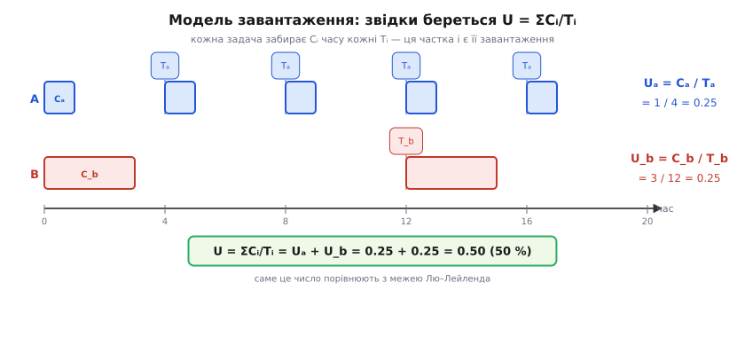
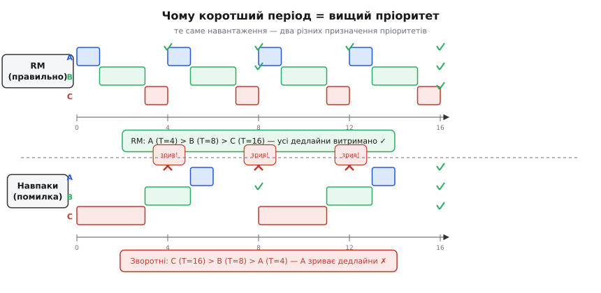

# 🧮 Математика: Rate Monotonic — чому коротший період = вищий пріоритет

Правило монотонності частоти — «найтерміновіше йде найпершим» — звучить як здоровий глузд. Тут — чому це правило не випадкове, а математично оптимальне, і як одним числом перевірити «чи всі задачі встигнуть», ще не запускаючи код на ESP32. Весь цей апарат стосується **RTOS-задач із фіксованим ритмом** — мотор щомілісекунди, кнопки кожні 20 мс, дисплей кожні 200 мс, — саме таких, що наповнюють [планувальник реального часу](book:programming/realtime-determinism). Десятковий роздільник у всіх числах — крапка.

## Означення: завантаження, період, межа розкладності

Модель: задача *i* прокидається кожні **Tᵢ** (період = дедлайн за RMS-припущенням) і витрачає **Cᵢ** часу — це найгірший час виконання, [**WCET**](book:programming/realtime-determinism). Завантаження однієї задачі:

```
Uᵢ = Cᵢ / Tᵢ
```

Якщо задача виконується 0.2 мс кожну 1 мс — вона забирає 20 % ядра. Сумарне завантаження:

```
U = Σ Uᵢ = Σ Cᵢ/Tᵢ
```

Очевидна **необхідна умова** — U ≤ 1.0: неможливо просити більше 100 % одного ядра. На ESP32 ядер два ([FreeRTOS](book:programming/freertos)), але аналіз ведуть **по кожному ядру окремо** — задача, закріплена через pinning, не може «позичити» час сусіднього ядра.

**Rate-monotonic priority assignment (RMA):** пріоритети призначаються один раз (фіксовані) — менший Tᵢ → вищий пріоритет. Для порівняння: динамічний EDF (*earliest deadline first*) може вичавити більше, але у FreeRTOS відсутній — RMA є природним вибором для фіксованих пріоритетів RTOS.

> 🔧 **Навіщо це.** Завантаження U — **бюджет процесора**. Порахуйте його до написання задач: якщо U вже > 100 %, жоден планувальник і жодні пріоритети не врятують — це арифметика, не майстерність.


*Рис. Модель завантаження: кожна задача забирає Cᵢ часу кожні Tᵢ, тож з'їдає частку Uᵢ=Cᵢ/Tᵢ процесора; сума цих часток U — те число, що перевіряють на розкладність.*

## Інтуїція: чому саме коротший період заслуговує вищий пріоритет

Дві задачі: A (Tₐ = 10 мс) і B (T_b = 100 мс). Задача B між своїми дедлайнами має 100 мс запасу — вона легко пропустить кілька проходів A. Задача A живе у вузькому 10-мілісекундному вікні: якщо B «проривається» наскрізь, A не встигне до свого дедлайну.

**Симетрія втрат нерівна:** затримати рідкісну довгоперіодну задачу майже завжди безпечно; затримати часту — майже завжди фатально. «Найчастіша йде першою» — прямий наслідок розташування дедлайнів, а не вподобання планувальника.

Якщо ж зробити навпаки і дати повільному дисплею найвищий пріоритет — виходить **рукотворна інверсія пріоритетів за дизайном**; RM саме її уникає на рівні призначення. Ключове твердження теорії: серед **усіх** схем роздачі фіксованих пріоритетів, якщо хоч якась вкладе всі дедлайни — то й RM-розклад вкладе. **RM оптимальний серед фіксованих** (Liu & Layland, 1973). «Оптимальний» тут означає «не гірший за будь-яку іншу схему», а не «вкладе завжди».


*Рис. Згори — RM-розклад, де встигають усі; знизу — зворотні пріоритети, де рідкісна задача блокує часту, і та зриває дедлайн. Навантаження те саме — різниця лише в порядку пріоритетів.*

## Формальний апарат: межа Лю–Лейленда

**Теорема (Liu & Layland, 1973).** Для n незалежних RMA-задач дедлайни гарантовано виконуються, якщо:

```
U = Σ Cᵢ/Tᵢ  ≤  n · (2^(1/n) − 1)
```

Права частина **спадає** з n — що більше задач, то вищий ризик невдалого збігу фаз:

```
n=1 → 1.000   n=2 → 0.828   n=3 → 0.780   n=4 → 0.757   n→∞ → ln 2 ≈ 0.693
```

Звідки ln 2? При n→∞ стандартна границя n·(2^(1/n)−1) = ln 2. Повний вивід — поза курсом, але число варто запам'ятати: **≈ 70 % — безпечний поріг** для будь-якої кількості задач.

**Критичне розрізнення:** межа — **достатня**, але не **необхідна** умова. U ≤ межі ⇒ гарантовано встигнуть; межа < U ≤ 1.0 — «сіра зона», де система **може** встигнути, але тест не підтверджує. Вихід за межу ≠ вирок: є точний **аналіз часу відгуку** (ітеративний розрахунок Rᵢ = Cᵢ + Σ⌈Rᵢ/Tⱼ⌉·Cⱼ), однак це окремий, складніший інструмент.

> 🔧 **Навіщо це.** Тримай сумарне завантаження одного ядра нижче ~70 % (ln 2) — і про дедлайни всіх RMS-задач можна не хвилюватися. Між 70 % і 100 % — перевіряй точним аналізом або вимірюванням. Вище 100 % — скорочуй WCET, подовжуй Tᵢ або виноси на [друге ядро ESP32](book:programming/freertos).

Межі моделі (де аналіз ламається): задачі незалежні й не блокуються; дедлайн = Tᵢ; перемикання контексту знехтуване (на RTOS це розумно — [затримки обмежені](book:programming/realtime-determinism)). Щойно з'являються м'ютекси — незалежність рветься, [інверсія пріоритетів](book:programming/task-ipc) поїдає запас, і простий тест стає недостатнім.

## Worked-приклад: три задачі числом

**Приклад (тест розкладності за межею Лю–Лейленда).** Три типові RTOS-задачі — мотор, кнопки, дисплей — тепер із часами виконання Cᵢ:

```
Задача     T (мс)  C (мс)
мотор         1     0.2
кнопки       20     1
дисплей     200    20

Крок 1. RM-пріоритети (менший T → вищий):
  мотор → ВИСОКИЙ, кнопки → середній, дисплей → низький
  ← збіг з інтуїцією «найчастіша — найперша» = RMA ✓

Крок 2. Завантаження:
  U_мотор   = 0.2 / 1   = 0.200
  U_кнопки  = 1   / 20  = 0.050
  U_дисплей = 20  / 200 = 0.100

Крок 3. Сума:  U = 0.200 + 0.050 + 0.100 = 0.350  (35 %)

Крок 4. Межа n=3:  3 · (2^(1/3) − 1) = 3 · 0.2599 = 0.780  (78 %)

Крок 5. 0.350 ≤ 0.780  →  ✅ ГАРАНТОВАНО розкладні; запас 43 %
```

Тест дав «так» до написання коду — у цьому й сила: підрахунок дешевший за налагодження на платі.

Контрприклад — **не завантаження ламає, а пріоритети**: той самий набір задач із Cᵢ_дисплей = 40 мс дає U = 0.450 ≤ 0.780 (тест пройдено). Але якщо дати дисплею НАЙВИЩИЙ пріоритет — його 40-мілісекундне малювання блокує мотор, і той зриває 1-мілісекундний дедлайн. Математика не врятує від неправильного порядку пріоритетів.

## Як це лягає на практику

Правило монотонності частоти і приклад трьох задач тепер мають не лише інтуїцію, а теорему й перевірний тест. Механізм, що реально витісняє нижчий пріоритет вищим, дає [планувальник](book:programming/scheduler); де рахувати U по кожному ядру окремо — закріплення задач за ядром у [FreeRTOS](book:programming/freertos). Щойно з'являються спільні ресурси, [успадкування пріоритету](book:programming/task-ipc) рятує від інверсії, але простий тест за завантаженням стає недостатнім.

Для більшості аматорських ESP32-проєктів достатньо тримати завантаження ядра нижче ~70 % і призначати пріоритети за RM — тоді дедлайни подбають про себе самі. Де ціна помилки висока — перевіряйте вимірюванням, не лише формулою: модель ідеалізована, а реальність завжди додає джитер і непередбачені збіги.
