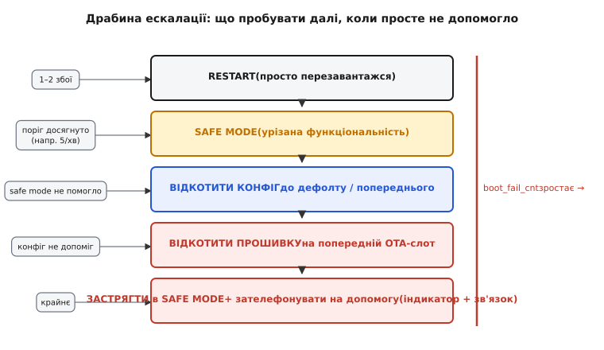
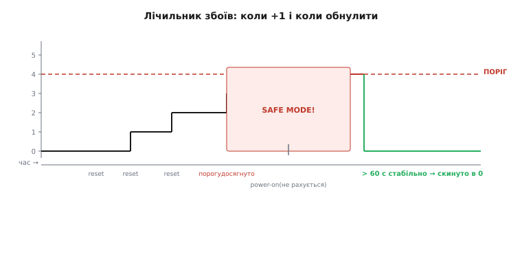

# Лічильник перезавантажень

Reset як ліки має дозу. Пристрій, що перезавантажується раз на місяць — здоровий; той, що кожні три секунди — у «циклі смерті». Відрізнити їх можна лише **рахуючи**.

**Ідея лічильника.** Персистентний лічильник (в [RTC-пам'яті](book:programming/rtc-memory) або [NVS](book:programming/nvs)), що інкрементується при кожному ненормальному старті й обнуляється після N секунд **стабільної** роботи. Малий лічильник — норма; перевищив поріг за короткий час — система зрозуміла, що зациклилась.

**Причина reset як ключ.** Не кожен reset однаково «підозрілий», і [причина перезавантаження](book:programming/reset-causes) — головний фільтр. `esp_reset_reason()` повертає:
- `ESP_RST_POWERON` — нормальне увімкнення, людина підключила живлення;
- `ESP_RST_SW` — програмний reset (наш `esp_restart()`), очікуваний;
- `ESP_RST_TASK_WDT` / `ESP_RST_INT_WDT` — watchdog, підозріло;
- `ESP_RST_PANIC` — паніка, підозріло;
- `ESP_RST_BROWNOUT` — [просіло живлення](book:programming/brownout), окремий клас;
- `ESP_RST_DEEPSLEEP` — вихід з [deep-sleep](book:programming/rtc-memory), очікуваний.

Реагувати треба на **патологічні** причини — watchdog і panic. Power-on, deep-sleep wake, програмний reset — не рахувати.

**Стратегія ескалації за лічильником.** Лічильник збоїв — це не просто «скільки разів впали», а **підказка, що пробувати далі**:

1. **1–2 збої** → просто перезавантажся (разовий збій, без зміни поведінки);
2. **Досяг порогу** (наприклад, 5 за хвилину) → **не повторюй те саме**: переходь у [safe mode](book:programming/safe-mode);
3. **Safe mode не виправив** → **відкоти конфіг** до дефолтного або попереднього ([атомарний запис конфігу](book:programming/write-integrity));
4. **Конфіг не допоміг** → **відкоти прошивку** на попередній [OTA-слот](book:programming/ota-slots);
5. **Все не допомогло** → **застрягни в safe mode** і кличь на допомогу (яскравий індикатор + доступний канал зв'язку).



*Рис. Драбина ескалації: що пробувати далі, коли просте не допомогло.*

**Де лічильник мусить жити.** RTC-пам'ять переживає reset і навіть brownout-reset, але **не** повне знеструмлення. NVS переживає знеструмлення, але [зношує Flash](book:programming/wear-leveling) кожним записом. Компроміс: **лічильник у RTC** (швидко, без зносу), **порогові події** (вирішення про відкат конфігу, про safe mode) — **у NVS** (потрібна персистентність через знеструмлення). При старті після power-on RTC-лічильник скидається явно.

**Обнулення лічильника — критична деталь.** Коли вважати, що «вижили»? Не після першого успішного запуску — після **T секунд безперервної нормальної роботи**. Наприклад, 60 секунд без аварій → обнулити. Без цього пристрій із рідкими (але реальними) збоями накопичить лічильник і хибно піде в safe mode. Таймер запускати в кінці `app_main`, після ініціалізації всіх підсистем, і скидати лічильник лише при його спрацюванні.



*Рис. Серія швидких рестартів → лічильник росте → поріг → safe mode. Після >60 с стабільності → скинути в 0.*

**Worked-приклад.** Логіка старту з лічильником і стратегією ескалації:

```c
#include "esp_system.h"
#include "nvs_flash.h"
#include "freertos/FreeRTOS.h"
#include "freertos/timers.h"

#define FAULT_THRESHOLD       5       // збоїв за "вікно"
#define STABILITY_TIMEOUT_MS  60000   // 60 с стабільності → скинути лічильник

RTC_NOINIT_ATTR static uint32_t s_boot_fail_cnt;
static TimerHandle_t s_stability_timer;

static void stability_timer_cb(TimerHandle_t xTimer) {
    // 60 с без аварій — вважаємо пристрій здоровим
    ESP_LOGI(TAG, "stable for 60s — resetting fault counter");
    s_boot_fail_cnt = 0;
}

void startup_check(void) {
    esp_reset_reason_t reason = esp_reset_reason();

    // Патологічні причини — рахувати
    bool pathological = (reason == ESP_RST_TASK_WDT ||
                         reason == ESP_RST_INT_WDT  ||
                         reason == ESP_RST_PANIC);

    if (reason == ESP_RST_POWERON) {
        // Повне знеструмлення: скинути RTC-лічильник
        s_boot_fail_cnt = 0;
    }

    if (pathological) {
        s_boot_fail_cnt++;
        ESP_LOGW(TAG, "pathological reset reason %d, fault_cnt=%lu",
                 reason, s_boot_fail_cnt);
    }

    // Стратегія ескалації
    if (s_boot_fail_cnt >= FAULT_THRESHOLD) {
        ESP_LOGE(TAG, "fault loop detected! cnt=%lu — entering safe mode / rollback",
                 s_boot_fail_cnt);

        // Спробувати відкотити конфіг (§4.3.7: читати backup-слот)
        if (!config_rollback_if_available()) {
            // Конфіг не допоміг → відкотити прошивку (§4.3.8)
            esp_ota_mark_app_invalid_rollback_and_reboot();
            // Якщо й це не допоможе — safe mode назавжди
        }
        enter_safe_mode();   // запустити мінімальну конфігурацію
        return;
    }

    // Нормальний старт — завести таймер стабільності
    s_stability_timer = xTimerCreate("stability", pdMS_TO_TICKS(STABILITY_TIMEOUT_MS),
                                     pdFALSE, NULL, stability_timer_cb);
    xTimerStart(s_stability_timer, 0);

    // ... далі нормальна ініціалізація
}
```

> 🔧 **Навіщо це.** Без лічильника пристрій із поганим конфігом перезавантажується вічно й виглядає «мертвим» — залізо ціле, але до нього не дістатись. З лічильником він **сам** розуміє «я зациклився», відкочується до робочого стану й оживає. Це різниця між цеглиною й самовідновним пристроєм.

> ⚙️ Атомарне оновлення конфігу (два слоти + версія + CRC, база безпечного відкоту): `r03-s7-a-atomic-config.md`. [OTA-слоти і механіка відкату прошивки](book:programming/ota-slots) — те, на що спирається крок 4.

Лічильник ловить цикл смерті, який породжує сама логіка чи конфіг. Та частина рестартів має зовсім інше коріння й **маскується під баг прошивки** — [нестабільне живлення](book:programming/brownout), яке відрізняють уже не лічильником, а за причиною reset.

---
