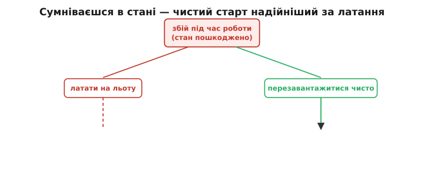
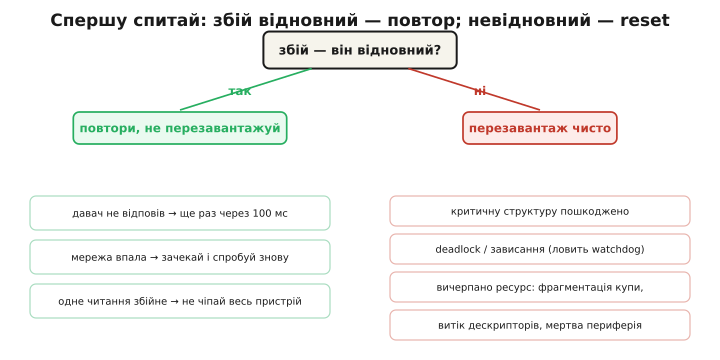
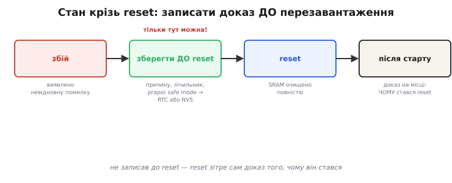
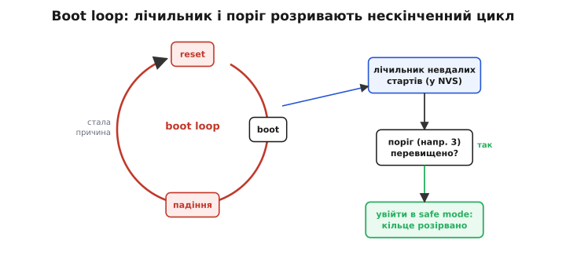

# Перезавантаження

Є промислова істина, яка спершу звучить дивно: навмисне перезавантаження (англ. *reboot*, від *re-* «знов» + *boot* — «завантаження», скорочення від *bootstrap*) часто **надійніше** за спробу акуратно полагодити зіпсований стан на льоту. Чистий старт відомий і передбачуваний. Латання невідомого стану — ні. Звідси й ціла стратегія відновлення (англ. *recovery*, від лат. *recuperare* — «повернути собі»): не рятувати пошкоджене, а свідомо повернути пристрій у точку, з якої він гарантовано вміє стартувати.

Щоб ця стратегія працювала, мало вміти викликати reset. Треба знати **коли** він доречний, а коли шкодить; що саме треба **зберегти** перед ним, бо reset стирає пам'ять; і як не загнати пристрій у нескінченний цикл перезавантажень. Розберімо все це по черзі.

### Чому чистий старт лікує

Після перезапуску стан пристрою **повністю визначений**: оперативна пам'ять очищена, периферія приведена в стан reset, змінні ініціалізовані з нуля або з відомих початкових значень. Що відбувається від натискання RESET до першого рядка `app_main`, докладно показує [послідовність завантаження](topic:programming/bootloader) — і кожен її крок детерміністичний.

Зіпсований стан — повна протилежність. Він невідомий: ніхто не знає, скільки в ньому прихованих «мін» — недописаний буфер, напівзвільнена структура, лічильник, що переповнився. Старе «вимкни-увімкни» працює саме тому, що **викидає накопичене пошкодження** разом з усіма його невидимими наслідками. Ти не лагодиш конкретну ваду — ти прибираєш весь непевний стан одним рухом.

> 📜 Ця засада не домашня кмітливість, а інженерна норма з гучними прикладами: 1997-го сторожовий таймер раз по раз робив повне скидання марсіанського апарата Pathfinder при зависанні через інверсію пріоритетів — і саме ці сліпі рестарти втримали місію живою, доки причину діагностували й виправили з Землі. Звідти ж тягнеться науковий напрям про відновлення через перезапуск. Подробиці — у вставці [Як reset урятував місію на Марсі](topic:programming/reboot-strategy/hist-restart-recovery.md).


*Чому reset надійніший за латання. З однієї точки збою — два шляхи. Ліворуч: лагодимо на льоту, але латка лягає на непередбачуваний стан, тож і результат непередбачуваний. Праворуч: чистий старт веде у повністю визначений стан, де RAM очищено, периферія в reset, а змінні починаються з нуля. Коли в стані сумніваєшся, правий шлях коротший і безпечніший.*

> 🔧 **Навіщо це.** Спокуса «акуратно відновити пошкоджений стан» породжує найзаплутаніші баги прошивки: латка накладається на непередбачуваний стан і дає непередбачуваний результат, який потім годинами ловлять. Промислові системи натомість тримаються правила «сумніваєшся — перезавантажся чисто», бо передбачуваний рестарт дешевший і надійніший за героїчне латання наосліп.

### Коли перезавантаження доречне, а коли шкодить

Reset — сильний інструмент, тож вмикати його треба з розбором. Ключове питання на кожен збій одне: **він відновний?**

Якщо ситуація очікувана й відновна — перезавантаження зайве, ба навіть шкідливе. Давач не відповів на один запит — спробуй прочитати ще раз через сотню мілісекунд, а не перезавантажуй весь пристрій через одне невдале читання. Зник зв'язок із мережею — зачекай і повтори, а не кидай систему в reset. Логіка «спробуй, потім вирішуй» підвищує стійкість без зайвих перезапусків: дрібний, сам собою минущий збій не повинен валити всю систему.

Якщо ж помилка невідновна — reset стає правильною відповіддю. Виявлено псування критичної структури даних, яке вже не відкотити. Сталося зависання чи взаємне блокування завдань — його ловить [сторожовий таймер](topic:programming/watchdog) і робить reset автоматично. Вичерпано ресурс так, що його не повернути: фрагментувалася купа після довгої роботи, потекли файлові дескриптори, периферія впала в стан, з якого не виходить навіть переініціалізацією. У всіх цих випадках лагодити нема чого — стан уже за межею ремонту, і чистий старт єдиний дає визначеність.


*Розвилка рішення. На кожен збій спершу питаємо, чи він відновний. Відновні (давач мовчить, мережа впала, одне читання збійне) лікуються повтором — пристрій чіпати не треба. Невідновні (пошкоджено критичну структуру, зависання, вичерпано ресурс) лікуються чистим перезавантаженням. Та сама подія в різних гілках вимагає протилежної реакції — тому розрізняти їх треба свідомо.*

Окрема й важлива ланка цієї логіки — [сторожовий таймер](topic:programming/watchdog) як **автоматичний** reset зависання. Прошивка в нормі періодично «годує» сторожа; щойно вона перестала це робити — сторож вважає, що система зависла, і робить reset сам, без участі коду. Тонкість тут у тому, **як** годувати. Сліпе «погодувати в кожному циклі» знецінює сторожа: він перестане ловити саме ті зависання, заради яких існує. Годувати треба в контрольних точках, які проходяться лише тоді, коли реальна робота справді рухається. Тоді, якщо завдання застрягло в одній гілці й до контрольної точки не дійшло, сторож спрацює — як і має.

### Зберегти стан крізь перезавантаження

Reset очищає всю оперативну пам'ять. А отже все, що треба **пам'ятати після** перезапуску — причину збою, лічильник рестартів, прапорець безпечного режиму — слід записати **до** reset, у пам'ять, яка його переживе.

Місць для цього два, і вони різні за стійкістю. [RTC-пам'ять](topic:programming/rtc-memory) переживає програмний reset, бо її область при старті не ініціалізується; але вона **не** переживає повного знеструмлення, а на ESP32 за замовчуванням не зберігається ще й через пробудження з глибокого сну. [Енергонезалежна пам'ять](topic:programming/nvs) у Flash переживає і reset, і знеструмлення — ціною повільнішого й «дорожчого» запису. Звідси проста засада: швидкий лічильник у межах серії перезапусків кладемо в RTC-пам'ять, а те, що мусить пережити вимкнення живлення, — в NVS.


*Стан крізь перезавантаження. Між виявленням збою й самим reset є єдине вікно, коли причину й лічильник ще можна зберегти — у RTC-пам'ять чи NVS. Reset очищає всю SRAM, тож після старту на місці лишається тільки те, що встигли записати завчасно. Пропустити це вікно — означає стерти сам доказ того, чому reset стався, і перетворити налагодження на детектив без свідків.*

> 🔧 **Навіщо це.** Якщо не зберегти причину до reset, перезапуск зітре її разом з усім станом — і на руках лишиться пристрій, що раптом перезавантажився невідомо чому. Збережений код збою й лічильник рестартів перетворюють німий рестарт на читабельний слід: видно, що сталося, котрий це раз поспіль і чи пора вмикати безпечний режим.

### Грамотне перезавантаження, а не панічне

Навіть коли reset вирішено, кидати його миттю не можна. Правильний порядок той самий, що й при вході в [безпечний стан](topic:programming/safe-mode): спершу привести виконавчі органи в безпечне положення, потім дозаписати критичні дані, і лише тоді перезавантажуватися. Якщо скинути пристрій посеред активного запису в NVS, є ризик зіпсувати саме той запис, де зберігається [цілісність даних](topic:programming/write-integrity) — зокрема й причину збою, яку ми щойно намагалися зберегти. Панічний reset здатен знищити власні докази.

На ESP32 програмне перезавантаження — це виклик `esp_restart()`. Перед ним прошивка має пройти весь ланцюжок: безпечний стан → збереження стану → reset. Ось обробник критичної помилки, що робить це по порядку й веде лічильник рестартів у RTC-пам'яті:

```c
#include "esp_system.h"
#include "nvs_flash.h"
#include "esp_log.h"
static const char *TAG = "fault_handler";

// RTC_NOINIT_ATTR: змінна у RTC slow memory. Переживає програмний reset,
// але НЕ переживає повного знеструмлення; через deep-sleep на ESP32 за
// замовчуванням теж не зберігається (треба окремо тримати RTC-домен живим).
RTC_NOINIT_ATTR static uint32_t s_boot_fail_cnt;
RTC_NOINIT_ATTR static uint32_t s_last_fault_code;

// Викликати на старті: відрізнити «свіже» увімкнення від рестарту по збою.
void fault_counter_init(void) {
    esp_reset_reason_t reason = esp_reset_reason();
    if (reason == ESP_RST_POWERON || reason == ESP_RST_BROWNOUT) {
        // Справжнє увімкнення живлення або просідання напруги:
        // RTC-пам'ять могла бути неініціалізованою — починаємо лічбу з нуля.
        s_boot_fail_cnt   = 0;
        s_last_fault_code = 0;
    }
    // Якщо причина — watchdog чи panic, лічильник НЕ чіпаємо:
    // він уже інкрементований перед попереднім reset і має зберегтися.
}

// Викликати при будь-якій критичній помилці.
void fault_handler(uint32_t fault_code) {
    // Крок 1: безпечний стан — ПЕРЕДУСІМ (між збоєм і reset мотор не крутиться).
    enter_safe_state();

    // Крок 2: зберегти причину й збільшити лічильник — ДО reset, поки RAM жива.
    s_last_fault_code = fault_code;
    s_boot_fail_cnt++;

    // Крок 3: лишити слід у журналі.
    ESP_LOGE(TAG, "FAULT 0x%08lx — reboot #%lu", fault_code, s_boot_fail_cnt);

    // Крок 4: дозаписати NVS — закрити незавершені транзакції, не лишити їх «рваними».
    nvs_flash_deinit();

    // Невелика пауза — дати UART витиснути лог до кінця.
    vTaskDelay(pdMS_TO_TICKS(200));

    // Крок 5: чисте перезавантаження.
    esp_restart();
}
```

Розбір по кроках. `s_boot_fail_cnt` у `RTC_NOINIT_ATTR` переживає програмний reset, тож після перезапуску ми точно знаємо, котрий це раз поспіль — і саме на цьому числі далі будуватиметься захист від нескінченного циклу. `esp_reset_reason()` дає відрізнити свіже ввімкнення живлення (лічильник скидаємо) від рестарту по збою (лічильник зберігаємо) — без цієї перевірки лічба була б безглуздою. `enter_safe_state()` стоїть першим навмисно: у проміжку між виявленням збою й reset виконавчі органи мають бути знеструмлені. `nvs_flash_deinit()` коректно закриває незавершені записи, щоб reset не лишив NVS у суперечливому стані. А пауза перед `esp_restart()` дає журналу дописатися — інакше останній, найцінніший рядок про причину збою не встиг би вийти.

### Коли ліки стають отрутою: boot loop

Reset чудово лікує **разовий** збій. Але якщо причина **стала** — зіпсований конфіг, апаратна вада, що повторюється на кожному старті, — пристрій входить у *boot loop*: reset → завантаження → той самий збій → знову reset, і так без кінця. Ліки в передозуванні стають отрутою: пристрій безперервно перезавантажується й не робить нічого корисного.

Рятує саме той лічильник рестартів, який ми зберегли крізь reset. Ідея проста: рахувати **невдалі** старти й, коли їх поспіль набралося більше за поріг (типово близько трьох), перестати ламитися тим самим шляхом — і натомість завантажитися в [безпечний режим](topic:programming/safe-mode) з мінімумом функцій, або відкотити останню зміну конфігу. Це розриває кільце: замість нескінченних спроб пристрій зупиняється у відомому робочому мінімумі, звідки людина чи система вже може його витягти. Лічильник, поріг і скидання його після вдалого старту — окрема тема, [лічильник перезавантажень](topic:programming/reboot-counter).


*Boot loop і вихід із нього. Стала причина замикає reset, завантаження й падіння в самопідтримне кільце — пристрій крутиться в ньому без користі. Розриває кільце лічильник невдалих стартів у NVS: щойно він перевищив поріг, пристрій іде не на черговий приречений старт, а в безпечний режим. Та сама стратегія перезавантаження, що рятує від разового збою, потребує цього запобіжника проти збою сталого.*

> 🔧 **Навіщо це.** Без захисту від boot loop одна стала вада — биті дані в конфігу чи відсутня периферія — здатна перетворити пристрій на цеглину, що вічно перезавантажується й до користувача не доходить. Лічильник із порогом коштує кількох рядків коду й одного запису в NVS, а рятує від найприкрішого роду «смерті» в полі, коли пристрій ніби живий, але назавжди застряг на старті.

Перезавантаження, отже, не груба кнопка, а продумана стратегія відновлення: вмикати його лише на невідновних збоях, виходити в нього грамотно — через безпечний стан і збереження причини, — і неодмінно прикривати запобіжником від нескінченного циклу. У такому вигляді чистий старт стає одним з найнадійніших інструментів стійкої прошивки.
