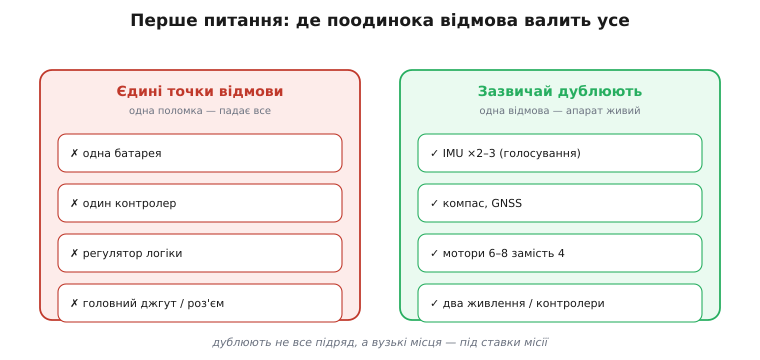
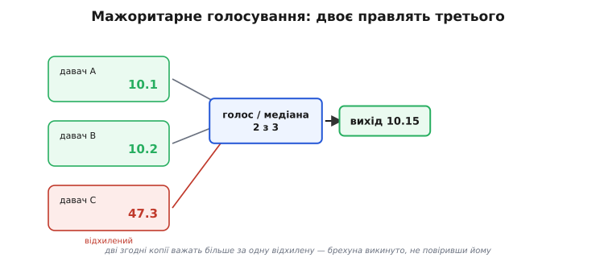
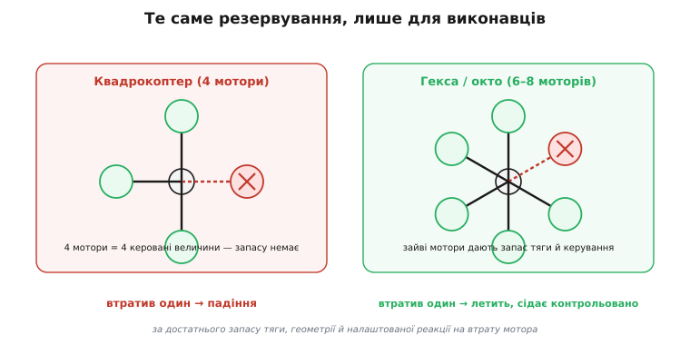
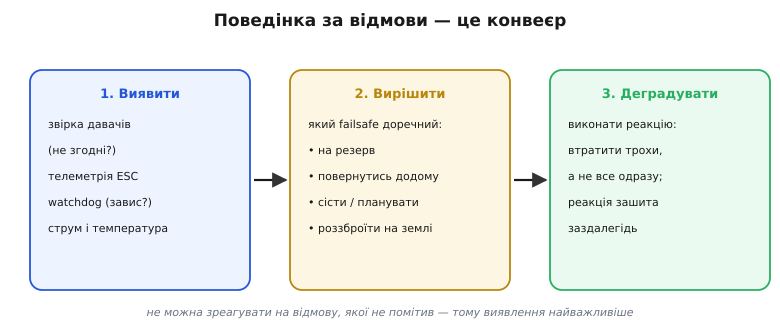
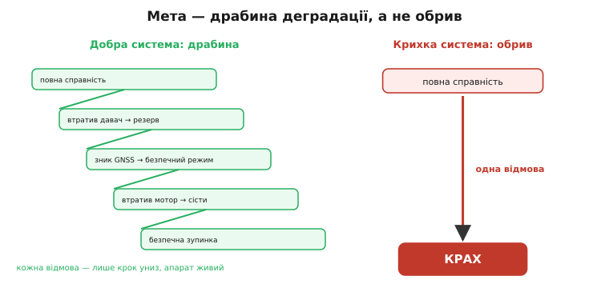

# Надлишковість

Будь-який компонент апарата **може відмовити**. Давач збреше, мотор стане, ESC перегріється, дріт обірветься, батарея просяде. Тому добрий апарат визначається не тим, що він працює бездоганно, — бездоганного не буває, — а тим, **як він ламається**. Надлишковість (*redundancy*, від латинського *redundare* — «переливатися через край», тобто мати **більше, ніж конче треба**) і є відповіддю: тримати запас, щоб відмова однієї деталі не означала падіння всього апарата. Той самий запас, прикладений до конкретної ланки — продубльований давач, зайвий мотор, друге живлення, — називають **резервуванням**: це надлишковість у дії. Ця тема зшиває всі компоненти з принципами надійності [політного контролера](topic:programming/flight-controller).

### Перше питання: де поодинока відмова валить усе

Проєктуючи (чи розбираючи) апарат на надійність, перше питання таке: **які частини, відмовивши поодинці, валять усе?** Це — **єдині точки відмови** (*single point of failure*, SPOF):


*Карта вразливості. Ліворуч — типові єдині точки відмови: одна батарея, один політний контролер, один регулятор живлення логіки, головний джгут. Відмовить така — падає все. Праворуч — те, що зазвичай дублюють: IMU (два-три, з голосуванням), компас, GNSS, а на серйозних апаратах — навіть два контролери чи два джерела живлення. Правило просте: знайди вузькі місця — і прибери їх або продублюй.*

Але дублювати все підряд — помилка. Кожна зайва деталь додає **ваги, ціни й нових деталей, що теж можуть зламатися**. Тому надлишковість — це завжди компроміс: дублюють саме критичні вузькі місця, і то відповідно до **ставок**. Іграшковому дрону вистачить одного всього; апарату, що возить щось цінне над людьми, — кількох. І варто пам'ятати пастку зі [спільною за причиною відмовою](topic:programming/flight-controller) (Ariane 5): подвоїти **однакове** мало, якщо обидві копії ламаються однаково.

Ця пастка цілком жива й на рівні компонентів. Два однакові приймачі GNSS однаково «осліпнуть» від тієї самої глушилки; два IMU, жорстко прикручені поряд, однаково потонуть у тій самій вібрації; дві ланки, що живляться від одного регулятора, помруть разом із ним. Тому справжня надлишковість — це ще й **різнорідність**: рознести давачі фізично, узяти різні їх типи, розвести живлення. Інакше «дубльована» система має приховану єдину точку відмови — спільну причину.

Серед усіх SPOF **живлення** — найпідступніше, бо від нього залежить геть усе разом. Тому в серйозних системах резервують і його: два акумулятори через діодне «АБО» (щоб відмова одного не знеструмила борт), окреме надійне живлення політного контролера, моніторинг кожної шини. Просадка напруги при ривку моторів чи серво здатна перезавантажити контролер у найгірший момент — тому логіку живлять окремо від силової частини.

Тут варто бути чесним: надлишковість — **не безплатне добро**. Кожна додана деталь — це ще й нове джерело відмови, зайва вага, складніша збірка й більше з'єднань (а роз'єми та пайки — класичні місця поломок). Інколи простіша система з меншою кількістю частин **надійніша** за хитромудру з дублями, бо в ній просто менше чому ламатися. Тому інженерна мудрість — не «продублюй усе», а «продублюй те, що варте дублювання, і спрости решту». Надійність — це судження, а не кількість запчастин.

> 🔧 **Навіщо це.** Беручи чужий апарат, мисленнєво спитай: «що буде, якщо це відмовить?» — по кожній ланці. Знайдеш SPOF — знайдеш, де апарат найслабший. Часто це **живлення**: одна батарея, один роз'єм, один регулятор, від яких залежить геть усе. Тому надійні апарати так пильнують саме живлення.

### Голосування: коли давачів троє, а не один

Найчистіший спосіб обернути дублювання на надійність — **голосування** (*voting*). Якщо одного давача мало, бо він може збрехати непомітно, ставлять кілька й беруть **те, на чому копії згодні**. Класична форма — **потрійне модульне резервування** (*triple modular redundancy*, TMR): три однакові вузли рахують те саме, а **мажоритарний голосувач** (*majority voter*) видає те значення, на якому збігаються принаймні двоє. Один збоїть — двоє його **переголосують**, і помилка навіть не вийде назовні.

Чому саме троє? З двома давачами ти **помітиш** розбіжність, але не знатимеш, **хто** з них бреше, — лишається тільки виключити обох. Третій давач дає більшість: двоє проти одного, і відразу видно, кого слухати, а кого викинути. Це і є та різниця між «помітити відмову» і «пережити її, не втративши значення».


*Мажоритарне голосування. Три давачі міряють те саме; два згодні (10.1 і 10.2), третій раптом видає 47.3 — він збоїть. Голосувач відкидає відхилене значення й бере те, на чому збігаються двоє. Вихід лишається правильним, хоча один із трьох ошалів. Це й є сенс TMR: одна відмова **маскується**, а не проходить далі.*

Ідея von Neumann з 1956 року — будувати надійне ціле з ненадійних частин через дублювання й голосування — у 1962-му стала інженерним методом (дослідження IBM), а далі лягла в основу систем, яким падати не можна: від бортового комп'ютера ракети Saturn V до перших систем «керування дротом» (*fly-by-wire*). У дешевому дроні TMR у чистому вигляді рідкісне, але **думка** та сама: кілька IMU, кілька приймачів GNSS, два компаси — і логіка, що звіряє їх і відкидає відмовлений. Те, як ця ідея народилася й дійшла від лекційної дошки до бортового комп'ютера ракети й літака, варте окремої [короткої історії](topic:programming/redundancy/hist-tmr.md).

Розберімо найпростіший голосувач — **медіану трьох**, серцевину TMR для числових давачів. Медіана (середнє з трьох за величиною) автоматично викидає одного «викидня»: якщо один давач застряг чи показав дику величину, він опиняється скраю, а медіана бере того, хто посередині, — тобто згоду двох розсудливих.

> 🔧 **Навіщо це.** Медіана трьох — це **дешевий, але дуже дієвий** запобіжник: жодного навчання, жодних порогів, лише три числа й кілька порівнянь. Саме тому її кладуть у критичні цикли, де однієї застряглої величини досить, щоб апарат рвонув не туди.

**Умова: три давачі висоти дають 10.1, 10.2 і 47.3 м; узяти медіану, щоб один збій не пройшов далі.**

:::tabs
```c
// медіана трьох float — голосувач TMR для числового давача.
// Повертає середнє за величиною; один викидень автоматично відкидається.
static float median3(float a, float b, float c) {
    // максимум і мінімум — «крайні», середнє з них — медіана
    float hi = a > b ? a : b;  hi = hi > c ? hi : c;   // найбільше
    float lo = a < b ? a : b;  lo = lo < c ? lo : c;   // найменше
    return a + b + c - hi - lo;                        // лишається середнє
}

void example(void) {
    float alt = median3(10.1f, 10.2f, 47.3f);
    // hi = 47.3, lo = 10.1  →  10.1 + 10.2 + 47.3 − 47.3 − 10.1 = 10.2
    // давач, що збрехав (47.3), відкинуто; на виході — здорові 10.2 м
}
```
```python
# медіана трьох float — голосувач TMR для числового давача.
# Повертає середнє за величиною; один викидень автоматично відкидається.
def median3(a, b, c):
    # максимум і мінімум — «крайні», середнє з них — медіана
    hi = max(a, b, c)                     # найбільше
    lo = min(a, b, c)                     # найменше
    return a + b + c - hi - lo            # лишається середнє


alt = median3(10.1, 10.2, 47.3)
# hi = 47.3, lo = 10.1  →  10.1 + 10.2 + 47.3 − 47.3 − 10.1 = 10.2
# давач, що збрехав (47.3), відкинуто; на виході — здорові 10.2 м
```
:::

Покроково на наших числах:

```pseudocode
сума    = 10.1 + 10.2 + 47.3 = 67.6
hi      = 47.3        (давач C — викидень)
lo      = 10.1        (давач A)
медіана = 67.6 − 47.3 − 10.1 = 10.2   (давач B — згода розсудливих)
```

Брехливе значення 47.3 навіть не торкнулося виходу: воно стало `hi` й одразу відняте. Вийшли здорові 10.2 м — рівно те, чого ми хотіли від голосування. Та сама функція переживе будь-який **один** збій із трьох; на два збої заразом її вже не стане — для цього довелося б брати п'ять давачів і голосувати «3 з 5». Кількість копій, як і скрізь у цій темі, добирають під ставки.

Один важливий нюанс: голосування рятує лише від **незалежних** збоїв. Якщо всі три давачі однакові й стоять в одному місці, спільна причина (та сама вібрація, та сама глушилка, та сама хиба в коді) звалить усіх трьох разом — і медіана чесно віддасть «згоду» трьох однаково неправильних. Тому під TMR кладуть ту саму різнорідність: різні типи давачів, рознесене розташування, по змозі — незалежні реалізації.

### Резервування виконавців: чому 6–8 моторів

Окрім давачів, є й надлишковість **виконавців**, і тут — найвиразніший приклад усієї теми:


*Чому серйозні апарати беруть 6–8 моторів. Квадрокоптер має рівно 4 мотори на 4 керовані величини (крен, тангаж, курс, тяга) — запасу немає, тож втрата одного мотора зазвичай означає падіння. Гекса- й октокоптери мають **зайві** мотори: втративши один, вони — за достатнього запасу тяги, правильної геометрії й належної детекції та мікшера — ще мають чим і триматися в повітрі, і керувати, тож можуть сісти контрольовано. (Та не кожен гекс автоматично переживає втрату мотора: це вимога до конструкції й налаштування, а не дарунок самих шести моторів.) Та сама логіка резервування, що для давачів, лише для виконавчої частини.*

Ось чому апарати, яким падати не можна (важкі, над людьми, з цінним вантажем), роблять на шести-восьми моторах, а не на чотирьох: це **резервування виконавців**. Те саме стосується й інших приводів: заклинило серво керма на літаку — і поверхня застрягла; тому відповідальні апарати дублюють і керма, і канали, щоб відмова одного приводу не позбавляла керованості.

Резервування виконавців ширше за мотори. Зламалася лопать чи промінь рами — і навіть зайвий мотор не врятує, тож міцність конструкції теж частина надійності. Заклинило один із кількох серво на поверхні — інші мають дотягнути. Але за все це платять **вагою й ціною**: гекса важча й дорожча за квадро, дубльовані керма складніші. Тому, як і скрізь, рівень резервування виконавців добирають під ставки — від «впаде, то й нехай» до «не має права впасти ніколи».

> 🔧 **Навіщо це.** Рахуючи мотори на чужому апараті, ти тепер бачиш не лише «потужніше», а й «надійніше»: шість-вісім моторів — це часто саме про здатність пережити відмову одного. А якщо важливий апарат стоїть на чотирьох моторах — це свідомо прийнятий ризик: одна поломка мотора чи ESC його покладе.

### Спершу — виявити

Будь-яка реакція на відмову починається з того, що відмову треба **помітити**. Не можна зреагувати на те, чого не бачиш:


*Поведінка за відмови — це конвеєр. Спершу **виявити**: перехресною перевіркою давачів (вони не згодні між собою?), телеметрією ESC (мотор раптом утратив оберти?), сторожовим таймером (код завис?), моніторингом струму й температури. Потім **вирішити**, яка наперед задана реакція доречна. І нарешті **деградувати** — виконати її, втративши трохи можливостей, а не все одразу.*

Виявлення — найважче й найважливіше. Саме тут стають у пригоді всі ті дрібниці, що розкидані по апарату: телеметрія [ESC](topic:electronics/esc), що доповідає про здоров'я мотора; кілька [бортових давачів](root:embedded/onboard-sensors), що дають змогу їх **звірити** (те саме голосування); [watchdog](topic:programming/watchdog), що ловить зависання. Система, що не вміє помітити власну хворобу, не зможе на неї й відповісти — хоч би які гарні в неї були failsafe.

Виявлення відмов — не лише робота автоматики. Над нею стоїть **оператор**, що читає [телеметрію](topic:programming/params-gcs) і може втрутитися раніше, ніж автомат; а ще раніше працюють **передпольотні перевірки** — той самий список «чи зловила GNSS, чи відкалібровані давачі, чи здорові мотори», що не дає апарату навіть зброїтися з відомою вадою. Найдешевша відмова — та, яку зловили **на землі**, до зльоту. Тому грамотна експлуатація — теж шар надійності, не менш важливий за резервні давачі.

> 🔧 **Навіщо це.** Це пояснює, чому варті уваги «зайві» канали діагностики — телеметрія, логи, перехресні перевірки. Вони не крутять моторів і не міряють висоти, але саме вони дають системі **знати**, що щось не так. Розбираючи аварію по логах, ти йдеш тим самим шляхом: що система могла помітити й коли.

### Поведінка за відмови: драбина, а не обрив

Мета всієї цієї роботи — щоб апарат, втрачаючи щось, **сходив сходами вниз**, а не падав з обриву:


*Дві долі за відмови. Добра система деградує **сходинками**: відмовив давач — перейшла на резерв; зник GNSS — переходить у безпечніший режим (без супутників горизонтальну позицію довго не втримати — зазвичай це посадка або утримання висоти під ручне керування); відмовив мотор (на гекса з запасом тяги) — сідає; зрештою — безпечна зупинка. Кожна відмова лише на крок знижує можливості, апарат живий. Крихка система натомість зривається з **обриву**: від повної справності одразу до краху від першої ж поломки. Уся робота з надійності служить тому, щоб перетворити обрив на сходи.*

Реакції — ті самі [failsafe](topic:programming/failsafe): втрата зв'язку → повернутись додому; низький заряд → сісти; втрата GNSS → перейти в режим без супутників; відмова давача → виключити його й летіти на решті; відмова мотора → переконфігуруватись і сідати. Усі вони мають бути **зашиті заздалегідь** — бо в момент аварії вигадувати нíколи.

Тут важливе [розрізнення](topic:programming/flight-controller): **безпечна відмова** (сісти чи повернутись) проти **працездатної** (летіти далі на резерві). Просте резервування дозволяє безпечно завершити політ; глибше — продовжити завдання попри поломку. Який рівень потрібен — диктує місія, а не амбіція: інколи найрозумніша реакція на відмову — акуратно сісти, а не героїчно дотягувати на останніх силах.

І ще одне, найважливіше на практиці: **failsafe, який не випробувано, не працює**. Реакції на відмови — найрідше виконуваний код, тож саме в ньому ховаються баги, що вилазять у найгірший момент. Тому їх **навмисне перевіряють**: «вбивають» GNSS у симуляції ([SITL](topic:programming/ardupilot-layers) уміє впорскувати відмови), імітують втрату зв'язку на прив'язаному апараті, дивляться поведінку за низького заряду. Система, чиї failsafe жодного разу не спрацьовували на випробуванні, — це система з невипробуваною половиною.

> 📜 Найвеличніший в історії приклад «драбини, а не обриву» — рейс **United 232**. 19 липня 1989 року в DC-10 над Айовою зруйнувався хвостовий двигун, і його уламки перебили **всі три** незалежні гідросистеми — літак повністю втратив керма, елерони, руль висоти. За підручником це «некерований» літак. Та екіпаж капітана **Ела Гейнса** (*Al Haynes*), якому допоміг пілот-інструктор з-поміж пасажирів **Денні Фітч** (*Denny Fitch*), знайшов **інший** канал керування: вони правили літаком самою лише **різницею тяги** двох уцілілих двигунів — додаси газу одному, і ніс повертає. Тобто кермували точно так, як кермує мультикоптер! Сісти ідеально не вдалося, але з 296 людей на борту вижило 184 — там, де мала б загинути більшість. Урок подвійний: по-перше, навіть за катастрофічної відмови лишається шанс, якщо є **інший шлях** впливати на апарат; по-друге, керування самою тягою — не екзотика, а те, на чому щодня тримається кожен дрон.

> 🔧 **Навіщо це.** Запитуй про чужу (і свою) систему не «чи зламається», а «**як** вона зламається». Деградує сходинками — добра інженерія; падає з обриву від першої поломки — крихка. І шукай «інші канали»: те, що тримає апарат, коли основне відмовило, — від резервного мотора до керування самою тягою.

Проживімо одну відмову до кінця, щоб усе зійшлося. Гекса в автономній місії; раптом один мотор клинить. [ESC](topic:electronics/esc) миттю бачить, що оберти впали попри повний газ, і **доповідає** про це по телеметрії. Контролер **виявляє** негаразд — і за частку секунди **переконфігуровує** [мікшер](topic:algorithms/motor-mixer), розподіляючи тягу по п'ятьох здорових моторах; апарат хитнуло, але він вирівнявся — бо мав **запас тяги** й налаштовану реакцію на втрату мотора (без цього й гекса може не втриматися). Далі — **рішення**: дотягнути місію чи перервати? Спрацьовує наперед задане — скажімо, «повернутись додому». Апарат **деградував**: утратив запас і дрібку маневреності, але не впав. Якби це був квадрокоптер — історія скінчилася б на слові «клинить». Ось чому всі ці ланки — давачі, голосування, телеметрія, мікшер, резервування, failsafe — це не окремі деталі, а одна система, що рятує апарат **разом**.

### Кожен компонент має спосіб відмовити

Корисно перебрати апарат очима **відмов**. IMU — вібрація й дрейф (тому демпфери й поєднання); барометр — дрейф із погодою (тому якір GNSS); GNSS — глушіння й втрата неба (тому не сам); мотор — перегрів і клин (тому запас і телеметрія); ESC — струм і тепло (тому номінал із запасом); серво — заклинення й люфт (тому момент і жорсткі тяги); живлення — просадка (тому окремі шини). Кожен компонент — це не лише функція, а й **спосіб відмовити**, і знати другий не менш важливо, ніж перший.

Питання надійності зводить усе це докупи: знайти єдині точки відмови, продумано резервувати, голосуванням відкидати збрехлі копії, **виявляти** негаразди й деградувати сходинками, а не зриватися з обриву. Бо апарат — це не набір деталей, а **система**, і її якість міряється не тим, як вона працює справна, а тим, як вона тримається, коли щось іде не так.

Цей погляд «через відмови» — і є межа між іграшкою та серйозним апаратом. Іграшку будують так, щоб вона **літала**; серйозний апарат — так, щоб він **не падав**, коли щось зламається. Те саме й при читанні чужої системи: подивись на неї очима песиміста — де тонко, що дублюється, як вона поводиться за збою — і про її справжню якість дізнаєшся більше, ніж із будь-якого списку характеристик. Це й є та зріла інженерна грамотність, заради якої варто розбиратися в усьому апараті — від давачів до останнього роз'єму.

А найчастіша й найкритичніша єдина точка відмови, на яку весь час виводить ця розмова, — це **живлення**: одна батарея, один регулятор, одна шина, від яких залежить геть усе. Саме воно лишається найнедооціненішою частиною складного апарата.
