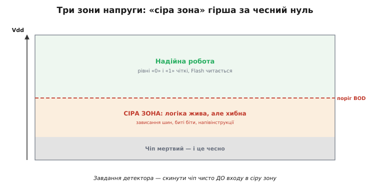
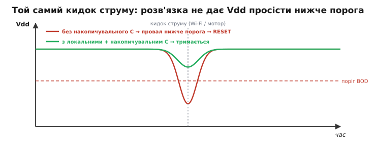

# 🔌 Супервізор живлення і brownout-детектор: чому МК «дивно глючить»

Просіле живлення (brownout, англ. *brown-out* — «часткове затемнення», на противагу повному *black-out*) дає не чистий збій, а **хаотичні глюки**: саме тому слабке живлення — одна з найпідступніших [причин скидання МК](book:programming/reset-causes). Тут копаємо глибше: чому так стається, що таке детектор як вузол і чим це лікують на платі.

## Чому просіла напруга — це гірше за вимкнення

Здавалося б, менше живлення — повільніша робота, та й по всьому. Насправді — навпаки. Коли Vdd падає нижче надійного рівня, але **ще не до нуля**, чіп опиняється в **сірій зоні**: транзистори перемикаються на межі, рівні «0» і «1» розпливаються, а Flash читається з помилками. Цифрова логіка не вміє «трохи недопрацьовувати» — вона ламається **непередбачувано**: зависають шини I2C/SPI, АЦП видає дурню, у пам'яті спливають биті біти, інструкція виконується наполовину. Звідси й репутація слабкого живлення як «проклятого»: симптоми хаотичні й не вказують на причину.

*Три зони напруги. Угорі — надійна робота. Унизу — чіп мертвий, і це чесно. А між ними — підступна **сіра зона**, де логіка ще жива, але робить дурниці. Завдання детектора — скинути чіп чисто **до** входу в неї.*

## Детектор як вузол: вбудований BOD

Щоб не пускати чіп у сіру зону, всередині є **детектор просідання (*brownout detector*, BOD)** — компаратор, що безперервно звіряє Vdd з порогом і, щойно напруга падає нижче, **примусово скидає** чіп. У ESP32 поріг налаштовний, а сам BOD типово **увімкнений** — і вимикати його, аби «прибрати перезавантаження», — велика помилка: ти не лікуєш хворобу, а гасиш сигналізацію, лишаючи чіп блукати в сірій зоні.

## Зовнішній супервізор живлення

Коли вбудованого BOD замало — потрібен точніший поріг, нагляд за кількома лініями живлення чи захист зовнішніх компонентів, — ставлять окрему мікросхему-**супервізор** (*voltage supervisor / reset IC*, класів на кшталт **MCP1xx** чи **TPS3xxx**). Це крихітний чип, що стежить за напругою й тримає лінію RESET притиснутою, поки живлення не стане надійним; багато з них додають затримку, гістерезис, а інколи й власний сторожовий таймер. По суті це той самий BOD, але **зовнішній і незалежний** від самого МК.

## Як супервізор підключають

Незалежно від виробника, схема ввімкнення цього класу майже завжди однакова — і знати її варто, бо саме на ній найчастіше спотикаються. Вивід RESET супервізора зазвичай роблять **з відкритим стоком** (*open-drain*): чип не «видає» рівень, а лише **притягує лінію до землі**, коли живлення погане, і **відпускає** її, коли все гаразд. Тому на лінії потрібен **підтягувальний резистор** (*pull-up*, типово 10 кОм) до Vdd — без нього у «відпущеному» стані рівень плаває, і скидання спрацьовує випадково. (Рідші варіанти з двотактним виходом — *push-pull* — самі задають обидва рівні, і pull-up їм не потрібен; але саме відкритий стік дає головний зиск нижче.) Сама лінія активна **низьким** рівнем: ім'я виводу часто пишуть із рискою згори або з символом `#`/`n` (`RESET#`, `nRST`), що й означає «активний нуль».

Відкритий стік дає ще один зиск: на одну лінію RESET можна **посадити кілька джерел** — сам супервізор, кнопку, вивід відлагоджувача — і будь-яке з них притягне її до землі незалежно від решти (це монтажне «АБО»). Саме тому **кнопку скидання** заводять на той самий вузол: вона просто замикає лінію на землю через той-таки відкритий стік. На вхід супервізора **MR** (*manual reset*), якщо він є, кнопку чіпляють напряму — чип сам додасть придушення брязкоту й витримку.

> 🔧 **Навіщо це.** Якщо плата «сама перезавантажується» з виглядом brownout, а живлення насправді в нормі — перша підозра саме на цю обв'язку: забутий або завеликий pull-up на RESET, кнопка без придушення брязкоту, довга траса RESET, що ловить наводки. Перевірити вузол RESET осцилографом — п'ять хвилин, а економлять дні полювання на «привида» в коді.

## Де ставити поріг

Поріг — головне налаштування детектора, і вибирають його з натягом між двома бідами. Постав **зависоко** — і детектор битиме скидання від кожної дрібної просадки, яку чіп насправді пережив би; пристрій перезавантажуватиметься без потреби. Постав **занизько** — і скидання спізниться: напруга встигне зайти в сіру зону, чіп наробить дурниць (а то й зіпсує запис у Flash) ще **до** того, як детектор схаменеться. Розумний орієнтир — трохи **вище** за нижню межу надійної роботи чипа з даташита, але **нижче** за нормальну робочу напругу з її звичайними дрібними коливаннями. У ESP32 вбудований поріг має кілька дискретних рівнів на вибір; зовнішній супервізор беруть із потрібним фіксованим порогом одразу під свою лінію живлення (3.3 В, 1.8 В тощо).

Тонкість, про яку забувають: поріг має сенс лише вкупі з **гістерезисом** (*hysteresis*, грец. *hysteresis* — «відставання»). Без нього на самій межі напруга, що ледь тремтить навколо порога, змусила б детектор торохтіти скиданнями без кінця. Тому поріг «спрацювати» завжди трохи **нижчий** за поріг «відпустити»: детектор б'є при просіданні до одного рівня, а знімає скидання, лише коли напруга піднялася відчутно вище. Цю різницю чип забезпечує сам — від інженера треба тільки не дивуватися, що «відпускає» воно за дещо вищої напруги, ніж «спрацьовує».

## Лік: конденсатори, що переживають сплеск

Найкраще, однак, **не доводити** до просідання. Кидок струму (передача Wi-Fi, пуск мотора) короткий — і його можна перекрити **конденсаторами** поряд із чипом: локальні **100 нФ** біля кожної ніжки VDD гасять швидкі піки, а накопичувальний **10–100 мкФ** віддає заряд у мить великого кидка, не даючи Vdd просісти до порога. Це та сама причина, чому дешевий стабілізатор і тонкий кабель так часто винні (див. [DevKit-плату](book:programming/esp32-architecture/comp-devkit.md)): їм бракує саме цього запасу.

*Той самий сплеск струму, два випадки. Без розв'язки Vdd провалюється нижче порога BOD → скидання. З локальними й накопичувальним конденсаторами заряд віддається миттєво, і напруга лишається у безпечній зоні.*

## Типові граблі

- **Вимкнути BOD «щоб не скидався»** — найгірше рішення: ховає проблему й пускає чіп у сіру зону.
- **Немає накопичувального C** — кожна передача Wi-Fi провокує просідання.
- **Тонкий кабель / слабкий стабілізатор** — той самий брак запасу під кидок.
- **Поріг BOD занижений** — детектор спрацьовує надто пізно, уже на межі сірої зони.
- **Немає pull-up на RESET** — лінія відкритого стоку плаває, і скидання б'є випадково.

## Варіації

Буває вбудований BOD, зовнішній супервізор, а ще комбіновані чипи «супервізор + сторож» в одному корпусі. Розрізняють детектори **просідання** (стежать за роботою) і **power-on** супервізори (тримають reset на старті); часто це той самий вузол із двома порогами. Багато супервізорів мають і вхід **ручного скидання** — кнопку RESET виводять саме на них.

На платах із кількома лініями живлення (ядро, периферія, радіо) трапляється **багатоканальний** супервізор: він тримає reset, доки **всі** напруги не стануть надійними, і б'є його, щойно **бодай одна** просіла. Сусідній різновид — **віконний** (*window*) детектор, що ловить не лише «занизько», а й «зависоко»: напруга вище за норму так само небезпечна, бо може спалити логіку. Для одноплатного проєкту на ESP32 цього зазвичай не треба — вистачає вбудованого BOD, — але знати про ці варіанти варто, бо на серйознішій платі вони рятують від цілого класу збоїв живлення, які поодинокий поріг просто не побачить.
