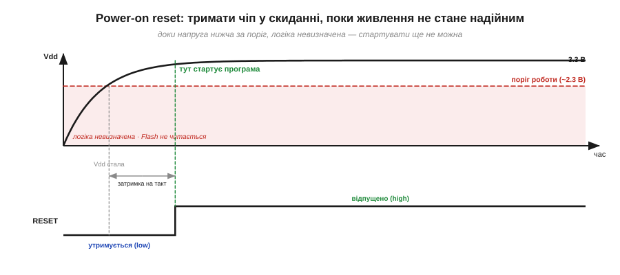
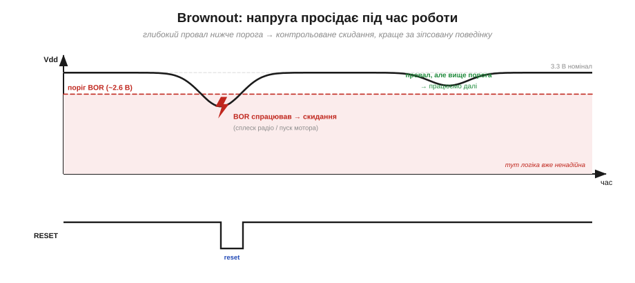
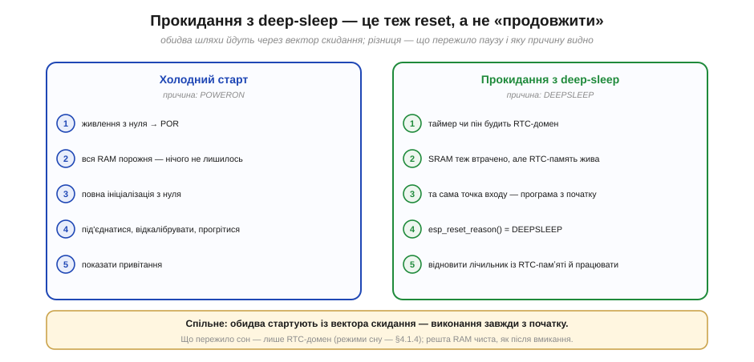
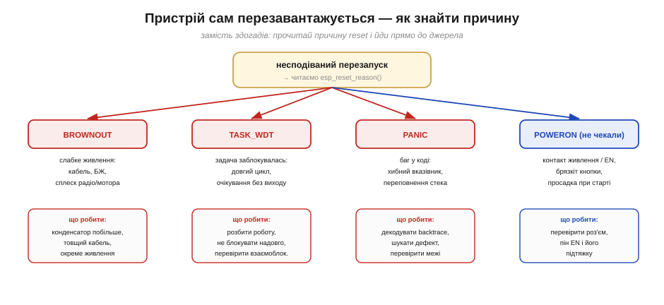

# Причини reset: power-on, brownout, watchdog, вихід із deep-sleep

Коли чіп заробив, його програма починається **з початку** — з тієї самої першої інструкції, що й завжди. Лічильник команд стрибає на вектор скидання, регістри падають у стан за умовчанням, змінні втрачають старі значення, і `setup()` біжить наново. Це стається не само собою: **щось** його викликає. Найочевидніша відповідь — «я ввімкнув живлення». Але придивімося уважніше: пристрій, що вже спокійно працював, теж раптом може стартувати з нуля. І причин у цього багато — ще й здебільшого таких, що сигналять про халепу: напруга на мить просіла, програма зависла й її довелося перезавантажити силоміць, або вона сама свідомо пішла спати, а потім прокинулась.

Хороша новина в тому, що чіп **запам'ятовує**, чому востаннє скинувся, — і лишає цей запис там, де прошивка прочитає його на самому старті. Це одне з найпрактичніших діагностичних знарядь у вбудованій розробці. Воно відрізняє безпорадне «мій пристрій сам перезавантажується, і я не розумію чому» від упевненого «лог каже brownout щоразу, коли вмикається помпа, — отже, винне живлення». У цій темі розберемо всі типові причини скидання, навчимося їх розрізняти й видобувати з цього користь.

### Що таке скидання і чому причин багато

**Скидання (reset)** повертає чіп у відомий початковий стан. Лічильник команд (*program counter*, PC) стрибає на сталу адресу — **вектор скидання (reset vector)**, — звідки починається код; периферійні [регістри](book:programming/memory-mapped-io) набувають значень за умовчанням; уся звичайна оперативна пам'ять вважається «сміттям». Це не те саме, що вимкнути живлення: під час скидання чіп лишається під напругою, просто його логіку примусово ставлять на старт. По суті reset — це «почати життя наново, не вмираючи».

Корисно одразу провести межу: що скидання **стирає**, а що — **ні**. Зникає вміст звичайної SRAM — а отже, всі глобальні й локальні змінні, купа, стеки задач — і налаштування периферії, що повертаються до значень за умовчанням. А **переживають** скидання речі, які лежать поза цією зоною: код і незмінні дані у Flash, вміст пам'яті RTC-домену (за умов, про які скажемо нижче) і, звісно, сам **регістр причини**. Тому надійний спосіб щось пронести крізь reset — покласти це туди, що не стирається, а не в звичайну змінну, яка випарується разом з усією SRAM.

Найважливіше, що тут варто вкласти в голову: до одного **входу скидання** ведуть **кілька джерел**. Натиснули кнопку, просіла напруга, спрацював сторож, програма сама себе перезапустила, чіп прокинувся зі сну — усе це різні події, але **результат однаковий**: ядро рестартує з вектора скидання. А щоб після рестарту можна було дізнатися, котре саме джерело спрацювало, чіп тримає окремий **регістр причини (reset reason)** — крихітну засувку, яка переживає сам reset.


*Рис. Анатомія скидання. Зліва — джерела (синім — нормальні, червоним — симптоми біди, зеленим — навмисні); усі сходяться на спільну лінію RESET. Праворуч — два наслідки: ядро стартує з вектора скидання, а причина лишається в засувці, яку прочитає `esp_reset_reason()`. Висновок: майже все, крім увімкнення живлення й свідомого перезапуску, варто залогувати.*

Пройдімо джерелами по черзі — від найбуденнішого до найпідступнішого.

### Power-on reset (POR): нормальний старт

Коли на чіп уперше подають живлення, напруга на ньому не зринає миттєво до 3.3 В — вона **наростає** за якісь мікросекунди-мілісекунди, поки заряджаються конденсатори на платі. І в цей перехідний момент чіп **не має права** виконувати код: при напрузі, нижчій за робочу, транзистори перемикаються ненадійно, рівні «нуля» й «одиниці» розпливаються, а Flash іще не читається коректно. Запусти ядро зарано — і воно почне виконувати не інструкції, а хаос.

Саме тому всередині є схема **power-on reset (POR)**: вона стежить, як Vdd перетинає поріг надійної роботи, і **тримає** чіп у скиданні, доки живлення не стане певним, та ще й додає коротку затримку, щоб устиг стабілізуватися такт. Лише тоді reset відпускають — і програма стартує. POR — це **очікувана** причина: так і має бути щоразу, коли пристрій вмикають із цілковито знеструмленого стану.


*Рис. Power-on reset у часі. Поки напруга нижча за поріг (червона зона — логіка невизначена, Flash не читається), лінія RESET утримується в активному стані. Коли Vdd стала і минула затримка на стабілізацію такту — reset відпускають, і саме тут починає виконуватися програма. Висновок: затримка старту не баг, а захист від запуску в невизначеному стані.*

Варто розуміти й **межу** POR. Він стереже лише **наростання** напруги на старті; що буде з Vdd **далі** — уже не його клопіт. Якщо живлення підніметься, POR відпустить reset, а тоді напруга просяде — бо ввімкнулося потужне навантаження чи бракує струму, — цього POR уже не помітить. На сторожі такого випадку стоїть інша схема.

### Brownout (BOR): підступний сусід POR

А тепер найцікавіше. Що, як напруга просідає **не на старті, а посеред роботи**? Радіо ESP32 під час передачі вихоплює з живлення короткий, але потужний кидок струму — сотні міліампер; смикнувся мотор, сів акумулятор, виявився надто тонкий USB-кабель чи кепський блок живлення — і Vdd на мить провалюється. Якщо вона впаде нижче робочого порога, але не до нуля, чіп опиняється в **найгіршій із можливих зон**: він іще «живий», ще намагається виконувати код, але робить це вже ненадійно. Це загрожує не просто збоєм — спотворені записи можуть пошкодити дані у Flash чи лишити периферію в безглуздому стані.

Щоб цього не сталося, є **детектор просідання — brownout reset (BOR)**. Він **безперервно** порівнює Vdd з порогом і, щойно вона провалюється нижче, **примусово й чисто** скидає чіп. Логіка тут проста й сувора: **контрольоване скидання краще за неконтрольовану дурницю**. Хай краще пристрій чесно перезавантажиться, ніж тишком зіпсує дані й піде працювати «якось не так». Дрібний провал, що лишився вище порога, BOR пропускає — система його переживе; а глибокий — обриває негайно.


*Рис. Brownout під час роботи. Перший провал (сплеск радіо чи пуск мотора) сягає нижче порога BOR → детектор б'є скидання. Другий, дрібніший, лишається вище порога → система працює далі. Висновок: BOR жертвує одним перезапуском, щоб урятувати стан і Flash від запису сміттям.*

> 🔧 **Навіщо це.** Brownout — найчастіша причина «чіп поводиться як проклятий»: пристрій на столі від USB працює, а в полі від акумулятора чи слабкого блока перезавантажується саме в мить, коли вмикає радіо. Знаючи це, інженер не шукає міфічний баг у коді, а дивиться на живлення: товщий кабель, конденсатор побільше біля чипа, окрема лінія для сильнострумних споживачів. Сам факт «причина = BROWNOUT» економить години.

> 🔌 **Глибше — компонентна вставка.** Як саме влаштований супервізор живлення й детектор brownout, чому МК «дивно глючить» на просілій напрузі та що ставлять на платі, щоб цьому зарадити, — у вставці [Супервізор живлення і brownout-детектор](comp-brownout.md).

### Watchdog: страховка від зависання

Буває й геть інша біда: живлення в нормі, але **програма зависла**. Потрапила в нескінченний цикл, заклинила в очікуванні події, що ніколи не настане, або наштовхнулася на дефект, який спинив виконання. Завислий код не здатен полагодити сам себе — нікому віддати команду, нема кому помітити проблему. Потрібен сторож **ззовні самої програми**.

Цю роль грає **сторожовий таймер (watchdog)** — апаратний лічильник, який невпинно рахує вгору. Прошивка мусить періодично його **скидати** — у жаргоні «годувати» (*feed*, *kick*). Поки програма здорова й проходить свій цикл, вона годує сторожа вчасно, і той ніколи не доходить до межі. А от якщо програма зависла й годувати перестала — лічильник доповзає до межі та **перезавантажує чіп**. Це остання лінія оборони: навіть коли все інше відмовило, watchdog поверне пристрій до життя. Тут він цікавить нас лише як **причина** скидання; докладна [механіка сторожа](book:programming/watchdog) — як годувати правильно, як зловити зависання окремих задач — це окрема велика тема.


*Рис. Дві долі сторожового таймера. Угорі — здорова програма: регулярні «feed» скидають лічильник, він не сягає межі. Внизу — програма зависла після кількох годувань: лічильник безперешкодно доповзає до межі й б'є RESET. Висновок: watchdog ловить саме той клас відмов, із яким код не впорається сам.*

На ESP32 сторожів насправді кілька, і прошивка розрізняє їх у причині скидання: **task watchdog** спрацьовує, коли якась задача надто довго не віддає процесор, а **interrupt watchdog** — коли надовго застрягли в обробнику переривання чи в критичній секції із вимкненими перериваннями. Обидва кажуть про одне: щось у коді заклинило й не відпускає процесор.

### Навмисний перезапуск: програма сама себе

Не кожне скидання — лихо. Часто прошивка перезавантажує себе **свідомо**, викликом на кшталт `esp_restart()`. Так роблять після оновлення прошивки «по повітрю» (щоб запуститися вже з нового образу), після зміни критичних налаштувань, за командою «перезавантажити» з інтерфейсу або коли код сам вирішив, що чистий старт — найпростіший вихід зі скрутного стану. Це **очікувана** причина: бачимо її в логах — і знаємо, що так і було задумано, а не зламалося.

### Зовнішнє скидання: пін EN

Нарешті, чіп можна скинути **ззовні** — притиснувши до землі спеціальний пін (на ESP32 він зветься **EN**, від *enable*). Це роблять руками — кнопкою скидання на платі; автоматично — зовнішньою мікросхемою-супервізором, що смикає EN на просіданні живлення чи за сигналом; або через відлагоджувач під час розробки. Для самого чипа це найпростіше з усіх скидань: зовнішній сигнал просто тримає його в стані старту, доки активний, а щойно відпустить — чіп піде з вектора скидання, як і завжди.

### Вихід із deep-sleep: «старт», а не «продовжити»

І остання, особлива причина — та, що збиває з пантелику новачків. У [режимі deep-sleep](book:programming/clock-power) ESP32 майже знеструмлений — ядра вимкнені, звичайна SRAM втрачає вміст, живим лишається тільки крихітний **RTC-домен**. Тому **прокидання з глибокого сну — це по суті скидання**: програма починається не з того місця, де заснула, а **знову з початку**, з вектора скидання. Хто чекав, що код «продовжиться з рядка після виклику сну», щиро дивується.

Щоб із цим можна було жити, чіп **відрізняє** пробудження зі сну від свіжого ввімкнення живлення: причина скидання так і називається — «вихід із deep-sleep». Прочитавши її на старті, прошивка не марнує час на повну ініціалізацію (мережа, калібрування, привітання) — а одразу відновлює потрібний контекст із пам'яті RTC-домену, що пережила сон, і працює далі. Що саме й як [зберігати в RTC-пам'яті](book:programming/rtc-memory) між пробудженнями — окрема тема; головне тут — що **deep-sleep = перезапуск**, і програму треба писати з цією думкою.


*Рис. Два шляхи до `setup()`. Ліворуч — холодний старт (причина POWERON): RAM порожня, повна ініціалізація. Праворуч — прокидання зі сну (причина DEEPSLEEP): та сама точка входу, але жива пам'ять RTC-домену дає змогу пропустити важку ініціалізацію й відновити контекст. Висновок: код мусить уміти обидва сценарії, бо точка входу в них одна.*

Тут проступає чітка межа між двома режимами сну. **Легкий сон (light-sleep)** зберігає живлення SRAM і стан ядра, тому з нього програма **продовжується** — рядок після виклику сну виконається, наче й не спали. **Глибокий сон (deep-sleep)** жертвує цим заради мікроамперів, і ціна жертви — саме перезапуск. Тож вибір між ними не лише про економію струму, а й про те, чи готова твоя програма починатися спочатку щоразу, як прокинеться.

### Як прошивка читає причину

Усі ці джерела зводяться до одного практичного питання: **як код дізнається, чому стартував**? Відповідь — той самий **регістр причини**, засувка, що пережила скидання. У середовищі ESP32 його зчитує один виклик — `esp_reset_reason()`, — який повертає значення з переліку (*enum*): `ESP_RST_POWERON`, `ESP_RST_BROWNOUT`, `ESP_RST_TASK_WDT`, `ESP_RST_PANIC`, `ESP_RST_SW`, `ESP_RST_DEEPSLEEP` і кілька інших. Прошивка викликає його **рано** — ще до основної ініціалізації — і далі гілкується: залогувати причину, полічити підозрілі перезапуски, перейти в безпечний режим, відновити контекст після сну.


*Рис. Від засувки до рішення. Угорі — потік: причина фіксується в регістрі (переживає reset) → `esp_reset_reason()` на старті → `switch` із гілкою на кожен випадок. Унизу — що означає кожне значення й яка типова реакція. Висновок: один виклик перетворює невидиму причину на конкретну дію.*

Окремо вирізняється `ESP_RST_PANIC` — скидання після **винятку**: звернення за хибним вказівником, ділення на нуль, переповнення стека. Перед таким перезапуском система зазвичай встигає виплюнути в лог **backtrace** — ланцюжок адрес, який інструменти розробника розгортають у назви функцій, показуючи, де саме впало. Тобто ця причина не лише називає клас біди, а й нерідко веде до конкретного рядка коду — найцінніша підказка, яку дає регістр.

Одна чесна дрібниця наостанок. На класичному ESP32 натискання кнопки скидання (пін **EN**) прошивка бачить як `ESP_RST_POWERON` — чіп не вміє відрізнити зовнішнє скидання від увімкнення живлення (окреме значення `ESP_RST_EXT` для нього не передбачене). Тож «POWERON» інколи означає не «щойно ввімкнули», а «хтось смикнув reset» — про це варто пам'ятати, коли читаєш логи.

### Навіщо це: від «привида» до діагнозу

Зберімо все докупи на типовій історії. Пристрій у полі **сам перезавантажується**, на вигляд — випадково. Без причини скидання це години здогадів: баг у коді? перегрів? космічні промені? А з нею діагностика стає прямою: читаємо `esp_reset_reason()` — і йдемо просто до джерела. `BROWNOUT` → слабке живлення, шукай конденсатор і кабель. `TASK_WDT` → задача десь блокується. `PANIC` → справжній баг, дивись backtrace. Несподіваний `POWERON` → поганий контакт живлення чи дребезг EN. «Привид» перетворюється на конкретну несправність, яку видно й можна полагодити.


*Рис. Триаж несподіваного перезапуску. Від кореня «читаємо причину» — чотири найчастіші гілки, кожна з типовим джерелом і конкретними діями. Висновок: причина скидання звужує пошук від «усього коду й заліза» до однієї ділянки.*

> 🔧 **Навіщо це.** Залогувати причину скидання на кожному старті — звичка, що окупається стократ. У полі, де немає ні відлагоджувача, ні очей розробника, цей єдиний рядок у логах нерідко єдине, що відрізняє «знаю, у чому річ» від «гадки не маю». Тому професійна прошивка робить це **завжди**.

**Приклад (лічильник brownout і безпечний режим).** Хай пристрій із сильнострумним навантаженням (помпа, радіо) інколи просідає по живленню. Розумна тактика: рахувати **поспіль** скидання через brownout, і якщо їх забагато — не вмикати важке навантаження, а перейти в безпечний режим і повідомити. Лічильник кладемо в пам'ять RTC-домену, що переживає скидання — на відміну від звичайної RAM, яка зникає разом з усім її вмістом.

```
// дуже рано в boot, ще до важкої ініціалізації
RTC_DATA_ATTR static int brownouts;      // переживає reset (RTC-домен)
esp_reset_reason_t r = esp_reset_reason();

switch (r) {
  case ESP_RST_POWERON:                   // звичайний старт від живлення
    brownouts = 0;                        // починаємо з чистого аркуша
    break;
  case ESP_RST_BROWNOUT:
    brownouts = brownouts + 1;            // рахуємо просідання поспіль
    log("brownout #%d", brownouts);
    if (brownouts >= 3)
        enter_safe_mode();                // не вмикати помпу/радіо
    break;
  case ESP_RST_TASK_WDT:
  case ESP_RST_INT_WDT:
    log("watchdog: щось зависло");        // привід шукати блокування
    break;
  case ESP_RST_DEEPSLEEP:
    restore_context();                    // прокинулись — не ініціалізуємо все наново
    break;
  default:
    log("reset reason = %d", r);          // решта — просто в лог
}
```

Тут варто помітити три речі. По-перше, гілка `POWERON` **обнуляє** лічильник: справжнє ввімкнення живлення означає «нова сесія, рахуємо заново». По-друге, три brownout поспіль — це вже не випадковість, а діагноз «живлення не тягне», і розумніше захиститися, ніж уперто перезавантажуватися по колу. По-третє, гілка `DEEPSLEEP` свідомо **пропускає** повну ініціалізацію — інакше кожне пробудження коштувало б зайвих витрат і часу. Усе це — лише завдяки одному значенню, яке чіп зберіг для нас крізь скидання.
