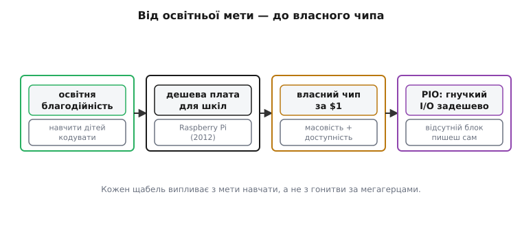
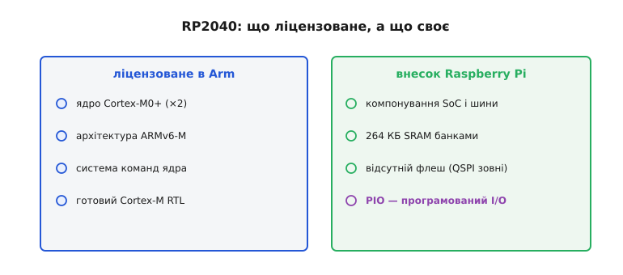
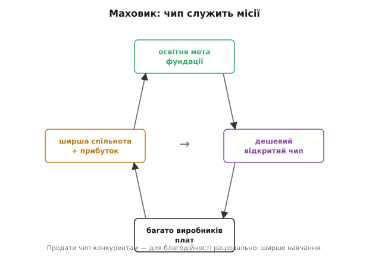

# 📜 Raspberry Pi: коли освітня фундація зробила власний чип (RP2040)

> Це не звична історія про мікроконтролер. [RP2040 і його PIO](book:programming/rp2040-pio) — нова ідея на пейзажі МК, а тут з'ясовуємо, *чому* ця ідея взагалі народилася і хто за нею стоїть. Відповідь несподівана: чип зробила не кремнієва корпорація, а британська освітня доброчинна організація, чия статутна мета — навчити дітей кодувати. І саме ця мета пояснює все: і дивну числову назву, і відсутність вбудованого флешу, і головний винахід (PIO), і рішення продавати власний чип прямим конкурентам. Межі цієї вставки чіткі: *як* PIO влаштований усередині — окрема ⚙️-вставка [PIO зсередини](book:programming/rp2040-pio/proj-pio.md); плата Pico і зовнішній QSPI-Flash — окрема 🔌-вставка [Pico board](book:programming/rp2040-pio/comp-pico-board.md); народження ядра ARM у Кембриджі — окрема 📜 [історія ARM](root:embedded/mcu-selection/hist-arm.md). Тут — лише фундація та її чип.

## Дивне ім'я: що означає «RP2040»

Перша загадка — назва. Більшість МК отримують маркетингові імена: ESP32, STM32, ATmega. А цей чип — суха числова абревіатура RP2040. Жодного «Pi-Chip», жодного «EduCore». Чому?

Тому що RP2040 — не назва, а **інженерний серійний номер**, де кожен символ щось кодує. Творець чипа *Eben Upton* (*Ебен Аптон*) пояснив логіку відкрито:

**Розшифровка RP2040** (за поясненням самого Аптона):

```
RP     — Raspberry Pi (виробник)
 2     — кількість ядер: два (dual-core)
  0    — тип ядра: Cortex-M0+  (код «0»)
   4   — обсяг RAM як логарифмічний показник:
          floor(log₂(RAM / 16 КБ)) = floor(log₂(264 / 16)) = floor(log₂ 16.5) = 4
    0  — вбудована non-volatile пам'ять тим самим правилом:
          флешу на кристалі немає → цифра 0 за домовленістю
          (0 = «немає»; сам log₂ від нуля не визначений)
```

Остання цифра «0» — не результат обчислення, а домовлена позначка «вбудованого флешу немає». І це **не помилка й не економія по-дешевому**: зовнішній QSPI-Flash свідомо винесено за кристал, а причина — у самому задумі (деталі плати — в 🔌 [Pico board](book:programming/rp2040-pio/comp-pico-board.md)).

Схема навмисно масштабується на всю майбутню родину. Аптон сам наводив контрприклад: гіпотетичний чип на **чотири ядра Cortex-M3, 256 КБ RAM і без флешу** назвався б **RP4340**.

```
RP4340
 4   — чотири ядра
  3   — ядро Cortex-M3 (код «3»)
   4   — floor(log₂(256 / 16)) = floor(log₂ 16) = 4
    0   — флешу немає
```

Назва самодокументована і росте разом із сім'єю. Це не маркетинг — це видає інженерну культуру організації, де стандарт важливіший за красу бренду. Залишається питання: *хто* ця організація? А відповідь справді несподівана.



*Від місії до власного кремнію: кожен щабель випливає з освітньої мети, а не з ринкової гонки за мегагерцами.*

## Несподіваний творець: не чипний гігант, а доброчинна фундація

Пройдімося звичним списком мікроконтролерів. AVR — продукт *Atmel*, компанії напівпровідників. STM32 — *STMicroelectronics*, один із найбільших чипмейкерів Європи. ESP32 — *Espressif Systems*, спеціалізований виробник бездротових SoC. А RP2040 зробила **освітня благодійна організація**. Це по-справжньому дивно — і саме звідси все випливає.

**Raspberry Pi Foundation** (Фундація Raspberry Pi) — британська **освітня благодійність** (charity), заснована у 2008 році, офіційно зареєстрована як благодійна організація у 2009-му. Серед шести засновників-опікунів — *Eben Upton* (виконавчий директор) і *David Braben* (*Девід Брабен*), співавтор легендарної космічної гри *Elite* (1984, BBC Micro — той самий мікрокомп'ютер, навколо якого згодом постав 📜 [ARM](root:embedded/mcu-selection/hist-arm.md)). Статутна мета фундації — **просувати вивчення інформатики, особливо серед дітей і молоді**.

Як освітня благодійність опинилася у виробництві заліза? Поступово. Спершу фундація спроєктувала **одноплатний комп'ютер Raspberry Pi** (2012) як «втручання заради освіти» — щоб дати школярам дешеву і доступну платформу для програмування. Щоб його виробляти і продавати комерційно, засновали **Raspberry Pi (Trading) Ltd** (2012, пізніше просто **Raspberry Pi Ltd**) — комерційну «дочку», **прибуток якої спрямовувався на доброчинну роботу** фундації. Бізнес тут — не ціль, а інструмент місії.

Важлива географія: Raspberry Pi спроєктовано в **Кембриджі** — тому самому технологічному кластері («Silicon Fen»), де свого часу виникли *Acorn Computers* і де народилося ядро ARM. Спадковість місця реальна: не просто символічна, а кадрова й інфраструктурна. Детальніше про неї — окрема 📜 [історія ARM](root:embedded/mcu-selection/hist-arm.md); тут лише позначимо, що коріння кембриджської мікроелектроніки глибокі.

Питання, яке виникає одразу: організація, що живе, аби *навчати дітей кодувати*, раптом сідає проєктувати власний кремній. Навіщо їй це — і чому не взяти готовий чужий МК з полиці?

## Навіщо благодійності власний кремній: чого не давали готові чипи

Питання чесне. На ринку 2019–2020 років — великий вибір дешевих мікроконтролерів: AVR, STM32, різні Cortex-M від десятків виробників. Зробити власний кристал з нуля — величезний ризик і суттєві витрати навіть для великої корпорації. Що змусило невеличку кембриджську команду на такий крок?

Команда публічно формулювала **чотири взаємопов'язані цілі**: зробити чип, який (1) **робить рівно те, що треба** для їхніх задач, (2) має **гнучкий I/O** без зайвих компромісів, (3) коштує **дешево** в партії, і (4) має **мале споживання** і невелику площу, щоб вписатися в прості навчальні плати. Готові чипи кожен по-своєму не влучали у всі чотири одночасно: або дорого, або без гнучкого I/O, або у потрібному діапазоні цін — занадто обмежена периферія.

Але за цими чотирма цілями стояли ще дві глибші.

**Перша — масовість і ціна.** Щоб чип потрапив у руки сотень тисяч новачків і в дешеві навчальні плати, він мусить коштувати справжні копійки — близько **$1 у партії**. При такій ціні виробничий контроль над власним кремнієм дозволяє тримати собівартість, яку в чужого постачальника не отримаєш.

**Друга — довга гарантована доступність.** Для освіти й промисловості критично, щоб чип не «зник» через два-три роки через зміну продуктового портфеля постачальника. Raspberry Pi заявила виробництво RP2040 **приблизно до 2041 року** (≈20 років від випуску) — і зафіксувала це офіційно. Лише власний кремній дає таку гарантію: жодна велика компанія не буде утримувати на конвеєрі чужу старіючу модель два десятиліття заради освітнього проєкту.

Додатковий контекст часу: RP2040 вийшов у **січні 2021 року** — в розпалі **глобального дефіциту чипів**, коли виробники по всьому світу місяцями чекали на поставки. Raspberry Pi, яка заздалегідь законтрактувала виробництво на TSMC, опинилася в значно кращому становищі, ніж конкуренти, що залежали від сторонніх постачальників, — і це теж стало аргументом «за» власний кремній.

Але зробити «геть свою» ISA (систему команд) — самогубство для невеличкої команди: треба від нуля будувати компілятори, ланцюжки інструментів, бібліотеки. Тому пішли третім шляхом: ліцензоване ядро + власна обв'язка. І тут до гри входить ARM.

## Як саме зробили: ліцензоване ядро ARM і Arm Flexible Access

Важливо одразу бути точними, бо атрибуція тут легко спотворюється.

**Raspberry Pi не винаходила процесорного ядра.** Команда взяла **ліцензоване** ядро **ARM Cortex-M0+** (архітектура ARMv6-M) і збудувала навколо нього **власний SoC** на базі готового Cortex-M RTL від Arm. Своє тут — компонування, периферія, шинна структура, SRAM і — найголовніше — PIO. Ядро само по собі прийшло з Кембриджського офісу Arm.

Ключем до практичної реалізації стала програма **Arm Flexible Access** — нова на той час (запущена 2019 року) схема **дешевого доступу до IP Arm**: інструменти, підтримка, навчання, доступ до RTL за значно нижчим порогом входу, ніж традиційна ліцензія. Raspberry Pi скористалася нею і стала **однією з перших компаній**, що вивела кристал на виробництво (tape-out) саме через Flexible Access. Саме це зробило «власний чип» реальним для невеликої команди — поріг входу в кремнієвий дизайн різко впав.

Технічна паспортна рамка:

```
Ядро:       2× ARM Cortex-M0+, ARMv6-M
Частота:    133 МГц (сертифіковано до ~200 МГц у пізніших ревізіях)
SRAM:       264 КБ (внутрішня, розділена на банки)
Flash:      немає (зовнішній QSPI, до 16 МБ)
Техпроцес:  TSMC 40 нм
Корпус:     QFN-56
GPIO:       30 (більшість — через PIO)
```

Cortex-M0+ — навмисне **скромне** ядро: дешеве у виробництві, маловитратне, без FPU і без складних режимів адресації. Це не вада — це свідоме рішення, узгоджене з місією: навчальний і вбудований чип не потребує гігагерців. Порівняно з M4 і M7, які ми побачимо у старших МК, M0+ дає мінімально достатній базис для більшості вбудованих задач і стає ідеальною точкою входу для новачка.

> 🔧 **Навіщо це.** Якщо ви вибираєте МК для довгого промислового чи освітнього проєкту, зверніть увагу: «ліцензоване ядро» — не слабкість. ARM Cortex-M0+ добре задокументований, підтримується avr-gcc і clang, має стабільний ABI. Raspberry Pi не переписувала ISA — вона скористалась перевіреним ядром і зосередила власну інженерію там, де потрібна унікальність. Саме так роблять більшість успішних SoC-дизайнерів. Для порівняння: чому частина виробників обирає [RISC-V замість ARM](root:embedded/esp32-family/hist-riscv.md) — то інший кут; тут важить, як ліцензування через Flexible Access відкрило двері невеликій команді.



*Чесна атрибуція: ліцензоване ядро від Arm — ліворуч; власний внесок Raspberry Pi (компонування, SRAM, відсутній флеш, PIO) — праворуч. Межа заслуги тут точна.*

## PIO: коли бракує периферії — її програмуєш сам

Якщо б RP2040 був просто ще одним M0+ у новій обгортці — ця вставка була б нецікавою. Але чип має одну рису, яка відрізняє його від звичних МК: **Programmable I/O (PIO)**.

Поставимо знайому проблему. Периферія в мікроконтролерах завжди *скінченна*: є UART, SPI, I²C, PWM, таймери. Але рано чи пізно трапляється завдання, де потрібен протокол, якого в залізі нема: адресні RGB-світлодіоди (WS2812 — своя специфіка тактування бітів), дисплей із нестандартним паралельним інтерфейсом, промислова шина. Класична відповідь — **біт-бенгінг**: емулювати протокол руками в коді, перемикаючи ніжки GPIO у потрібні моменти. Ціна відома: це з'їдає ядро повністю, б'ється джитером від переривань, і стає нестабільним на будь-яких складніших задачах.

**PIO** — відповідь на це. Концептуально (без заглиблення у деталі регістрів — вони в ⚙️ [PIO зсередини](book:programming/rp2040-pio/proj-pio.md)): це **два незалежні блоки по чотири програмовані апаратні автомати**, які можуть виконувати той самий біт-бенгінг **самостійно, у фоні**, з точним тактованим таймінгом — поки обидва ядра Cortex-M0+ зайняті чимось іншим. Ти *дописуєш* периферії, якої в кристалі нема, у вигляді короткої PIO-програми — і чип її виконує апаратно, з детермінованим часом.

Звідси й влучне формулювання: «периферія, яку програмуєш сам». PIO — це не дивна назва, а точний опис механіки.

Чому це стратегічно важливо саме для *маленького дешевого* чипа? Альтернатива — додати у кремній десятки різних спеціалізованих контролерів для кожного можливого протоколу. Але кожен такий блок — площа кристала, ціна, споживання. PIO замінює їх усіх **одним програмованим блоком**: скромний чип раптом «говорить» майже будь-яким протоколом, якого розробник захоче навчити. Ключова мета — «гнучкий I/O за малу ціну» — тут і втілена.

> 🔧 **Навіщо це (для розробника).** На практиці PIO означає, що навіть на $1-чипі можна «вигадати» відсутній апаратний інтерфейс — і не вбивати ядро в циклі біт-бенгінгу. Межа «що вміє чип» рухається вашим кодом, а не вибором іншої, дорожчої моделі. Це той самий принцип «розширення можливостей через програмування», що є наскрізною темою всього курсу — тільки реалізований на рівні мікропрограм всередині SoC.

Над RP2040 і PIO зокрема працювала **невелика кембриджська команда** — *James Adams* (*Джеймс Адамс*, апаратний лід), *Luke Wren* (*Люк Рен*, ASIC і архітектура PIO), *Liam Fraser*, *Chris Boross* та інші. Не «один геній», а невелика злагоджена команда — у цілковитій відповідності до наскрізного уроку курсу: будь-яке важливе залізо є результатом командної роботи, а не одного осяяння.

## Щедрість, що спантеличує: продати власний чип конкурентам

Тут — ще одна дивина, яка спершу не вкладається в голові.

RP2040 вийшов 21 січня 2021 року. Raspberry Pi одночасно представила **власну плату Pico** ($4) і почала **відкрито продавати чип як окремий компонент** (~$1 у партії). Вже на старті свої плати на RP2040 підготували — і представили практично одночасно! — *Adafruit*, *Pimoroni*, *Arduino*, *SparkFun*: прямі конкуренти в сегменті навчальних і DIY-плат. Звичайна компанія берегла б власний чип для власних продуктів і намагалась отримати максимальну маржу. Raspberry Pi роздала його суперникам.

Чому — і чому це **логічно саме для благодійної організації**?

Мета фундації не «перемогти на ринку плат», а **щоб якомога більше людей навчалося**. Що більше виробників роблять плати на RP2040 — то ширша екосистема: більше форм-факторів, більше прикладів, нижча кінцева ціна для покупця, більше спільнот і форумів. Все це разом означає: **більше дітей і новачків отримують доступ до навчального заліза** — і тим краще виконано освітню місію. Відкритий чип і відкриті дизайни плат — паливо для спільноти. Цей самий маховик крутить й інші відкриті платформи (Arduino, ESP), але рушій тут інший — не лише бізнес-розрахунок, а **статутний обов'язок**.

> 🔧 **Навіщо це (для інженера довгострокових проєктів).** Коли ви вибираєте МК для проєкту, що повинен жити 5–10 років, одне з ключових питань — чи буде цей чип через 7 років. Raspberry Pi оголосила виробництво RP2040 до ~2041 року, а відкрита архітектура (ніяких секретних блоків, публічний даташит) означає, що екосистема підтримки не зникне разом із маркетинговим циклом постачальника. Це практичний [критерій вибору МК](root:embedded/mcu-checklist).

Додайте до цього фінансову конструкцію фундації: прибуток «дочки» Raspberry Pi Ltd ішов (і досі іде) до неї — тобто продаж чипа і плат буквально **фінансував навчання дітей**. Бізнес як двигун місії — не фігуральний вираз, а задокументована операційна схема.



*Замкнений маховик: освітня мета фундації → дешевий відкритий чип → широка екосистема виробників плат → більше спільноти й прибутку → знову фундація. Саме тому продати власний чип конкурентам — для благодійності раціонально.*

## Що з цього лишилось нам

RP2040 — рідкісний приклад, коли залізо спроєктувала **організація заради навчання**, і кожна його дивина випливає з тієї мети, а не з ринкової гонки за мегагерцами.

Загадкова числова назва RP2040 — не маркетинговий брак, а **самодокументований інженерний код**. Остання цифра «0» (флешу нема) — не помилка, а свідоме рішення для гнучкості (QSPI зовні) і здешевлення кристала. Скромне Cortex-M0+ ядро — не відставання, а **навмисний вибір**: дешевий, передбачуваний, ідеальний як перша платформа. PIO — **не бонусна функція**, а відповідь маленького дешевого чипа на скінченність вбудованої периферії: універсальний програмований блок замість десятка спеціалізованих. Відкритий продаж чипа конкурентам — **не альтруїзм**, а раціональна реалізація статутної мети: широка екосистема служить навчанню, а навчання — місія благодійності.

Тепер зрозуміло, чому RP2040 заслужив славу «нової ідеї в пейзажі МК»: PIO виводить гнучкість I/O на рівень, якого немає в AVR, STM32 чи ESP32 у базовій конфігурації. І зрозуміло, чому навколо цього чипа так багато плат і прикладів за такий короткий час — бо чип навмисно зробили відкритим, а фундація зацікавлена в максимальному охопленні.

Ширший урок, який повторюється через ESP32, Arduino, RISC-V і тепер RP2040: **екосистема й мета важать не менше за специфікацію**. Чим саме це обертається при виборі платформи — окрема розмова про те, чому [екосистема важить більше за мегагерци](book:programming/mcu-ecosystem).

І нарешті — про атрибуцію: Raspberry Pi **ліцензувала** ядро ARM Cortex-M0+ і збудувала навколо нього SoC; власний інженерний внесок команди — компонування і, головне, PIO. Не «винайшли процесор» — але реальна кремнієва інженерія, нова ідея периферії і бізнес-модель у служінні освітній місії. Невелика кембриджська команда, а не один герой. Колективність — наскрізний урок історії техніки.

