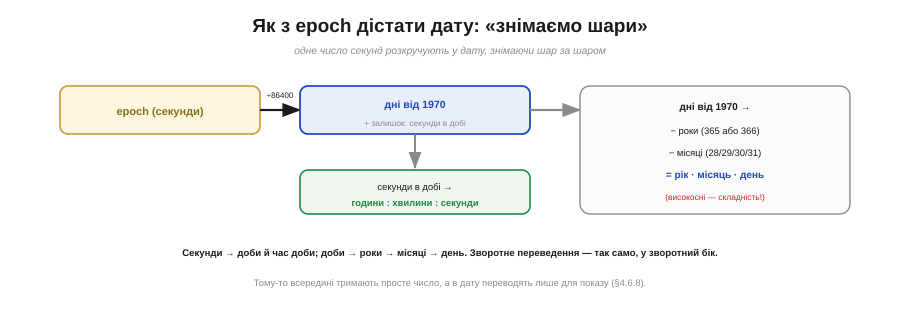
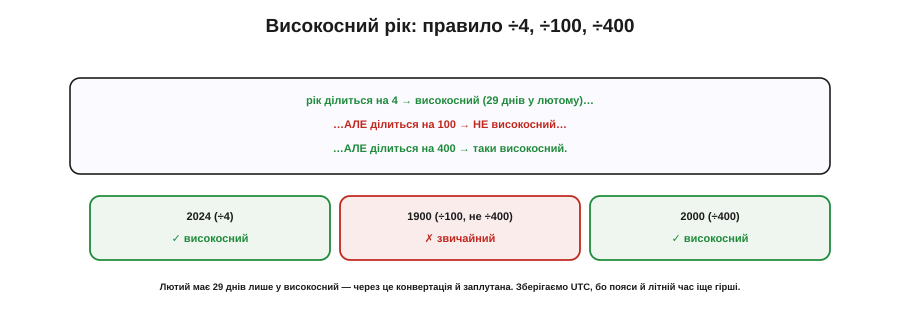

# 🧮 Unix-час і календар: високосні роки, пояси, чому зберігають UTC

> Математична вставка до теми [«RTC і реальний час»](book:programming/rtc). Час машина тримає як одне число секунд. А як із нього дістати «11 червня 2026, 14:30»? Тут і ховається вся календарна морока.

## Означення

**Epoch** — секунди від 1 січня 1970 (UTC), одне велике число. Щоб показати людську дату, його **переводять** у рік-місяць-день-години-хвилини-секунди. Це переведення — **календарна арифметика**, і вона напрочуд марудна через **високосні роки** (місяці різної довжини, лютий на 28 чи 29 днів) і **часові пояси**.

## Як це рахують: знімаємо шари

Уявіть epoch як довгу лінійку секунд. Дату дістають, **знімаючи шар за шаром**:

```
дні від 1970   = epoch / 86400        (86400 = секунд у добі)
секунди в добі = epoch mod 86400

години  = секунди_в_добі / 3600
хвилини = (секунди_в_добі mod 3600) / 60
секунди =  секунди_в_добі mod 60
```

Час доби виходить легко. А ось **дні → дата** складніше: від днів послідовно віднімають **роки** (365 або 366 — залежно, високосний чи ні), потім **місяці** (28/29/30/31), і що лишилось — це число місяця. Зворотне переведення — дата в epoch — робиться так само, лише в інший бік: порахувати, скільки повних днів від 1970-го до цієї дати (зважаючи на високосні), помножити на 86400 й додати секунди дня.


*Рис. Дату дістають шар за шаром: секунди → доби (÷86400) і час доби (mod 86400); доби → роки (− 365/366) → місяці (− 28/29/30/31) → день. Час доби — просто; дні в дату — складно через високосні роки.*

## Високосний рік: правило ÷4, ÷100, ÷400

Уся складність — у високосних роках. Точне (григоріанське) правило таке:

```
рік ділиться на 4       → високосний (лютий = 29 днів)
   …але ділиться на 100  → НЕ високосний
      …але ділиться на 400 → таки високосний
```

Приклади: **2024** (÷4) — високосний; **1900** (÷100, не ÷400) — звичайний; **2000** (÷400) — високосний. Саме через цей зубчастий лютий конвертація й не зводиться до простого ділення.


*Рис. Високосний, якщо ÷4, але не ÷100, хіба що ÷400. 2024 — високосний, 1900 — звичайний (÷100, не ÷400), 2000 — високосний (÷400). Лютий має 29 днів лише у високосний рік.*

## Чому зберігають UTC

А тепер найгірше — **часові пояси** й **літній час**. Місцевий час — це UTC плюс зсув пояса (±годин) плюс літній зсув (±1 год, що вмикається й вимикається за датою, та ще й по-різному в різних країнах). Зсув залежить і від **місця**, і від **пори року** — суцільне болото винятків. Тому правило залізне: **зберігай UTC, переводь у місцеве лише для показу**. Збережений UTC однозначний — його не зіпсує ні переїзд через пояс, ні переведення стрілок; а місцеву дату обчислюють останнім кроком, перед самим екраном.

## Де в курсі це працює

Це кількісний бік [роботи RTC із реальним часом](book:programming/rtc). На щастя, всю цю арифметику — і ділення на 86400, і високосне правило, і пояси — за вас робить **бібліотека** часу; писати її руками доводиться рідко. Та розуміти, **що** під капотом, корисно: тоді ви не дивуєтеся, чому «просто додати годину» до дати — погана ідея, і чому скрізь радять тримати UTC. А що буде, коли саме число секунд **переповниться**, — це окрема, повчальна [історія Y2K і 2038](book:programming/rtc/hist-y2k-2038.md).
