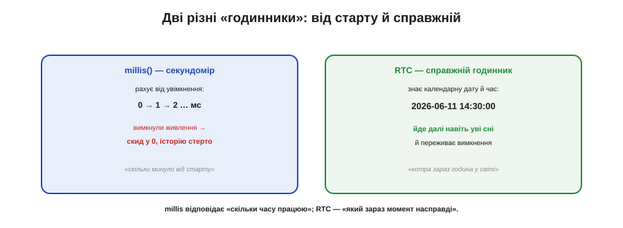
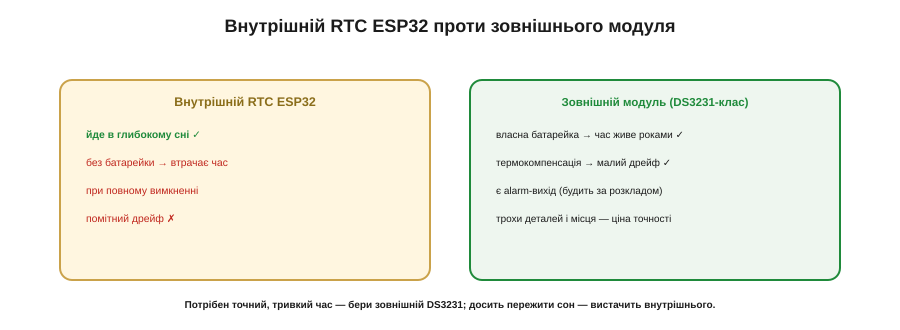
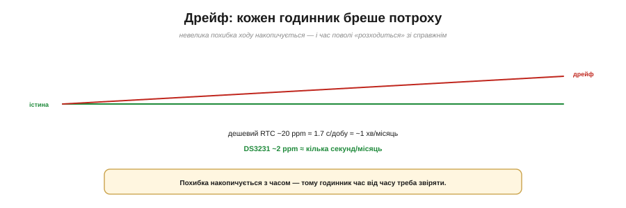

# RTC і реальний час: годинник, що йде уві сні

У програмному [відліку часу через `millis()` і `micros()`](book:programming/millis-micros) є одна спільна вада. Це чудові секундоміри, але рахують вони час **від увімкнення**: щойно подали живлення, лічильник пішов від нуля, а вимкнули — і він **забув усе**, наступного разу почавши знову з нуля. Такий годинник відповідає на питання «скільки я вже працюю?», та геть безпорадний перед іншим, не менш важливим: «а **котра зараз година** насправді? яке сьогодні число?». Для журналу з реальними мітками часу, для «увімкни обігрів о сьомій ранку», для «скільки днів тому це сталося» потрібен **інший** годинник — той, що знає **справжній**, календарний час і не забуває його при вимкненні. Це і є **RTC** — *Real-Time Clock*, годинник реального часу.

Уявімо простий приклад — реєстратор температури, що раз на годину записує показник. Із самим `millis()` у журналі стоятимуть мітки на кшталт «через 3 600 000 мс від старту» — а коли пристрій перезавантажиться, відлік піде з нуля, і ви вже не складете, **коли** саме що сталося. З RTC кожен запис дістає чесну мітку «2026-06-11 14:00», і журнал лишається зрозумілим крізь будь-які вимкнення. Різниця між «корисними даними» і «купою чисел без прив'язки до часу» — саме в цьому годиннику.

### Дві різні «годинники»

Розрізнімо їх чітко, бо плутанина тут часта. `millis()` — це **секундомір**: рахує мілісекунди від старту, і на кожне вимкнення скидається в нуль, стираючи історію. RTC — це **настінний годинник**: він тримає повну календарну дату й час (рік, місяць, день, години, хвилини, секунди), іде собі далі й переживає вимкнення. Перший каже «минуло стільки-то від увімкнення», другий — «зараз така-то мить у світі». Обидва потрібні, але для **різного**: millis — щоб відмірювати проміжки в роботі, RTC — щоб знати абсолютний момент.

Зверніть увагу: це не суперники, а **напарники**. У реальному пристрої вони працюють разом — RTC каже, **який зараз момент** (поставити мітку, спланувати на завтра), а `millis()` точно відмірює **короткі проміжки** в роботі (зачекати 50 мс, опитати раз на секунду). RTC цокає секундами й годинами — для мікросекундних інтервалів він заграбий; millis цокає мілісекундами — але не знає календаря. Кожен робить своє, і добрий код бере від кожного його сильний бік.

*Рис. millis() рахує від увімкнення й скидається в нуль при вимкненні — це секундомір «скільки я працюю». RTC тримає календарну дату й час, іде далі навіть уві сні й переживає вимкнення — це годинник «котра зараз година у світі».*

### Як машина зберігає час: epoch

А як узагалі записати «момент часу» одним зрозумілим машині способом? Людський запис — «11 червня 2026, 14:30:00» — незручний для обчислень: щоб відняти одну дату від іншої, довелося б морочитися з місяцями різної довжини й високосними роками. Тому машини зберігають час **простіше** — як **одне велике число**: скільки **секунд** минуло від умовної точки відліку. Цю точку прийнято класти на **1 січня 1970 року** (за всесвітнім часом UTC), а саме число звуть **Unix-часом**, або **epoch**.

*Рис. Машина зберігає момент часу як одне число — секунди від 1 січня 1970 (UTC). Його легко зберігати, порівнювати й віднімати; у звичну дату-годинник його переводять лише для показу.*

Принада такого запису — у його простоті. Одне число легко **зберігати** (кілька байтів), легко **порівнювати** (більше число — пізніший момент) і легко **віднімати** (різниця двох — це скільки секунд між подіями, без жодної календарної мороки). А в людський вигляд — дату й годинник — його переводять лише наприкінці, **для показу**. Так машина рахує час «у секундах від 1970-го», а ви бачите звичні «11 червня, 14:30».

Корисно відчути масштаб цього числа. Секунд від 1970 року набігло вже понад **півтора мільярда** — тож зберігають його в широкому, 32- чи краще 64-бітному полі (про те, чому 32 біти колись стають тісними, — окрема історія). А обчислення з ним справді тривіальні: щоб дізнатися, скільки минуло між двома подіями, просто **віднімаємо** їхні epoch-числа й дістаємо секунди; щоб порівняти, що раніше, — порівнюємо числа. Жодних «а скільки днів у лютому» — уся календарна морока відкладена на самий кінець, коли число треба показати людині.

А чому точка відліку — саме 1970-й? Без особливої містики: це приблизно тоді, коли народжувалися системи, що першими так лічили час, і дату просто **домовилися** взяти за нуль. Важлива не сама дата, а те, що вона **спільна**: коли всі рахують від однієї точки, числа різних пристроїв означають той самий момент і їх можна порівнювати без перекладача.

### Годинник, що йде уві сні

Тепер головна суперсила RTC, винесена в назву теми. Звичайному годиннику потрібне живлення, щоб цокати, — а пристрій то спить, то вимикається. RTC розв'язує це **крихітною батарейкою** (часто — пласка «таблетка»), що живить **лише годинник** і більше нічого. Решта чипа може спати, бути знеструмленою чи навіть від'єднаною від основного живлення — а RTC на своїй батарейці **знай собі цокає**, тримаючи час. Тому, прокинувшись хоч за годину, хоч за тиждень, пристрій одразу знає правильний час — не питаючи нікого. Звідси й образ: **годинник, що йде уві сні**, поки весь пристрій спочиває.

Це особливо рятує **автономні** пристрої на батарейках. Датчик, що прокидається раз на годину — виміряти й заснути назад, — більшість часу **вимкнений** майже повністю, заради економії заряду. Без годинника, що йде уві сні, він, прокинувшись, не мав би уявлення, котра година, і не зміг би ні поставити чесну мітку, ні діяти за розкладом. А RTC на своїй краплі струму дає йому це знання задарма: проспав — прокинувся — одразу знаєш точний час.

*Рис. Крихітна батарейка живить лише годинник. Решта ESP32 спить чи знеструмлена — а RTC знай собі цокає, тримаючи час. Прокинувшись хоч за тиждень, пристрій одразу знає правильний момент.*

### Внутрішній RTC ESP32 проти зовнішнього

Тут варто знати важливу подробицю саме про ESP32. У нього є **власний, вбудований** RTC — і він уміє йти під час [**глибокого сну** (deep sleep)](book:programming/sleep-modes), тримаючи час, поки чип дрімає між пробудженнями. Це зручно, й часто цього досить. Та в нього дві слабкості: по-перше, без зовнішньої батарейки він **втрачає** час при **повному** знеструмленні (висмикнули живлення — і годинник обнулився); по-друге, його дешевенький внутрішній генератор помітно **дрейфує** — час біжить не зовсім рівно.

*Рис. Внутрішній RTC ESP32 іде в глибокому сні, але без батарейки втрачає час при повному вимкненні й помітно дрейфує. Зовнішній модуль DS3231-класу має власну батарейку (час живе роками), термокомпенсацію (малий дрейф) і вихід-будильник.*

Коли потрібен **точний** і **тривкий** час — той, що переживе будь-яке вимкнення й не збреше за місяці, — ставлять **зовнішній RTC-модуль** класу **DS3231**. У нього власна батарейка (час живе **роками**), вбудована **термокомпенсація** (про неї за мить) і навіть окремий вихід-будильник. Правило просте: досить пережити сон — вистачить внутрішнього RTC; треба надійний календарний час назавжди — берімо зовнішній.

Зовнішній модуль під'єднують кількома дротами по [шині **I²C**](book:communications/i2c-bus) — як і багато інших давачів, — і далі читають із нього готові рік-місяць-день-години. Та хоч би який RTC ви взяли, лишається спільний клопіт: годинник треба бодай **раз виставити** на правильний час. Внутрішній — після кожного повного знеструмлення; зовнішній із батарейкою — один раз, і він триматиме його роками. Звідси й типовий вибір: пристрій у мережі радше виставлятиме час сам, із NTP; пристрій без мережі потребує батарейного DS3231, якому досить одного налаштування.

### Дрейф: кожен годинник бреше потроху

Чому взагалі годинник «бреше»? Бо **жоден** годинник не йде ідеально рівно. Його серце — [кварцовий резонатор](book:electronics/quartz-resonator) — коливається майже, але **не точно** на своїй частоті: трішки швидше або трішки повільніше. Цю похибку міряють у [**ppm** (*parts per million*, мільйонних частках)](book:electronics/frequency-accuracy-ppm) або в секундах за добу. І хоч яка вона мала, вона **накопичується**.

*Рис. Похибка ходу мала, але росте з часом. Дешевий RTC (~20 ppm) збігається десь на хвилину за місяць; термокомпенсований DS3231 (~2 ppm) — на лічені секунди. Тому час доводиться час від часу звіряти.*

Полічімо. Дешевий RTC із похибкою близько **20 ppm** збігається на 20 мільйонних від доби — це приблизно **1.7 секунди на добу**, тобто десь **хвилину на місяць**. За рік — чверть години! А ось термокомпенсований DS3231 тримає всього **~2 ppm** (бо вміє враховувати, як на кварц впливає температура) — це лічені **секунди на місяць**. Звідси й мораль: похибка ходу — не дрібниця на тлі тижнів і місяців, і якщо час має лишатися точним, його доведеться час від часу **звіряти**.

Чому ж термокомпенсація так допомагає? Бо головний ворог кварцу — **температура**: нагрівся чи охолов резонатор, і його частота трохи попливла. Звичайний RTC цього не враховує, тож на спеці чи морозі бреше сильніше. DS3231 же має всередині датчик температури й **підправляє** хід під неї — тому й тримає свої ~2 ppm у широкому діапазоні. А практичне питання «як часто звіряти» розв'язується просто: поділіть свій допуск на похибку. Терпите розбіжність до хвилини, а годинник дрейфує на хвилину за місяць, — отже, звіряйте раз на місяць; треба точність до секунди — звіряйтеся частіше або беріть точніший годинник.

### Синхронізація: звіряти з еталоном

А звіряти — з чим? Із **еталоном** точного часу. Найзручніший для підключеного пристрою — **NTP** (*Network Time Protocol*, мережевий протокол часу): ESP32 через Wi-Fi питає в сервера точного часу «котра зараз година?», отримує бездоганний UTC і **виставляє** свій годинник наново. Дрейф, що накопичився, цим обнуляється. Роблять це періодично — скажімо, раз на добу, — і годинник лишається точним без жодного зовнішнього модуля. Крім NTP, точний час уміють давати [**GPS**](book:communications/gnss) (супутники несуть атомний годинник) і спеціальні **радіосигнали** часу.

*Рис. Періодична синхронізація: ESP32 через Wi-Fi питає точний час у NTP-сервера, отримує еталонний UTC і виставляє годинник наново — накопичений дрейф обнуляється. Так само точний час дають GPS і радіосигнали.*

Звідси гарне поєднання для ESP32: внутрішній RTC тримає час між синхронізаціями (і переживає сон), а періодичний NTP-запит **підтягує** його до істини, гасячи дрейф. Якщо ж мережі немає — тоді на сцену виходить зовнішній DS3231, чий малий власний дрейф дозволяє довго обходитися **без** звіряння.

Дрібний, але приємний нюанс NTP: він враховує навіть **затримку** дороги до сервера й назад, тож виставляє час із похибкою в лічені мілісекунди — куди точніше, ніж потрібно більшості пристроїв. На практиці ESP32 зазвичай питає час одразу по під'єднанні до Wi-Fi, а потім зрідка повторює, щоб гасити дрейф. Головне — не сподіватися на мережу там, де її може не бути: для пристрою, що працює в полі без зв'язку, синхронізація — розкіш, і тоді весь тягар точності лягає на сам годинник.

### Як пристрій уперше дізнається час

Лишається питання, з якого все починається: звідки пристрій **узагалі** бере час уперше? Сам по собі свіжий мікроконтролер не має жодної гадки, котра година, — годинник треба чимось **завести**. Шляхів кілька. Перший — **з мережі**: під'єднався до Wi-Fi, спитав NTP — і час є. Другий — **з батарейного RTC**: модуль DS3231, якому час виставили колись давно, просто **віддає** збережене, не питаючи нікого. Третій — **вручну**: користувач виставляє час кнопками чи через застосунок (як на старій мікрохвильовці, що блимає «12:00», доки її не наладнаєш). Четвертий — **з GPS**, якщо він є на борту. Часто ці способи поєднують: батарейний RTC дає час одразу при старті, а NTP, щойно з'явиться мережа, уточнює його. Головне розуміти: без жодного з цих джерел пристрій лишиться тим самим «блимаючим 12:00» — знатиме, що час іде, але не знатиме, який саме.

### Чому зберігають UTC

Остання, але важлива звичка: **усередині** час тримають у **UTC** — єдиному всесвітньому часі без поясів і переведення стрілок. А місцевий час (із вашим часовим поясом і літнім/зимовим зсувом) обчислюють **лише для показу** користувачу. Так уникають цілого болота помилок: збережений UTC однозначний, його не зіпсує ні переїзд через пояс, ні переведення годинників навесні. Перевести UTC у місцеву дату — це вже календарна арифметика, варта окремої розмови.

Щоб відчути, від чого це рятує, уявіть, що ви зберегли «02:30 ночі 27 жовтня» — а саме тієї ночі годинники переводять назад, і «02:30» трапляється **двічі**. Котра з них? Або переїхали з пристроєм через часовий пояс — і всі збережені мітки раптом «зсунулися». UTC такого не знає: він тече рівно, без стрибків і поясів. Тому золоте правило — **зберігай UTC, показуй місцеве**.

> 🧮 **Календарна математика.** Як із секунд-epoch дістати рік-місяць-день, звідки беруться високосні роки й часові пояси та чому скрізь зберігають саме UTC — у вставці [Unix-час і календар](math-calendar-math.md).

> 📜 **Коли переповнюється сам час.** Проблема 2000 року й 2038-го — що буде, коли великий лічильник секунд дійде до краю, — історія у вставці [Y2K і 2038](hist-y2k-2038.md).

> 🔧 **Навіщо це.** Якщо вашому пристрою треба **знати справжній час** — ставити мітки в журналі, діяти за розкладом, рахувати дати, — самого `millis()` мало: він не переживає вимкнення й не знає календаря. Тоді беруть RTC: для підключеного пристрою часто досить внутрішнього RTC плюс періодичний **NTP**; для автономного, що мусить знати час і без мережі, — зовнішній **DS3231** із батарейкою. І завжди тримайте час **в UTC** усередині, переводячи в місцевий лише на екрані. Тоді журнал матиме чесні дати, будильники спрацюють вчасно, а пристрій не блиматиме «12:00» після кожного вимкнення.

Підсумуймо. **RTC** — це годинник, що знає **справжній, календарний** час і не забуває його, бо йде на власній батарейці навіть уві сні. Момент часу машина зберігає як **epoch** — одне число секунд від 1970-го. Будь-який годинник **дрейфує**, тож точний час підтримують **синхронізацією** з еталоном (NTP, GPS), а всередині тримають **UTC**, переводячи в місцевий лише для показу. ESP32 має внутрішній RTC (іде в сні, але дрейфує й гине без батарейки); для надійного, тривкого часу беруть зовнішній DS3231. Так мікроконтролер не лише точно відмірює проміжки роботи, а й знає, котра зараз година у світі, — ставить чесні мітки в журнал, діє за розкладом і не блимає «12:00» після кожного вимкнення.
