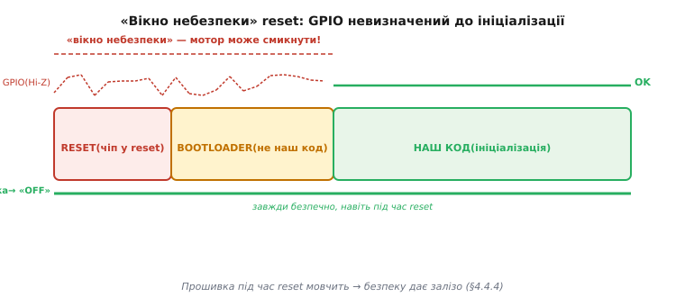

# Безпечний стан і safe mode

Коли збій уже стався й довіряти системі не можна, найважливіше — **не зробити гірше**. У фізичного пристрою «зависнути на повній потужності» небезпечніше, ніж вимкнутись. Нагрівач, що продовжує гріти без нагляду, — це не збій прошивки, що впала, — це пожежа.

**Безпечний стан фізичного пристрою.** Запитання «який вихід кожного актуатора найменш шкідливий при невідомому збої?» не має універсальної відповіді. Мотор — стоп (PWM duty = 0). Нагрівач — вимкнути (реле розімкнуто). Клапан нормально-закритий — закрити. Але клапан нормально-відкритий — навпаки, відкрити (бо відсутність сигналу = відкрито). Гальмо пружинного типу — притиснути (de-energize = загальмовано). Ключове: **безпечний стан визначає інженер під конкретну систему**, а не береться з довідника.


*Рис. Матриця безпечних станів актуаторів. «Знеструмлено = безпечно» — правило, але не без винятків.*

**Fail-safe by de-energizing.** Багато актуаторів проєктуються так, щоб **відсутність сигналу** = безпека: пружина повертає клапан у закрите положення, гальмо стискається без струму, реле розмикається без напруги на котушці. Тоді навіть мертва прошивка або обрив живлення автоматично призводять до безпечного стану — «задарма», без жодного рядка коду. Контрприклад: шасі літака, де «знеструмлено» = «прибрано» (що катастрофічно при посадці без команди) — тут знеструмлення навпаки небезпечне, і потрібне резервне живлення.

**GPIO у момент reset — практична пастка.** Від початку reset до завершення ініціалізації GPIO ніжки перебувають у невизначеному/Hi-Z стані. Якщо до них підключений [драйвер мотора](book:electronics/h-bridge) або реле — вони можуть «смикнутись» ненадовго. Прошивка в цей момент мовчить — вона ще не дійшла до `gpio_set_direction()`. Тому безпечний стан виходів має забезпечуватися **апаратно**: зовнішня [підтяжка (pull-up/pull-down)](book:electronics/floating-pullups) на вхід Enable драйвера тримає його в «вимкнено» ще до старту прошивки. Це не паранойя — це фундаментальна вимога для будь-якої системи з силовою периферією.



*Рис. «Вікно небезпеки» reset: GPIO Hi-Z від початку reset до ініціалізації. Апаратна підтяжка тримає «OFF» весь цей час.*

**Safe mode як режим зниженої функціональності.** Іноді пристрій сам розуміє, що нормально працювати не може: зіпсований конфіг у Flash, відмова критичного давача, [цикл збоїв](book:programming/reboot-counter). Замість нескінченних перезавантажень він може стартувати у **safe mode** — урізаному режимі, де лишається лише найнеобхідніше: зв'язок для діагностики й оновлення, базова індикація стану, безпечні виходи. Основна функція вимкнена. Це аналог «безпечного режиму» Windows або macOS — система підіймається мінімально, щоб дати можливість полагодити проблему.

**Перехід у безпечний стан — завжди ПЕРШИЙ крок.** При будь-якому тяжкому збої правильний порядок: спочатку зробити виходи безпечними → потім записати лог → потім ухвалювати рішення (reset, safe mode, деградація). Якщо зробити навпаки — логувати перед тим, як відключити нагрівач — між виявленням збою і відключенням виникає затримка. Для теплового нагрівача кілька секунд непомітні, для силового ключа у стані короткого замикання — ні.

**Worked-приклад.** Функція входу в безпечний стан — перша, що викликається при будь-якій критичній помилці:

```c
#include "driver/ledc.h"
#include "driver/gpio.h"
#include "esp_log.h"
static const char *TAG = "safe_state";

// GPIO призначення (приклад)
#define GPIO_HEATER_RELAY    GPIO_NUM_5   // active HIGH
#define GPIO_VALVE_CLOSE     GPIO_NUM_18  // active HIGH: закрити клапан
#define GPIO_FAULT_LED       GPIO_NUM_19  // active HIGH: індикатор аварії

// LEDC-канал для мотора (налаштований при ініціалізації)
#define MOTOR_LEDC_CHANNEL   LEDC_CHANNEL_0
#define MOTOR_LEDC_TIMER     LEDC_TIMER_0

void enter_safe_state(void) {
    ESP_LOGE(TAG, "ENTERING SAFE STATE");

    // 1. Зупинити мотор (LEDC duty → 0, потім зупинити таймер)
    ledc_set_duty(LEDC_HIGH_SPEED_MODE, MOTOR_LEDC_CHANNEL, 0);
    ledc_update_duty(LEDC_HIGH_SPEED_MODE, MOTOR_LEDC_CHANNEL);
    ledc_stop(LEDC_HIGH_SPEED_MODE, MOTOR_LEDC_CHANNEL, 0);  // idle_level = 0

    // 2. Вимкнути нагрівач (реле — LOW = розімкнуто)
    gpio_set_level(GPIO_HEATER_RELAY, 0);

    // 3. Закрити клапан (HIGH = закрити для н/з клапана)
    gpio_set_level(GPIO_VALVE_CLOSE, 1);

    // 4. Увімкнути індикатор аварії
    gpio_set_level(GPIO_FAULT_LED, 1);

    // 5. Тут може залишатися зв'язок для діагностики/OTA
    // (Wi-Fi/BLE стек не зупиняємо — він потрібен для допомоги)

    ESP_LOGI(TAG, "safe state: motor stopped, heater off, valve closed, fault LED on");
}
```

Виклик цієї функції має бути першим рядком будь-якого обробника критичної помилки — до будь-якого запису в лог, до будь-якого reset.

> 🔧 **Навіщо це.** «Впав і завис із увімкненим нагрівачем» — це не теорія, а спалені прилади й, у гіршому випадку, пожежі. Правильно спроєктований безпечний стан означає, що найгірший наслідок збою прошивки — пристрій **перестав** діяти, а не почав діяти **небезпечно**. Це і є різниця між «іграшкою» і промисловим пристроєм.

Апаратна сторона безпечного стану лежить у тому, як влаштовані самі виходи: [плаваючий пін і підтяжки](book:electronics/floating-pullups), [push-pull виходи](book:electronics/push-pull-output), а контроль напруги живлення з аварійним [скиданням](book:programming/reset-causes) бере на себе brownout-детектор.

Безпечний стан — це пауза. Часто найкращий спосіб **одужати** зі зіпсованого стану — [перезапуститися начисто](book:programming/reboot-strategy).

---
