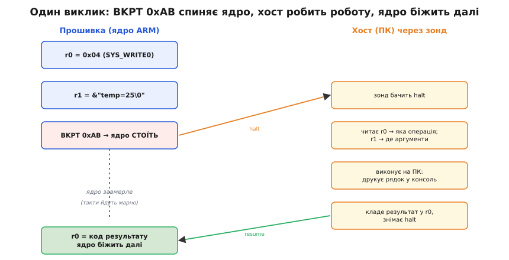
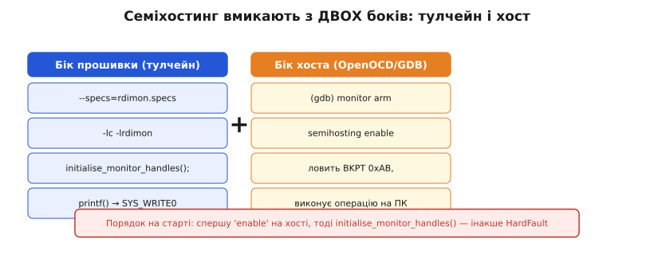
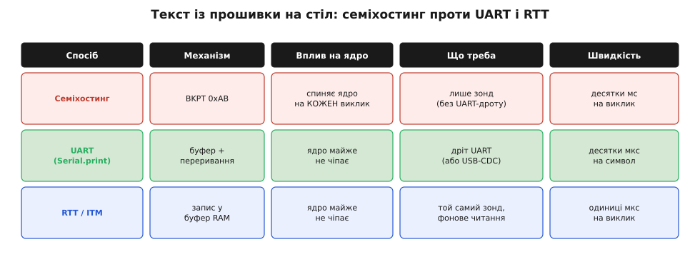

# Семіхостинг

Уяви ранню стадію проєкту: плата ще гола, UART нікуди не виведений, екрана немає, а тобі вже кортить побачити, що насправді порахувала прошивка — чи правильний той перший вимір з давача. [Зонд відлагодження](book:programming/swd-jtag-internals) до плати вже підключений, бо без нього код не залити. І тут виникає природна думка: якщо ядро вже вміє завмирати під зондом і віддавати свій стан на ПК, то чи не може прошивка просто **попросити** ПК надрукувати рядок — його ж клавіатурою, його екраном, його файловою системою? Саме це й робить **семіхостинг** (англ. *semihosting* — «напів-хостинг»: half вузла-*хоста*, тобто ПК, бере на себе те, чого позбавлений сам кристал). Прошивка користується вводом-виводом хоста — консоллю й файлами — через відлагоджувач, не маючи власного UART узагалі.

Слово «напів» тут точне й варте розшифровки. Повноцінний *хост* (англ. *host*, «господар, приймач») — це комп'ютер з операційною системою, екраном, диском і клавіатурою. Мікроконтролер усього цього позбавлений, він лише обчислювач. Семіхостинг дає йому **половину** хоста: обчислює кристал, а ввід-вивід за нього виконує ПК, до якого підключений зонд. Звідси й уся вигода, і вся плата за неї.

## Механізм: одна інструкція-пастка

Як прошивка взагалі може «гукнути» ПК, не маючи жодного дроту даних, крім ліній зонда? Відповідь несподівано проста й елегантна: через ту саму машинерію зупину, на якій тримаються [точки зупину](book:programming/breakpoints-watchpoints). Прошивка виконує **інструкцію-пастку** `BKPT` зі спеціальним, заздалегідь домовленим номером — для семіхостингу на ядрах Cortex-M це **`BKPT 0xAB`** (число `0xAB` — умовний знак саме семіхостингу, щоб відрізнити його від звичайної точки зупину). Ядро на цій інструкції завмирає рівно так само, як на будь-якому брейку: між двома командами, з повним доступом до регістрів.

Але перед тим як спинитися, прошивка кладе у регістри **заявку**. У `r0` — **номер операції**: що саме треба зробити (надрукувати рядок, відкрити файл, прочитати символ). У `r1` — **вказівник на блок параметрів** у пам'яті: де лежать аргументи цієї операції (адреса рядка, ім'я файлу, кількість байтів). Тобто `BKPT 0xAB` — це не «спинись назавжди», а «спинись і подивись, що я в тебе попросив через r0 і r1».

Далі вступає хост. Зонд бачить halt, і відлагоджувач (OpenOCD чи J-Link на боці ПК) **перехоплює** цю зупинку. Він читає `r0` — впізнає операцію; читає `r1` — дістає з пам'яті кристала аргументи; **виконує операцію вже на ПК** (друкує рядок у свою консоль, відкриває справжній файл на диску ПК); кладе результат назад у `r0`; знімає halt — і ядро біжить далі, ніби нічого й не було. З погляду коду прошивки це виглядає як звичайний виклик функції, що повернув значення. Насправді ж усю роботу зробив комп'ютер по інший бік зонда.



*Один виклик семіхостингу — це halt ядра, читання r0/r1 хостом, виконання роботи на ПК і повернення керування; усю обробку ядро простоює.*

Номери операцій стандартизовані ARM, і кількох вистачає, щоб відчути логіку. Найуживаніший для друку — **`SYS_WRITE0` (0x04)**: «надрукуй рядок із нуль-байтом у кінці», адреса рядка — в `r1`. Поруч `SYS_WRITEC` (0x03) — один символ; `SYS_WRITE` (0x05) — масив байтів відомої довжини. А для роботи з файлами на диску ПК — `SYS_OPEN` (0x01), `SYS_CLOSE` (0x02), `SYS_READ` (0x06), `SYS_READC` (0x07): прошивка відкриває справжній файл **на хості**, пише в нього або читає з нього. Саме звідси й береться головна незвична сила семіхостингу — кристал без власного накопичувача читає й пише файли на диску комп'ютера.

> 🔧 **Навіщо це.** Розуміти, що `printf` під семіхостингом — це насправді `BKPT 0xAB`, важливо з суто практичного боку: тепер ясно, чому такий «друк» поводиться зовсім інакше за [друк через UART](book:programming/why-debugger). Це не потік у дріт, а зупинка ядра з передачею роботи на ПК — і всі дивні наслідки (повільність, зависання без зонда) випливають саме звідси.

Архітектура диктує лише форму пастки, не суть. На класичних ARM (режим ARM/Thumb за межами Cortex-M) замість `BKPT` беруть `SVC` з номером `0xAB` (у Thumb) або `0x123456` (у ARM). На [RISC-V](book:programming/esp32-architecture) (ядра ESP32-C) інструкція `EBREAK` не має поля-номера, тож семіхостинг там упізнають за **магічною трійкою команд** — `EBREAK`, обгорнутий двома точно визначеними «порожніми» інструкціями, які разом і слугують підписом. Конвенція з регістрами та сама: номер операції в першому аргументному регістрі (`a0`), вказівник на параметри — у другому (`a1`). Принцип скрізь один: домовлена пастка плюс заявка в регістрах.

## Як це вмикають у тулчейні

Сам по собі `printf` із стандартної бібліотеки не знає про жоден зонд — він кудись виводить байти через службову функцію `_write`. Щоб ці байти пішли семіхостингом, треба підмінити нижній шар бібліотеки на варіант, який замість запису в UART виконує `BKPT 0xAB`. У тулчейні на основі GCC (`arm-none-eabi`) це робить **специфікація компонувальника `rdimon`** (англ. *RDI monitor* — від старого ARM-протоколу RDI, *Remote Debug Interface*): прапорець `--specs=rdimon.specs` плюс бібліотеки `-lc -lrdimon` підставляють реалізацію `_write`/`_read` через семіхостинг. Перед першим виводом прошивка ще має покликати `initialise_monitor_handles()` — вона налаштовує стандартні потоки (stdin/stdout/stderr) на семіхостинг.

Але цього замало: тулчейн лише навчив прошивку **робити** заявку. Хтось має її ще й **перехоплювати**. За замовчуванням відлагоджувач на `BKPT 0xAB` просто спиниться й віддасть керування тобі — рядка ти не побачиш. Семіхостинг на хості вмикають окремою командою: в OpenOCD це `arm semihosting enable`, з GDB — `monitor arm semihosting enable`. Лише після неї відлагоджувач починає **виконувати** заявки замість того, щоб на них спинятися.



*Працює лише тоді, коли налаштовані обидва боки; до того ж порядок на старті критичний — увімкнути семіхостинг на хості треба до виклику initialise_monitor_handles().*

Порядок на старті — типова пастка, що коштує годину розгубленості. Якщо прошивка покличе `initialise_monitor_handles()` (а та виконає `BKPT 0xAB`) **раніше**, ніж ти ввімкнув семіхостинг на хості, відлагоджувач сприйме пастку як несподівану налагоджувальну подію — і прилетить [HardFault](book:programming/hardfault) або глухий стоп. Тому послідовність завжди така: підняв OpenOCD → підключив GDB → `monitor arm semihosting enable` → і лише тоді даєш прошивці бігти. У готових інтеграціях (STM32CubeIDE, ESP-IDF) ці кроки часто сховані в налаштуваннях запуску, але механізм під ними — той самий.

> 🔧 **Навіщо це.** Найчастіша причина «семіхостинг мовчить або падає в HardFault» — забутий `monitor arm semihosting enable` або неправильний порядок старту. Знаючи, що бік прошивки й бік хоста вмикають **окремо**, ти перевіряєш обидва й не шукаєш привидів у власному коді, якого там немає.

**Worked-приклад. Як `printf("temp=%d\n", 25)` стає рядком на консолі ПК.**

Простий код, без жодного `Serial.begin` і навіть без єдиного дроту UART:

```c
extern void initialise_monitor_handles(void);  // з librdimon

int main(void) {
    initialise_monitor_handles();   // напрямити stdout у семіхостинг
    int temp = 25;
    printf("temp=%d\n", temp);      // піде через BKPT 0xAB, не в UART
    while (1) { }
}
```

Що відбувається під капотом, крок за кроком:

```
1. printf форматує рядок у буфер RAM:  "temp=25\n\0"
2. бібліотека кличе _write(rdimon) → готує семіхостинг-заявку:
      r0 = 0x04            ; SYS_WRITE0 — друкувати нуль-завершений рядок
      r1 = &буфер          ; адреса "temp=25\n\0" у пам'яті кристала
3. ядро виконує:  BKPT 0xAB   → halt, ядро завмирає
4. OpenOCD ловить halt, читає r0=0x04 → "це SYS_WRITE0",
      читає r1 → адреса; зчитує рядок із RAM кристала по байту до \0
5. OpenOCD друкує "temp=25" у СВОЮ консоль на ПК
6. кладе результат у r0, знімає halt → ядро біжить далі
```

На екрані ПК — у вікні OpenOCD або в консолі IDE — з'являється `temp=25`. На самій платі при цьому **жоден** периферійний блок не задіяний: ні UART, ні USB-CDC, лише лінії зонда, які й так уже підключені для прошивання. Це і є та сама рання діагностика «з порожньої плати», заради якої семіхостинг найчастіше й беруть.

## Ціна: ядро стоїть на кожен виклик

Дотепер усе звучить надто добре — друк і навіть файли без жодного дроту. Та плата за це сувора й випливає прямо з механізму. Кожен виклик семіхостингу **повністю спиняє ядро** на весь час, поки хост робить роботу. А «робота хоста» — це не миттєвість: відлагоджувач має помітити, що ядро стало, прочитати регістри через зонд, дістати дані з пам'яті кристала, виконати операцію й зняти halt. Усе це йде по USB до ПК і назад, і затримки USB тут панують.

Цифри відрізляють будь-яку ілюзію. Один виклик семіхостингу коштує **десятки мілісекунд**, а на повільному тактуванні зонда виміряно й до **~107 мс** на єдину операцію. Порівняймо порядки: символ по UART на 115200 бод летить за ~87 **мікросекунд**, тобто семіхостинг повільніший приблизно на **три порядки** — у тисячу разів і більше:

```
UART 115200:   ~87 мкс на символ        (ядро майже не стоїть)
семіхостинг:   ~10 000–100 000 мкс       на один виклик
                ────────────────────
                ≈ у 100–1000 разів повільніше, і ядро ВЕСЬ цей час завмерле
```

Наслідок очевидний і безжальний: семіхостинг **не годиться ні для чого, що має триматися реального часу**. Петля керування двигуном, радіостек, [обробник переривання](book:programming/isr), будь-яке часове вікно в мікросекунди — варто туди вставити семіхостинг-`printf`, і ядро завмиратиме на десятки мілісекунд щоразу, рвучи всі таймінги. Це не «повільнувато» — це зупинка цілого процесора посеред роботи. Тому семіхостинг — інструмент **виключно дебагу й виключно ранньої стадії**, а не штатного логування.



*Семіхостинг виграє лише в одному — не потребує UART-дроту; платить за це зупинкою ядра й затримкою в десятки мілісекунд на кожен виклик.*

Є ще пастка, страшніша за повільність. Інструкція `BKPT 0xAB` має сенс **лише коли підключений зонд із увімкненим семіхостингом**. А що, як прошивка з таким `printf` опиниться в полі без зонда? Тоді ядро дійде до `BKPT`, завмре в очікуванні хоста, якого немає, — і **зависне намертво**, або (бо налагоджувальна подія в робочому режимі некоректна) звалиться в HardFault. Звичайний UART-друк у такому разі просто йде в нікуди, нешкідливо; семіхостинг-друк **вішає пристрій**. Звідси два практичні правила. Перше: жодного семіхостингу в коді, що піде у поле, — лише на стенді з зондом. Друге, на випадок ненавмисного: іноді тулчейн сам тягне семіхостинг (через `rdimon`), хоча ти про нього й не просив; типовий захист — спеціальний [обробник збою](book:programming/hardfault), що впізнає `BKPT 0xAB`, пропускає його й веде ядро далі, перетворюючи фатальне зависання на нешкідливий «холостий» виклик.

> 🔧 **Навіщо це.** Правило просте й рятує залізо: семіхостинг — для стенду з зондом, ніколи для прошивки в поле. Якщо плата без зонда раптом зависає на старті — підозрюй забутий семіхостинг-`printf` (часто затягнутий `rdimon` чи бібліотечним `printf`), бо саме `BKPT 0xAB` без хоста й вішає ядро.

## Коли семіхостинг, а коли інше

Лишається чесно окреслити нішу. Семіхостинг сяє рівно в одному: коли треба швидко глянути на стан **на голій платі без жодного виведеного дроту**, а зонд уже й так підключений для прошивання. Рання діагностика першого запуску, разовий дамп таблиці в файл на ПК, тест, що читає вхідні дані прямо з файлу хоста, — тут він безцінний, бо ввімкнути його не коштує нічого, крім прапорця компонувальника й однієї команди GDB.

Щойно ти виходиш за межі цього сценарію — кращі інші засоби, і вибір диктує саме ціна зупинки ядра. Потрібен **постійний потік логів**, який не спиняє ядро, — бери звичайний друк у [UART](book:programming/why-debugger): дешевий дріт, ядро майже не чіпається, працює й без зонда, дає історію в реальному часі. Потрібен **дуже швидкий лог через той самий зонд, без UART-дроту** — бери [трасування на кшталт ITM/RTT](book:programming/trace-itm-swo): прошивка лише пише байти в буфер у RAM (одиниці мікросекунд), а зонд **фоново**, не спиняючи ядро, вичитує цей буфер на ПК. RTT поєднує дві вигоди семіхостингу (через зонд, без UART) без головної його вади — не зупиняє ядро.

І остання, важлива межа, щоб не плутати поняття. Семіхостинг — це **не** «`printf` через UART». Зовні вони схожі (той самий `printf`, рядок з'являється на ПК), але всередині — протилежні механізми: UART пхає байти в периферійний передавач і йде далі, ядро лишається живим; семіхостинг **спиняє** ядро й передає роботу комп'ютеру через зонд. Звідси й уся різниця в поведінці: швидкість, потреба в зонді, фатальне зависання без нього. Сплутати їх — означає очікувати від семіхостингу легкості UART, якої в нього немає, або боятися від UART зависань, на які він не здатний. Один термін — один механізм; знаючи, який саме за `printf` стоїть, ти наперед розумієш, як він поведеться.
